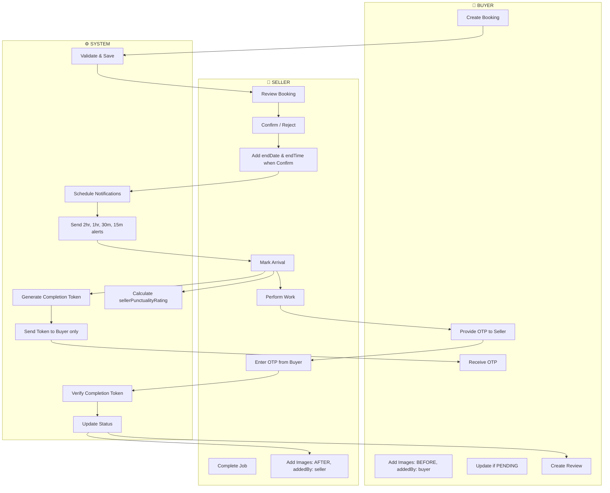
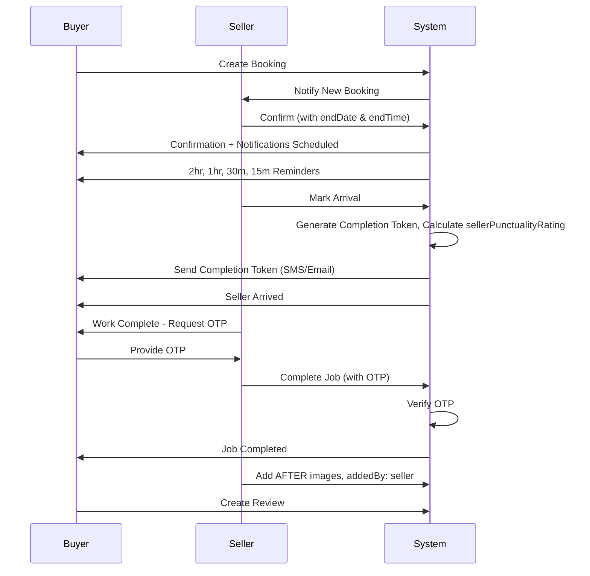
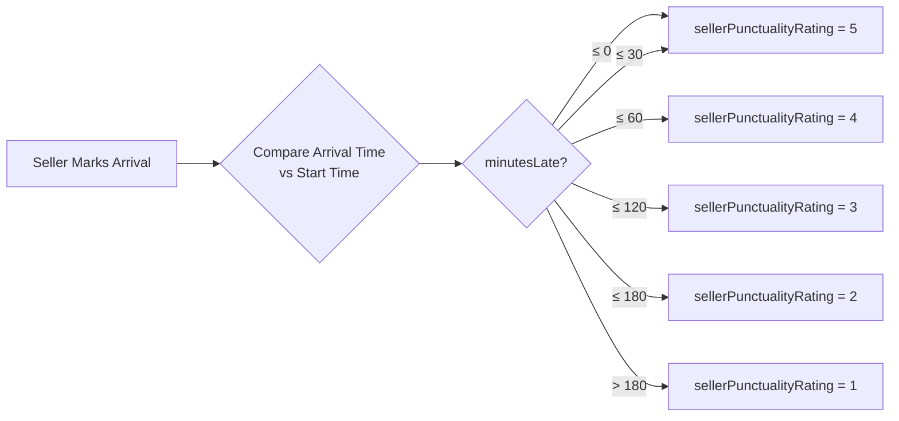
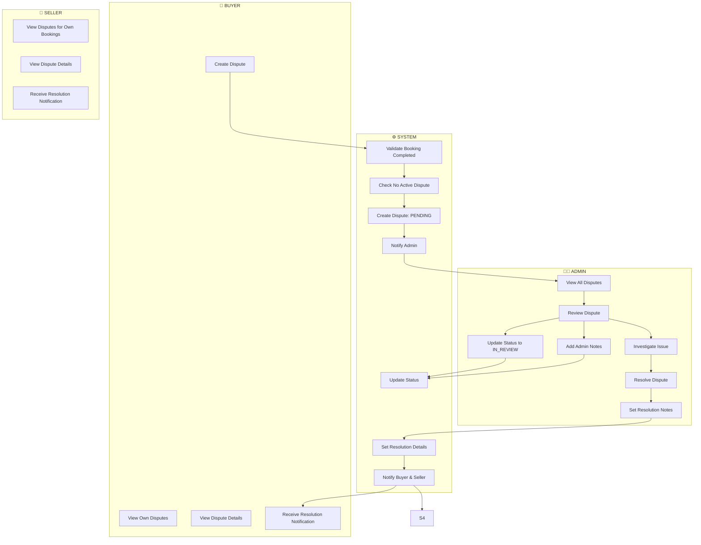
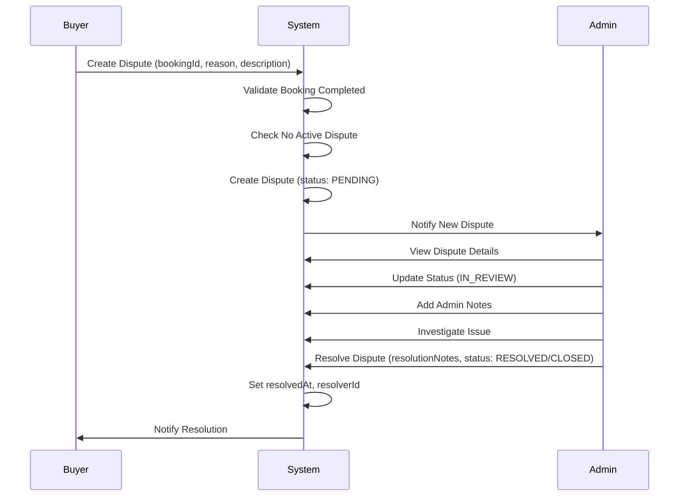
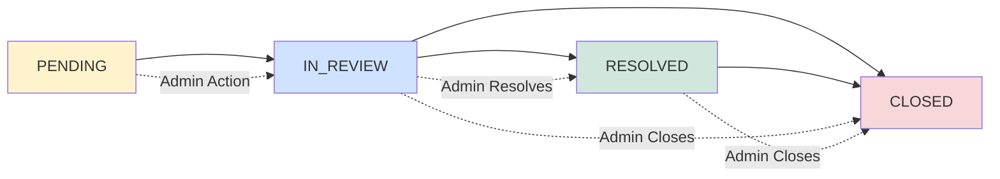

# Fixtree Backend - Implementation Stages

> **Note:** This is a temporary document for tracking implementation progress. It will be removed after all stages are completed.

Each stage is a separate commit. Complete one stage before moving to the next.

---

## Progress Overview

| Stage                                        | Description                   | Status        |
| -------------------------------------------- | ----------------------------- | ------------- |
| [1](#stage-1-project-setup--configuration)   | Project Setup & Configuration | ✅ Completed  |
| [2](#stage-2-common-utilities)               | Common Utilities              | ✅ Completed  |
| [3](#stage-3-database-setup)                 | Database Setup                | ✅ Completed  |
| [4](#stage-4-shared-services)                | Shared Services               | ✅ Completed  |
| [5](#stage-5-users-module)                   | Users Module                  | ✅ Completed  |
| [6](#stage-6-auth-module-basic)              | Auth Module (Basic)           | ✅ Completed  |
| [7](#stage-7-sessions-module)                | Sessions Module               | ✅ Completed  |
| [8](#stage-8-auth-module-extended)           | Auth Module (Extended)        | ✅ Completed  |
| [9](#stage-9-seller-module)                  | Seller Module                 | ✅ Completed  |
| [10](#stage-10-admin-modules)                | Admin Modules                 | ✅ Completed  |
| [11](#stage-11-queue--cron-jobs)             | Queue & Cron Jobs             | ✅ Completed  |
| [12](#stage-12-notifications-module)         | Notifications Module          | ✅ Completed  |
| [13](#stage-13-swagger-documentation)        | Swagger Documentation         | ✅ Completed  |
| [14](#stage-14-health-check-module)          | Health Check Module           | ✅ Completed  |
| [15](#stage-15-database-seeders)             | Database Seeders              | ✅ Completed  |
| [16](#stage-16-websocket-setup)              | WebSocket Setup               | ✅ Completed  |
| [17](#stage-17-admin-module)                 | Admin Module                  | ⬜ Pending    |
| [18](#stage-18-extend-seller-module)         | Extend Seller Module          | ⬜ Pending    |
| [19](#stage-19-categories-module)            | Categories Module             | ✅ Completed  |
| [20](#stage-20-services-module)              | Services Module               | ⬜ Pending    |
| [21](#stage-21-booking-core-features)        | Booking Core Features         | ⬜ Pending    |
| [22](#stage-22-booking-admin-endpoints)      | Booking Admin Endpoints       | ⬜ Pending    |
| [23](#stage-23-booking-queues--jobs)         | Booking Queues & Jobs         | ⬜ Pending    |
| [24](#stage-24-reviews-module)               | Reviews Module                | ⬜ Pending    |
| [25](#stage-25-chat-module)                  | Chat Module                   | ⬜ Pending    |
| [26](#stage-26-chat-multimedia-cleanup)      | Chat Multimedia Cleanup       | ⬜ Pending    |
| [27](#stage-27-buyer-module)                 | Buyer Module                  | ⬜ Pending    |
| [28](#stage-28-disputes-module)              | Disputes Module               | ⬜ Pending    |
| [29](#stage-29-strike-module)                | Strike Module                 | ⬜ Pending    |
| [30](#stage-30-audit-log-module)             | Audit Log Module              | ⬜ Pending    |
| [31](#stage-31-recent-activity-module)       | Recent Activity Module        | ⬜ Pending    |
| [32](#stage-32-recent-activity-cleanup)      | Recent Activity Cleanup       | ⬜ Pending    |
| [33](#stage-33-cities-module)                | Cities Module                 | ⬜ Pending    |
| [34](#stage-34-message-safety-module)        | Message Safety Module         | ⬜ Pending    |
| [35](#stage-35-plans-module)                 | Plans Module                  | ⬜ Pending    |
| [36](#stage-36-plan-subscriptions-module)    | Plan Subscriptions Module     | ⬜ Pending    |
| [37](#stage-37-boost-management-module)      | Boost Management Module       | ⚠️ Incomplete |
| [38](#stage-38-boost-audit-log-module)       | Boost Audit Log Module        | ⚠️ Incomplete |
| [39](#stage-39-performance-analytics-module) | Performance Analytics Module  | ⬜ Pending    |
| [40](#stage-40-support-module)               | Support Module                | ⬜ Pending    |
| [41](#stage-41-system-settings-module)       | System Settings Module        | ⬜ Pending    |
| [42](#stage-42-docker-setup)                 | Docker Setup                  | ⬜ Pending    |
| [43](#stage-43-cicd-pipeline)                | CI/CD Pipeline                | ⬜ Pending    |
| [44](#stage-44-final-integration--testing)   | Final Integration & Testing   | ⬜ Pending    |

**Legend:** ⬜ Pending | 🔄 In Progress | ✅ Completed | ⚠️ Incomplete

---

## Module Organization Approach

### Hybrid Pattern for Shared Domain Entities

For modules like **Categories**, **Services**, **Bookings**, etc., where both regular users (buyers/sellers) and admins need access, use the **Hybrid Pattern**:

**Structure:**

```
src/modules/
├── [module-name]/                    # Main module
│   ├── [module-name].module.ts       # Exports service & repository
│   ├── [module-name].service.ts      # Shared business logic
│   ├── [module-name].repository.ts   # Shared data access
│   ├── [module-name].controller.ts    # Public/Buyer/Seller endpoints
│   ├── entities/
│   └── dto/
└── admin/
    └── [module-name]/                # Admin-specific
        ├── admin-[module-name].module.ts      # Imports main module
        └── admin-[module-name].controller.ts   # Admin CRUD endpoints
```

**Key Principles:**

- ✅ **Single Source of Truth**: Entity, repository, and service defined once in main module
- ✅ **DRY Principle**: No code duplication for business logic
- ✅ **Clear Separation**: Public and admin endpoints in separate controllers
- ✅ **Export Service**: Main module exports service for admin module to use
- ✅ **Consistent Pattern**: Follows existing admin module structure

**Example Flow:**

1. Create main module with entity, repository, service, and public controller
2. Export service from main module
3. Create admin module that imports main module
4. Admin controller uses shared service for CRUD operations

**See:** `MODULE-ORGANIZATION-GUIDE.md` for detailed examples and best practices.

### Standard Implementation Checklist for Each Module

When implementing any module, ensure you cover:

1. **Entity Layer**
   - [ ] Create entity extending `BaseEntity`
   - [ ] Define all columns with proper types and constraints
   - [ ] Add relationships (OneToMany, ManyToOne, OneToOne)
   - [ ] Add indexes for frequently queried fields
   - [ ] Add soft delete support (deletedAt)

2. **Repository Layer**
   - [ ] Create repository extending TypeORM repository
   - [ ] Implement custom query methods
   - [ ] Add pagination support where needed
   - [ ] Handle soft deletes in queries

3. **Service Layer**
   - [ ] Create service with business logic
   - [ ] Inject repository and other dependencies
   - [ ] Implement CRUD operations
   - [ ] Add validation and error handling
   - [ ] Export service from module

4. **Controller Layer**
   - [ ] Create controller with endpoints
   - [ ] Add role guards (`@Roles()`, `@Public()`)
   - [ ] Add Swagger decorators (`@ApiTags()`, `@ApiOperation()`, `@ApiResponse()`)
   - [ ] Use DTOs for request/response validation
   - [ ] Handle HTTP status codes correctly

5. **DTOs**
   - [ ] Create request DTOs with validation decorators
   - [ ] Create response DTOs with transformation
   - [ ] Use `class-validator` for validation
   - [ ] Use `class-transformer` for serialization

6. **Database**
   - [ ] Generate migration file
   - [ ] Review migration SQL
   - [ ] Run migration in development
   - [ ] Verify table structure

7. **Admin Module** (if applicable)
   - [ ] Create admin module importing main module
   - [ ] Create admin controller with admin-only endpoints
   - [ ] Add admin role guards
   - [ ] Register in `AdminModule`

8. **Testing & Documentation**
   - [ ] Add Swagger documentation
   - [ ] Test endpoints manually
   - [ ] Verify role-based access
   - [ ] Check error handling

---

<a id="stage-1-project-setup--configuration"></a>

## Stage 1: Project Setup & Configuration

**Commit:** `feat: project setup and configuration`

**Tasks:**

- [x] Initialize NestJS project
- [x] Setup multi-environment files (`.env.example`, `.env.development`)
- [x] Create Joi validation schema for environment variables
- [x] Setup Husky, lint-staged, and commitlint
- [x] Configure Prettier (`.prettierrc`)
- [x] Configure ESLint strict mode (`eslint.config.mjs`)
- [x] Create `config/` module with all config files
- [x] Setup `app.module.ts` with ConfigModule
- [x] Configure `main.ts` (Helmet, CORS, global prefix)

**Files to create:**

```
# Environment files
.env.example              # Template (committed)
.env.development          # Development config (git ignored)
.env                      # Local overrides (git ignored)

# Code quality config
.prettierrc
.lintstagedrc
.commitlintrc
eslint.config.mjs

# Husky hooks
.husky/
├── pre-commit
└── commit-msg

# Source files
src/
├── main.ts
├── app.module.ts
└── config/
    ├── config.module.ts
    ├── env.validation.ts     # Joi validation schema
    ├── app.config.ts
    ├── database.config.ts
    ├── jwt.config.ts
    ├── bullmq.config.ts
    ├── cloudinary.config.ts
    ├── sendgrid.config.ts
    ├── twilio.config.ts
    └── google.config.ts      # Google OAuth settings
```

**Dependencies to install:**

```bash
npm install @nestjs/config helmet joi
```

**Multi-environment setup:**

```
.env.example        # Template with all variables (committed)
.env.development    # Development config (git ignored)
.env.staging        # Staging config (git ignored)
.env.production     # Production config (git ignored)
.env                # Local overrides (git ignored, highest priority)
```

**Loading order (ConfigModule):**

```typescript
envFilePath: [
  '.env', // Local overrides
  `.env.${process.env.NODE_ENV || 'development'}`, // Environment-specific
];
```

**Environment validation (env.validation.ts):**

```typescript
import * as Joi from 'joi';

export const envValidationSchema = Joi.object({
  NODE_ENV: Joi.string()
    .valid('development', 'staging', 'production')
    .required(),
  PORT: Joi.number().default(3000),

  // Database
  DB_HOST: Joi.string().required(),
  DB_PORT: Joi.number().default(5432),
  DB_USERNAME: Joi.string().required(),
  DB_PASSWORD: Joi.string().required(),
  DB_NAME: Joi.string().required(),

  // JWT
  JWT_SECRET: Joi.string().min(32).required(),
  JWT_EXPIRES_IN: Joi.string().default('15m'),
  JWT_REFRESH_SECRET: Joi.string().min(32).required(),
  JWT_REFRESH_EXPIRES_IN: Joi.string().default('7d'),

  // ... other validations
});
```

**Dev dependencies for code quality:**

```bash
npm install -D husky lint-staged @commitlint/cli @commitlint/config-conventional
```

**Husky setup commands:**

```bash
# Initialize Husky
npx husky init

# Create pre-commit hook
echo "npx lint-staged" > .husky/pre-commit

# Create commit-msg hook
echo "npx --no -- commitlint --edit \$1" > .husky/commit-msg
```

**Prettier configuration (`.prettierrc`):**

```json
{
  "semi": true,
  "trailingComma": "all",
  "singleQuote": true,
  "printWidth": 80,
  "tabWidth": 2,
  "useTabs": false,
  "bracketSpacing": true,
  "arrowParens": "always",
  "endOfLine": "lf"
}
```

**lint-staged configuration (`.lintstagedrc`):**

```json
{
  "*.ts": ["prettier --write", "eslint --fix"],
  "*.{json,md}": ["prettier --write"]
}
```

**commitlint configuration (`.commitlintrc`):**

```json
{
  "extends": ["@commitlint/config-conventional"],
  "rules": {
    "type-enum": [
      2,
      "always",
      [
        "feat",
        "fix",
        "docs",
        "style",
        "refactor",
        "perf",
        "test",
        "chore",
        "revert",
        "build",
        "ci"
      ]
    ],
    "subject-case": [2, "always", "lower-case"],
    "subject-max-length": [2, "always", 72]
  }
}
```

**Commit message format:**

```
<type>: <subject>

Examples:
feat: add user authentication
fix: resolve login validation bug
docs: update API documentation
chore: update dependencies
refactor: restructure auth module
```

---

<a id="stage-2-common-utilities"></a>

## Stage 2: Common Utilities

**Commit:** `feat: common utilities and helpers`

**Tasks:**

- [x] Create constants (app, queue)
- [x] Create enums (role, platform)
- [x] Create decorators (roles, current-user, public)
- [x] Create guards (jwt-auth, roles)
- [x] Create interceptors (response, logging, audit-log)
- [x] Create filters (http-exception)
- [x] Create middleware (request-id)
- [x] Create pipes (validation)
- [x] Create types (jwt-payload, api-response)
- [x] Create utils module and service

**Files to create:**

```
src/common/
├── constants/
│   ├── app.constants.ts
│   └── queue.constants.ts
├── decorators/
│   ├── roles.decorator.ts
│   ├── current-user.decorator.ts
│   └── public.decorator.ts
├── dto/
│   ├── pagination.dto.ts
│   └── pagination-response.dto.ts
├── enums/
│   ├── role.enum.ts
│   └── platform.enum.ts
├── guards/
│   ├── jwt-auth.guard.ts
│   └── roles.guard.ts
├── interceptors/
│   ├── response.interceptor.ts
│   ├── logging.interceptor.ts
│   └── audit-log.interceptor.ts
├── filters/
│   └── http-exception.filter.ts
├── middleware/
│   └── request-id.middleware.ts
├── pipes/
│   └── validation.pipe.ts
├── types/
│   ├── jwt-payload.type.ts
│   └── api-response.type.ts
└── utils/
    ├── utils.module.ts
    └── utils.service.ts
```

**Dependencies to install:**

```bash
npm install class-validator class-transformer bcrypt
npm install -D @types/bcrypt
```

---

<a id="stage-3-database-setup"></a>

## Stage 3: Database Setup

**Commit:** `feat: database configuration and base entity`

**Tasks:**

- [x] Install TypeORM and PostgreSQL driver
- [x] Create `database/typeorm.module.ts`
- [x] Create `database/typeorm.config.ts`
- [x] Create `database/entities/base.entity.ts` (with soft delete)
- [x] Setup migrations directory
- [x] Create seeder module structure

**Files to create:**

```
src/database/
├── typeorm.module.ts
├── typeorm.config.ts
├── entities/
│   └── base.entity.ts
├── migrations/
│   └── .gitkeep
└── seeders/
    ├── seeder.module.ts
    ├── seeder.service.ts
    └── data/
        └── super-admin.seed.ts
```

**Dependencies to install:**

```bash
npm install @nestjs/typeorm typeorm pg
```

**Add to package.json scripts:**

```json
{
  "scripts": {
    "migration:generate": "typeorm migration:generate -d src/database/typeorm.config.ts",
    "migration:run": "typeorm migration:run -d src/database/typeorm.config.ts",
    "migration:revert": "typeorm migration:revert -d src/database/typeorm.config.ts",
    "seed": "ts-node src/database/seeders/seeder.service.ts"
  }
}
```

---

<a id="stage-4-shared-services"></a>

## Stage 4: Shared Services

**Commit:** `feat: shared services (logger, cloudinary, sendgrid, twilio, upload)`

**Tasks:**

- [x] Create logger module (Winston)
- [x] Create cloudinary module
- [x] Create sendgrid module (email)
- [x] Create twilio module (SMS & phone verification)
- [x] Create upload module (Multer + Cloudinary)

**Files to create:**

```
src/shared/
├── logger/
│   ├── logger.module.ts
│   └── logger.service.ts
├── cloudinary/
│   ├── cloudinary.module.ts
│   └── cloudinary.service.ts
├── sendgrid/
│   ├── sendgrid.module.ts
│   └── sendgrid.service.ts
├── twilio/
│   ├── twilio.module.ts
│   └── twilio.service.ts
└── upload/
    ├── upload.module.ts
    ├── upload.service.ts
    └── upload.config.ts
```

**Dependencies to install:**

```bash
npm install winston cloudinary @sendgrid/mail twilio multer
npm install -D @types/multer
```

**Twilio Setup:**

1. Create Twilio account at https://www.twilio.com
2. Get Account SID and Auth Token from Console
3. Buy a phone number for sending SMS
4. Create a Verify Service for phone verification

---

<a id="stage-5-users-module"></a>

## Stage 5: Users Module

**Commit:** `feat: users module with entity and repository`

**Tasks:**

- [x] Create user entity (extends BaseEntity)
- [x] Create users repository
- [x] Create users service
- [x] Create users module
- [x] Create DTOs
- [x] Generate initial migration

**Files to create:**

```
src/modules/users/
├── users.module.ts
├── users.service.ts
├── users.repository.ts
├── entities/
│   └── user.entity.ts
└── dto/
    └── create-user.dto.ts
```

**After creating entity, run:**

```bash
npm run migration:generate -- src/database/migrations/CreateUsersTable
npm run migration:run
```

---

<a id="stage-6-auth-module-basic"></a>

## Stage 6: Auth Module (Basic)

**Commit:** `feat: auth module with JWT authentication`

**Tasks:**

- [x] Create auth module, controller, service
- [x] Create JWT strategy
- [x] Create JWT refresh strategy
- [x] Implement register endpoint
- [x] Implement login endpoint
- [x] Implement Google OAuth login endpoint
- [x] Implement refresh token endpoint
- [x] Implement logout endpoint
- [x] Create auth DTOs

**Files to create:**

```
src/modules/auth/
├── auth.module.ts
├── auth.controller.ts
├── auth.service.ts
├── strategies/
│   ├── jwt.strategy.ts
│   └── jwt-refresh.strategy.ts
└── dto/
    ├── login.dto.ts
    ├── register.dto.ts
    ├── refresh-token.dto.ts
    └── device-info.dto.ts
```

**Dependencies to install:**

```bash
npm install @nestjs/jwt @nestjs/passport passport passport-jwt google-auth-library
npm install -D @types/passport-jwt
```

**Google OAuth Flow (Token Verification):**

```
1. Client gets Google ID Token from Google Sign-In SDK
2. Client sends POST /api/auth/google { idToken, deviceInfo? }
3. Backend verifies token with google-auth-library
4. Backend extracts user info (email, googleId, name, picture)
5. Backend finds or creates user
6. Backend creates session and returns JWT tokens
```

---

<a id="stage-7-sessions-module"></a>

## Stage 7: Sessions Module

**Commit:** `feat: session management with multi-platform support`

**Tasks:**

- [x] Create session entity
- [x] Create sessions repository
- [x] Create sessions service
- [x] Create device-parser service (Bowser)
- [x] Implement session endpoints
- [x] Add Redis caching for sessions

**Files to create:**

```
src/modules/auth/sessions/
├── sessions.module.ts
├── sessions.service.ts
├── sessions.repository.ts
├── device-parser.service.ts
├── entities/
│   └── session.entity.ts
└── dto/
    └── session-response.dto.ts
```

**Dependencies to install:**

```bash
npm install bowser ioredis
```

**After creating entity, run:**

```bash
npm run migration:generate -- src/database/migrations/CreateSessionsTable
npm run migration:run
```

---

<a id="stage-8-auth-module-extended"></a>

## Stage 8: Auth Module (Extended)

**Commit:** `feat: extended auth features (password, profile, verification)`

**Tasks:**

- [x] Implement change password
- [x] Implement forgot password
- [x] Implement reset password
- [x] Implement email verification (send & verify)
- [x] Implement phone verification (send OTP & verify)
- [x] Implement get profile
- [x] Implement update profile
- [x] Implement delete account (soft delete)

**Files to create (additional DTOs):**

```
src/modules/auth/dto/
├── change-password.dto.ts
├── forgot-password.dto.ts
├── reset-password.dto.ts
├── update-profile.dto.ts
├── send-phone-verification.dto.ts
└── verify-phone.dto.ts
```

---

<a id="stage-9-seller-module"></a>

## Stage 9: Seller Module

**Commit:** `feat: seller module with approval workflow`

**Overview:**
Implement Seller module using Hybrid Pattern with approval workflow. When a user registers as a seller, a seller record is created with PENDING status. Admin must approve the seller before they can access seller features. Includes endpoints for sellers (after approval), buyers (view sellers), and admins (approve/manage sellers).

**Tasks:**

### Main Module (`src/modules/sellers/`)

- [ ] Create `Seller` entity extending `BaseEntity` with fields: userId (one-to-one with User), status (PENDING, APPROVED, REJECTED, MISSING_DETAILS), approvedAt, approvedBy, rejectionReason, missingDetailsReason, missingDetailsRequestedAt, missingDetailsRequestedBy, isActive
- [ ] Create `SellersRepository` with methods: findOne, findByUser, findAll (with filters), findByStatus, create, update, updateStatus
- [ ] Create `SellersService` with business logic: create seller on registration, update seller profile, check if seller is approved, get seller details, handle status updates, get ranked sellers by bookings
- [ ] Create `SellersController` with public/buyer endpoints: GET (list approved sellers), GET by ID (view seller profile), GET by user ID
- [ ] Create seller endpoints: GET profile, PATCH profile (only if approved)
- [ ] Add middleware/guard to check seller approval status for seller-only endpoints
- [ ] Create DTOs: `SellerResponseDto`, `UpdateSellerDto`, `SellerListResponseDto`
- [ ] Add filtering: by status, location, rating (when reviews are implemented)
- [ ] Export `SellersService` and `SellersRepository` from module
- [ ] Add Swagger decorators
- [ ] Update `AuthService.register()` to auto-create seller with PENDING status when `role=SELLER`

### Seller Endpoints (`src/modules/sellers/`)

- [ ] GET `/sellers/profile` - Get own seller profile (`@Roles(Role.SELLER)`, check status - must be APPROVED or MISSING_DETAILS)
- [ ] PATCH `/sellers/profile` - Update own seller profile (`@Roles(Role.SELLER)`, check status - must be APPROVED or MISSING_DETAILS)
- [ ] Add status check middleware/guard - reject if status is PENDING or REJECTED

### Buyer Endpoints (`src/modules/sellers/`)

- [ ] GET `/sellers` - List all approved sellers (Public/Buyer, filter by status=APPROVED)
- [ ] GET `/sellers/:id` - Get seller profile by ID (Public/Buyer, only approved sellers)
- [ ] GET `/sellers/user/:userId` - Get seller by user ID (Public/Buyer)

### Admin Module (`src/modules/admin/sellers/`)

- [ ] Create `AdminSellersModule` importing `SellersModule`
- [ ] Create `AdminSellersController` with admin endpoints
- [ ] Add POST `/admin/sellers/:id/approve` - Approve seller (`@Roles(Role.ADMIN, Role.SUPER_ADMIN)`)
- [ ] Add POST `/admin/sellers/:id/reject` - Reject seller with reason (`@Roles(Role.ADMIN, Role.SUPER_ADMIN)`)
- [ ] Add POST `/admin/sellers/:id/request-missing-details` - Request seller to add/update missing information (`@Roles(Role.ADMIN, Role.SUPER_ADMIN)`)
- [ ] Add GET `/admin/sellers` - List all sellers with status (`@Roles(Role.ADMIN, Role.SUPER_ADMIN)`)
- [ ] Add GET `/admin/sellers/pending` - List pending sellers (`@Roles(Role.ADMIN, Role.SUPER_ADMIN)`)
- [ ] Add GET `/admin/sellers/ranked-by-bookings` - Get ranked sellers by bookings (`@Roles(Role.ADMIN, Role.SUPER_ADMIN)`)
- [ ] Add GET `/admin/sellers/missing-details` - List sellers with missing details requested (`@Roles(Role.ADMIN, Role.SUPER_ADMIN)`)
- [ ] Add PATCH `/admin/sellers/:id` - Update any seller (`@Roles(Role.ADMIN, Role.SUPER_ADMIN)`)
- [ ] Add DELETE `/admin/sellers/:id` - Delete seller (`@Roles(Role.ADMIN, Role.SUPER_ADMIN)`)
- [ ] Create DTOs: `ApproveSellerDto`, `RejectSellerDto`, `RequestMissingDetailsDto`
- [ ] Register in `AdminModule`

### Database & Migration

- [ ] Generate migration: `CreateSellersTable`
- [ ] Add enum type for status: `seller_status` (PENDING, APPROVED, REJECTED, MISSING_DETAILS)
- [ ] Add indexes: user_id (unique), status, approved_at
- [ ] Run migration

**Files to create:**

```
src/modules/sellers/
├── sellers.module.ts              # Main module (exports service)
├── sellers.service.ts             # Shared business logic
├── sellers.repository.ts          # Shared data access
├── sellers.controller.ts          # Public/Buyer/Seller endpoints
├── guards/
│   └── seller-approved.guard.ts   # Guard to check seller approval
├── entities/
│   └── seller.entity.ts          # Seller entity
└── dto/
    ├── requests/
    │   ├── update-seller.dto.ts
    │   ├── approve-seller.dto.ts
    │   ├── reject-seller.dto.ts
    │   └── request-missing-details.dto.ts
    └── responses/
        ├── seller-response.dto.ts
        └── seller-list-response.dto.ts

src/modules/admin/sellers/
├── admin-sellers.module.ts        # Admin module (imports SellersModule)
└── admin-sellers.controller.ts    # Admin endpoints
```

**Entity Structure:**

```typescript
// seller.entity.ts
export enum SellerStatus {
  PENDING = 'PENDING',
  APPROVED = 'APPROVED',
  REJECTED = 'REJECTED',
  MISSING_DETAILS = 'MISSING_DETAILS',
}

@Entity('seller')
export class Seller extends BaseEntity {
  @Column({ name: 'user_id', type: 'uuid', unique: true })
  @Index()
  userId: string;

  @OneToOne(() => User, { onDelete: 'CASCADE' })
  @JoinColumn({ name: 'user_id' })
  user: User;

  @Column({
    name: 'status',
    type: 'enum',
    enum: SellerStatus,
    default: SellerStatus.PENDING,
  })
  @Index()
  status: SellerStatus;

  @Column({ name: 'approved_at', type: 'timestamptz', nullable: true })
  approvedAt: Date | null;

  @Column({ name: 'approved_by', type: 'uuid', nullable: true })
  approvedBy: string | null;

  @Column({ name: 'rejection_reason', type: 'text', nullable: true })
  rejectionReason: string | null;

  @Column({ name: 'missing_details_reason', type: 'text', nullable: true })
  missingDetailsReason: string | null;

  @Column({
    name: 'missing_details_requested_at',
    type: 'timestamptz',
    nullable: true,
  })
  missingDetailsRequestedAt: Date | null;

  @Column({
    name: 'missing_details_requested_by',
    type: 'uuid',
    nullable: true,
  })
  missingDetailsRequestedBy: string | null;

  @Column({ name: 'is_active', default: true })
  isActive: boolean;

  @Column({ name: 'is_paused', default: false })
  isPaused: boolean;

  @Column({ name: 'paused_at', type: 'timestamptz', nullable: true })
  pausedAt: Date | null;

  @Column({ name: 'paused_by', type: 'uuid', nullable: true })
  pausedBy: string | null;
}
```

**Status Field Explanation:**

The `status` field combines approval workflow and missing details requests:

- **PENDING**: Initial status when seller registers (awaiting admin review)
- **APPROVED**: Seller is approved and can perform seller actions
- **REJECTED**: Seller application rejected (cannot perform seller actions)
- **MISSING_DETAILS**: Admin requested seller to add/update missing information (e.g., missing license, incomplete profile). Seller can still perform actions but should address the request.

**Endpoints:**

**Public/Buyer Endpoints** (`/sellers`):

```
GET    /sellers                     # List approved sellers (Public/Buyer)
GET    /sellers/:id                 # Get seller profile by ID (Public/Buyer)
GET    /sellers/user/:userId       # Get seller by user ID (Public/Buyer)
```

**Seller Endpoints** (`/sellers`):

```
GET    /sellers/profile             # Get own seller profile (SELLER, must be approved)
PATCH  /sellers/profile             # Update own seller profile (SELLER, must be approved)
```

**Admin Endpoints** (`/admin/sellers`):

```
GET    /admin/sellers                      # List all sellers with status (Admin)
GET    /admin/sellers/pending              # List pending sellers (Admin)
GET    /admin/sellers/missing-details # List sellers with missing details requested (Admin)
GET    /admin/sellers/:id                 # Get seller details (Admin)
POST   /admin/sellers/:id/approve         # Approve seller (Admin/Super Admin)
POST   /admin/sellers/:id/reject          # Reject seller with reason (Admin/Super Admin)
POST   /admin/sellers/:id/request-missing-details # Request seller to add/update missing details (Admin/Super Admin)
PATCH  /admin/sellers/:id                 # Update any seller (Admin/Super Admin)
DELETE /admin/sellers/:id                 # Delete seller (Admin/Super Admin)
```

**Database Schema:**

```sql
CREATE TYPE seller_status AS ENUM ('PENDING', 'APPROVED', 'REJECTED', 'MISSING_DETAILS');

CREATE TABLE sellers (
  id UUID PRIMARY KEY DEFAULT gen_random_uuid(),
  user_id UUID NOT NULL UNIQUE REFERENCES users(id) ON DELETE CASCADE,
  status seller_status DEFAULT 'PENDING',
  approved_at TIMESTAMPTZ NULLABLE,
  approved_by UUID NULLABLE REFERENCES users(id),
  rejection_reason TEXT NULLABLE,
  missing_details_reason TEXT NULLABLE,
  missing_details_requested_at TIMESTAMPTZ NULLABLE,
  missing_details_requested_by UUID NULLABLE REFERENCES users(id),
  is_active BOOLEAN DEFAULT true,
  is_paused BOOLEAN DEFAULT false,
  paused_at TIMESTAMPTZ NULLABLE,
  paused_by UUID NULLABLE REFERENCES users(id),
  created_at TIMESTAMPTZ NOT NULL DEFAULT NOW(),
  updated_at TIMESTAMPTZ NOT NULL DEFAULT NOW(),
  deleted_at TIMESTAMPTZ NULLABLE
);

CREATE INDEX idx_sellers_user_id ON sellers(user_id);
CREATE INDEX idx_sellers_status ON sellers(status);
CREATE INDEX idx_sellers_approved_at ON sellers(approved_at);
CREATE INDEX idx_sellers_is_paused ON sellers(is_paused);
CREATE INDEX idx_sellers_deleted_at ON sellers(deleted_at);
```

**Status Workflow:**

1. **Registration**: User registers with `role=SELLER` → Seller record created with `status=PENDING`
2. **Pending State**: Seller cannot access seller-only endpoints (services, bookings management, etc.)
3. **Admin Approval**: Admin reviews and approves → `status=APPROVED`, `approvedAt` set, `approvedBy` set
4. **Rejection**: Admin rejects with reason → `status=REJECTED`, `rejectionReason` set
5. **Missing Details Request**: Admin finds missing information (e.g., license, certificate) → `status=MISSING_DETAILS`, `missingDetailsReason` set, `missingDetailsRequestedAt` set, `missingDetailsRequestedBy` set. Seller can still perform actions but should address the request.
6. **Active State**: Only APPROVED or MISSING_DETAILS sellers can access seller features (MISSING_DETAILS sellers can work but should complete missing details)

**Implementation Checklist:**

- [ ] Entity extends `BaseEntity` with status enum (PENDING, APPROVED, REJECTED, MISSING_DETAILS)
- [ ] Entity includes missing details request fields (missingDetailsReason, missingDetailsRequestedAt, missingDetailsRequestedBy)
- [ ] Repository handles status queries (findByStatus)
- [ ] Service includes status check methods and handles status updates
- [ ] Create `SellerApprovedGuard` to check status (must be APPROVED or MISSING_DETAILS)
- [ ] Public controller filters by `status=APPROVED`
- [ ] Seller controller uses `SellerApprovedGuard` on protected endpoints
- [ ] Admin controller handles approval/rejection/request-missing-details workflow
- [ ] DTOs include status-related fields and RequestMissingDetailsDto
- [ ] Swagger documentation complete
- [ ] Module exports service for admin module
- [ ] Migration includes enum type with MISSING_DETAILS and indexes
- [ ] Update `AuthService.register()` to create seller with PENDING status

**Integration with Registration:**

Update `AuthService.register()` method:

```typescript
// After user creation
if (user.role === Role.SELLER) {
  await this.sellersService.create(user.id); // Creates with PENDING status
}
```

**Dependencies:**
No new dependencies required. Uses existing:

- `@nestjs/typeorm` (already installed)
- `class-validator` (already installed)
- `class-transformer` (already installed)

**After creating entity, run:**

```bash
npm run migration:generate -- src/database/migrations/CreateSellersTable
npm run migration:run
```

---

<a id="stage-10-admin-modules"></a>

## Stage 10: Admin Modules

**Commit:** `feat: admin modules (auth and users management)`

**Tasks:**

- [ ] Create admin module (root)
- [ ] Create admin-auth module, controller, service
- [ ] Create admin-users module, controller, service
- [ ] Implement admin login (role restriction)
- [ ] Implement user management (CRUD, ban/unban)

**Files to create:**

```
src/modules/admin/
├── admin.module.ts
├── auth/
│   ├── admin-auth.module.ts
│   ├── admin-auth.controller.ts
│   └── admin-auth.service.ts
└── users/
    ├── admin-users.module.ts
    ├── admin-users.controller.ts
    └── admin-users.service.ts
```

**Endpoints:**

### Admin Authentication (`/admin/auth/*`)

```
POST   /admin/auth/login                # Admin login (ADMIN/SUPER_ADMIN only)
POST   /admin/auth/refresh-token        # Refresh token
POST   /admin/auth/logout               # Logout
POST   /admin/auth/password/change      # Change password
POST   /admin/auth/password/forgot      # Forgot password
POST   /admin/auth/password/reset       # Reset password

GET    /admin/auth/me                   # Get admin profile
PATCH  /admin/auth/profile              # Update profile

GET    /admin/auth/sessions             # List sessions
DELETE /admin/auth/sessions/:id         # Logout device
DELETE /admin/auth/sessions             # Logout all
DELETE /admin/auth/sessions/others      # Logout others
```

### Admin User Management (`/admin/users/*`)

```
GET    /admin/users                     # List all users
POST   /admin/users                     # Create user (Super Admin)
GET    /admin/users/:id                 # Get user details
PATCH  /admin/users/:id                 # Update user
DELETE /admin/users/:id                 # Delete user
POST   /admin/users/:id/ban             # Ban user
POST   /admin/users/:id/unban           # Unban user
```

**Dependencies:**

No new dependencies required. Uses existing:

- `@nestjs/jwt` (already installed)
- `@nestjs/passport` (already installed)
- `passport-jwt` (already installed)
- `class-validator` (already installed)
- `class-transformer` (already installed)

---

<a id="stage-11-queue--cron-jobs"></a>

## Stage 11: Queue & Cron Jobs

**Commit:** `feat: BullMQ queues and cron jobs`

**Tasks:**

- [ ] Create BullMQ module
- [ ] Create cron module, service, processor
- [ ] Add example cron job (cleanup sessions)
- [ ] Test queue functionality

**Files to create:**

```
src/queues/
├── bullmq.module.ts
└── cron/
    ├── cron.module.ts
    ├── cron.service.ts
    └── cron.processor.ts
```

**Dependencies to install:**

```bash
npm install @nestjs/bullmq bullmq
```

---

<a id="stage-12-notifications-module"></a>

## Stage 12: Notifications Module

**Commit:** `feat: notifications module with queue processor`

**Tasks:**

- [ ] Create notifications module
- [ ] Create notifications service
- [ ] Create notifications processor
- [ ] Implement email notifications (via SendGrid)
- [ ] Implement SMS notifications (via Twilio)

**Notification types to implement:**

- Welcome email
- Password reset email
- Email verification
- Welcome SMS
- Booking confirmation SMS
- Booking reminder SMS

**Files to create:**

```
src/modules/notifications/
├── notifications.module.ts
├── notifications.service.ts
└── notifications.processor.ts
```

---

<a id="stage-13-swagger-documentation"></a>

## Stage 13: Swagger Documentation

**Commit:** `feat: swagger API documentation`

**Tasks:**

- [x] Configure Swagger in main.ts
- [x] Add Swagger decorators to all controllers
- [x] Add API tags, operations, and response decorators
- [x] Configure authentication (Bearer token) in Swagger
- [x] Test all endpoints via Swagger UI

**Dependencies to install:**

```bash
npm install @nestjs/swagger
```

**Swagger Configuration:**

- Swagger UI will be available at `/api/docs`
- Bearer token authentication support
- Auto-generated schemas from DTOs
- Interactive API testing interface

---

<a id="stage-14-health-check-module"></a>

## Stage 14: Health Check Module

**Commit:** `feat: health check module`

**Tasks:**

- [x] Create health module and controller
- [x] Configure health checks for database (PostgreSQL)
- [x] Configure health checks for Redis
- [x] Add memory and disk health checks
- [x] Test health check endpoint

**Files created:**

```
src/modules/health/
├── health.module.ts
├── health.controller.ts
└── dto/
    ├── health-check-response.dto.ts
    ├── database-health-response.dto.ts
    ├── redis-health-response.dto.ts
    └── ...
```

**Dependencies installed:**

```bash
npm install @nestjs/terminus
```

**Health Check Endpoints:**

```
GET /api/health          # Overall health status
GET /api/health/db       # Database health
GET /api/health/redis    # Redis health
```

---

<a id="stage-15-database-seeders"></a>

## Stage 15: Database Seeders

**Commit:** `feat: database seeders for initial data`

**Tasks:**

- [x] Implement seeder service
- [x] Create super admin seeder
- [x] Add seeder command to package.json
- [ ] Test seeder execution

**Run seeder:**

```bash
npm run seed
```

---

<a id="stage-16-websocket-setup"></a>

## Stage 16: WebSocket Setup

**Commit:** `feat: websocket setup and configuration`

**Overview:**
Set up WebSocket infrastructure using Socket.IO for real-time communication. This stage establishes the foundation for WebSocket-based features like chat, notifications, and real-time updates. Includes WebSocket gateway setup, authentication middleware, connection management, and basic event handling.

**Module Organization:**

- **WebSocket Gateway** (`src/shared/websocket/`): Core WebSocket infrastructure, authentication, and connection management
- **Shared Infrastructure**: Reusable WebSocket setup for all modules that need real-time communication

**Flow:**

1. **WebSocket Server Setup**: Configure Socket.IO server with NestJS
2. **Authentication**: Implement JWT-based authentication for WebSocket connections
3. **Connection Management**: Track connected users and manage connections
4. **Event Handling**: Basic event structure for real-time communication
5. **Error Handling**: Proper error handling and disconnection management

**Dependencies:**

- Stage 6 (Auth Module Basic) must be completed - JWT authentication required
- Install WebSocket dependencies: `socket.io`, `@nestjs/websockets`, `@nestjs/platform-socket.io`

**Tasks:**

### Dependencies

- [ ] Install: `socket.io`, `@nestjs/websockets`, `@nestjs/platform-socket.io`
- [ ] Install: `@types/socket.io` (dev dependency)

### WebSocket Infrastructure (`src/shared/websocket/`)

- [ ] Create `WebSocketGateway` base class implementing `OnGatewayConnection`, `OnGatewayDisconnect`
- [ ] Configure Socket.IO server with CORS settings
- [ ] Create `WebSocketAuthGuard` - JWT authentication guard for WebSocket connections
- [ ] Create `WebSocketAuthMiddleware` - Extract and verify JWT token from handshake
- [ ] Implement connection authentication on `handleConnection`
- [ ] Implement disconnection handling on `handleDisconnect`
- [ ] Create connection manager to track connected users
- [ ] Create helper utilities for WebSocket operations

### Connection Management

- [ ] Store user connections (userId → socketId mapping)
- [ ] Track active rooms/namespaces
- [ ] Implement user presence tracking (online/offline status)
- [ ] Handle reconnection scenarios
- [ ] Clean up on disconnection

### Error Handling

- [ ] Implement error handling for authentication failures
- [ ] Implement error handling for connection errors
- [ ] Log WebSocket events and errors
- [ ] Handle invalid events gracefully

**Files to create:**

```
src/shared/websocket/
├── websocket.module.ts
├── websocket.gateway.ts
├── guards/
│   └── websocket-auth.guard.ts
├── middleware/
│   └── websocket-auth.middleware.ts
├── interfaces/
│   └── websocket-user.interface.ts
└── utils/
    └── websocket.utils.ts
```

**WebSocket Configuration:**

```typescript
// websocket.gateway.ts
@WebSocketGateway({
  cors: {
    origin: process.env.FRONTEND_URL || '*',
    credentials: true,
  },
  namespace: '/',
  transports: ['websocket', 'polling'],
})
export class WebSocketGateway
  implements OnGatewayConnection, OnGatewayDisconnect
{
  // Connection handling
  // Authentication
  // Event broadcasting utilities
  handleConnection(client: Socket, ...args: any[]) {}
  handleDisconnect(client: Socket) {}
}
```

**Authentication Flow:**

1. **Client Connects**: Client connects to WebSocket server with JWT token in handshake
2. **Token Extraction**: Middleware extracts JWT token from handshake query/auth headers
3. **Token Verification**: Verify JWT token using AuthService
4. **User Identification**: Extract user ID from token payload
5. **Connection Established**: Store user connection, emit `connected` event
6. **Connection Rejected**: If authentication fails, disconnect client

**Connection Management:**

- **User Mapping**: `Map<userId, socketId>` - Track which socket belongs to which user
- **Room Management**: Users can join/leave rooms (conversations, notifications, etc.)
- **Presence**: Track online/offline status of users
- **Broadcasting**: Utilities to broadcast to users, rooms, or all connected clients

**Implementation Checklist:**

- [ ] Install WebSocket dependencies: `socket.io`, `@nestjs/websockets`, `@nestjs/platform-socket.io`, `@types/socket.io`
- [ ] Create `WebSocketModule` in `src/shared/websocket/`
- [ ] Create `WebSocketGateway` base class:
  - [ ] Configure CORS settings
  - [ ] Configure namespace
  - [ ] Configure transports (websocket, polling)
- [ ] Create `WebSocketAuthMiddleware`:
  - [ ] Extract JWT token from handshake query/auth headers
  - [ ] Verify token using AuthService
  - [ ] Attach user info to socket data
- [ ] Create `WebSocketAuthGuard`:
  - [ ] Verify user is authenticated
  - [ ] Extract user from socket data
- [ ] Implement `handleConnection(client, ...args)`:
  - [ ] Authenticate user via middleware
  - [ ] Store user connection (userId → socketId)
  - [ ] Emit `connected` event with user info
  - [ ] Log connection
- [ ] Implement `handleDisconnect(client)`:
  - [ ] Remove user connection from mapping
  - [ ] Clean up user rooms
  - [ ] Log disconnection
- [ ] Create connection manager utilities:
  - [ ] `getUserSocket(userId)` - Get socket for a user
  - [ ] `isUserOnline(userId)` - Check if user is online
  - [ ] `getOnlineUsers()` - Get list of online users
  - [ ] `joinRoom(socket, roomName)` - Join a room
  - [ ] `leaveRoom(socket, roomName)` - Leave a room
  - [ ] `broadcastToRoom(roomName, event, data)` - Broadcast to room
  - [ ] `broadcastToUser(userId, event, data)` - Send to specific user
- [ ] Create `WebSocketUser` interface:
  - [ ] `userId: string`
  - [ ] `socketId: string`
  - [ ] `connectedAt: Date`
- [ ] Add error handling:
  - [ ] Authentication errors
  - [ ] Connection errors
  - [ ] Invalid events
- [ ] Register `WebSocketModule` in `AppModule`
- [ ] Test WebSocket connection
- [ ] Test authentication
- [ ] Test disconnection
- [ ] Test room joining/leaving
- [ ] Test broadcasting

**Testing:**

- [ ] Test WebSocket connection with valid JWT token
- [ ] Test WebSocket connection rejection with invalid/missing token
- [ ] Test user connection tracking
- [ ] Test room management
- [ ] Test broadcasting to users and rooms
- [ ] Test reconnection handling
- [ ] Test error scenarios

**After setup:**

- WebSocket infrastructure is ready for use in Chat module and other real-time features
- Authentication is properly configured
- Connection management utilities are available

---

<a id="stage-17-admin-module"></a>

## Stage 17: Admin Module

**Commit:** `feat: admin module - super admin create and view admins`

**Overview:**
Add endpoints so that **Super Admin** can create admin users (role ADMIN) and view/list all admins. This stage extends the existing Admin structure (Stage 10) with dedicated admin-management capabilities restricted to Super Admin only.

**Module Organization:**

- **Admin Module** (`src/modules/admin/users/` or `src/modules/admin/admins/`): Extends existing AdminUsersController and AdminUsersService (or dedicated AdminAdminsController)
- **No New Entity**: Uses existing User entity; new users are created with `role = ADMIN`
- **Access**: All endpoints are Super Admin only (`@Roles(Role.SUPER_ADMIN)`)

**Flow:**

1. **Create Admin**: Super Admin creates a new user with name, email, password; system sets role to ADMIN and hashes password.
2. **View Admins**: Super Admin lists all admin users (role ADMIN, optionally include SUPER_ADMIN) with pagination and optional search.

**Dependencies:**

- Stage 5 (Users Module) must be completed – User entity and user creation exist
- Stage 10 (Admin Modules) must be completed – admin auth and admin module structure exist

**Tasks:**

- [ ] Add **Create Admin** endpoint: Super Admin can create a new user with role `ADMIN`. Restrict to `@Roles(Role.SUPER_ADMIN)`.
- [ ] Add **View Admins** endpoint: Super Admin can list all admin users with pagination and optional search. Restrict to `@Roles(Role.SUPER_ADMIN)`.
- [ ] Create DTOs: `CreateAdminDto`, `GetAdminsQueryDto`, `AdminItemResponseDto`, `AdminListResponseDto`, `CreateAdminResponseDto`.
- [ ] Place endpoints under admin module (e.g. `AdminUsersController` or `AdminAdminsController`).
- [ ] Add Swagger decorators and document that these endpoints are Super Admin only.

**Files to create/modify:**

```
src/modules/admin/users/   (or src/modules/admin/admins/)
├── admin-users.controller.ts   # (modify) add POST /admin/admins, GET /admin/admins
├── admin-users.service.ts      # (modify) add createAdmin(), getAllAdmins()
└── dto/
    ├── requests/
    │   ├── create-admin.dto.ts
    │   └── get-admins-query.dto.ts
    └── responses/
        ├── create-admin-response.dto.ts
        ├── admin-item-response.dto.ts
        └── admin-list-response.dto.ts
```

**Endpoints:**

**Admin Endpoints** (`/admin/admins`):

```
POST   /admin/admins              # Create admin (SUPER_ADMIN only)
GET    /admin/admins              # List admins (SUPER_ADMIN only, pagination, search)
```

**Query Parameters for GET /admin/admins:**

- `search` (optional): Search by name or email (partial, case-insensitive)
- `isActive` (optional): Filter by active status – `true` | `false`
- `page` (optional): Page number (default: 1)
- `limit` (optional): Items per page (default: 20, max: 100)

---

**DTOs:**

```typescript
// dto/requests/create-admin.dto.ts
import {
  IsEmail,
  IsString,
  IsOptional,
  MinLength,
  MaxLength,
  Matches,
} from 'class-validator';
import { ApiProperty, ApiPropertyOptional } from '@nestjs/swagger';

export class CreateAdminDto {
  @ApiProperty({ description: 'Admin full name', example: 'Jane Admin' })
  @IsString()
  @MinLength(1)
  @MaxLength(100)
  name: string;

  @ApiProperty({
    description: 'Admin email (unique)',
    example: 'admin@example.com',
  })
  @IsEmail()
  email: string;

  @ApiProperty({
    description: 'Password (min 8 chars, at least one letter and one number)',
    example: 'SecurePass1',
  })
  @IsString()
  @MinLength(8)
  @MaxLength(128)
  @Matches(/^(?=.*[A-Za-z])(?=.*\d)[A-Za-z\d@$!%*#?&]+$/, {
    message: 'Password must contain at least one letter and one number',
  })
  password: string;

  @ApiPropertyOptional({ description: 'Phone number', example: '+1234567890' })
  @IsOptional()
  @IsString()
  @MaxLength(30)
  phone?: string;

  @ApiPropertyOptional({
    description: 'Street address',
    example: '123 Main St',
  })
  @IsOptional()
  @IsString()
  @MaxLength(255)
  address?: string;

  @ApiPropertyOptional({ description: 'City', example: 'New York' })
  @IsOptional()
  @IsString()
  @MaxLength(100)
  city?: string;

  @ApiPropertyOptional({ description: 'State / Province', example: 'NY' })
  @IsOptional()
  @IsString()
  @MaxLength(100)
  state?: string;

  @ApiPropertyOptional({ description: 'Country', example: 'US' })
  @IsOptional()
  @IsString()
  @MaxLength(100)
  country?: string;

  @ApiPropertyOptional({ description: 'Postal / ZIP code', example: '10001' })
  @IsOptional()
  @IsString()
  @MaxLength(20)
  postalCode?: string;
}
```

```typescript
// dto/requests/get-admins-query.dto.ts
import { IsOptional, IsString, IsIn, IsInt, Min, Max } from 'class-validator';
import { Type } from 'class-transformer';
import { ApiPropertyOptional } from '@nestjs/swagger';

export class GetAdminsQueryDto {
  @ApiPropertyOptional({
    description: 'Search by name or email (partial match)',
    example: 'admin',
  })
  @IsOptional()
  @IsString()
  search?: string;

  @ApiPropertyOptional({
    description: 'Filter by active status',
    enum: ['true', 'false'],
  })
  @IsOptional()
  @IsIn(['true', 'false'])
  isActive?: string;

  @ApiPropertyOptional({ description: 'Page number', default: 1 })
  @IsOptional()
  @Type(() => Number)
  @IsInt()
  @Min(1)
  page?: number = 1;

  @ApiPropertyOptional({ description: 'Items per page', default: 20 })
  @IsOptional()
  @Type(() => Number)
  @IsInt()
  @Min(1)
  @Max(100)
  limit?: number = 20;
}
```

```typescript
// dto/responses/create-admin-response.dto.ts
import { ApiProperty } from '@nestjs/swagger';

export class CreateAdminResponseDto {
  @ApiProperty({
    description: 'Created admin user ID',
    example: '123e4567-e89b-12d3-a456-426614174000',
  })
  id: string;

  @ApiProperty({ description: 'Admin name', example: 'Jane Admin' })
  name: string;

  @ApiProperty({ description: 'Admin email', example: 'admin@example.com' })
  email: string;

  @ApiProperty({ description: 'Role', example: 'ADMIN' })
  role: string;

  @ApiProperty({ description: 'Account active status' })
  isActive: boolean;

  @ApiProperty({ description: 'Creation timestamp' })
  createdAt: Date;
}
```

```typescript
// dto/responses/admin-item-response.dto.ts
import { ApiProperty } from '@nestjs/swagger';

export class AdminItemResponseDto {
  @ApiProperty({ description: 'Admin user ID' })
  id: string;

  @ApiProperty({ description: 'Admin name' })
  name: string;

  @ApiProperty({ description: 'Admin email', nullable: true })
  email: string | null;

  @ApiProperty({ description: 'Phone', nullable: true })
  phone: string | null;

  @ApiProperty({ description: 'Role' })
  role: string;

  @ApiProperty({ description: 'Profile image URL', nullable: true })
  profileImage: string | null;

  @ApiProperty({ description: 'Account active status' })
  isActive: boolean;

  @ApiProperty({ description: 'Email verified' })
  isEmailVerified: boolean;

  @ApiProperty({ description: 'Phone verified' })
  isPhoneVerified: boolean;

  @ApiProperty({ description: 'Street address', nullable: true })
  address: string | null;

  @ApiProperty({ description: 'City', nullable: true })
  city: string | null;

  @ApiProperty({ description: 'State / Province', nullable: true })
  state: string | null;

  @ApiProperty({ description: 'Country', nullable: true })
  country: string | null;

  @ApiProperty({ description: 'Postal / ZIP code', nullable: true })
  postalCode: string | null;

  @ApiProperty({ description: 'Registration date' })
  createdAt: Date;

  @ApiProperty({ description: 'Last update date' })
  updatedAt: Date;
}
```

```typescript
// dto/responses/admin-list-response.dto.ts
import { ApiProperty } from '@nestjs/swagger';
import { AdminItemResponseDto } from './admin-item-response.dto';

export class AdminListResponseDto {
  @ApiProperty({ type: [AdminItemResponseDto], description: 'List of admins' })
  data: AdminItemResponseDto[];

  @ApiProperty({
    description: 'Pagination metadata',
    example: { page: 1, limit: 20, total: 5, totalPages: 1 },
  })
  meta: {
    page: number;
    limit: number;
    total: number;
    totalPages: number;
  };
}
```

---

**Workflow:**

### Phase 1: Create Admin

1. **Super Admin creates an admin**
   - Super Admin sends POST `/admin/admins` with body: `name`, `email`, `password` (and optional `phone`, `address`, `city`, `state`, `country`, `postalCode`).
   - System validates:
     - User is authenticated and has role `SUPER_ADMIN`.
     - Request body passes `CreateAdminDto` validation (name, valid email, password strength).
     - Email is not already used by another user (unique constraint).
   - System actions:
     - Hash password (e.g. bcrypt).
     - Create user via `UsersService` or `UsersRepository` with `role = ADMIN`, `isActive = true`, and provided fields.
     - Return `CreateAdminResponseDto` (id, name, email, role, isActive, createdAt) – do not return password.

### Phase 2: View Admins

2. **Super Admin lists admins**
   - Super Admin sends GET `/admin/admins` with optional query: `search`, `isActive`, `page`, `limit`.
   - System validates:
     - User is authenticated and has role `SUPER_ADMIN`.
     - Query params pass `GetAdminsQueryDto` (page ≥ 1, limit 1–100).
   - System actions:
     - Query users where `role IN ('ADMIN')` (or include `SUPER_ADMIN` if product requires).
     - If `search`: filter by name or email (case-insensitive, partial match).
     - If `isActive`: filter by `isActive` (map `'true'`/`'false'` to boolean).
     - Apply pagination (page, limit).
     - Return `AdminListResponseDto` (data: `AdminItemResponseDto[]`, meta: page, limit, total, totalPages).

---

**Key Rules & Validations:**

1. **Access:** Only users with role `SUPER_ADMIN` can call POST `/admin/admins` and GET `/admin/admins`. Use `@Roles(Role.SUPER_ADMIN)` at controller or method level.

2. **Create Admin:**
   - New user must have `role = ADMIN` (never BUYER, SELLER, or SUPER_ADMIN from this endpoint).
   - Email must be unique; return 409 Conflict or 400 if email already exists.
   - Password must be hashed before persisting (e.g. bcrypt with same config as registration).

3. **View Admins:**
   - Return only users with `role = ADMIN` (optionally include SUPER_ADMIN for “all admins” list).
   - Pagination defaults: `page = 1`, `limit = 20`; cap `limit` at 100.
   - Search applies to `name` and `email` (case-insensitive, partial match).

4. **Reuse:** Use existing User entity and existing auth/user utilities (e.g. `UsersRepository.create`, password hashing from Auth/Users module). No new database tables or migrations required.

---

**Implementation Checklist:**

- [ ] Extend `AdminUsersService` (or create `AdminAdminsService`):
  - [ ] `createAdmin(dto: CreateAdminDto)` – validate email uniqueness, hash password, create user with `role = ADMIN`, return user (no password).
  - [ ] `getAllAdmins(query: GetAdminsQueryDto)` – query users by role ADMIN (and optionally SUPER_ADMIN), apply search and isActive filter, paginate, return list and meta.
- [ ] Extend `AdminUsersController` (or add `AdminAdminsController`):
  - [ ] POST `/admin/admins` – body `CreateAdminDto`, return `CreateAdminResponseDto` (`@Roles(Role.SUPER_ADMIN)`).
  - [ ] GET `/admin/admins` – query `GetAdminsQueryDto`, return `AdminListResponseDto` (`@Roles(Role.SUPER_ADMIN)`).
- [ ] Create DTOs as above: `CreateAdminDto`, `GetAdminsQueryDto`, `CreateAdminResponseDto`, `AdminItemResponseDto`, `AdminListResponseDto` with validation and Swagger decorators.
- [ ] Ensure email uniqueness check before create; hash password with same method as registration.
- [ ] Add Swagger tags and response examples for both endpoints.

---

<a id="stage-18-extend-seller-module"></a>

## Stage 18: Extend Seller Module

**Commit:** `feat: extend seller module with documents and admin actions`

**Overview:**
Extend the Seller module with additional features: seller documents (licenses, certificates), enhanced admin actions (approve, reject, request update), and pause/unpause functionality. This stage builds upon Stage 9's basic seller implementation.

**Tasks:**

### Main Module Updates (`src/modules/sellers/`)

- [ ] Create `SellerDocument` entity (one-to-many with Seller): name, url
- [ ] Update `Seller` entity: Ensure status enum includes MISSING_DETAILS, add `missingDetailsReason`, `missingDetailsRequestedAt`, `missingDetailsRequestedBy` (if not already in Stage 9)
- [ ] Create `SellerStatus` enum if not already created: PENDING, APPROVED, REJECTED, MISSING_DETAILS
- [ ] Ensure `Seller` entity has `status` field with SellerStatus enum
- [ ] Create `SellerDocumentsRepository` with methods: findBySeller, create, update, delete
- [ ] Update `SellersService` to add: uploadDocument, deleteDocument, getDocuments, handleMissingDetailsRequest
- [ ] Create `SellersController` endpoints: POST upload-document, GET documents, DELETE document
- [ ] Create DTOs: `UploadDocumentDto`, `SellerDocumentResponseDto`, `RequestMissingDetailsDto`
- [ ] Integrate `UploadService` for document uploads (Cloudinary)
- [ ] Export `SellersService` and `SellerDocumentsRepository` from module
- [ ] Add Swagger decorators

### Seller Endpoints (`src/modules/sellers/`)

- [ ] POST `/sellers/documents` - Upload document (`@Roles(Role.SELLER)`, check approval & not paused)
- [ ] GET `/sellers/documents` - Get own documents (`@Roles(Role.SELLER)`, check approval & not paused)
- [ ] DELETE `/sellers/documents/:id` - Delete own document (`@Roles(Role.SELLER)`, check approval & not paused)
- [ ] Update existing seller endpoints to check `isPaused` status

### Admin Module Updates (`src/modules/admin/sellers/`)

- [ ] Update `AdminSellersController` with enhanced actions:
  - POST `/admin/sellers/:id/approve` - Approve seller (sets status=APPROVED, clears missing details request fields)
  - POST `/admin/sellers/:id/reject` - Reject seller with reason (sets status=REJECTED, rejectionReason)
  - POST `/admin/sellers/:id/request-missing-details` - Request seller to add/update missing information (sets status=MISSING_DETAILS, missingDetailsReason, missingDetailsRequestedAt, missingDetailsRequestedBy). Example reasons: "License document missing", "Certificate not uploaded", "Profile information incomplete"
  - POST `/admin/sellers/:id/pause` - Pause seller (sets isPaused=true, pausedAt, pausedBy)
  - POST `/admin/sellers/:id/unpause` - Unpause seller (sets isPaused=false, clears pausedAt, pausedBy)
- [ ] Add GET `/admin/sellers/:id/documents` - View seller documents
- [ ] Add GET `/admin/sellers/missing-details` - List sellers with missing details requested
- [ ] Create DTOs: `ApproveSellerDto`, `RejectSellerDto`, `RequestMissingDetailsDto`, `PauseSellerDto`
- [ ] Add `@Roles(Role.ADMIN, Role.SUPER_ADMIN)` guards

### Guards & Middleware

- [ ] Update `SellerApprovedGuard` to also check `isPaused` status
- [ ] Guard should check: `status` must be APPROVED or MISSING_DETAILS AND `isPaused` must be false
- [ ] Create helper method: `checkSellerCanPerformAction()` - checks status (APPROVED or MISSING_DETAILS) + not paused
- [ ] Apply guard to all seller-only endpoints

### Database & Migration

- [ ] Generate migration: `ExtendSellersTable` (add pause fields, missing details request fields if not in Stage 9)
- [ ] Generate migration: `CreateSellerDocumentsTable`
- [ ] Update status enum to include MISSING_DETAILS (if Stage 9 migration already created)
- [ ] Add indexes: seller_id (in documents), is_paused, status
- [ ] Run migrations

**Files to create:**

```
src/modules/sellers/
├── sellers.module.ts              # Updated (exports documents repository)
├── sellers.service.ts             # Updated (add document methods)
├── sellers.repository.ts          # Existing
├── sellers.controller.ts         # Updated (add document endpoints)
├── guards/
│   └── seller-approved.guard.ts   # Updated (check pause status)
├── entities/
│   ├── seller.entity.ts          # Updated (add pause, update request fields)
│   └── seller-document.entity.ts # New
└── dto/
    ├── requests/
    │   ├── update-seller.dto.ts
    │   └── upload-document.dto.ts
    └── responses/
        ├── seller-response.dto.ts
        ├── seller-document-response.dto.ts
        └── seller-list-response.dto.ts

src/modules/admin/sellers/
├── admin-sellers.module.ts        # Updated
├── admin-sellers.controller.ts   # Updated (add pause/unpause, request update)
└── dto/
    ├── requests/
    │   ├── approve-seller.dto.ts
    │   ├── reject-seller.dto.ts
    │   ├── request-missing-details.dto.ts
    │   └── pause-seller.dto.ts
    └── responses/
        └── seller-document-response.dto.ts
```

**Entity Structures:**

```typescript
// seller.entity.ts (updated)
export enum SellerStatus {
  PENDING = 'PENDING',
  APPROVED = 'APPROVED',
  REJECTED = 'REJECTED',
  MISSING_DETAILS = 'MISSING_DETAILS',
}

@Entity('seller')
export class Seller extends BaseEntity {
  @Column({ name: 'user_id', type: 'uuid', unique: true })
  @Index()
  userId: string;

  @OneToOne(() => User, { onDelete: 'CASCADE' })
  @JoinColumn({ name: 'user_id' })
  user: User;

  @Column({
    name: 'status',
    type: 'enum',
    enum: SellerStatus,
    default: SellerStatus.PENDING,
  })
  @Index()
  status: SellerStatus;

  @Column({ name: 'approved_at', type: 'timestamptz', nullable: true })
  approvedAt: Date | null;

  @Column({ name: 'approved_by', type: 'uuid', nullable: true })
  approvedBy: string | null;

  @Column({ name: 'rejection_reason', type: 'text', nullable: true })
  rejectionReason: string | null;

  @Column({ name: 'missing_details_reason', type: 'text', nullable: true })
  missingDetailsReason: string | null;

  @Column({
    name: 'missing_details_requested_at',
    type: 'timestamptz',
    nullable: true,
  })
  missingDetailsRequestedAt: Date | null;

  @Column({
    name: 'missing_details_requested_by',
    type: 'uuid',
    nullable: true,
  })
  missingDetailsRequestedBy: string | null;

  @Column({ name: 'is_active', default: true })
  isActive: boolean;

  @Column({ name: 'is_paused', default: false })
  @Index()
  isPaused: boolean;

  @Column({ name: 'paused_at', type: 'timestamptz', nullable: true })
  pausedAt: Date | null;

  @Column({ name: 'paused_by', type: 'uuid', nullable: true })
  pausedBy: string | null;

  @OneToMany(() => SellerDocument, (document) => document.seller)
  documents: SellerDocument[];
}

// seller-document.entity.ts (new)
@Entity('seller_documents')
export class SellerDocument extends BaseEntity {
  @Column({ name: 'seller_id', type: 'uuid' })
  @Index()
  sellerId: string;

  @ManyToOne(() => Seller, (seller) => seller.documents, {
    onDelete: 'CASCADE',
  })
  @JoinColumn({ name: 'seller_id' })
  seller: Seller;

  @Column({ name: 'name', type: 'varchar', length: 255 })
  name: string;

  @Column({ name: 'url', type: 'text' })
  url: string;
}
```

**Endpoints:**

**Seller Endpoints** (`/sellers`):

```
POST   /sellers/documents          # Upload document (SELLER, approved & not paused)
GET    /sellers/documents          # Get own documents (SELLER, approved & not paused)
DELETE /sellers/documents/:id      # Delete own document (SELLER, approved & not paused)
```

**Admin Endpoints** (`/admin/sellers`):

```
POST   /admin/sellers/:id/approve            # Approve seller (Admin)
POST   /admin/sellers/:id/reject            # Reject seller with reason (Admin)
POST   /admin/sellers/:id/request-missing-details # Request seller to add/update missing details (Admin)
POST   /admin/sellers/:id/pause             # Pause seller (Admin)
POST   /admin/sellers/:id/unpause           # Unpause seller (Admin)
GET    /admin/sellers/:id/documents         # View seller documents (Admin)
GET    /admin/sellers/missing-details # List sellers with missing details requested (Admin)
```

**Database Schema:**

```sql
-- Extend sellers table (if not already in Stage 9)
ALTER TABLE sellers
  ADD COLUMN is_paused BOOLEAN DEFAULT false,
  ADD COLUMN paused_at TIMESTAMPTZ NULLABLE,
  ADD COLUMN paused_by UUID NULLABLE REFERENCES users(id),
  ADD COLUMN missing_details_reason TEXT NULLABLE,
  ADD COLUMN missing_details_requested_at TIMESTAMPTZ NULLABLE,
  ADD COLUMN missing_details_requested_by UUID NULLABLE REFERENCES users(id);

-- Update status enum to include MISSING_DETAILS (if Stage 9 migration already created)
ALTER TYPE seller_status ADD VALUE IF NOT EXISTS 'MISSING_DETAILS';

CREATE INDEX idx_sellers_is_paused ON sellers(is_paused);

-- Create seller_documents table
CREATE TABLE seller_documents (
  id UUID PRIMARY KEY DEFAULT gen_random_uuid(),
  seller_id UUID NOT NULL REFERENCES sellers(id) ON DELETE CASCADE,
  name VARCHAR(255) NOT NULL,
  url TEXT NOT NULL,
  created_at TIMESTAMPTZ NOT NULL DEFAULT NOW(),
  updated_at TIMESTAMPTZ NOT NULL DEFAULT NOW(),
  deleted_at TIMESTAMPTZ NULLABLE
);

CREATE INDEX idx_seller_documents_seller_id ON seller_documents(seller_id);
CREATE INDEX idx_seller_documents_deleted_at ON seller_documents(deleted_at);
```

**Admin Actions Workflow:**

1. **Approve Seller**: Admin approves pending seller → `status=APPROVED`, `approvedAt` set, `approvedBy` set, clears missing details request fields
2. **Reject Seller**: Admin rejects with reason → `status=REJECTED`, `rejectionReason` set
3. **Request Missing Details**: Admin finds missing information (e.g., license missing, certificate not uploaded, incomplete profile) → `status=MISSING_DETAILS`, `missingDetailsReason` set (e.g., "License document is missing", "Certificate not uploaded", "Profile information incomplete"), `missingDetailsRequestedAt` set, `missingDetailsRequestedBy` set. Seller can still perform actions but should address the request.
4. **Pause Seller**: Admin pauses approved/missing-details seller → `isPaused=true`, `pausedAt` set, `pausedBy` set (seller cannot perform seller actions)
5. **Unpause Seller**: Admin unpauses seller → `isPaused=false`, clear pause fields

**Note**: When admin approves a seller that has `MISSING_DETAILS` status, the status changes to `APPROVED` and missing details request fields are cleared.

**Document Workflow:**

1. **Upload**: Seller uploads document → Document created with `name` and `url`
2. **View**: Seller and admin can view documents
3. **Delete**: Seller can delete their own documents

**Implementation Checklist:**

- [ ] Create `SellerStatus` enum with values: PENDING, APPROVED, REJECTED, MISSING_DETAILS
- [ ] Update Seller entity with complete structure:
  - [ ] `status` field with SellerStatus enum (default: PENDING)
  - [ ] `approvedAt`, `approvedBy` fields
  - [ ] `rejectionReason` field
  - [ ] `missingDetailsReason`, `missingDetailsRequestedAt`, `missingDetailsRequestedBy` fields
  - [ ] `isActive` field
  - [ ] `isPaused`, `pausedAt`, `pausedBy` fields
  - [ ] `documents` relation (OneToMany with SellerDocument)
- [ ] Create SellerDocument entity (name, url only)
- [ ] Create SellerDocumentsRepository
- [ ] Update SellersService with document methods
- [ ] Update SellerApprovedGuard to check status (APPROVED or MISSING_DETAILS) AND pause status
- [ ] Add document upload endpoints (seller)
- [ ] Add admin approval/reject/request-missing-details endpoints
- [ ] Add admin pause/unpause endpoints
- [ ] Create all required DTOs (including RequestMissingDetailsDto)
- [ ] Integrate UploadService for document uploads
- [ ] Add Swagger documentation
- [ ] Generate and run migrations (ExtendSellersTable, CreateSellerDocumentsTable)
- [ ] Test all workflows

**After creating entities, run:**

```bash
npm run migration:generate -- src/database/migrations/ExtendSellersTable
npm run migration:generate -- src/database/migrations/CreateSellerDocumentsTable
npm run migration:run
```

---

<a id="stage-19-categories-module"></a>

## Stage 19: Categories Module

**Commit:** `feat: categories module`

**Overview:**
Implement Categories module using the Hybrid Pattern. Create main module with public read endpoints (buyers/sellers) and admin module with CRUD endpoints (admin/super-admin). Both modules share the same entity, repository, and service.

**Module Organization:**

- **Main Module** (`src/modules/categories/`): Contains entity, repository, service, and public controller (GET endpoints only)
- **Admin Module** (`src/modules/admin/categories/`): Contains admin controller (POST, PATCH, DELETE endpoints) that uses the shared service from main module
- **Shared Logic**: Repository and service are shared between public and admin controllers

**Flow:**

1. **Public Access**: Buyers and sellers can view all categories (list and get by ID) without authentication
2. **Admin Management**: Admins can create, update, and delete categories
3. **Service Association**: Categories are referenced by services (many-to-one relationship)
4. **Pricing Guidance**: Categories include minimum/maximum price ranges and platform commission rates for guidance
5. **Soft Delete**: Categories use soft delete for data retention

**Tasks:**

### Main Module (`src/modules/categories/`)

- [ ] Create `Category` entity extending `BaseEntity` with fields: name, description, icon
- [ ] Create `CategoriesRepository` with methods: findAll, findOne, findById, create, update, delete (soft delete)
- [ ] Create `CategoriesService` with business logic for all CRUD operations
- [ ] Create `CategoriesController` with public GET endpoints (list, get by ID)
- [ ] Create DTOs: `CategoryResponseDto` (response), `CreateCategoryDto`, `UpdateCategoryDto` (requests)
- [ ] Export `CategoriesService` and `CategoriesRepository` from module
- [ ] Add Swagger decorators to controller and DTOs
- [ ] Add `@Public()` decorator to GET endpoints (or `@Roles(Role.BUYER, Role.SELLER)`)

### Admin Module (`src/modules/admin/categories/`)

- [ ] Create `AdminCategoriesModule` that imports `CategoriesModule`
- [ ] Create `AdminCategoriesController` with admin-only endpoints
- [ ] Add `@Roles(Role.ADMIN, Role.SUPER_ADMIN)` guard at controller level
- [ ] Implement POST (create), PATCH (update), DELETE endpoints using shared service
- [ ] Add Swagger decorators with `@ApiTags('admin')` and `@ApiBearerAuth('JWT-auth')`
- [ ] Register `AdminCategoriesModule` in `AdminModule`

### Database & Migration

- [ ] Generate migration: `CreateCategoriesTable`
- [ ] Add indexes: deleted_at for soft delete queries
- [ ] Run migration
- [ ] Verify table structure matches entity

**Files to create:**

```
src/modules/categories/
├── categories.module.ts              # Main module (exports service & repository)
├── categories.service.ts             # Shared business logic
├── categories.repository.ts          # Shared data access
├── categories.controller.ts          # Public endpoints (GET only)
├── entities/
│   └── category.entity.ts            # Category entity
└── dto/
    ├── requests/
    │   ├── create-category.dto.ts
    │   └── update-category.dto.ts
    └── responses/
        └── category-response.dto.ts

src/modules/admin/categories/
├── admin-categories.module.ts        # Admin module (imports CategoriesModule)
└── admin-categories.controller.ts    # Admin endpoints (POST, PATCH, DELETE)
```

**Entity Structure:**

```typescript
// category.entity.ts
@Entity('categories')
export class Category extends BaseEntity {
  @Column({ name: 'name', type: 'varchar', length: 255, unique: true })
  @Index()
  name: string;

  @Column({ name: 'description', type: 'text', nullable: true })
  description: string | null;

  @Column({ name: 'icon', type: 'varchar', length: 255, nullable: true })
  icon: string | null;

  @Column({
    name: 'minimum_price',
    type: 'decimal',
    precision: 10,
    scale: 2,
    nullable: true,
  })
  minimumPrice: number | null;

  @Column({
    name: 'maximum_price',
    type: 'decimal',
    precision: 10,
    scale: 2,
    nullable: true,
  })
  maximumPrice: number | null;

  @Column({
    name: 'platform_commission_rate',
    type: 'decimal',
    precision: 5,
    scale: 2,
    nullable: true,
  })
  platformCommissionRate: number | null;

  // BaseEntity provides: id, createdAt, updatedAt, deletedAt (soft delete)
}
```

**Repository Methods (`CategoriesRepository`):**

```typescript
// categories.repository.ts
@Injectable()
export class CategoriesRepository extends Repository<Category> {
  constructor(
    @InjectRepository(Category)
    private readonly repository: Repository<Category>,
  ) {
    super(repository.target, repository.manager, repository.queryRunner);
  }

  async findAll(): Promise<Category[]> {
    return this.repository.find({
      where: { deletedAt: IsNull() },
      order: { createdAt: 'DESC' },
    });
  }

  async findById(id: string): Promise<Category | null> {
    return this.repository.findOne({
      where: { id, deletedAt: IsNull() },
    });
  }

  async create(data: Partial<Category>): Promise<Category> {
    const category = this.repository.create(data);
    return this.repository.save(category);
  }

  async update(id: string, data: Partial<Category>): Promise<Category> {
    await this.repository.update(id, data);
    return this.findById(id);
  }

  async delete(id: string): Promise<void> {
    await this.repository.softDelete(id);
  }
}
```

**Service Methods (`CategoriesService`):**

```typescript
// categories.service.ts
@Injectable()
export class CategoriesService {
  constructor(private readonly categoriesRepository: CategoriesRepository) {}

  async findAll(): Promise<Category[]> {
    return this.categoriesRepository.findAll();
  }

  async findById(id: string): Promise<Category> {
    const category = await this.categoriesRepository.findById(id);
    if (!category) {
      throw new NotFoundException(`Category with ID ${id} not found`);
    }
    return category;
  }

  async create(createCategoryDto: CreateCategoryDto): Promise<Category> {
    // Check if category with same name already exists
    const existing = await this.categoriesRepository.findOne({
      where: { name: createCategoryDto.name, deletedAt: IsNull() },
    });
    if (existing) {
      throw new ConflictException(
        `Category with name "${createCategoryDto.name}" already exists`,
      );
    }

    // Validate price range
    if (
      createCategoryDto.minimumPrice !== undefined &&
      createCategoryDto.maximumPrice !== undefined
    ) {
      if (createCategoryDto.minimumPrice > createCategoryDto.maximumPrice) {
        throw new BadRequestException(
          'Minimum price cannot be greater than maximum price',
        );
      }
    }

    // Validate commission rate
    if (createCategoryDto.platformCommissionRate !== undefined) {
      if (
        createCategoryDto.platformCommissionRate < 0 ||
        createCategoryDto.platformCommissionRate > 100
      ) {
        throw new BadRequestException(
          'Platform commission rate must be between 0 and 100',
        );
      }
    }

    return this.categoriesRepository.create(createCategoryDto);
  }

  async update(
    id: string,
    updateCategoryDto: UpdateCategoryDto,
  ): Promise<Category> {
    const category = await this.findById(id);

    // Check if name is being updated and if it conflicts with existing category
    if (updateCategoryDto.name && updateCategoryDto.name !== category.name) {
      const existing = await this.categoriesRepository.findOne({
        where: { name: updateCategoryDto.name, deletedAt: IsNull() },
      });
      if (existing) {
        throw new ConflictException(
          `Category with name "${updateCategoryDto.name}" already exists`,
        );
      }
    }

    // Validate price range (consider both existing and new values)
    const minPrice =
      updateCategoryDto.minimumPrice !== undefined
        ? updateCategoryDto.minimumPrice
        : category.minimumPrice;
    const maxPrice =
      updateCategoryDto.maximumPrice !== undefined
        ? updateCategoryDto.maximumPrice
        : category.maximumPrice;

    if (minPrice !== null && maxPrice !== null && minPrice > maxPrice) {
      throw new BadRequestException(
        'Minimum price cannot be greater than maximum price',
      );
    }

    // Validate commission rate
    const commissionRate =
      updateCategoryDto.platformCommissionRate !== undefined
        ? updateCategoryDto.platformCommissionRate
        : category.platformCommissionRate;

    if (
      commissionRate !== null &&
      (commissionRate < 0 || commissionRate > 100)
    ) {
      throw new BadRequestException(
        'Platform commission rate must be between 0 and 100',
      );
    }

    return this.categoriesRepository.update(id, updateCategoryDto);
  }

  async delete(id: string): Promise<void> {
    await this.findById(id); // Verify category exists
    await this.categoriesRepository.delete(id);
  }
}
```

**Public Controller (`CategoriesController`):**

```typescript
// categories.controller.ts
@Controller('categories')
@ApiTags('categories')
export class CategoriesController {
  constructor(private readonly categoriesService: CategoriesService) {}

  @Get()
  @Public() // Or @Roles(Role.BUYER, Role.SELLER)
  @ApiOperation({ summary: 'List all categories' })
  @ApiResponse({ status: 200, type: [CategoryResponseDto] })
  async findAll(): Promise<CategoryResponseDto[]> {
    const categories = await this.categoriesService.findAll();
    return categories.map((cat) => new CategoryResponseDto(cat));
  }

  @Get(':id')
  @Public() // Or @Roles(Role.BUYER, Role.SELLER)
  @ApiOperation({ summary: 'Get category by ID' })
  @ApiParam({ name: 'id', type: 'string', format: 'uuid' })
  @ApiResponse({ status: 200, type: CategoryResponseDto })
  @ApiResponse({ status: 404, description: 'Category not found' })
  async findById(@Param('id') id: string): Promise<CategoryResponseDto> {
    const category = await this.categoriesService.findById(id);
    return new CategoryResponseDto(category);
  }
}
```

**Admin Controller (`AdminCategoriesController`):**

```typescript
// admin-categories.controller.ts
@Controller('admin/categories')
@ApiTags('admin')
@ApiBearerAuth('JWT-auth')
@Roles(Role.ADMIN, Role.SUPER_ADMIN)
export class AdminCategoriesController {
  constructor(private readonly categoriesService: CategoriesService) {}

  @Post()
  @ApiOperation({ summary: 'Create category' })
  @ApiBody({ type: CreateCategoryDto })
  @ApiResponse({ status: 201, type: CategoryResponseDto })
  @ApiResponse({ status: 409, description: 'Category name already exists' })
  async create(
    @Body() createCategoryDto: CreateCategoryDto,
  ): Promise<CategoryResponseDto> {
    const category = await this.categoriesService.create(createCategoryDto);
    return new CategoryResponseDto(category);
  }

  @Patch(':id')
  @ApiOperation({ summary: 'Update category' })
  @ApiParam({ name: 'id', type: 'string', format: 'uuid' })
  @ApiBody({ type: UpdateCategoryDto })
  @ApiResponse({ status: 200, type: CategoryResponseDto })
  @ApiResponse({ status: 404, description: 'Category not found' })
  @ApiResponse({ status: 409, description: 'Category name already exists' })
  async update(
    @Param('id') id: string,
    @Body() updateCategoryDto: UpdateCategoryDto,
  ): Promise<CategoryResponseDto> {
    const category = await this.categoriesService.update(id, updateCategoryDto);
    return new CategoryResponseDto(category);
  }

  @Delete(':id')
  @ApiOperation({ summary: 'Delete category (soft delete)' })
  @ApiParam({ name: 'id', type: 'string', format: 'uuid' })
  @ApiResponse({ status: 200, description: 'Category deleted successfully' })
  @ApiResponse({ status: 404, description: 'Category not found' })
  async delete(@Param('id') id: string): Promise<{ message: string }> {
    await this.categoriesService.delete(id);
    return { message: 'Category deleted successfully' };
  }
}
```

**DTOs:**

```typescript
// create-category.dto.ts
export class CreateCategoryDto {
  @IsString()
  @IsNotEmpty()
  @Length(1, 255)
  @ApiProperty({ description: 'Category name', example: 'Plumbing' })
  name: string;

  @IsString()
  @IsOptional()
  @ApiProperty({
    description: 'Category description',
    required: false,
    example: 'Plumbing services and repairs',
  })
  description?: string;

  @IsString()
  @IsOptional()
  @Length(0, 255)
  @ApiProperty({
    description: 'Category icon URL or icon name',
    required: false,
    example: 'plumbing-icon.svg',
  })
  icon?: string;

  @IsNumber()
  @IsOptional()
  @Min(0)
  @ApiProperty({
    description: 'Minimum price for services in this category',
    required: false,
    example: 50.0,
  })
  minimumPrice?: number;

  @IsNumber()
  @IsOptional()
  @Min(0)
  @ApiProperty({
    description: 'Maximum price for services in this category',
    required: false,
    example: 500.0,
  })
  maximumPrice?: number;

  @IsNumber()
  @IsOptional()
  @Min(0)
  @Max(100)
  @ApiProperty({
    description: 'Platform commission rate percentage (0-100)',
    required: false,
    example: 15.5,
  })
  platformCommissionRate?: number;
}

// update-category.dto.ts
export class UpdateCategoryDto extends PartialType(CreateCategoryDto) {
  // Inherits all fields from CreateCategoryDto as optional
}

// category-response.dto.ts
export class CategoryResponseDto {
  @ApiProperty({ description: 'Category ID', example: 'uuid' })
  id: string;

  @ApiProperty({ description: 'Category name', example: 'Plumbing' })
  name: string;

  @ApiProperty({
    description: 'Category description',
    nullable: true,
    example: 'Plumbing services and repairs',
  })
  description: string | null;

  @ApiProperty({
    description: 'Category icon',
    nullable: true,
    example: 'plumbing-icon.svg',
  })
  icon: string | null;

  @ApiProperty({
    description: 'Minimum price for services in this category',
    nullable: true,
    example: 50.0,
  })
  minimumPrice: number | null;

  @ApiProperty({
    description: 'Maximum price for services in this category',
    nullable: true,
    example: 500.0,
  })
  maximumPrice: number | null;

  @ApiProperty({
    description: 'Platform commission rate percentage',
    nullable: true,
    example: 15.5,
  })
  platformCommissionRate: number | null;

  @ApiProperty({ description: 'Created at', example: '2026-02-10T00:00:00Z' })
  createdAt: Date;

  @ApiProperty({ description: 'Updated at', example: '2026-02-10T00:00:00Z' })
  updatedAt: Date;

  constructor(category: Category) {
    this.id = category.id;
    this.name = category.name;
    this.description = category.description;
    this.icon = category.icon;
    this.minimumPrice = category.minimumPrice;
    this.maximumPrice = category.maximumPrice;
    this.platformCommissionRate = category.platformCommissionRate;
    this.createdAt = category.createdAt;
    this.updatedAt = category.updatedAt;
  }
}
```

**Endpoints:**

**Public Endpoints** (`/categories`):

```
GET    /categories                     # List all categories (Public/Buyer/Seller)
GET    /categories/:id                 # Get category by ID (Public/Buyer/Seller)
```

**Admin Endpoints** (`/admin/categories`):

```
POST   /admin/categories               # Create category (Admin/Super Admin)
PATCH  /admin/categories/:id           # Update category (Admin/Super Admin)
DELETE /admin/categories/:id           # Delete category (Admin/Super Admin)
```

**Database Schema:**

```sql
-- Create categories table
CREATE TABLE categories (
  id UUID PRIMARY KEY DEFAULT gen_random_uuid(),
  name VARCHAR(255) NOT NULL UNIQUE,
  description TEXT NULLABLE,
  icon VARCHAR(255) NULLABLE,
  minimum_price DECIMAL(10,2) NULLABLE,
  maximum_price DECIMAL(10,2) NULLABLE,
  platform_commission_rate DECIMAL(5,2) NULLABLE,
  created_at TIMESTAMPTZ NOT NULL DEFAULT NOW(),
  updated_at TIMESTAMPTZ NOT NULL DEFAULT NOW(),
  deleted_at TIMESTAMPTZ NULLABLE
);

CREATE INDEX idx_categories_name ON categories(name);
CREATE INDEX idx_categories_deleted_at ON categories(deleted_at);
```

**Workflow:**

1. **View Categories**: Public users, buyers, and sellers can view all active categories (not soft-deleted) including pricing and commission information
2. **Create Category**: Admin creates a new category with:
   - Required: name (must be unique)
   - Optional: description, icon, minimumPrice, maximumPrice, platformCommissionRate
   - System validates: duplicate names, price range (min <= max), commission rate (0-100)
3. **Update Category**: Admin updates category details. System validates:
   - Name uniqueness if name is changed
   - Price range (minimumPrice <= maximumPrice)
   - Commission rate (0-100)
4. **Delete Category**: Admin soft-deletes a category. Category is hidden from public view but data is retained for historical reference (services may still reference it)

**Implementation Checklist:**

- [ ] Create `Category` entity extending `BaseEntity`:
  - [ ] `name` field (VARCHAR 255, unique, indexed, required)
  - [ ] `description` field (TEXT, nullable)
  - [ ] `icon` field (VARCHAR 255, nullable)
  - [ ] `minimumPrice` field (DECIMAL 10,2, nullable)
  - [ ] `maximumPrice` field (DECIMAL 10,2, nullable)
  - [ ] `platformCommissionRate` field (DECIMAL 5,2, nullable) - percentage (0-100)
  - [ ] Soft delete support via `deletedAt` from BaseEntity
- [ ] Create `CategoriesRepository` with methods:
  - [ ] `findAll()` - Get all non-deleted categories
  - [ ] `findById(id)` - Get category by ID (excluding deleted)
  - [ ] `create(data)` - Create new category
  - [ ] `update(id, data)` - Update category
  - [ ] `delete(id)` - Soft delete category
- [ ] Create `CategoriesService` with business logic:
  - [ ] `findAll()` - Return all non-deleted categories
  - [ ] `findById(id)` - Get category by ID with error handling
  - [ ] `create(dto)` - Create category with duplicate name check, validate price range (min <= max if both provided), validate commission rate (0-100)
  - [ ] `update(id, dto)` - Update category with duplicate name check, validate price range, validate commission rate
  - [ ] `delete(id)` - Soft delete category with existence check
- [ ] Create `CategoriesController` (public):
  - [ ] GET `/categories` - List all categories (`@Public()`)
  - [ ] GET `/categories/:id` - Get category by ID (`@Public()`)
- [ ] Create `AdminCategoriesController` (admin):
  - [ ] POST `/admin/categories` - Create category (`@Roles(Role.ADMIN, Role.SUPER_ADMIN)`)
  - [ ] PATCH `/admin/categories/:id` - Update category (`@Roles(Role.ADMIN, Role.SUPER_ADMIN)`)
  - [ ] DELETE `/admin/categories/:id` - Delete category (soft delete) (`@Roles(Role.ADMIN, Role.SUPER_ADMIN)`)
- [ ] Create DTOs:
  - [ ] `CreateCategoryDto` - Validation for:
    - [ ] name (required, string, 1-255 chars)
    - [ ] description (optional, string)
    - [ ] icon (optional, string, max 255 chars)
    - [ ] minimumPrice (optional, number, min 0)
    - [ ] maximumPrice (optional, number, min 0)
    - [ ] platformCommissionRate (optional, number, 0-100)
  - [ ] `UpdateCategoryDto` - Extends PartialType(CreateCategoryDto)
  - [ ] `CategoryResponseDto` - Response transformation with all fields
- [ ] Add validation in service:
  - [ ] If both minimumPrice and maximumPrice are provided, ensure minimumPrice <= maximumPrice
  - [ ] If platformCommissionRate is provided, ensure it's between 0 and 100
- [ ] Export `CategoriesService` and `CategoriesRepository` from `CategoriesModule`
- [ ] Register `AdminCategoriesModule` in `AdminModule`
- [ ] Add Swagger decorators to all endpoints and DTOs
- [ ] Generate and run migration: `CreateCategoriesTable`
- [ ] Add indexes: `name` (unique), `deleted_at`
- [ ] Test all endpoints and workflows

**After creating entity, run:**

```bash
npm run migration:generate -- src/database/migrations/CreateCategoriesTable
npm run migration:run
```

---

<a id="stage-20-services-module"></a>

## Stage 20: Services Module

**Commit:** `feat: services module`

**Overview:**
Implement Services module using Hybrid Pattern. Sellers can create/manage their services, buyers can browse/search services, and admins can manage all services. Includes service availability schedules, social links, image uploads, location tracking, and favorite services functionality.

**Module Organization:**

- **Main Module** (`src/modules/services/`): Contains entities, repository, service, and public/buyer/seller controllers
- **Admin Module** (`src/modules/admin/services/`): Contains admin controller that uses the shared service from main module
- **Shared Logic**: Repository and service are shared between all controllers

**Flow:**

1. **Public Access**: Buyers and sellers can view all active services (list and get by ID) with filtering
2. **Seller Management**: Approved sellers can create, update, and delete their own services
3. **Availability Management**: Sellers can set availability schedules (day of week, time slots)
4. **Social Links**: Sellers can add social media links to their services
5. **Image Management**: Sellers can upload multiple images for their services
6. **Favorite Services**: Buyers can add/remove services to/from favorites and view their favorite services
7. **Admin Management**: Admins can manage all services, update status, and moderate content
8. **Soft Delete**: Services use soft delete for data retention

**Tasks:**

### Main Module (`src/modules/services/`)

- [ ] Create `DayOfWeek` enum in `src/common/enums/day-of-week.enum.ts` with values 0-6 mapped to day names
- [ ] Create `Service` entity extending `BaseEntity` with fields: sellerId, title, categoryId, images (array), description, price, address, latitude, longitude, status
- [ ] Create `ServiceAvailability` entity (one-to-many with Service): dayOfWeek (using DayOfWeek enum), startTime, endTime, isAvailable
- [ ] Create `ServiceSocialLink` entity (one-to-many with Service): platform, url
- [ ] Create `FavoriteService` entity (many-to-many between User and Service): userId, serviceId
- [ ] Create `ServicesRepository` with methods: findAll (with filters), findById, findBySeller, findByCategory, create, update, delete (soft delete)
- [ ] Create `ServiceAvailabilityRepository` with methods: findByService, create, update, delete
- [ ] Create `ServiceSocialLinksRepository` with methods: findByService, create, update, delete
- [ ] Create `FavoriteServicesRepository` with methods: findByUser, findByService, create, delete, checkIfFavorite
- [ ] Create `ServicesService` with business logic: CRUD, availability management, social links management, image upload handling, favorite management
- [ ] Create `ServicesController` with public endpoints: GET (list with filters), GET by ID, GET by seller, GET by category
- [ ] Create seller endpoints: POST (create), PATCH (update own), DELETE (delete own), manage availability, manage social links
- [ ] Create buyer endpoints: POST favorite, DELETE favorite, GET favorites
- [ ] Create DTOs: `ServiceResponseDto`, `CreateServiceDto`, `UpdateServiceDto`, `ServiceAvailabilityDto`, `ServiceSocialLinkDto`, `FavoriteServiceResponseDto`
- [ ] Integrate `UploadService` for photo uploads (Cloudinary)
- [ ] Add filtering: by category, location, price range, availability, seller
- [ ] Export `ServicesService` and repositories from module
- [ ] Add Swagger decorators
- [ ] Add `SellerApprovedGuard` to seller endpoints

### Seller Endpoints (`src/modules/services/`)

- [ ] POST `/services` - Create service (`@Roles(Role.SELLER)`, `SellerApprovedGuard`)
- [ ] PATCH `/services/:id` - Update own service (`@Roles(Role.SELLER)`, verify ownership, `SellerApprovedGuard`)
- [ ] DELETE `/services/:id` - Delete own service (`@Roles(Role.SELLER)`, verify ownership, `SellerApprovedGuard`)
- [ ] GET `/services/my-services` - Get own services (`@Roles(Role.SELLER)`, `SellerApprovedGuard`)
- [ ] POST `/services/:id/availability` - Add availability schedule (`@Roles(Role.SELLER)`, verify ownership)
- [ ] PATCH `/services/:id/availability/:availabilityId` - Update availability (`@Roles(Role.SELLER)`, verify ownership)
- [ ] DELETE `/services/:id/availability/:availabilityId` - Delete availability (`@Roles(Role.SELLER)`, verify ownership)
- [ ] POST `/services/:id/social-links` - Add social link (`@Roles(Role.SELLER)`, verify ownership)
- [ ] PATCH `/services/:id/social-links/:linkId` - Update social link (`@Roles(Role.SELLER)`, verify ownership)
- [ ] DELETE `/services/:id/social-links/:linkId` - Delete social link (`@Roles(Role.SELLER)`, verify ownership)
- [ ] POST `/services/:id/images` - Upload images (`@Roles(Role.SELLER)`, verify ownership)
- [ ] DELETE `/services/:id/images/:imageIndex` - Delete image (`@Roles(Role.SELLER)`, verify ownership)

### Buyer Endpoints (`src/modules/services/`)

- [ ] POST `/services/:id/favorite` - Add to favorites (`@Roles(Role.BUYER)`)
- [ ] DELETE `/services/:id/favorite` - Remove from favorites (`@Roles(Role.BUYER)`)
- [ ] GET `/services/favorites` - Get favorite services (`@Roles(Role.BUYER)`)
- [ ] GET `/services/:id/is-favorite` - Check if service is favorite (`@Roles(Role.BUYER)`)

### Admin Module (`src/modules/admin/services/`)

- [ ] Create `AdminServicesModule` importing `ServicesModule`
- [ ] Create `AdminServicesController` with admin management endpoints
- [ ] Add `@Roles(Role.ADMIN, Role.SUPER_ADMIN)` guard at controller level
- [ ] Add admin endpoints: GET all services, GET by ID, PATCH update any service, DELETE any service, PATCH update status, GET top-by-bookings
- [ ] Register in `AdminModule`

### Database & Migration

- [ ] Generate migrations: `CreateServicesTable`, `CreateServiceAvailabilityTable`, `CreateServiceSocialLinksTable`, `CreateFavoriteServicesTable`
- [ ] Add indexes: seller_id, category_id, status, deleted_at, user_id (in favorites), service_id (in favorites), unique constraint on (user_id, service_id) in favorites
- [ ] Run migrations

**Files to create:**

```
src/common/enums/
└── day-of-week.enum.ts              # Day of week enum (0-6 mapped to day names)

src/modules/services/
├── services.module.ts
├── services.service.ts
├── services.repository.ts
├── service-availability.repository.ts
├── service-social-links.repository.ts
├── favorite-services.repository.ts
├── services.controller.ts
├── entities/
│   ├── service.entity.ts
│   ├── service-availability.entity.ts
│   ├── service-social-link.entity.ts
│   └── favorite-service.entity.ts
└── dto/
    ├── requests/
    │   ├── create-service.dto.ts
    │   ├── update-service.dto.ts
    │   ├── create-availability.dto.ts
    │   ├── update-availability.dto.ts
    │   ├── create-social-link.dto.ts
    │   └── update-social-link.dto.ts
    └── responses/
        ├── service-response.dto.ts
        ├── service-availability-response.dto.ts
        ├── service-social-link-response.dto.ts
        └── favorite-service-response.dto.ts

src/modules/admin/services/
├── admin-services.module.ts
└── admin-services.controller.ts
```

**Entity Structures:**

```typescript
// day-of-week.enum.ts (src/common/enums/day-of-week.enum.ts)
// Location: src/common/enums/day-of-week.enum.ts
// Purpose: Maps day numbers (0-6) to day names for service availability
export enum DayOfWeek {
  SUNDAY = 0,
  MONDAY = 1,
  TUESDAY = 2,
  WEDNESDAY = 3,
  THURSDAY = 4,
  FRIDAY = 5,
  SATURDAY = 6,
}

// Helper function to get full day name
export const getDayName = (dayOfWeek: DayOfWeek): string => {
  const dayNames: Record<DayOfWeek, string> = {
    [DayOfWeek.SUNDAY]: 'Sunday',
    [DayOfWeek.MONDAY]: 'Monday',
    [DayOfWeek.TUESDAY]: 'Tuesday',
    [DayOfWeek.WEDNESDAY]: 'Wednesday',
    [DayOfWeek.THURSDAY]: 'Thursday',
    [DayOfWeek.FRIDAY]: 'Friday',
    [DayOfWeek.SATURDAY]: 'Saturday',
  };
  return dayNames[dayOfWeek];
};

// Helper function to get abbreviated day name
export const getDayAbbreviation = (dayOfWeek: DayOfWeek): string => {
  const dayAbbreviations: Record<DayOfWeek, string> = {
    [DayOfWeek.SUNDAY]: 'Sun',
    [DayOfWeek.MONDAY]: 'Mon',
    [DayOfWeek.TUESDAY]: 'Tue',
    [DayOfWeek.WEDNESDAY]: 'Wed',
    [DayOfWeek.THURSDAY]: 'Thu',
    [DayOfWeek.FRIDAY]: 'Fri',
    [DayOfWeek.SATURDAY]: 'Sat',
  };
  return dayAbbreviations[dayOfWeek];
};

// service.entity.ts
export enum ServiceStatus {
  ACTIVE = 'ACTIVE',
  INACTIVE = 'INACTIVE',
}

@Entity('services')
export class Service extends BaseEntity {
  @Column({ name: 'seller_id', type: 'uuid' })
  @Index()
  sellerId: string;

  @ManyToOne(() => Seller, { onDelete: 'CASCADE' })
  @JoinColumn({ name: 'seller_id' })
  seller: Seller;

  @Column({ name: 'title', type: 'varchar', length: 255 })
  title: string;

  @Column({ name: 'category_id', type: 'uuid', nullable: true })
  @Index()
  categoryId: string | null;

  @ManyToOne(() => Category, { nullable: true })
  @JoinColumn({ name: 'category_id' })
  category: Category | null;

  @Column({ name: 'images', type: 'text', array: true, default: [] })
  images: string[];

  @Column({ name: 'description', type: 'text' })
  description: string;

  @Column({ name: 'price', type: 'decimal', precision: 10, scale: 2 })
  price: number;

  @Column({ name: 'address', type: 'varchar', length: 255 })
  address: string; // Service address (e.g., "123 Main St, Toronto, ON, Canada"). Seller can input address manually (validated by Google Maps API) or select location on map (coordinates converted to address via geocoding API). If address is entered, it will be converted to coordinates via geocoding API.

  @Column({ name: 'latitude', type: 'decimal', precision: 10, scale: 8 })
  latitude: number;

  @Column({ name: 'longitude', type: 'decimal', precision: 11, scale: 8 })
  longitude: number;

  @Column({
    name: 'status',
    type: 'enum',
    enum: ServiceStatus,
    default: ServiceStatus.ACTIVE,
  })
  @Index()
  status: ServiceStatus;

  @OneToMany(() => ServiceAvailability, (availability) => availability.service)
  availabilities: ServiceAvailability[];

  @OneToMany(() => ServiceSocialLink, (link) => link.service)
  socialLinks: ServiceSocialLink[];

  @OneToMany(() => FavoriteService, (favorite) => favorite.service)
  favorites: FavoriteService[];

  // BaseEntity provides: id, createdAt, updatedAt, deletedAt
}

// service-availability.entity.ts
import { DayOfWeek } from '../../../common/enums/day-of-week.enum';

@Entity('service_availability')
export class ServiceAvailability extends BaseEntity {
  @Column({ name: 'service_id', type: 'uuid' })
  @Index()
  serviceId: string;

  @ManyToOne(() => Service, (service) => service.availabilities, {
    onDelete: 'CASCADE',
  })
  @JoinColumn({ name: 'service_id' })
  service: Service;

  @Column({ name: 'day_of_week', type: 'int' }) // 0-6 (Sunday-Saturday), use DayOfWeek enum
  dayOfWeek: DayOfWeek;

  @Column({ name: 'start_time', type: 'time' })
  startTime: string; // Format: 'HH:mm:ss'

  @Column({ name: 'end_time', type: 'time' })
  endTime: string; // Format: 'HH:mm:ss'

  @Column({ name: 'is_available', type: 'boolean', default: true })
  isAvailable: boolean;

  // BaseEntity provides: id, createdAt, updatedAt
}

// service-availability-response.dto.ts (example)
import { DayOfWeek, getDayName } from '../../../common/enums/day-of-week.enum';

export class ServiceAvailabilityResponseDto {
  @ApiProperty({ description: 'Availability ID', example: 'uuid' })
  id: string;

  @ApiProperty({
    description: 'Day of week (0=Sunday, 1=Monday, ..., 6=Saturday)',
    enum: DayOfWeek,
    example: DayOfWeek.MONDAY,
  })
  dayOfWeek: DayOfWeek;

  @ApiProperty({ description: 'Day name', example: 'Monday' })
  dayName: string;

  @ApiProperty({ description: 'Start time', example: '09:00:00' })
  startTime: string;

  @ApiProperty({ description: 'End time', example: '17:00:00' })
  endTime: string;

  @ApiProperty({ description: 'Is available', example: true })
  isAvailable: boolean;

  constructor(availability: ServiceAvailability) {
    this.id = availability.id;
    this.dayOfWeek = availability.dayOfWeek;
    this.dayName = getDayName(availability.dayOfWeek); // Convert number to day name
    this.startTime = availability.startTime;
    this.endTime = availability.endTime;
    this.isAvailable = availability.isAvailable;
  }
}

// service-social-link.entity.ts
@Entity('service_social_links')
export class ServiceSocialLink extends BaseEntity {
  @Column({ name: 'service_id', type: 'uuid' })
  @Index()
  serviceId: string;

  @ManyToOne(() => Service, (service) => service.socialLinks, {
    onDelete: 'CASCADE',
  })
  @JoinColumn({ name: 'service_id' })
  service: Service;

  @Column({ name: 'platform', type: 'varchar', length: 50 })
  platform: string; // 'facebook', 'instagram', 'twitter', etc.

  @Column({ name: 'url', type: 'varchar', length: 255 })
  url: string;

  // BaseEntity provides: id, createdAt, updatedAt
}

// favorite-service.entity.ts
@Entity('favorite_services')
export class FavoriteService extends BaseEntity {
  @Column({ name: 'user_id', type: 'uuid' })
  @Index()
  userId: string;

  @ManyToOne(() => User, { onDelete: 'CASCADE' })
  @JoinColumn({ name: 'user_id' })
  user: User;

  @Column({ name: 'service_id', type: 'uuid' })
  @Index()
  serviceId: string;

  @ManyToOne(() => Service, (service) => service.favorites, {
    onDelete: 'CASCADE',
  })
  @JoinColumn({ name: 'service_id' })
  service: Service;

  // Unique constraint on (user_id, service_id)
  // BaseEntity provides: id, createdAt, updatedAt
}
```

**Endpoints:**

**Public Endpoints** (`/services`):

```
GET    /services                       # List services (with filters: category, location, price range, seller)
GET    /services/:id                   # Get service by ID (includes availability, social links, favorite status if authenticated)
GET    /services/seller/:sellerId      # Get services by seller
GET    /services/category/:categoryId  # Get services by category
```

**Seller Endpoints** (`/services`):

```
POST   /services                       # Create service (SELLER, approved)
GET    /services/my-services           # Get own services (SELLER, approved)
PATCH  /services/:id                   # Update own service (SELLER, approved, verify ownership)
DELETE /services/:id                   # Delete own service (SELLER, approved, verify ownership)
POST   /services/:id/availability      # Add availability schedule (SELLER, approved, verify ownership)
PATCH  /services/:id/availability/:availabilityId  # Update availability (SELLER, approved, verify ownership)
DELETE /services/:id/availability/:availabilityId  # Delete availability (SELLER, approved, verify ownership)
POST   /services/:id/social-links      # Add social link (SELLER, approved, verify ownership)
PATCH  /services/:id/social-links/:linkId  # Update social link (SELLER, approved, verify ownership)
DELETE /services/:id/social-links/:linkId  # Delete social link (SELLER, approved, verify ownership)
POST   /services/:id/images            # Upload images (SELLER, approved, verify ownership)
DELETE /services/:id/images/:imageIndex  # Delete image (SELLER, approved, verify ownership)
```

**Buyer Endpoints** (`/services`):

```
POST   /services/:id/favorite          # Add to favorites (BUYER)
DELETE /services/:id/favorite         # Remove from favorites (BUYER)
GET    /services/favorites             # Get favorite services (BUYER)
GET    /services/:id/is-favorite       # Check if service is favorite (BUYER)
```

**Admin Endpoints** (`/admin/services`):

```
GET    /admin/services                 # List all services (ADMIN)
GET    /admin/services/:id             # Get service by ID (ADMIN)
PATCH  /admin/services/:id             # Update any service (ADMIN)
DELETE /admin/services/:id            # Delete any service (ADMIN)
PATCH  /admin/services/:id/status     # Update service status (ADMIN)
GET    /admin/services/top-by-bookings # Get top services by bookings (ADMIN)
```

**Database Schema:**

```sql
-- Create services table
CREATE TYPE service_status AS ENUM ('ACTIVE', 'INACTIVE');

CREATE TABLE services (
  id UUID PRIMARY KEY DEFAULT gen_random_uuid(),
  seller_id UUID NOT NULL REFERENCES sellers(id) ON DELETE CASCADE,
  title VARCHAR(255) NOT NULL,
  category_id UUID NULLABLE REFERENCES categories(id),
  images TEXT[] DEFAULT '{}',
  description TEXT NOT NULL,
  price DECIMAL(10,2) NOT NULL,
  address VARCHAR(255) NOT NULL,
  latitude DECIMAL(10,8) NOT NULL,
  longitude DECIMAL(11,8) NOT NULL,
  status service_status DEFAULT 'ACTIVE',
  created_at TIMESTAMPTZ NOT NULL DEFAULT NOW(),
  updated_at TIMESTAMPTZ NOT NULL DEFAULT NOW(),
  deleted_at TIMESTAMPTZ NULLABLE
);

CREATE INDEX idx_services_seller_id ON services(seller_id);
CREATE INDEX idx_services_category_id ON services(category_id);
CREATE INDEX idx_services_status ON services(status);
CREATE INDEX idx_services_deleted_at ON services(deleted_at);

-- Create service_availability table
CREATE TABLE service_availability (
  id UUID PRIMARY KEY DEFAULT gen_random_uuid(),
  service_id UUID NOT NULL REFERENCES services(id) ON DELETE CASCADE,
  day_of_week INTEGER NOT NULL CHECK (day_of_week >= 0 AND day_of_week <= 6), -- 0=Sunday, 1=Monday, ..., 6=Saturday
  start_time TIME NOT NULL,
  end_time TIME NOT NULL,
  is_available BOOLEAN DEFAULT true,
  created_at TIMESTAMPTZ NOT NULL DEFAULT NOW(),
  updated_at TIMESTAMPTZ NOT NULL DEFAULT NOW()
);

CREATE INDEX idx_service_availability_service_id ON service_availability(service_id);

-- Create service_social_links table
CREATE TABLE service_social_links (
  id UUID PRIMARY KEY DEFAULT gen_random_uuid(),
  service_id UUID NOT NULL REFERENCES services(id) ON DELETE CASCADE,
  platform VARCHAR(50) NOT NULL,
  url VARCHAR(255) NOT NULL,
  created_at TIMESTAMPTZ NOT NULL DEFAULT NOW(),
  updated_at TIMESTAMPTZ NOT NULL DEFAULT NOW()
);

CREATE INDEX idx_service_social_links_service_id ON service_social_links(service_id);

-- Create favorite_services table
CREATE TABLE favorite_services (
  id UUID PRIMARY KEY DEFAULT gen_random_uuid(),
  user_id UUID NOT NULL REFERENCES users(id) ON DELETE CASCADE,
  service_id UUID NOT NULL REFERENCES services(id) ON DELETE CASCADE,
  created_at TIMESTAMPTZ NOT NULL DEFAULT NOW(),
  updated_at TIMESTAMPTZ NOT NULL DEFAULT NOW(),
  UNIQUE(user_id, service_id)
);

CREATE INDEX idx_favorite_services_user_id ON favorite_services(user_id);
CREATE INDEX idx_favorite_services_service_id ON favorite_services(service_id);
```

**Workflow:**

1. **View Services**: Public users, buyers, and sellers can view all active services (not soft-deleted) with filtering options
2. **Create Service**: Approved seller creates a service with title, category, description, price, address, location coordinates (latitude, longitude - required), and images. **Address & Coordinates Workflow**: Seller can either (a) input address manually (validated by Google Maps API, then converted to coordinates via geocoding API) or (b) select location on map (coordinates picked, then converted to address via geocoding API). Both address and coordinates are stored. System validates seller is approved and not paused
3. **Manage Availability**: Seller sets availability schedules using `DayOfWeek` enum (0-6 representing Sunday-Saturday) with time slots. Response includes day name (e.g., "Monday") using `getDayName()` helper function
4. **Manage Social Links**: Seller adds social media links (Facebook, Instagram, Twitter, etc.) to their service
5. **Upload Images**: Seller uploads multiple images for their service using Cloudinary
6. **Update Service**: Seller updates their own service details. System validates ownership
7. **Delete Service**: Seller soft-deletes their service. Service is hidden but data is retained
8. **Add to Favorites**: Buyer adds a service to their favorites. System checks for duplicates
9. **Remove from Favorites**: Buyer removes a service from their favorites
10. **View Favorites**: Buyer views their list of favorite services
11. **Admin Management**: Admin can view, update, delete, and change status of any service

**Implementation Checklist:**

- [ ] Create `DayOfWeek` enum in `src/common/enums/day-of-week.enum.ts`:
  - [ ] Enum values: SUNDAY=0, MONDAY=1, TUESDAY=2, WEDNESDAY=3, THURSDAY=4, FRIDAY=5, SATURDAY=6
  - [ ] Helper function `getDayName()` - Returns full day name (e.g., "Monday")
  - [ ] Helper function `getDayAbbreviation()` - Returns abbreviated day name (e.g., "Mon")
- [ ] Create `Service` entity extending `BaseEntity`:
  - [ ] `sellerId` field (UUID, references sellers, indexed)
  - [ ] `title` field (VARCHAR 255, required)
  - [ ] `categoryId` field (UUID, nullable, references categories, indexed)
  - [ ] `images` field (TEXT array, default empty array)
  - [ ] `description` field (TEXT, required)
  - [ ] `price` field (DECIMAL 10,2, required)
  - [ ] `address` field (VARCHAR 255, required) - Service address (e.g., "123 Main St, Toronto, ON, Canada"). Seller can input address manually (validated by Google Maps API) or select location on map (coordinates converted to address via geocoding API)
  - [ ] `latitude` field (DECIMAL 10,8, required) - Service location latitude coordinate (compulsory). If address is entered, converted from address via geocoding API. If location selected on map, coordinates are picked directly
  - [ ] `longitude` field (DECIMAL 11,8, required) - Service location longitude coordinate (compulsory). If address is entered, converted from address via geocoding API. If location selected on map, coordinates are picked directly
  - [ ] `status` field (enum: ACTIVE, INACTIVE, default ACTIVE, indexed)
  - [ ] Relations: availabilities, socialLinks, favorites
- [ ] Create `ServiceAvailability` entity:
  - [ ] `serviceId` field (UUID, references services, indexed)
  - [ ] `dayOfWeek` field (INTEGER, 0-6, required, use DayOfWeek enum type)
  - [ ] `startTime` field (TIME, required)
  - [ ] `endTime` field (TIME, required)
  - [ ] `isAvailable` field (BOOLEAN, default true)
- [ ] Create `ServiceSocialLink` entity:
  - [ ] `serviceId` field (UUID, references services, indexed)
  - [ ] `platform` field (VARCHAR 50, required)
  - [ ] `url` field (VARCHAR 255, required)
- [ ] Create `FavoriteService` entity:
  - [ ] `userId` field (UUID, references users, indexed)
  - [ ] `serviceId` field (UUID, references services, indexed)
  - [ ] Unique constraint on (userId, serviceId)
- [ ] Create repositories:
  - [ ] `ServicesRepository` - findAll (with filters), findById, findBySeller, findByCategory, create, update, delete (soft delete)
  - [ ] `ServiceAvailabilityRepository` - findByService, create, update, delete
  - [ ] `ServiceSocialLinksRepository` - findByService, create, update, delete
  - [ ] `FavoriteServicesRepository` - findByUser, findByService, create, delete, checkIfFavorite
- [ ] Create `ServicesService` with business logic:
  - [ ] `findAll()` - Get all active services with filters (category, location, price range, seller)
  - [ ] `findById(id, userId?)` - Get service by ID, include favorite status if userId provided
  - [ ] `findBySeller(sellerId)` - Get services by seller
  - [ ] `findByCategory(categoryId)` - Get services by category
  - [ ] `create(sellerId, dto)` - Create service, validate seller is approved
  - [ ] `update(id, sellerId, dto)` - Update service, validate ownership
  - [ ] `delete(id, sellerId)` - Soft delete service, validate ownership
  - [ ] `addAvailability(serviceId, sellerId, dto)` - Add availability schedule
  - [ ] `updateAvailability(serviceId, availabilityId, sellerId, dto)` - Update availability
  - [ ] `deleteAvailability(serviceId, availabilityId, sellerId)` - Delete availability
  - [ ] `addSocialLink(serviceId, sellerId, dto)` - Add social link
  - [ ] `updateSocialLink(serviceId, linkId, sellerId, dto)` - Update social link
  - [ ] `deleteSocialLink(serviceId, linkId, sellerId)` - Delete social link
  - [ ] `uploadImages(serviceId, sellerId, files)` - Upload images using UploadService
  - [ ] `deleteImage(serviceId, sellerId, imageIndex)` - Delete image
  - [ ] `addToFavorites(userId, serviceId)` - Add service to favorites, check for duplicates
  - [ ] `removeFromFavorites(userId, serviceId)` - Remove service from favorites
  - [ ] `getFavorites(userId)` - Get user's favorite services
  - [ ] `isFavorite(userId, serviceId)` - Check if service is favorite
  - [ ] `getTopByBookings(limit)` - Get top services by booking count (for admin)
- [ ] Create `ServicesController` (public/seller/buyer):
  - [ ] GET `/services` - List services with filters (`@Public()`)
  - [ ] GET `/services/:id` - Get service by ID (`@Public()`, include favorite status if authenticated)
  - [ ] GET `/services/seller/:sellerId` - Get services by seller (`@Public()`)
  - [ ] GET `/services/category/:categoryId` - Get services by category (`@Public()`)
  - [ ] POST `/services` - Create service (`@Roles(Role.SELLER)`, `SellerApprovedGuard`)
  - [ ] GET `/services/my-services` - Get own services (`@Roles(Role.SELLER)`, `SellerApprovedGuard`)
  - [ ] PATCH `/services/:id` - Update own service (`@Roles(Role.SELLER)`, `SellerApprovedGuard`, verify ownership)
  - [ ] DELETE `/services/:id` - Delete own service (`@Roles(Role.SELLER)`, `SellerApprovedGuard`, verify ownership)
  - [ ] POST `/services/:id/availability` - Add availability (`@Roles(Role.SELLER)`, `SellerApprovedGuard`, verify ownership)
  - [ ] PATCH `/services/:id/availability/:availabilityId` - Update availability (`@Roles(Role.SELLER)`, `SellerApprovedGuard`, verify ownership)
  - [ ] DELETE `/services/:id/availability/:availabilityId` - Delete availability (`@Roles(Role.SELLER)`, `SellerApprovedGuard`, verify ownership)
  - [ ] POST `/services/:id/social-links` - Add social link (`@Roles(Role.SELLER)`, `SellerApprovedGuard`, verify ownership)
  - [ ] PATCH `/services/:id/social-links/:linkId` - Update social link (`@Roles(Role.SELLER)`, `SellerApprovedGuard`, verify ownership)
  - [ ] DELETE `/services/:id/social-links/:linkId` - Delete social link (`@Roles(Role.SELLER)`, `SellerApprovedGuard`, verify ownership)
  - [ ] POST `/services/:id/images` - Upload images (`@Roles(Role.SELLER)`, `SellerApprovedGuard`, verify ownership)
  - [ ] DELETE `/services/:id/images/:imageIndex` - Delete image (`@Roles(Role.SELLER)`, `SellerApprovedGuard`, verify ownership)
  - [ ] POST `/services/:id/favorite` - Add to favorites (`@Roles(Role.BUYER)`)
  - [ ] DELETE `/services/:id/favorite` - Remove from favorites (`@Roles(Role.BUYER)`)
  - [ ] GET `/services/favorites` - Get favorite services (`@Roles(Role.BUYER)`)
  - [ ] GET `/services/:id/is-favorite` - Check if favorite (`@Roles(Role.BUYER)`)
- [ ] Create `AdminServicesController` (admin):
  - [ ] GET `/admin/services` - List all services (`@Roles(Role.ADMIN, Role.SUPER_ADMIN)`)
  - [ ] GET `/admin/services/:id` - Get service by ID (`@Roles(Role.ADMIN, Role.SUPER_ADMIN)`)
  - [ ] PATCH `/admin/services/:id` - Update any service (`@Roles(Role.ADMIN, Role.SUPER_ADMIN)`)
  - [ ] DELETE `/admin/services/:id` - Delete any service (`@Roles(Role.ADMIN, Role.SUPER_ADMIN)`)
  - [ ] PATCH `/admin/services/:id/status` - Update service status (`@Roles(Role.ADMIN, Role.SUPER_ADMIN)`)
  - [ ] GET `/admin/services/top-by-bookings` - Get top services by bookings (`@Roles(Role.ADMIN, Role.SUPER_ADMIN)`)
- [ ] Create DTOs:
  - [ ] `CreateServiceDto` - Validation for title, categoryId, description, price, address (required, validated by Google Maps API), latitude (required, converted from address if address provided, or provided directly if map selected), longitude (required, converted from address if address provided, or provided directly if map selected), images
  - [ ] Integrate Google Maps API for address validation and geocoding (address ↔ coordinates conversion)
  - [ ] Handle two input methods: (a) Address input → validate via Google Maps API → geocode to coordinates, (b) Map selection → pick coordinates → reverse geocode to address
  - [ ] `UpdateServiceDto` - Extends PartialType(CreateServiceDto)
  - [ ] `ServiceResponseDto` - Response transformation with all fields, include favorite status if authenticated
  - [ ] `CreateAvailabilityDto` - Validation for dayOfWeek (use DayOfWeek enum, 0-6), startTime, endTime, isAvailable
  - [ ] `ServiceAvailabilityResponseDto` - Response transformation with dayName field (use getDayName() helper)
  - [ ] `UpdateAvailabilityDto` - Extends PartialType(CreateAvailabilityDto)
  - [ ] `ServiceAvailabilityResponseDto` - Response transformation
  - [ ] `CreateSocialLinkDto` - Validation for platform, url
  - [ ] `UpdateSocialLinkDto` - Extends PartialType(CreateSocialLinkDto)
  - [ ] `ServiceSocialLinkResponseDto` - Response transformation
  - [ ] `FavoriteServiceResponseDto` - Response transformation with service details
- [ ] Add validation in service:
  - [ ] Verify seller is approved and not paused before creating/updating services
  - [ ] Verify ownership before updating/deleting services
  - [ ] Validate time range (startTime < endTime) for availability
  - [ ] Check for duplicate favorites before adding
  - [ ] Validate service exists and is active before adding to favorites
  - [ ] Validate address using Google Maps API (if address is provided)
  - [ ] Convert address to coordinates using geocoding API (if address is provided and coordinates not provided)
  - [ ] Convert coordinates to address using reverse geocoding API (if coordinates are provided and address not provided)
  - [ ] Ensure both address and coordinates are stored (one derived from the other via geocoding)
- [ ] Integrate `UploadService` for photo uploads (Cloudinary)
- [ ] Integrate Google Maps API for address validation and geocoding:
  - [ ] Create geocoding service/utility for address ↔ coordinates conversion
  - [ ] Validate address using Google Maps Places API (if address provided)
  - [ ] Convert address to coordinates using Google Geocoding API (if address provided, coordinates missing)
  - [ ] Convert coordinates to address using Google Reverse Geocoding API (if coordinates provided, address missing)
  - [ ] Handle both input methods: address input or map selection
- [ ] Export `ServicesService` and repositories from `ServicesModule`
- [ ] Register `AdminServicesModule` in `AdminModule`
- [ ] Add Swagger decorators to all endpoints and DTOs
- [ ] Generate and run migrations: `CreateServicesTable`, `CreateServiceAvailabilityTable`, `CreateServiceSocialLinksTable`, `CreateFavoriteServicesTable`
- [ ] Add indexes: seller_id, category_id, status, deleted_at, user_id (favorites), service_id (favorites), unique constraint on (user_id, service_id)
- [ ] Test all endpoints and workflows
- [ ] Test address validation with Google Maps API
- [ ] Test geocoding (address → coordinates)
- [ ] Test reverse geocoding (coordinates → address)
- [ ] Test both input methods (address input and map selection)

**Dependencies to install:**

```bash
npm install @googlemaps/google-maps-services-js
```

**Address & Coordinates Workflow:**

**Method 1: Address Input**

1. Seller enters address manually (e.g., "123 Main St, Toronto, ON, Canada")
2. System validates address using Google Maps Places API
3. System converts address to coordinates using Google Geocoding API
4. Both address and coordinates are stored in database

**Method 2: Map Selection**

1. Seller selects location on map (picks coordinates: latitude, longitude)
2. System converts coordinates to address using Google Reverse Geocoding API
3. Both coordinates and address are stored in database

**Note**: Both address and coordinates are always stored together. If one is provided, the other is derived via geocoding API.

**After creating entities, run:**

```bash
npm run migration:generate -- src/database/migrations/CreateServicesTables
npm run migration:run
```

---

<a id="stage-21-booking-core-features"></a>

## Stage 21: Booking Core Features

**Commit:** `feat: booking core features (buyer and seller endpoints)`

**Overview:**
Implement core booking features for buyers and sellers. Buyers create bookings, sellers confirm/reject/complete them. Includes status workflow, location tracking, completion token verification, and image management.

**Module Organization:**

- **Main Module** (`src/modules/bookings/`): Contains entities, repository, service, and buyer/seller controllers
- **Shared Logic**: Repository and service are shared between buyer and seller controllers
- **Admin Endpoints**: Will be implemented in Stage 22 (Booking Admin Endpoints)
- **Background Jobs**: BullMQ processor for arrival notifications (implemented in Stage 22)

**Flow:**

1. **Buyer Creates Booking**: Buyer creates booking with date, time, location, description, images, and estimated budget
2. **Status Workflow**: PENDING → CONFIRMED → ARRIVED → COMPLETED (if confirmed), or PENDING → REJECTED (terminal)
3. **Auto-Cancellation**: Bookings auto-canceled if seller doesn't respond within 30 minutes (cron job runs every minute)
4. **Seller Actions**: Seller can confirm or reject pending bookings, mark arrival, complete job
5. **Arrival Notifications**: System sends notifications 15min, 30min, 1hr, 2hr before booking time (only for CONFIRMED bookings)
6. **Completion Token Verification**: Completion token generated when seller marks arrival, verified when completing job
7. **Location Tracking**: Address coordinates tracked; seller arrival coordinates validated but not stored
8. **Image Management**: Multiple images can be uploaded per booking
9. **Dashboard Analytics**: Top cities, top services, ranked sellers based on bookings
10. **Soft Delete**: Bookings use soft delete for data retention

**Tasks:**

### Main Module (`src/modules/bookings/`)

- [ ] Create `BookingStatus` enum: PENDING, CONFIRMED, ARRIVED, COMPLETED, REJECTED
- [ ] Create `Booking` entity extending `BaseEntity` with all booking fields
- [ ] Create `BookingImage` entity (one-to-many with Booking): imageUrl
- [ ] Create `BookingsRepository` with methods: findAll (filtered by role), findById, findByService, findByBuyer (userId), findBySeller (sellerId), findByStatus, create, update, confirm, reject, markArrival
- [ ] Create `BookingImagesRepository` with methods: findByBooking, create, delete
- [ ] Create `BookingsService` with business logic: create booking, status transitions, arrival tracking, completion token generation/verification, completion workflow, availability checking
- [ ] Create `BookingsController` with buyer endpoints: GET (list own bookings), GET by ID, POST (create), PATCH (update own booking before confirmation)
- [ ] Create seller endpoints: GET (list bookings where sellerId matches seller with pagination/filtering), POST confirm, POST reject, POST arrive, POST complete
- [ ] Add availability checking endpoint: GET available-hours
- [ ] Create DTOs: `BookingResponseDto`, `CreateBookingDto`, `UpdateBookingDto`, `ConfirmBookingDto`, `RejectBookingDto`, `MarkArrivalDto`, `CompleteJobDto`, `AvailableHoursResponseDto`, `StatsResponseDto`
- [ ] Integrate `UploadService` for image uploads (Cloudinary)
- [ ] Add role-based filtering: buyers see their bookings (where userId = buyerId), sellers see their bookings (where sellerId = sellerId)
- [ ] Export `BookingsService` from module (for use in Stage 21 admin module)
- [ ] Add Swagger decorators

### Database & Migration

- [ ] Generate migrations: `CreateBookingsTable`, `CreateBookingImagesTable`
- [ ] Add indexes: user_id (buyer), service_id, seller_id (seller), start_date, status, created_at (for auto-cancellation cron query)
- [ ] Add enum types: `booking_status` (PENDING, CONFIRMED, ARRIVED, COMPLETED, REJECTED), `canceled_by_type` (SELLER, SYSTEM)
- [ ] Add `rejection_reason` field (TEXT, nullable)
- [ ] Add `canceled_by` field (enum: canceled_by_type, nullable)
- [ ] Run migrations

**Files to create:**

```
src/modules/bookings/
├── bookings.module.ts
├── bookings.service.ts
├── bookings.repository.ts
├── booking-images.repository.ts
├── bookings.controller.ts
├── entities/
│   ├── booking.entity.ts
│   └── booking-image.entity.ts
└── dto/
    ├── requests/
    │   ├── create-booking.dto.ts
    │   ├── update-booking.dto.ts
    │   ├── confirm-booking.dto.ts
    │   ├── reject-booking.dto.ts
            │   ├── mark-arrival.dto.ts
            │   └── complete-job.dto.ts
    └── responses/
        ├── booking-response.dto.ts
        ├── booking-list-response.dto.ts
        ├── available-hours-response.dto.ts
        └── stats-response.dto.ts

```

**Entity Structures:**

```typescript
// booking.entity.ts
export enum BookingStatus {
  PENDING = 'PENDING',
  CONFIRMED = 'CONFIRMED',
  ARRIVED = 'ARRIVED',
  COMPLETED = 'COMPLETED',
  REJECTED = 'REJECTED',
}

export enum CanceledBy {
  SELLER = 'SELLER',
  SYSTEM = 'SYSTEM',
}

@Entity('bookings')
export class Booking extends BaseEntity {
  // ========== Booking Details ==========
  @Column({ name: 'title', type: 'varchar', length: 255 })
  title: string;

  @Column({ name: 'description', type: 'text' })
  description: string;

  @Column({ name: 'cost', type: 'decimal', precision: 10, scale: 2 })
  cost: number;

  // ========== Date & Time Fields ==========
  @Column({ name: 'start_date', type: 'date' })
  @Index()
  startDate: Date;

  @Column({ name: 'start_time', type: 'time' })
  startTime: string; // Format: 'HH:mm:ss'

  @Column({ name: 'end_date', type: 'date', nullable: true })
  @Index()
  endDate: Date | null; // Set by seller during confirmation - estimated job end date

  @Column({ name: 'end_time', type: 'time', nullable: true })
  endTime: string | null; // Format: 'HH:mm:ss' - Set by seller during confirmation (along with endDate)

  // ========== Location Fields ==========
  @Column({ name: 'address', type: 'varchar', length: 255 })
  address: string;

  @Column({ name: 'city', type: 'varchar', length: 100 })
  city: string;

  @Column({ name: 'country', type: 'varchar', length: 100 })
  country: string;

  @Column({ name: 'postal_code', type: 'varchar', length: 20 })
  postalCode: string;

  @Column({ name: 'latitude', type: 'decimal', precision: 10, scale: 8 })
  latitude: number;

  @Column({ name: 'longitude', type: 'decimal', precision: 11, scale: 8 })
  longitude: number;

  // ========== Status & Workflow ==========
  @Column({
    name: 'status',
    type: 'enum',
    enum: BookingStatus,
    default: BookingStatus.PENDING,
  })
  @Index()
  status: BookingStatus;

  @Column({
    name: 'completion_token',
    type: 'varchar',
    length: 10,
    nullable: true,
  })
  completionToken: string | null; // Token generated when seller arrives, buyer provides to seller to complete job

  @Column({ name: 'seller_punctuality_rating', type: 'int', nullable: true })
  sellerPunctualityRating: number | null; // Auto-calculated when seller marks arrival, based on how late seller arrived (1-5). See formula in workflow.

  // ========== Notes & Cancellation ==========
  @Column({ name: 'seller_notes', type: 'text', nullable: true })
  sellerNotes: string | null;

  @Column({ name: 'rejection_reason', type: 'text', nullable: true })
  rejectionReason: string | null; // Reason for rejection (seller rejection or auto-cancellation)

  @Column({
    name: 'canceled_by',
    type: 'enum',
    enum: CanceledBy,
    nullable: true,
  })
  canceledBy: CanceledBy | null; // Who canceled the booking (SELLER or SYSTEM) - only set when status is REJECTED

  // ========== Relationships ==========
  @Column({ name: 'user_id', type: 'uuid' })
  @Index()
  userId: string; // Buyer ID

  @ManyToOne(() => User, { onDelete: 'CASCADE' })
  @JoinColumn({ name: 'user_id' })
  buyer: User; // Explicit buyer relationship

  @Column({ name: 'service_id', type: 'uuid' })
  @Index()
  serviceId: string;

  @ManyToOne(() => Service, { onDelete: 'CASCADE' })
  @JoinColumn({ name: 'service_id' })
  service: Service;

  @Column({ name: 'seller_id', type: 'uuid' })
  @Index()
  sellerId: string; // Seller ID (derived from service.sellerId, stored for direct access)

  @ManyToOne(() => User, { onDelete: 'CASCADE' })
  @JoinColumn({ name: 'seller_id' })
  seller: User; // Explicit seller relationship

  // ========== Relations ==========
  @OneToMany(() => BookingImage, (image) => image.booking)
  images: BookingImage[];

  // BaseEntity provides: id, createdAt, updatedAt, deletedAt
}

// booking-image.entity.ts
export enum BookingImageType {
  BEFORE = 'BEFORE', // Image added before job completion
  AFTER = 'AFTER', // Image added after job completion
}

@Entity('booking_images')
export class BookingImage extends BaseEntity {
  @Column({ name: 'booking_id', type: 'uuid' })
  @Index()
  bookingId: string;

  @ManyToOne(() => Booking, (booking) => booking.images, {
    onDelete: 'CASCADE',
  })
  @JoinColumn({ name: 'booking_id' })
  booking: Booking;

  @Column({ name: 'image_url', type: 'text' })
  imageUrl: string;

  @Column({
    name: 'image_type',
    type: 'enum',
    enum: BookingImageType,
  })
  @Index()
  imageType: BookingImageType;

  @Column({ name: 'added_by', type: 'uuid' })
  @Index()
  addedBy: string; // User ID of who added/uploaded the image (buyer or seller)

  @ManyToOne(() => User, { onDelete: 'CASCADE' })
  @JoinColumn({ name: 'added_by' })
  addedByUser: User;

  // BaseEntity provides: id, createdAt, updatedAt
}
```

**Endpoints:**

**Buyer Endpoints** (`/bookings`):

```
GET    /bookings                       # List own bookings (BUYER)
GET    /bookings/:id                   # Get booking by ID (BUYER, verify ownership) - includes completion token if status is ARRIVED
POST   /bookings                       # Create booking (BUYER) - images stored as BEFORE, addedBy=buyer
PATCH  /bookings/:id                   # Update own booking (BUYER, only if PENDING, verify ownership)
POST   /bookings/:id/images            # Add images (BUYER) - Only before completion. imageType: BEFORE, addedBy: buyer
GET    /bookings/available-hours       # Get available booking hours for a service (BUYER)
GET    /bookings/stats                  # Get own booking statistics (BUYER)
```

**Seller Endpoints** (`/bookings`):

```
GET    /bookings/seller                 # List bookings for seller (where sellerId = seller's userId) (SELLER, approved)
GET    /bookings/:id                    # Get booking by ID (SELLER, verify service ownership)
POST   /bookings/:id/confirm            # Confirm booking (SELLER, requires endDate & endTime)
POST   /bookings/:id/reject             # Reject booking (SELLER, optional rejectionReason)
POST   /bookings/:id/arrive             # Mark seller arrival (SELLER) - status changes to ARRIVED, completionToken sent to BUYER only, sellerPunctualityRating auto-calculated
POST   /bookings/:id/images             # Add images (SELLER) - Only after completion. imageType: AFTER, addedBy: seller
POST   /bookings/:id/complete           # Complete job (SELLER) - requires completion token from buyer
GET    /bookings/stats                  # Get own booking statistics (SELLER, approved)
```

**Note:** Admin endpoints will be implemented in Stage 22 (Booking Admin Endpoints).

**Database Schema:**

```sql
-- Create booking status enum
CREATE TYPE booking_status AS ENUM ('PENDING', 'CONFIRMED', 'ARRIVED', 'COMPLETED', 'REJECTED');
CREATE TYPE canceled_by_type AS ENUM ('SELLER', 'SYSTEM');

-- Create bookings table
CREATE TABLE bookings (
  id UUID PRIMARY KEY DEFAULT gen_random_uuid(),

  -- Booking Details
  title VARCHAR(255) NOT NULL,
  description TEXT NOT NULL,
  cost DECIMAL(10,2) NOT NULL,

  -- Date & Time Fields
  start_date DATE NOT NULL,
  start_time TIME NOT NULL,
  end_date DATE NULLABLE,
  end_time TIME NULLABLE,

  -- Location Fields
  address VARCHAR(255) NOT NULL,
  city VARCHAR(100) NOT NULL,
  country VARCHAR(100) NOT NULL,
  postal_code VARCHAR(20) NOT NULL,
  latitude DECIMAL(10,8) NOT NULL,
  longitude DECIMAL(11,8) NOT NULL,

  -- Status & Workflow
  status booking_status DEFAULT 'PENDING',
  completion_token VARCHAR(10) NULLABLE,
  seller_punctuality_rating INTEGER NULLABLE CHECK (seller_punctuality_rating >= 1 AND seller_punctuality_rating <= 5),

  -- Notes & Cancellation
  seller_notes TEXT NULLABLE,
  rejection_reason TEXT NULLABLE,
  canceled_by canceled_by_type NULLABLE,

  -- Relationships
  user_id UUID NOT NULL REFERENCES users(id) ON DELETE CASCADE,
  service_id UUID NOT NULL REFERENCES services(id) ON DELETE CASCADE,
  seller_id UUID NOT NULL REFERENCES users(id) ON DELETE CASCADE,

  -- Timestamps
  created_at TIMESTAMPTZ NOT NULL DEFAULT NOW(),
  updated_at TIMESTAMPTZ NOT NULL DEFAULT NOW(),
  deleted_at TIMESTAMPTZ NULLABLE
);

CREATE INDEX idx_bookings_user_id ON bookings(user_id); -- Buyer
CREATE INDEX idx_bookings_service_id ON bookings(service_id);
CREATE INDEX idx_bookings_seller_id ON bookings(seller_id); -- Seller
CREATE INDEX idx_bookings_start_date ON bookings(start_date);
CREATE INDEX idx_bookings_status ON bookings(status);
CREATE INDEX idx_bookings_deleted_at ON bookings(deleted_at);
CREATE INDEX idx_bookings_created_at ON bookings(created_at); -- For auto-cancellation cron job query

-- Create booking_images table
CREATE TYPE booking_image_type AS ENUM ('BEFORE', 'AFTER');

CREATE TABLE booking_images (
  id UUID PRIMARY KEY DEFAULT gen_random_uuid(),
  booking_id UUID NOT NULL REFERENCES bookings(id) ON DELETE CASCADE,
  image_url TEXT NOT NULL,
  image_type booking_image_type NOT NULL,
  added_by UUID NOT NULL REFERENCES users(id) ON DELETE CASCADE,
  created_at TIMESTAMPTZ NOT NULL DEFAULT NOW(),
  updated_at TIMESTAMPTZ NOT NULL DEFAULT NOW()
);

CREATE INDEX idx_booking_images_booking_id ON booking_images(booking_id);
CREATE INDEX idx_booking_images_image_type ON booking_images(image_type);
CREATE INDEX idx_booking_images_added_by ON booking_images(added_by);
```

**Total Workflow:**

### Booking Flow Diagram (Swimlane)



### Booking Sequence Flow Diagram



### Arrival Rating Logic



### Complete Booking Lifecycle

#### Phase 1: Booking Creation (Buyer)

1. **Buyer Initiates Booking**
   - Buyer selects a service from available services
   - Buyer fills booking form with:
     - `startDate`: Date when service is needed
     - `startTime`: Preferred start time (e.g., "09:00:00")
     - `address`: Full street address
     - `city`, `country`, `postalCode`: Location details
     - `title`: Title/name for the booking
     - `description`: Description of work needed
     - `cost`: Estimated cost/budget
     - `latitude`, `longitude`: GPS coordinates
     - Images: Multiple photos of the problem/area (stored with `imageType`: BEFORE, `addedBy`: buyer userId)
   - `endDate` and `endTime` are NOT set (remain null)
   - System validates:
     - Service exists and is active
     - Seller exists and is approved (from service.sellerId)
     - Booking date is not in the past
     - Time slot is available (checks service availability)
   - System actions:
     - Sets `userId` = buyer's ID
     - Sets `serviceId` = selected service ID
     - Sets `sellerId` = service.sellerId (derived from service, stored for direct access)
     - Validates sellerId matches service.sellerId for consistency
   - Status: `PENDING`
   - Booking is created and saved

2. **Buyer Can Update & Add Images (Before Completion Only)**
   - Buyer can modify booking details only if status is `PENDING`
   - **Only buyer can add images before job completion** (PENDING, CONFIRMED, or ARRIVED)
   - Images stored as `imageType`: BEFORE, `addedBy`: buyer userId

#### Phase 2: Seller Review & Confirmation (Seller) / Auto-Cancellation (System)

3. **Seller Reviews Booking**
   - Seller receives notification of new booking
   - Seller views booking details:
     - Service requested
     - Date and start time
     - Location and address
     - Problem description
     - Images uploaded
     - Estimated budget
   - **Seller must respond within 30 minutes** (confirm or reject)
   - Seller decides: Confirm or Reject

3.5. **Auto-Cancellation (System Cron Job)**

- **Cron job runs every minute** (or every 5 minutes) to check for pending bookings
- Finds all bookings where:
  - `status = PENDING`
  - `createdAt < NOW() - 30 minutes`
- For each matching booking:
  - Status changes to `REJECTED`
  - `canceledBy` = `SYSTEM`
  - `rejectionReason` = "Booking automatically canceled: Seller did not respond within 30 minutes"
  - Notification sent to buyer: "Your booking request was automatically canceled because the seller did not respond within 30 minutes"
- Booking enters terminal state (cannot be confirmed after auto-cancellation)

4. **Seller Confirms Booking**
   - Seller calls `POST /bookings/:id/confirm`
   - Seller provides:
     - `endDate`: Estimated job completion date (required)
     - `endTime`: Estimated job completion time (required)
       - Example: startDate 2026-02-15, startTime 09:00, endDate 2026-02-15, endTime 12:00 (3hr job)
       - Or multi-day: endDate 2026-02-16, endTime 17:00
   - System validates:
     - `endDate` and `endTime` are provided (required)
     - endDate/endTime is after startDate/startTime
     - SellerId matches booking.sellerId (seller owns the booking)
     - Status is `PENDING`
   - System actions:
     - Status changes to `CONFIRMED`
     - `endDate` and `endTime` are saved
     - **Arrival notification jobs will be created in BullMQ queue** (implemented in Stage 22, not stored in entity):
       - 2 hours before start time
       - 1 hour before start time
       - 30 minutes before start time
       - 15 minutes before start time
     - Buyer receives confirmation notification
   - Booking is now active and cannot be canceled by buyer

5. **Seller Rejects Booking** (Alternative Path)
   - Seller calls `POST /bookings/:id/reject`
   - Seller provides:
     - `rejectionReason`: Optional reason for rejection
   - System validates:
     - SellerId matches booking.sellerId (seller owns the booking)
     - Status is `PENDING`
   - System actions:
     - Status changes to `REJECTED`
     - `canceledBy` = `SELLER`
     - `rejectionReason` saved (if provided)
     - Buyer receives rejection notification
     - Booking is closed (no further actions possible)

#### Phase 3: Pre-Arrival Notifications (Queue-Based)

6. **Arrival Notifications Sent via BullMQ**
   - When booking is confirmed: **4 delayed jobs are created in the queue** (not stored in entity)
   - Jobs are scheduled at: 2hr, 1hr, 30min, 15min before `startDate` + `startTime`
   - When each job runs:
     - Sends notification (SMS/email) to buyer
     - Job is consumed and removed - no DB flags needed
   - **Planned formula**: Job delay = (startDate + startTime) - (2hr | 1hr | 30min | 15min)
   - Jobs are canceled/removed from queue if booking is rejected/canceled

#### Phase 4: Seller Arrival (Seller)

7. **Seller Arrives at Location**
   - Seller travels to service location
   - When seller arrives:
     - Seller opens app and marks arrival
     - Seller provides in request body:
       - `latitude`: Seller's current GPS latitude
       - `longitude`: Seller's current GPS longitude
     - **Coordinates are NOT stored** - only used for distance validation
     - System actions:
       - Validates status is `CONFIRMED` (must be CONFIRMED to mark arrival)
       - Validates seller owns the service
       - **Calculates distance** between service location (`booking.latitude`, `booking.longitude`) and seller coordinates (from request)
       - **If distance >= 50 meters**: Throw error "You must be within 50 meters of the service location to mark arrival"
       - **If distance < 50 meters**:
         - Status changes to `ARRIVED`
         - Generates 6-digit completion token
         - Saves token in `completionToken` field
         - **Token is sent to BUYER only** (SMS/email)
         - **Calculates `sellerPunctualityRating`** based on how late seller arrived (see formula below)
         - Buyer receives notification: "Seller has arrived" (includes completion token)
   - Completion token is required to complete the job - **buyer provides token to seller when job is done**

**Seller Punctuality Rating Formula (Auto-calculated when seller marks arrival):**

- Compare arrival time vs scheduled `startTime` (on `startDate`)
- If seller arrives on time or early: `minutesLate <= 0` → `sellerPunctualityRating = 5`
- If seller is late:
  ```
  if (minutesLate <= 30)  sellerPunctualityRating = 5;
  else if (minutesLate <= 60)  sellerPunctualityRating = 4;
  else if (minutesLate <= 120) sellerPunctualityRating = 3;
  else if (minutesLate <= 180) sellerPunctualityRating = 2;
  else sellerPunctualityRating = 1;
  ```

#### Phase 5: Job Execution (Seller)

8. **Seller Performs Work**
   - Seller completes the service work
   - Seller may take notes about work performed
   - Work duration should be within estimated time (`startTime` to `endTime`)

#### Phase 6: Job Completion (Seller)

9. **Seller Completes Job**
   - When work is done, **buyer provides completion token to seller** (buyer sees token in app/SMS/email; seller does NOT)
   - Seller enters the completion token received from buyer into the app
   - Seller marks job as complete with:
     - `completionToken`: Token received from buyer (required for verification)
     - `sellerNotes`: Optional notes about work performed
   - System validates:
     - Status is `ARRIVED`
     - SellerId matches booking.sellerId (seller owns the booking)
     - Completion token matches stored `completionToken`
   - System actions:
     - Verifies completion token matches
     - Status changes to `COMPLETED`
     - `sellerNotes` saved (if provided)
     - Buyer receives completion notification
     - Booking is now complete and ready for review

#### Phase 7: Post-Completion (Seller)

10. **Add After-Job Images (Seller Only)**
    - **Only seller can add images after job completion**
    - Images stored as `imageType`: AFTER, `addedBy`: seller userId
    - e.g., before/after photos, work completion proof

11. **Buyer Reviews Completed Booking**
    - Buyer can now create a review for the completed booking
    - Review includes rating and comments
    - Seller can reply to review
    - (Reviews handled in Reviews Module - Stage 23)

#### Phase 8: Admin Oversight (Admin)

12. **Admin Can Manage Any Booking**
    - Admin can view all bookings
    - Admin can update booking status if needed
    - Admin can view analytics and metrics
    - Admin can resolve disputes if any arise

### Status Transitions

```
PENDING → CONFIRMED → ARRIVED → COMPLETED
  ↓
REJECTED (terminal state)
```

**Allowed Transitions:**

- `PENDING` → `CONFIRMED` (Seller confirms)
- `PENDING` → `REJECTED` (Seller rejects OR auto-canceled after 30 minutes)
- `CONFIRMED` → `ARRIVED` (Seller marks arrival at location)
- `ARRIVED` → `COMPLETED` (Seller completes job)
- `CONFIRMED` → `REJECTED` (Admin can reject if needed)
- `ARRIVED` → `REJECTED` (Admin can reject if needed)
- `PENDING` → `COMPLETED` (Admin can force complete if needed)

**Terminal States:**

- `COMPLETED`: Booking successfully completed
- `REJECTED`: Booking was rejected and cannot proceed

### Key Rules & Validations

1. **Buyer Actions:**
   - Can create booking (status: PENDING), images as BEFORE, addedBy: buyer
   - Can update booking only if PENDING
   - Can add images only before completion: BEFORE, addedBy: buyer (if PENDING, CONFIRMED, or ARRIVED)
   - Can view own bookings and completion token (only buyer sees token after seller arrives)
   - Provides completion token to seller when job is complete (seller does NOT see token in app)
   - Cannot cancel after confirmation

2. **Seller Actions:**
   - Can view bookings for own services (completion token is never shown to seller)
   - Can confirm/reject pending bookings
   - Must provide endDate and endTime when confirming
   - Can mark arrival (status changes to ARRIVED, generates completion token sent to buyer, sellerPunctualityRating auto-calculated)
   - Can add images only after completion: AFTER, addedBy: seller (if COMPLETED)
   - Can complete job only if status is ARRIVED (requires completion token - buyer provides token to seller verbally)

3. **System Actions:**
   - **Auto-cancels bookings** if seller doesn't respond within 30 minutes (cron job)
   - Schedules arrival notifications when confirmed
   - Generates completion token when seller arrives, **sends token to buyer only** (SMS/email)
   - Auto-calculates sellerPunctualityRating based on minutes late when seller marks arrival
   - Validates completion token when seller completes job (token provided by buyer)
   - Cancels notifications if booking rejected

4. **Admin Actions:**
   - Can view all bookings
   - Can update any booking status
   - Can view analytics

### Data Flow Summary

**Booking Creation:**

```
Buyer → Creates Booking → Status: PENDING, endDate & endTime: null
```

**Auto-Cancellation (if seller doesn't respond):**

```
System Cron (every 1-5 min) → Finds PENDING bookings > 30min old
                            → Status: REJECTED, canceledBy: SYSTEM, rejectionReason: "Auto-canceled: Seller did not respond"
                            → Buyer notified
```

**Booking Confirmation:**

```
Seller → Confirms (within 30 min) → Status: CONFIRMED, endDate & endTime: [seller provides]
                                 → BullMQ Jobs Created (2hr, 1hr, 30min, 15min before)
```

**Seller Arrival:**

```
Seller → Marks Arrival (passes lat/long in body) → Distance Calculated
       → If < 50m: Status: ARRIVED, Completion Token Generated, Sent to BUYER, sellerPunctualityRating Calculated
       → If >= 50m: Error "Must be within 50m of service location"
       → Coordinates NOT stored
```

**Job Completion:**

```
Buyer → Provides Completion Token to Seller (verbally/in-person)
Seller → Enters Token in App → Completes Job → Status: COMPLETED, Notes Saved
```

### Notification Timeline Example

**Booking:** Date: 2026-02-15, StartTime: 10:00:00, EndTime: 13:00:00

- **08:00:00** (2hr before): BullMQ job fires → Notification sent to buyer
- **09:00:00** (1hr before): BullMQ job fires → Notification sent to buyer
- **09:30:00** (30min before): BullMQ job fires → Notification sent to buyer
- **09:45:00** (15min before): BullMQ job fires → Notification sent to buyer
- **10:00:00**: Booking start time
- **~10:00:00**: Seller arrives, marks arrival (passes coords) → distance check < 50m → status: ARRIVED, completion token generated, sent to buyer, sellerPunctualityRating calculated
- **~13:00:00**: Estimated completion time (endDate + endTime)
- **After work**: Buyer gives completion token to seller → Seller enters token and completes job → Status: COMPLETED

**Implementation Checklist:**

- [ ] Create `BookingStatus` enum: PENDING, CONFIRMED, ARRIVED, COMPLETED, REJECTED
- [ ] Create `Booking` entity extending `BaseEntity`:
  - [ ] `userId` field (UUID, references users, indexed) - Buyer ID
  - [ ] `buyer` relationship (ManyToOne with User) - Explicit buyer relationship
  - [ ] `serviceId` field (UUID, references services, indexed)
  - [ ] `service` relationship (ManyToOne with Service)
  - [ ] `sellerId` field (UUID, references users, indexed) - Seller ID (derived from service.sellerId, stored for direct access)
  - [ ] `seller` relationship (ManyToOne with User) - Explicit seller relationship
  - [ ] `startDate` field (DATE, required, indexed)
  - [ ] `startTime` field (TIME, required)
  - [ ] `endDate` field (DATE, nullable) - Set by seller during confirmation, required when confirming
  - [ ] `endTime` field (TIME, nullable) - Set by seller during confirmation, required when confirming
  - [ ] `address`, `city`, `country`, `postalCode` fields
  - [ ] `title` field (VARCHAR 255, required)
  - [ ] `description` field (TEXT, required)
  - [ ] `cost` field (DECIMAL 10,2, required)
  - [ ] `latitude`, `longitude` fields (DECIMAL, required) - service location
  - [ ] NO arrival coordinates in entity (passed in body for distance check only)
  - [ ] NO arrival notification flags (queue manages via BullMQ delayed jobs)
  - [ ] `completionToken` field (VARCHAR 10, nullable) - Token generated when seller arrives, buyer provides to seller to complete job
  - [ ] `sellerPunctualityRating` field (INTEGER, nullable, 1-5) - Auto-calculated based on seller's punctuality
  - [ ] `rejectionReason` field (TEXT, nullable) - Reason for rejection (seller rejection or auto-cancellation)
  - [ ] `canceledBy` field (enum: CanceledBy, nullable) - Who canceled the booking (SELLER or SYSTEM), only set when status is REJECTED
  - [ ] `sellerNotes` field (TEXT, nullable)
  - [ ] `status` field (enum: BookingStatus, default PENDING, indexed)
  - [ ] `images` relation (OneToMany with BookingImage)
- [ ] Create `BookingImage` entity with `BookingImageType` enum:
  - [ ] `bookingId` field (UUID, references bookings, indexed)
  - [ ] `imageUrl` field (TEXT, required)
  - [ ] `imageType` field (enum: BEFORE, AFTER only)
  - [ ] `addedBy` field (UUID, references users, indexed) - who added/uploaded the image
- [ ] Create repositories:
  - [ ] `BookingsRepository` - findAll (with role-based filtering), findById, findByService, findByBuyer (userId), findBySeller (sellerId), findByStatus, create, update, confirm, reject, markArrival
  - [ ] `BookingImagesRepository` - findByBooking, create, delete
- [ ] Create `BookingsService` with business logic:
  - [ ] `create(userId, dto, images)` - Create booking, validate service exists and is active, set sellerId from service.sellerId, validate sellerId matches service, upload images
  - [ ] `findAll(userId, role)` - Get bookings filtered by role (buyer sees own bookings where userId = buyerId, seller sees own bookings where sellerId = sellerId)
  - [ ] `findById(id, userId, role)` - Get booking by ID with role-based access check
  - [ ] `update(id, userId, dto)` - Update booking, only if PENDING and user owns it
  - [ ] `confirm(id, sellerId, dto)` - Confirm booking, verify sellerId matches booking.sellerId, verify status is PENDING, set endDate and endTime (seller provides estimated completion date and time), change status to CONFIRMED. Note: Arrival notification jobs will be scheduled in Stage 22.
  - [ ] `reject(id, sellerId, dto)` - Reject booking, verify sellerId matches booking.sellerId, verify status is PENDING, set canceledBy=SELLER, set rejectionReason (optional), change status to REJECTED
  - [ ] `markArrival(id, sellerId, dto)` - Mark seller arrival. Verify sellerId matches booking.sellerId. Receive latitude/longitude in body. Calculate distance from service location. If >= 50m throw error. If < 50m: change status to ARRIVED, generate completion token, send to buyer only, auto-calculate sellerPunctualityRating. Do NOT store coordinates.
  - [ ] `completeJob(id, sellerId, dto)` - Complete job, verify sellerId matches booking.sellerId, verify status is ARRIVED, verify completion token, update status to COMPLETED
  - [ ] `getAvailableHours(serviceId, date)` - Get available time slots for a service on a date
  - [ ] `getStats(userId, role)` - Get booking statistics filtered by role (buyer sees own stats, seller sees own stats)
  - [ ] `generateCompletionToken()` - Generate 6-digit numeric completion token (e.g., "123456")
  - [ ] `verifyCompletionToken(booking, token)` - Verify completion token matches booking's completionToken field
- [ ] Add `addImage(bookingId, userId, role, imageType, file)` - Add image. Validate: buyer can only add BEFORE (if not COMPLETED), seller can only add AFTER (if COMPLETED). Set addedBy to userId.
- [ ] Create `BookingsController` (buyer):
  - [ ] GET `/bookings` - List own bookings (`@Roles(Role.BUYER)`)
  - [ ] GET `/bookings/:id` - Get booking by ID (`@Roles(Role.BUYER)`, verify ownership) - includes completion token if status is ARRIVED
  - [ ] POST `/bookings` - Create booking (`@Roles(Role.BUYER)`) - images as BUYER_BEFORE_JOB
  - [ ] PATCH `/bookings/:id` - Update own booking (`@Roles(Role.BUYER)`, only if PENDING, verify ownership)
  - [ ] POST `/bookings/:id/images` - Add images (`@Roles(Role.BUYER)`) - only before completion, imageType: BEFORE, addedBy: buyer
  - [ ] GET `/bookings/available-hours` - Get available hours (`@Roles(Role.BUYER)`)
  - [ ] GET `/bookings/stats` - Get booking statistics (`@Roles(Role.BUYER)`) - own booking stats
- [ ] Create seller endpoints:
  - [ ] GET `/bookings/seller` - List bookings for seller (where sellerId = seller's userId) (`@Roles(Role.SELLER)`, `SellerApprovedGuard`)
  - [ ] GET `/bookings/:id` - Get booking by ID (`@Roles(Role.SELLER)`, `SellerApprovedGuard`, verify service ownership)
  - [ ] POST `/bookings/:id/confirm` - Confirm booking (`@Roles(Role.SELLER)`, `SellerApprovedGuard`, verify sellerId matches booking.sellerId, requires endDate & endTime)
  - [ ] POST `/bookings/:id/reject` - Reject booking (`@Roles(Role.SELLER)`, `SellerApprovedGuard`, verify sellerId matches booking.sellerId, optional rejectionReason)
  - [ ] POST `/bookings/:id/arrive` - Mark arrival (`@Roles(Role.SELLER)`, status changes to ARRIVED, completion token sent to buyer only, sellerPunctualityRating auto-calculated)
  - [ ] POST `/bookings/:id/images` - Add images (`@Roles(Role.SELLER)`) - only after completion, imageType: AFTER, addedBy: seller
  - [ ] POST `/bookings/:id/complete` - Complete job (`@Roles(Role.SELLER)`, requires status to be ARRIVED, requires completion token from buyer)
  - [ ] GET `/bookings/stats` - Get booking statistics (`@Roles(Role.SELLER)`, `SellerApprovedGuard`) - own booking stats
- [ ] Create DTOs:
  - [ ] `CreateBookingDto` - Validation for serviceId, startDate, startTime (endDate/endTime NOT included - seller sets them when confirming), address, city, country, postalCode, title, description, cost, latitude, longitude
  - [ ] `UpdateBookingDto` - Extends PartialType(CreateBookingDto), only allowed if PENDING
  - [ ] `ConfirmBookingDto` - Validation for endDate (required), endTime (required) - seller provides estimated job completion date and time
  - [ ] `RejectBookingDto` - Validation for rejectionReason (optional) - seller can provide reason for rejection
  - [ ] `MarkArrivalDto` - Validation for latitude, longitude (seller's current coordinates - passed in body, NOT stored). System calculates distance from service location; if < 50m allow, else throw error
  - [ ] `CompleteJobDto` - Validation for completionToken (required), sellerNotes (optional)
  - [ ] `AddBookingImageDto` - Validation for imageType (BookingImageType enum)
  - [ ] `BookingResponseDto` - Response transformation with all fields, include service and user details. **OTP only included in response for BUYER**, never for seller
  - [ ] `BookingListResponseDto` - Response for list endpoints
  - [ ] `AvailableHoursResponseDto` - Response for available hours
  - [ ] `StatsResponseDto` - Response for booking statistics
- [ ] Add validation in service:
  - [ ] Verify service exists and is active before creating booking
  - [ ] Verify seller is approved before creating booking
  - [ ] Verify booking date is not in the past
  - [ ] Verify booking date is within reasonable future range (e.g., max 1 year ahead)
  - [ ] Verify time slot is available (check service availability)
  - [ ] Validate cost is positive and within reasonable range
  - [ ] Validate image count limits (e.g., max 10 images per booking)
  - [ ] Validate image file size limits (e.g., max 5MB per image)
  - [ ] Verify sellerId matches booking.sellerId before updating status (seller owns the booking)
  - [ ] When confirming booking: require endDate and endTime (seller provides estimated completion date and time)
  - [ ] When confirming booking: validate endDate/endTime is after startDate/startTime
  - [ ] Verify booking status is CONFIRMED before marking arrival (status changes to ARRIVED after marking arrival)
  - [ ] When marking arrival: calculate distance (Haversine formula) between service coords and seller coords from body. Reject if >= 50 meters with error: "You must be within 50 meters of the service location to mark arrival"
  - [ ] When marking arrival: calculate sellerPunctualityRating from minutes late (formula: <=30min→5, <=60→4, <=120→3, <=180→2, else→1)
  - [ ] When marking arrival: send completion token to buyer only (SMS/email), never expose completion token to seller
  - [ ] When returning booking: include completion token only for buyer role, never for seller
  - [ ] Verify completion token matches before completing job (error: "Invalid completion token" if mismatch)
  - [ ] Verify booking status is ARRIVED before completing job (error: "Booking must be in ARRIVED status to complete")
  - [ ] Prevent duplicate completion (error: "Booking already completed" if status is COMPLETED)
  - [ ] Note: Arrival notification jobs scheduling will be implemented in Stage 23 (Booking Queues & Jobs)
- [ ] Integrate `UploadService` for image uploads (Cloudinary)
- [ ] Integrate `NotificationsService` for SMS/email notifications
- [ ] Note: BullMQ queue registration for booking notifications will be done in Stage 23 (Booking Queues & Jobs)
- [ ] Export `BookingsService` from `BookingsModule` (for use in Stage 21 admin module)
- [ ] Add Swagger decorators to all endpoints and DTOs
- [ ] Generate and run migrations: `CreateBookingsTable`, `CreateBookingImagesTable`
- [ ] Add indexes: user_id (buyer), service_id, seller_id (seller), start_date, status, deleted_at
- [ ] Test all buyer and seller endpoints and workflows
- [ ] Note: Arrival notification and auto-cancellation testing will be done in Stage 23 (Booking Queues & Jobs)
- [ ] Test OTP generation and verification

**After creating entities, run:**

```bash
npm run migration:generate -- src/database/migrations/CreateBookingsTables
npm run migration:run
```

---

<a id="stage-22-booking-admin-endpoints"></a>

## Stage 22: Booking Admin Endpoints

**Commit:** `feat: booking admin endpoints`

**Overview:**
Implement admin endpoints for booking management, analytics, and dashboard features. Admin can view all bookings, update status, and access booking analytics.

**Dependencies:**

- Stage 21 (Booking Core Features) must be completed

**Tasks:**

### Admin Module (`src/modules/admin/bookings/`)

- [ ] Create `AdminBookingsModule` importing `BookingsModule`
- [ ] Create `AdminBookingsController` with admin oversight endpoints
- [ ] Add `@Roles(Role.ADMIN, Role.SUPER_ADMIN)` guard at controller level
- [ ] Add admin endpoints: GET all bookings, GET by ID, PATCH update any booking status
- [ ] Add admin endpoints: GET analytics, GET stats
- [ ] Register in `AdminModule`

### Service Methods (in `BookingsService`)

- [ ] `getAnalytics()` - Get comprehensive booking analytics
- [ ] `getStats()` - Get booking statistics (for admin)

**Files to create:**

```
src/modules/admin/bookings/
├── admin-bookings.module.ts
└── admin-bookings.controller.ts
```

**Endpoints:**

**Admin Endpoints** (`/admin/bookings`):

```
GET    /admin/bookings                  # List all bookings (ADMIN)
GET    /admin/bookings/:id              # Get booking by ID (ADMIN)
PATCH  /admin/bookings/:id/status       # Update any booking status (ADMIN)
GET    /admin/bookings/analytics        # Get booking analytics (ADMIN)
GET    /admin/bookings/stats            # Get booking statistics (ADMIN)
```

**Implementation Checklist:**

- [ ] Create `AdminBookingsModule` importing `BookingsModule`
- [ ] Create `AdminBookingsController` with all admin endpoints
- [ ] Add `@Roles(Role.ADMIN, Role.SUPER_ADMIN)` guard at controller level
- [ ] Implement `getAnalytics()` service method
- [ ] Implement `getStats()` service method
- [ ] Create DTOs: `AnalyticsResponseDto`, `StatsResponseDto`
- [ ] Register `AdminBookingsModule` in `AdminModule`
- [ ] Add Swagger decorators to all endpoints and DTOs
- [ ] Test all admin endpoints

---

<a id="stage-23-booking-queues--jobs"></a>

## Stage 23: Booking Queues & Jobs

**Commit:** `feat: booking queues and jobs (arrival notifications and auto-cancellation)`

**Overview:**
Implement background jobs and cron jobs for booking module. Includes arrival notification jobs (BullMQ) and auto-cancellation cron job for pending bookings.

**Dependencies:**

- Stage 21 (Booking Core Features) must be completed
- Stage 22 (Booking Admin Endpoints) must be completed
- Stage 11 (Queue & Cron Jobs) must be completed
- Stage 12 (Notifications Module) must be completed

**Tasks:**

### Background Jobs (`src/modules/bookings/processors/`)

- [ ] Create `BookingNotificationProcessor` extending `WorkerHost`
- [ ] Register processor in `BookingsModule` with `@Processor(QUEUES.NOTIFICATIONS)` or create dedicated queue
- [ ] Implement job processing:
  - [ ] Process arrival notification jobs
  - [ ] Send SMS/email notifications via NotificationsService
  - [ ] Job consumes itself after processing (no DB flags needed)
- [ ] Update `BookingsService.confirm()`:
  - [ ] When booking is confirmed: Schedule 4 delayed jobs (2hr, 1hr, 30min, 15min before start)
  - [ ] Job delay formula: `(startDate + startTime) - delayMinutes`
  - [ ] Use BullMQ `add()` with `delay` option
- [ ] Update `BookingsService.reject()`:
  - [ ] Cancel/remove jobs if booking is rejected
  - [ ] Use BullMQ `removeJobs()` or job cancellation
- [ ] Update auto-cancellation cron job:
  - [ ] Cancel/remove jobs when booking is auto-canceled by system
  - [ ] Use BullMQ `removeJobs()` or job cancellation

**Files to create:**

```
src/modules/bookings/
├── processors/
│   └── booking-notification.processor.ts
```

**Job Structure:**

```typescript
// When booking is confirmed
await this.notificationQueue.add(
  'booking-arrival-notification',
  {
    bookingId: booking.id,
    buyerId: booking.userId,
    notificationType: '2hr' | '1hr' | '30min' | '15min',
    scheduledTime: startDate + startTime,
  },
  {
    delay: delayInMilliseconds, // Calculated delay
    removeOnComplete: true,
    removeOnFail: false,
  },
);
```

### Cron Jobs (`src/queues/cron/`)

- [ ] Add `AUTO_CANCEL_PENDING_BOOKINGS` to `CRON_JOBS` constant in `src/common/constants/queue.constants.ts`
- [ ] Register cron job in `CronService.onModuleInit()`:
  - Pattern: `*/1 * * * *` (every minute) - recommended for accuracy
  - Job name: `AUTO_CANCEL_PENDING_BOOKINGS`
  - Options: `removeOnComplete: true, removeOnFail: false`
- [ ] Add handler in `CronProcessor.process()`:
  - [ ] Query bookings where `status = PENDING` AND `createdAt < NOW() - INTERVAL '30 minutes'`
  - [ ] For each booking:
    - [ ] Update status to `REJECTED`
    - [ ] Set `canceledBy` = `SYSTEM`
    - [ ] Set `rejectionReason` = "Booking automatically canceled: Seller did not respond within 30 minutes"
    - [ ] Send notification to buyer via NotificationsService
  - [ ] Log cancellation count
- [ ] Inject `BookingsService` into `CronProcessor` to access booking update methods
- [ ] Import `BookingsModule` in `CronModule` to access `BookingsService`

**Implementation Notes:**

- Arrival notification jobs are scheduled when booking status changes to `CONFIRMED`
- Jobs are automatically consumed after processing (no DB flags needed)
- Auto-cancellation cron runs every minute to check for pending bookings older than 30 minutes
- Both jobs use NotificationsService for sending SMS/email

**Testing:**

- [ ] Test arrival notification jobs are scheduled correctly when booking is confirmed
- [ ] Test notification jobs fire at correct times (2hr, 1hr, 30min, 15min before)
- [ ] Test notification jobs are canceled when booking is rejected
- [ ] Test auto-cancellation cron job cancels pending bookings after 30 minutes
- [ ] Test notifications are sent correctly to buyers
- [ ] Test auto-cancellation notifications are sent to buyers

**After implementation:**

- Verify jobs are scheduled in Redis/BullMQ dashboard
- Monitor cron job execution logs
- Test end-to-end notification flow

---

<a id="stage-24-reviews-module"></a>

## Stage 24: Reviews Module

**Commit:** `feat: reviews module`

**Overview:**
Implement Reviews module using Hybrid Pattern. Buyers can review completed bookings (one review per booking, cannot update or delete), sellers can reply to reviews, and admins can hide/unhide reviews (hidden reviews are not visible to buyers) and delete reviews. Includes rating system (1-5 stars), filtering, sorting, and average rating calculations.

**Module Organization:**

- **Main Module** (`src/modules/reviews/`): Contains entity, repository, service, and public/buyer/seller controllers
- **Admin Module** (`src/modules/admin/reviews/`): Contains admin controller that uses the shared service from main module
- **Shared Logic**: Repository and service are shared between all controllers
- **Integration**: Reviews are linked to completed bookings (Stage 20)

**Flow:**

1. **Buyer Creates Review**: After booking is completed, buyer can create a review with rating (1-5) and comment (one-time only, cannot update or delete)
2. **One Review Per Booking**: Each completed booking can have only one review (enforced by unique constraint)
3. **Seller Reply**: Seller can reply to reviews for their services (one reply per review)
4. **Hidden Reviews**: Admins can hide/unhide reviews - hidden reviews are not visible to buyers/public, but visible to admins
5. **Rating Aggregation**: System calculates average ratings for services and sellers (only includes visible reviews)
6. **Filtering & Sorting**: Reviews can be filtered by service, seller, rating, and sorted by date, rating
7. **Admin Moderation**: Admins can delete reviews for moderation purposes

**Dependencies:**

- Stage 21 (Booking Core Features) must be completed - reviews are created for completed bookings

**Tasks:**

### Main Module (`src/modules/reviews/`)

- [ ] Create `Review` entity extending `BaseEntity` with all review fields
- [ ] Create `ReviewsRepository` with methods: findAll (with filters and pagination, exclude hidden for buyers), findById, findByService, findBySeller, findByBooking, findByReviewer, create, addReply, hide, unhide
- [ ] Create `ReviewsService` with business logic: create review (validate booking is completed), add seller reply, hide/unhide review, calculate average ratings for services and sellers (only visible reviews)
- [ ] Create `ReviewsController` with public endpoints: GET (list with filters, exclude hidden reviews), GET by ID (exclude hidden reviews), GET by service (exclude hidden reviews), GET by seller (exclude hidden reviews)
- [ ] Create buyer endpoints: POST (create review) - buyer can only create, cannot update or delete
- [ ] Create seller endpoints: POST reply, GET reviews for seller's services (exclude hidden reviews)
- [ ] Add filtering: by service, seller, rating, date range
- [ ] Add sorting: by date (newest/oldest), rating (highest/lowest)
- [ ] Add pagination support for list endpoints
- [ ] Create DTOs: `ReviewResponseDto`, `CreateReviewDto`, `ReplyReviewDto`, `ReviewListResponseDto`
- [ ] Add validation: ensure booking is completed and not already reviewed before review creation
- [ ] Export `ReviewsService` from module (for use in admin module)
- [ ] Add Swagger decorators

### Admin Module (`src/modules/admin/reviews/`)

- [ ] Create `AdminReviewsModule` importing `ReviewsModule`
- [ ] Create `AdminReviewsController` with admin oversight endpoints
- [ ] Add `@Roles(Role.ADMIN, Role.SUPER_ADMIN)` guard at controller level
- [ ] Add admin endpoints: GET all reviews (including hidden), GET by ID (including hidden), POST hide/unhide, DELETE (moderate/delete reviews)
- [ ] Register in `AdminModule`

### Database & Migration

- [ ] Generate migration: `CreateReviewsTable`
- [ ] Add indexes: booking_id (unique), service_id, seller_id, reviewer_id, rating, is_featured, created_at
- [ ] Add check constraint: rating >= 1 AND rating <= 5
- [ ] Add unique constraint on booking_id (one review per booking)
- [ ] Run migration

**Files to create:**

```
src/modules/reviews/
├── reviews.module.ts
├── reviews.service.ts
├── reviews.repository.ts
├── reviews.controller.ts
├── entities/
│   └── review.entity.ts
└── dto/
    ├── requests/
    │   ├── create-review.dto.ts
    │   └── reply-review.dto.ts
    └── responses/
        ├── review-response.dto.ts
        └── review-list-response.dto.ts

src/modules/admin/reviews/
├── admin-reviews.module.ts
└── admin-reviews.controller.ts
```

**Entity Structure:**

```typescript
// review.entity.ts
@Entity('reviews')
export class Review extends BaseEntity {
  // ========== Relationships ==========
  @Column({ name: 'booking_id', type: 'uuid', unique: true })
  @Index({ unique: true })
  bookingId: string; // One review per booking (unique constraint)

  @ManyToOne(() => Booking, { onDelete: 'CASCADE' })
  @JoinColumn({ name: 'booking_id' })
  booking: Booking;

  @Column({ name: 'reviewer_id', type: 'uuid' })
  @Index()
  reviewerId: string; // Buyer who created the review

  @ManyToOne(() => User, { onDelete: 'CASCADE' })
  @JoinColumn({ name: 'reviewer_id' })
  reviewer: User; // Buyer who wrote the review

  @Column({ name: 'service_id', type: 'uuid' })
  @Index()
  serviceId: string; // Service being reviewed

  @ManyToOne(() => Service, { onDelete: 'CASCADE' })
  @JoinColumn({ name: 'service_id' })
  service: Service;

  @Column({ name: 'seller_id', type: 'uuid' })
  @Index()
  sellerId: string; // Seller being reviewed

  @ManyToOne(() => User, { onDelete: 'CASCADE' })
  @JoinColumn({ name: 'seller_id' })
  seller: User; // Seller who provided the service

  // ========== Review Content ==========
  @Column({ name: 'rating', type: 'int' })
  @Index()
  rating: number; // 1-5 stars

  @Column({ name: 'comment', type: 'text' })
  comment: string; // Review comment/text

  // ========== Seller Reply ==========
  @Column({ name: 'reply', type: 'text', nullable: true })
  reply: string | null; // Seller's reply to the review

  @Column({ name: 'reply_date', type: 'timestamptz', nullable: true })
  replyDate: Date | null; // When seller replied

  // ========== Visibility Status ==========
  @Column({ name: 'is_hidden', type: 'boolean', default: false })
  @Index()
  isHidden: boolean; // Admin can hide reviews - hidden reviews are not visible to buyers/public

  // BaseEntity provides: id, createdAt, updatedAt, deletedAt
}
```

**Endpoints:**

**Public Endpoints** (`/reviews`):

```
GET    /reviews                        # List reviews with filters and pagination (Public)
GET    /reviews/:id                    # Get review by ID (Public)
GET    /reviews/service/:serviceId    # Get reviews for a service (Public) - includes average rating
GET    /reviews/seller/:sellerId      # Get reviews for a seller (Public) - includes average rating
```

**Buyer Endpoints** (`/reviews`):

```
POST   /reviews                        # Create review (BUYER) - only for completed bookings, one-time only (cannot update or delete)
```

**Seller Endpoints** (`/reviews`):

```
GET    /reviews/my-services            # Get reviews for seller's services (SELLER, approved)
POST   /reviews/:id/reply             # Reply to review (SELLER, verify seller owns the service) - one reply per review
```

**Admin Endpoints** (`/admin/reviews`):

```
GET    /admin/reviews                 # List all reviews including hidden (ADMIN)
GET    /admin/reviews/:id             # Get review by ID including hidden (ADMIN)
POST   /admin/reviews/:id/hide        # Hide review (ADMIN) - review becomes invisible to buyers/public
POST   /admin/reviews/:id/unhide      # Unhide review (ADMIN) - review becomes visible to buyers/public
DELETE /admin/reviews/:id             # Delete review (ADMIN) - moderation
```

**Database Schema:**

```sql
-- Create reviews table
CREATE TABLE reviews (
  id UUID PRIMARY KEY DEFAULT gen_random_uuid(),

  -- Relationships
  booking_id UUID NOT NULL UNIQUE REFERENCES bookings(id) ON DELETE CASCADE,
  reviewer_id UUID NOT NULL REFERENCES users(id) ON DELETE CASCADE,
  service_id UUID NOT NULL REFERENCES services(id) ON DELETE CASCADE,
  seller_id UUID NOT NULL REFERENCES users(id) ON DELETE CASCADE,

  -- Review Content
  rating INTEGER NOT NULL CHECK (rating >= 1 AND rating <= 5),
  comment TEXT NOT NULL,

  -- Seller Reply
  reply TEXT NULLABLE,
  reply_date TIMESTAMPTZ NULLABLE,

  -- Visibility Status
  is_hidden BOOLEAN DEFAULT false,

  -- Timestamps
  created_at TIMESTAMPTZ NOT NULL DEFAULT NOW(),
  updated_at TIMESTAMPTZ NOT NULL DEFAULT NOW(),
  deleted_at TIMESTAMPTZ NULLABLE
);

-- Indexes
CREATE UNIQUE INDEX idx_reviews_booking_id ON reviews(booking_id); -- One review per booking
CREATE INDEX idx_reviews_service_id ON reviews(service_id);
CREATE INDEX idx_reviews_seller_id ON reviews(seller_id);
CREATE INDEX idx_reviews_reviewer_id ON reviews(reviewer_id);
CREATE INDEX idx_reviews_rating ON reviews(rating);
CREATE INDEX idx_reviews_is_hidden ON reviews(is_hidden);
CREATE INDEX idx_reviews_created_at ON reviews(created_at);
CREATE INDEX idx_reviews_deleted_at ON reviews(deleted_at);
```

**Workflow:**

### Phase 1: Review Creation (Buyer)

1. **Buyer Creates Review**
   - Buyer can create review only after booking status is `COMPLETED`
   - Buyer provides:
     - `rating`: 1-5 stars (required)
     - `comment`: Review text (required, min length validation)
   - System validates:
     - Booking exists and status is `COMPLETED`
     - Booking has not been reviewed yet (bookingId is unique)
     - Buyer owns the booking (reviewerId matches booking.userId)
     - Rating is between 1 and 5
   - System actions:
     - Creates review with bookingId, reviewerId, serviceId, sellerId
     - Sets `isHidden` = false (default) - review is visible to buyers/public
     - Seller receives notification: "You received a new review"
     - Updates service and seller average ratings (calculated on-the-fly or cached, only includes visible reviews)
   - **Note**: Buyer cannot update or delete review after creation - it's a one-time action

### Phase 2: Seller Reply (Seller)

2. **Seller Replies to Review**
   - Seller can reply to reviews for their services
   - Seller provides:
     - `reply`: Reply text (required, min length validation)
   - System validates:
     - Review exists
     - Seller owns the service (sellerId matches review.sellerId)
     - Review doesn't already have a reply (reply is null)
   - System actions:
     - Sets `reply` and `replyDate`
     - Buyer receives notification: "Seller replied to your review"
     - Review can no longer be edited by buyer

### Phase 3: Admin Management (Admin)

3. **Admin Hides/Unhides Review**
   - Admin can hide reviews to make them invisible to buyers/public
   - Admin can unhide reviews to make them visible again
   - System actions:
     - Sets `isHidden` = true (hide) or false (unhide)
     - Hidden reviews are excluded from public/buyer endpoints
     - Hidden reviews are still visible to admins
     - Recalculates average ratings (only includes visible reviews)

4. **Admin Moderation**
   - Admin can delete reviews for moderation purposes
   - System actions:
     - Soft deletes review
     - Recalculates average ratings (only includes visible, non-deleted reviews)

### Rating Aggregation

- **Service Average Rating**: Calculated from all visible (not hidden), non-deleted reviews for a service
- **Seller Average Rating**: Calculated from all visible (not hidden), non-deleted reviews for a seller's services
- **Rating Distribution**: Count of visible reviews per rating (1-5 stars)
- **Total Reviews Count**: Total number of visible reviews (hidden reviews excluded)

**Key Rules & Validations:**

1. **Buyer Actions:**
   - Can create review only for completed bookings
   - Can create only one review per booking
   - **Cannot update or delete review** - review is permanent once created

2. **Seller Actions:**
   - Can reply to reviews for own services
   - Can reply only once per review
   - Cannot edit or delete reviews

3. **Admin Actions:**
   - Can hide/unhide any review - hidden reviews are not visible to buyers/public
   - Can delete any review (moderation)
   - Can view all reviews including hidden ones

4. **Validation Rules:**
   - Rating must be between 1 and 5
   - Comment is required (min 10 characters, max 1000 characters)
   - Reply is required when replying (min 10 characters, max 500 characters)
   - One review per booking (enforced by unique constraint)
   - One reply per review (enforced by application logic)

**Implementation Checklist:**

- [ ] Create `Review` entity extending `BaseEntity`:
  - [ ] `bookingId` field (UUID, unique, references bookings, indexed)
  - [ ] `reviewerId` field (UUID, references users, indexed) - Buyer ID
  - [ ] `serviceId` field (UUID, references services, indexed)
  - [ ] `sellerId` field (UUID, references users, indexed)
  - [ ] `rating` field (INTEGER, 1-5, required, indexed, check constraint)
  - [ ] `comment` field (TEXT, required, min/max length validation)
  - [ ] `reply` field (TEXT, nullable)
  - [ ] `replyDate` field (TIMESTAMPTZ, nullable)
  - [ ] `isHidden` field (BOOLEAN, default false, indexed) - hidden reviews are not visible to buyers/public
  - [ ] Relationships: booking, reviewer, service, seller
- [ ] Create `ReviewsRepository`:
  - [ ] `findAll(filters, pagination, excludeHidden = true)` - Get reviews with filters (service, seller, rating, date range) and pagination, exclude hidden reviews for buyers/public
  - [ ] `findById(id)` - Get review by ID
  - [ ] `findByService(serviceId, filters, pagination)` - Get reviews for a service
  - [ ] `findBySeller(sellerId, filters, pagination)` - Get reviews for a seller
  - [ ] `findByBooking(bookingId)` - Get review by booking ID
  - [ ] `findByReviewer(reviewerId, pagination)` - Get reviews by a reviewer (exclude hidden)
  - [ ] `create(dto)` - Create review
  - [ ] `addReply(id, reply)` - Add seller reply
  - [ ] `hide(id)` - Hide review (admin)
  - [ ] `unhide(id)` - Unhide review (admin)
  - [ ] `delete(id)` - Soft delete review (admin)
- [ ] Create `ReviewsService` with business logic:
  - [ ] `create(reviewerId, dto)` - Create review, validate booking is completed, validate booking not already reviewed, validate reviewer owns booking
  - [ ] `findAll(filters, pagination, excludeHidden = true)` - Get reviews with filters and pagination, exclude hidden reviews for buyers/public
  - [ ] `findById(id, excludeHidden = true)` - Get review by ID, exclude hidden reviews for buyers/public
  - [ ] `findByService(serviceId, filters, pagination, excludeHidden = true)` - Get reviews for service with average rating, exclude hidden reviews
  - [ ] `findBySeller(sellerId, filters, pagination, excludeHidden = true)` - Get reviews for seller with average rating, exclude hidden reviews
  - [ ] `addReply(id, sellerId, dto)` - Add seller reply, verify seller owns service, verify no existing reply
  - [ ] `hide(id)` - Hide review (admin) - sets isHidden = true
  - [ ] `unhide(id)` - Unhide review (admin) - sets isHidden = false
  - [ ] `delete(id)` - Soft delete review (admin)
  - [ ] `calculateAverageRating(serviceId, excludeHidden = true)` - Calculate average rating for a service (only visible reviews)
  - [ ] `calculateSellerAverageRating(sellerId, excludeHidden = true)` - Calculate average rating for a seller (only visible reviews)
  - [ ] `getRatingDistribution(serviceId, excludeHidden = true)` - Get rating distribution (count per rating 1-5, only visible reviews)
- [ ] Create `ReviewsController` (public/buyer/seller):
  - [ ] GET `/reviews` - List reviews with filters (`@Public()`, pagination, filters: service, seller, rating, date range, sort: date, rating) - **exclude hidden reviews**
  - [ ] GET `/reviews/:id` - Get review by ID (`@Public()`) - **exclude hidden reviews**
  - [ ] GET `/reviews/service/:serviceId` - Get reviews for service (`@Public()`, includes average rating) - **exclude hidden reviews**
  - [ ] GET `/reviews/seller/:sellerId` - Get reviews for seller (`@Public()`, includes average rating) - **exclude hidden reviews**
  - [ ] POST `/reviews` - Create review (`@Roles(Role.BUYER)`, verify booking is completed, verify not already reviewed) - **buyer can only create, cannot update or delete**
  - [ ] GET `/reviews/my-services` - Get reviews for seller's services (`@Roles(Role.SELLER)`, `SellerApprovedGuard`) - **exclude hidden reviews**
  - [ ] POST `/reviews/:id/reply` - Reply to review (`@Roles(Role.SELLER)`, `SellerApprovedGuard`, verify seller owns service, verify no existing reply)
- [ ] Create `AdminReviewsController` (admin):
  - [ ] GET `/admin/reviews` - List all reviews including hidden (`@Roles(Role.ADMIN, Role.SUPER_ADMIN)`, with filters and pagination, include hidden reviews)
  - [ ] GET `/admin/reviews/:id` - Get review by ID including hidden (`@Roles(Role.ADMIN, Role.SUPER_ADMIN)`, include hidden reviews)
  - [ ] POST `/admin/reviews/:id/hide` - Hide review (`@Roles(Role.ADMIN, Role.SUPER_ADMIN)`) - makes review invisible to buyers/public
  - [ ] POST `/admin/reviews/:id/unhide` - Unhide review (`@Roles(Role.ADMIN, Role.SUPER_ADMIN)`) - makes review visible to buyers/public
  - [ ] DELETE `/admin/reviews/:id` - Delete review (`@Roles(Role.ADMIN, Role.SUPER_ADMIN)`) - moderation
- [ ] Create DTOs:
  - [ ] `CreateReviewDto` - Validation for bookingId (required), rating (required, 1-5), comment (required, min 10, max 1000 characters)
  - [ ] `ReplyReviewDto` - Validation for reply (required, min 10, max 500 characters)
  - [ ] `ReviewResponseDto` - Response transformation with all fields, include reviewer, service, seller details, booking reference
  - [ ] `ReviewListResponseDto` - Response for list endpoints with pagination metadata
- [ ] Add validation in service:
  - [ ] Verify booking exists and status is COMPLETED before creating review
  - [ ] Verify booking has not been reviewed yet (unique constraint on bookingId)
  - [ ] Verify reviewer owns the booking (reviewerId matches booking.userId)
  - [ ] Verify rating is between 1 and 5
  - [ ] Verify comment length (min 10, max 1000 characters)
  - [ ] Verify reply length (min 10, max 500 characters)
  - [ ] Verify seller owns the service before replying (sellerId matches review.sellerId)
  - [ ] Verify review doesn't already have a reply before allowing seller to reply
  - [ ] **Exclude hidden reviews** from public/buyer/seller endpoints (isHidden = false)
  - [ ] **Include hidden reviews** in admin endpoints (show all reviews)
  - [ ] Recalculate average ratings when review is hidden/unhidden/deleted (only include visible reviews)
- [ ] Integrate `NotificationsService` for SMS/email notifications (new review, seller reply)
- [ ] Export `ReviewsService` from `ReviewsModule` (for use in admin module)
- [ ] Register `AdminReviewsModule` in `AdminModule`
- [ ] Add Swagger decorators to all endpoints and DTOs
- [ ] Generate and run migration: `CreateReviewsTable`
- [ ] Add indexes: booking_id (unique), service_id, seller_id, reviewer_id, rating, is_hidden, created_at, deleted_at
- [ ] Test all endpoints and workflows
- [ ] Test rating aggregation calculations
- [ ] Test filtering and sorting
- [ ] Test pagination

**After creating entity, run:**

```bash
npm run migration:generate -- src/database/migrations/CreateReviewsTable
npm run migration:run
```

---

<a id="stage-25-chat-module"></a>

## Stage 25: Chat Module

**Commit:** `feat: chat module with websocket support`

**Overview:**
Implement Chat module with WebSocket support for real-time messaging between users. Users can create conversations, send text messages, share files, and receive real-time notifications. Includes both REST API for message history and WebSocket gateway for real-time communication.

**Module Organization:**

- **Main Module** (`src/modules/chat/`): Contains entities, repositories, service, REST controller, and WebSocket gateway
- **Admin Module** (`src/modules/admin/chat/`): Contains admin controller that uses the shared service from main module
- **Shared Logic**: Repository and service are shared between REST API and WebSocket gateway
- **Real-time Communication**: WebSocket gateway handles real-time messaging and presence

**Flow:**

1. **Conversation Creation**: Users can create conversations with other users (one conversation per pair, enforced by unique constraint)
2. **Real-time Messaging**: Messages are sent via WebSocket for instant delivery, also stored via REST API
3. **Message History**: REST API provides message history grouped by date (Today, Yesterday, Older dates)
4. **File Sharing**: Users can share files (images, documents) via messages
5. **Read Receipts**: Track message read status (optional - can be implemented later)
6. **Admin Moderation**: Admins can view all conversations and messages for moderation

**Dependencies:**

- Stage 5 (Users Module) must be completed - conversations are between users
- Stage 4 (Shared Services) must be completed - UploadService for file sharing
- Stage 16 (WebSocket Setup) must be completed - WebSocket infrastructure required

**Tasks:**

### Main Module (`src/modules/chat/`)

- [ ] Create `Conversation` entity extending `BaseEntity` with participant fields and lastMessageAt
- [ ] Create `Message` entity extending `BaseEntity` with conversation, sender, message content, and file fields
- [ ] Create `ConversationsRepository` with methods: findAll (by user), findById, findByParticipants, create, updateLastMessage
- [ ] Create `MessagesRepository` with methods: findByConversation (with pagination), findById, create, markAsRead
- [ ] Create `ChatService` with business logic: create conversation, send message (REST and WebSocket), get message history grouped by date, handle file uploads, get unread count
- [ ] Create `ChatGateway` (WebSocket) extending base WebSocket gateway with events: join_room, leave_room, send_message
- [ ] Use WebSocket infrastructure from Stage 16 (WebSocket Setup)
- [ ] Create `ChatController` (REST API) with endpoints: GET conversations, GET conversation by ID, POST conversation, GET messages
- [ ] Use WebSocket authentication from Stage 16 (WebSocket Setup)
- [ ] Implement room-based messaging (one room per conversation, room name = conversationId)
- [ ] Integrate `UploadService` for file sharing (images, documents)
- [ ] Create DTOs: `ConversationResponseDto`, `MessageResponseDto`, `CreateConversationDto`, `SendMessageDto`, `ConversationListResponseDto`, `MessageHistoryResponseDto` (with date grouping)
- [ ] Add date grouping for message history (Today, Yesterday, Older dates)
- [ ] Export `ChatService` from module (for use in admin module)
- [ ] Add Swagger decorators for REST endpoints

### Admin Module (`src/modules/admin/chat/`)

- [ ] Create `AdminChatModule` importing `ChatModule`
- [ ] Create `AdminChatController` with admin oversight endpoints
- [ ] Add `@Roles(Role.ADMIN, Role.SUPER_ADMIN)` guard at controller level
- [ ] Add admin endpoints: GET all conversations, GET conversation by ID, GET all messages, DELETE conversation/message (moderation)
- [ ] Register in `AdminModule`

### Database & Migration

- [ ] Generate migrations: `CreateConversationsTable`, `CreateMessagesTable`
- [ ] Add indexes: participant1_id, participant2_id, conversation_id, sender_id, created_at, last_message_at
- [ ] Add unique constraint: (participant1_id, participant2_id) - one conversation per user pair
- [ ] Run migrations

**Files to create:**

```
src/modules/chat/
├── chat.module.ts
├── chat.service.ts
├── chat.gateway.ts
├── chat.controller.ts
├── repositories/
│   ├── conversations.repository.ts
│   └── messages.repository.ts
├── entities/
│   ├── conversation.entity.ts
│   └── message.entity.ts
└── dto/
    ├── requests/
    │   ├── create-conversation.dto.ts
    │   └── send-message.dto.ts
    └── responses/
        ├── conversation-response.dto.ts
        ├── conversation-list-response.dto.ts
        ├── message-response.dto.ts
        └── message-history-response.dto.ts

src/modules/admin/chat/
├── admin-chat.module.ts
└── admin-chat.controller.ts
```

**Entity Structures:**

```typescript
// conversation.entity.ts
@Entity('conversations')
export class Conversation extends BaseEntity {
  // ========== Participants ==========
  @Column({ name: 'participant1_id', type: 'uuid' })
  @Index()
  participant1Id: string; // First participant (user ID)

  @ManyToOne(() => User, { onDelete: 'CASCADE' })
  @JoinColumn({ name: 'participant1_id' })
  participant1: User;

  @Column({ name: 'participant2_id', type: 'uuid' })
  @Index()
  participant2Id: string; // Second participant (user ID)

  @ManyToOne(() => User, { onDelete: 'CASCADE' })
  @JoinColumn({ name: 'participant2_id' })
  participant2: User;

  // ========== Last Message Info ==========
  @Column({ name: 'last_message_at', type: 'timestamptz', nullable: true })
  @Index()
  lastMessageAt: Date | null; // Timestamp of last message (for sorting conversations)

  // ========== Relations ==========
  @OneToMany(() => Message, (message) => message.conversation)
  messages: Message[];

  // BaseEntity provides: id, createdAt, updatedAt, deletedAt
  // Unique constraint: (participant1_id, participant2_id) - one conversation per user pair
}

// message.entity.ts
@Entity('messages')
export class Message extends BaseEntity {
  // ========== Relationships ==========
  @Column({ name: 'conversation_id', type: 'uuid' })
  @Index()
  conversationId: string;

  @ManyToOne(() => Conversation, (conversation) => conversation.messages, {
    onDelete: 'CASCADE',
  })
  @JoinColumn({ name: 'conversation_id' })
  conversation: Conversation;

  @Column({ name: 'sender_id', type: 'uuid' })
  @Index()
  senderId: string; // User who sent the message

  @ManyToOne(() => User, { onDelete: 'CASCADE' })
  @JoinColumn({ name: 'sender_id' })
  sender: User;

  // ========== Message Content ==========
  @Column({ name: 'message', type: 'text' })
  message: string; // Message text content

  // ========== File Attachment ==========
  @Column({ name: 'file_url', type: 'text', nullable: true })
  fileUrl: string | null; // URL of attached file (if any)

  @Column({ name: 'file_type', type: 'varchar', length: 50, nullable: true })
  fileType: string | null; // File type: 'image', 'document', 'video', etc.

  @Column({ name: 'file_name', type: 'varchar', length: 255, nullable: true })
  fileName: string | null; // Original file name

  // ========== Read Status ==========
  @Column({ name: 'is_read', type: 'boolean', default: false })
  @Index()
  isRead: boolean; // Whether message has been read by recipient

  @Column({ name: 'read_at', type: 'timestamptz', nullable: true })
  readAt: Date | null; // When message was read

  // BaseEntity provides: id, createdAt, updatedAt, deletedAt
}
```

**Endpoints:**

**User Endpoints** (`/chat`):

```
GET    /chat/conversations                    # Get user's conversations (AUTHENTICATED) - sorted by lastMessageAt
GET    /chat/conversations/:id                # Get conversation by ID (AUTHENTICATED, verify user is participant)
POST   /chat/conversations                    # Create conversation (AUTHENTICATED) - with another user
GET    /chat/conversations/:id/messages       # Get messages in conversation (AUTHENTICATED, verify user is participant) - grouped by date (Today, Yesterday, Older dates)
POST   /chat/messages                         # Send message via REST (AUTHENTICATED) - also available via WebSocket
```

**Admin Endpoints** (`/admin/chat`):

```
GET    /admin/chat/conversations              # List all conversations (ADMIN)
GET    /admin/chat/conversations/:id          # Get conversation by ID (ADMIN)
GET    /admin/chat/conversations/:id/messages # Get all messages in conversation (ADMIN)
DELETE /admin/chat/conversations/:id          # Delete conversation (ADMIN) - moderation
DELETE /admin/chat/messages/:id              # Delete message (ADMIN) - moderation
```

**WebSocket Events:**

**Client → Server Events:**

- `join_room` - Join a conversation room (payload: `{ conversationId: string }`)
- `leave_room` - Leave a conversation room (payload: `{ conversationId: string }`)
- `send_message` - Send a message (payload: `{ conversationId: string, message: string, fileUrl?: string, fileType?: string }`)

**Server → Client Events:**

- `connected` - Connection confirmed (from WebSocket Setup stage)
- `new_message` - Receive a new message (payload: `MessageResponseDto`)
- `conversation_updated` - Conversation updated (e.g., new message, lastMessageAt changed)

**Database Schema:**

```sql
-- Create conversations table
CREATE TABLE conversations (
  id UUID PRIMARY KEY DEFAULT gen_random_uuid(),

  -- Participants
  participant1_id UUID NOT NULL REFERENCES users(id) ON DELETE CASCADE,
  participant2_id UUID NOT NULL REFERENCES users(id) ON DELETE CASCADE,

  -- Last Message Info
  last_message_at TIMESTAMPTZ NULLABLE,

  -- Timestamps
  created_at TIMESTAMPTZ NOT NULL DEFAULT NOW(),
  updated_at TIMESTAMPTZ NOT NULL DEFAULT NOW(),
  deleted_at TIMESTAMPTZ NULLABLE,

  -- Unique constraint: one conversation per user pair
  UNIQUE(participant1_id, participant2_id)
);

-- Indexes
CREATE INDEX idx_conversations_participant1_id ON conversations(participant1_id);
CREATE INDEX idx_conversations_participant2_id ON conversations(participant2_id);
CREATE INDEX idx_conversations_last_message_at ON conversations(last_message_at);
CREATE INDEX idx_conversations_deleted_at ON conversations(deleted_at);

-- Create messages table
CREATE TABLE messages (
  id UUID PRIMARY KEY DEFAULT gen_random_uuid(),

  -- Relationships
  conversation_id UUID NOT NULL REFERENCES conversations(id) ON DELETE CASCADE,
  sender_id UUID NOT NULL REFERENCES users(id) ON DELETE CASCADE,

  -- Message Content
  message TEXT NOT NULL,

  -- File Attachment
  file_url TEXT NULLABLE,
  file_type VARCHAR(50) NULLABLE,
  file_name VARCHAR(255) NULLABLE,

  -- Read Status
  is_read BOOLEAN DEFAULT false,
  read_at TIMESTAMPTZ NULLABLE,

  -- Timestamps
  created_at TIMESTAMPTZ NOT NULL DEFAULT NOW(),
  updated_at TIMESTAMPTZ NOT NULL DEFAULT NOW(),
  deleted_at TIMESTAMPTZ NULLABLE
);

-- Indexes
CREATE INDEX idx_messages_conversation_id ON messages(conversation_id);
CREATE INDEX idx_messages_sender_id ON messages(sender_id);
CREATE INDEX idx_messages_created_at ON messages(created_at);
CREATE INDEX idx_messages_is_read ON messages(is_read);
CREATE INDEX idx_messages_deleted_at ON messages(deleted_at);
```

**Workflow:**

### Phase 1: Conversation Creation

1. **User Creates Conversation**
   - User provides:
     - `participant2Id`: ID of the other user to chat with
   - System validates:
     - Both users exist
     - User is not trying to create conversation with themselves
     - Conversation doesn't already exist between these two users
   - System actions:
     - Creates conversation with participant1Id (current user) and participant2Id
     - Sets `lastMessageAt` = null (no messages yet)
     - Returns conversation details

### Phase 2: Real-time Messaging (WebSocket)

2. **User Connects to WebSocket**
   - User connects to WebSocket gateway with JWT token
   - System validates:
     - JWT token is valid
     - User is authenticated
   - System actions:
     - Establishes WebSocket connection
     - Emits `connected` event with user info
     - User can now send/receive real-time messages

3. **User Joins Conversation Room**
   - User emits `join_room` event with conversationId
   - System validates:
     - Conversation exists
     - User is a participant in the conversation
   - System actions:
     - User joins WebSocket room (room name = conversationId)
     - User can now receive real-time messages for this conversation

4. **User Sends Message (WebSocket)**
   - User emits `send_message` event with:
     - `conversationId`: Conversation ID
     - `message`: Message text
     - `fileUrl`: Optional file URL (if file is attached)
     - `fileType`: Optional file type
   - System validates:
     - Conversation exists
     - User is a participant
     - Message is not empty
   - System actions:
     - Creates message in database
     - Updates conversation `lastMessageAt`
     - Emits `new_message` to all users in the conversation room
     - Emits `conversation_updated` to participants

5. **User Sends Message (REST API)**
   - User sends POST request to `/chat/messages`
   - Same validation and actions as WebSocket
   - Message is stored and broadcasted via WebSocket if recipient is online

### Phase 3: Message History (REST API)

6. **User Retrieves Message History (Grouped by Date)**
   - User requests GET `/chat/conversations/:id/messages`
   - System validates:
     - Conversation exists
     - User is a participant
   - System actions:
     - Retrieves all messages for the conversation
     - Groups messages by date:
       - **Today**: Messages sent today (current date)
       - **Yesterday**: Messages sent yesterday
       - **Older**: Messages grouped by specific dates (e.g., "January 15, 2026", "January 14, 2026")
     - Returns grouped message history with date labels
     - Includes sender details, message content, file attachments, timestamps
     - Messages within each date group are sorted by time (oldest first or newest first)

### Phase 4: Admin Moderation (Admin)

7. **Admin Views Conversations**
   - Admin can view all conversations
   - Admin can view all messages in any conversation
   - Admin can delete conversations or messages for moderation

**Key Rules & Validations:**

1. **User Actions:**
   - Can create conversation with any other user
   - Can only have one conversation per user pair
   - Can send messages only in conversations they're part of
   - Can view message history only for their conversations
   - Can send text messages and file attachments

2. **WebSocket Rules:**
   - Must authenticate with JWT token on connection (handled by WebSocket Setup stage)
   - Must join conversation room before receiving messages
   - Messages are broadcasted to all participants in the room

3. **Validation Rules:**
   - Message text is required (if no file attachment)
   - File attachment is optional
   - Conversation participants must be different users
   - One conversation per user pair (enforced by unique constraint)
   - File size limits (e.g., max 10MB per file)
   - File type validation (images, documents, videos)

4. **Admin Actions:**
   - Can view all conversations and messages
   - Can delete conversations or messages (moderation)
   - Can access conversation history for any user

**Implementation Checklist:**

- [ ] Install dependencies: `socket.io`, `@nestjs/websockets`, `@nestjs/platform-socket.io`
- [ ] Create `Conversation` entity extending `BaseEntity`:
  - [ ] `participant1Id` field (UUID, references users, indexed)
  - [ ] `participant2Id` field (UUID, references users, indexed)
  - [ ] `lastMessageAt` field (TIMESTAMPTZ, nullable, indexed)
  - [ ] Unique constraint on (participant1Id, participant2Id)
  - [ ] Relationships: participant1, participant2, messages
- [ ] Create `Message` entity extending `BaseEntity`:
  - [ ] `conversationId` field (UUID, references conversations, indexed)
  - [ ] `senderId` field (UUID, references users, indexed)
  - [ ] `message` field (TEXT, required)
  - [ ] `fileUrl` field (TEXT, nullable)
  - [ ] `fileType` field (VARCHAR 50, nullable)
  - [ ] `fileName` field (VARCHAR 255, nullable)
  - [ ] `isRead` field (BOOLEAN, default false, indexed)
  - [ ] `readAt` field (TIMESTAMPTZ, nullable)
  - [ ] Relationships: conversation, sender
- [ ] Create `ConversationsRepository`:
  - [ ] `findAll(userId, pagination)` - Get all conversations for a user, sorted by lastMessageAt
  - [ ] `findById(id, userId)` - Get conversation by ID, verify user is participant
  - [ ] `findByParticipants(userId1, userId2)` - Find conversation between two users
  - [ ] `create(dto)` - Create conversation
  - [ ] `updateLastMessage(conversationId, timestamp)` - Update lastMessageAt
- [ ] Create `MessagesRepository`:
  - [ ] `findByConversation(conversationId)` - Get all messages for conversation (for date grouping)
  - [ ] `findById(id)` - Get message by ID
  - [ ] `create(dto)` - Create message
  - [ ] `markAsRead(messageId)` - Mark message as read
  - [ ] `getUnreadCount(conversationId, userId)` - Get unread message count
- [ ] Create `ChatService` with business logic:
  - [ ] `createConversation(userId, dto)` - Create conversation, validate users exist, validate not self-conversation, check if conversation already exists
  - [ ] `getConversations(userId, pagination)` - Get user's conversations sorted by lastMessageAt
  - [ ] `getConversationById(id, userId)` - Get conversation, verify user is participant
  - [ ] `sendMessage(userId, dto, file?)` - Send message, validate conversation exists, validate user is participant, create message, update lastMessageAt, broadcast via WebSocket
  - [ ] `getMessages(conversationId, userId)` - Get message history grouped by date, verify user is participant. Returns `MessageHistoryResponseDto` with messages grouped by date
  - [ ] `groupMessagesByDate(messages)` - Helper method to group messages by date:
    - Compare each message's `createdAt` date with current date
    - If same date → dateLabel = "Today"
    - If previous day → dateLabel = "Yesterday"
    - If older → dateLabel = formatted date string (e.g., "February 8, 2026")
    - Group messages by date (YYYY-MM-DD)
    - Sort date groups: newest first (Today first, then Yesterday, then older dates)
    - Sort messages within each group: oldest first (or newest first based on requirement)
    - Returns array of `{ dateLabel: string, date: string, messages: MessageResponseDto[] }`
  - [ ] `markMessageAsRead(messageId, userId)` - Mark message as read
  - [ ] `getUnreadCount(userId)` - Get total unread messages count for user
- [ ] Create `ChatGateway` (WebSocket) extending base WebSocket gateway:
  - [ ] `handleJoinRoom(client, payload)` - Join conversation room, verify user is participant
  - [ ] `handleLeaveRoom(client, payload)` - Leave conversation room
  - [ ] `handleSendMessage(client, payload)` - Send message, validate, save to DB, broadcast to room
  - [ ] Note: Connection/disconnection handled by base WebSocket gateway (Stage 16)
- [ ] Create `ChatController` (REST API):
  - [ ] GET `/chat/conversations` - Get user's conversations (`@Roles(Role.BUYER, Role.SELLER)`, sorted by lastMessageAt)
  - [ ] GET `/chat/conversations/:id` - Get conversation by ID (`@Roles(Role.BUYER, Role.SELLER)`, verify user is participant)
  - [ ] POST `/chat/conversations` - Create conversation (`@Roles(Role.BUYER, Role.SELLER)`, validate other user exists)
  - [ ] GET `/chat/conversations/:id/messages` - Get messages (`@Roles(Role.BUYER, Role.SELLER)`, verify user is participant) - returns messages grouped by date
  - [ ] POST `/chat/messages` - Send message (`@Roles(Role.BUYER, Role.SELLER)`, verify user is participant)
- [ ] Create `AdminChatController` (admin):
  - [ ] GET `/admin/chat/conversations` - List all conversations (`@Roles(Role.ADMIN, Role.SUPER_ADMIN)`)
  - [ ] GET `/admin/chat/conversations/:id` - Get conversation by ID (`@Roles(Role.ADMIN, Role.SUPER_ADMIN)`)
  - [ ] GET `/admin/chat/conversations/:id/messages` - Get all messages (`@Roles(Role.ADMIN, Role.SUPER_ADMIN)`)
  - [ ] DELETE `/admin/chat/conversations/:id` - Delete conversation (`@Roles(Role.ADMIN, Role.SUPER_ADMIN)`) - moderation
  - [ ] DELETE `/admin/chat/messages/:id` - Delete message (`@Roles(Role.ADMIN, Role.SUPER_ADMIN)`) - moderation
- [ ] Create DTOs:
  - [ ] `CreateConversationDto` - Validation for participant2Id (required, UUID, must be different from current user)
  - [ ] `SendMessageDto` - Validation for conversationId (required), message (required if no file), fileUrl (optional), fileType (optional)
  - [ ] `ConversationResponseDto` - Response with conversation details, participant info, last message preview, unread count
  - [ ] `ConversationListResponseDto` - Response for list endpoints with pagination metadata
  - [ ] `MessageResponseDto` - Response with message details, sender info, file attachment info, read status
  - [ ] `MessageHistoryResponseDto` - Response with messages grouped by date:
    - Structure: `{ dateLabel: string, date: string, messages: MessageResponseDto[] }[]`
    - `dateLabel`: Display label ("Today", "Yesterday", or formatted date like "January 15, 2026")
    - `date`: ISO date string (YYYY-MM-DD) for sorting/grouping
    - `messages`: Array of messages for that date, sorted by time (oldest first)
    - Example response:
      ```json
      [
        {
          "dateLabel": "Today",
          "date": "2026-02-10",
          "messages": [...]
        },
        {
          "dateLabel": "Yesterday",
          "date": "2026-02-09",
          "messages": [...]
        },
        {
          "dateLabel": "February 8, 2026",
          "date": "2026-02-08",
          "messages": [...]
        }
      ]
      ```
- [ ] Add validation in service:
  - [ ] Verify both users exist before creating conversation
  - [ ] Verify user is not creating conversation with themselves
  - [ ] Verify conversation doesn't already exist (check unique constraint)
  - [ ] Verify user is participant before sending message
  - [ ] Verify conversation exists before operations
  - [ ] Validate message is not empty (if no file attachment)
  - [ ] Validate file size limits (max 10MB per file)
  - [ ] Validate file types (images, documents, videos)
  - [ ] Update lastMessageAt when new message is sent
- [ ] Integrate `UploadService` for file uploads (Cloudinary)
- [ ] Use WebSocket authentication from Stage 16 (WebSocket Setup)
- [ ] Implement room-based messaging (one room per conversation, room name = conversationId)
- [ ] Export `ChatService` from `ChatModule` (for use in admin module)
- [ ] Register `AdminChatModule` in `AdminModule`
- [ ] Add Swagger decorators to all REST endpoints and DTOs
- [ ] Generate and run migrations: `CreateConversationsTable`, `CreateMessagesTable`
- [ ] Add indexes: participant1_id, participant2_id, conversation_id, sender_id, created_at, last_message_at, is_read, deleted_at
- [ ] Test WebSocket connection (authentication handled by Stage 16)
- [ ] Test real-time messaging
- [ ] Test file sharing
- [ ] Test message history grouping by date (Today, Yesterday, Older dates)
- [ ] Test date grouping logic (messages from today show as "Today", yesterday as "Yesterday", older dates formatted)
- [ ] Test admin moderation endpoints

**Dependencies to install:**

```bash
npm install socket.io @nestjs/websockets @nestjs/platform-socket.io
```

**After creating entities, run:**

```bash
npm run migration:generate -- src/database/migrations/CreateChatTables
npm run migration:run
```

---

<a id="stage-26-chat-multimedia-cleanup"></a>

## Stage 26: Chat Multimedia Cleanup

**Commit:** `feat: chat multimedia cleanup cron job`

**Overview:**
Add a scheduled job that deletes chat multimedia (message attachments: images, documents, videos) older than 30 days. Retention is configurable; files are removed from storage (e.g. Cloudinary) and message records are updated or cleaned so that old media is no longer served. This keeps storage and compliance under control without affecting recent chat history.

**Dependencies:**

- Stage 25 (Chat Module) must be completed – message/attachment entities and storage integration exist
- Stage 11 (Queue & Cron Jobs) must be completed – cron queue and CronProcessor exist

**Tasks:**

- [ ] Define retention period (e.g. 30 days) in config/env (e.g. `CHAT_MULTIMEDIA_RETENTION_DAYS`)
- [ ] Add cron job name to `CRON_JOBS` in `queue.constants.ts` (e.g. `CLEANUP_CHAT_MULTIMEDIA`)
- [ ] In `CronService.scheduleJobs()`, add repeatable job with pattern (e.g. daily at 02:00)
- [ ] In `CronProcessor`, add case for the new job that calls a cleanup handler
- [ ] Implement cleanup logic: find message attachments (or messages with `fileUrl` / `storageKey`) where `createdAt < NOW() - retention days`
- [ ] For each eligible item: delete file from storage (Cloudinary/S3) using existing upload/storage service, then remove or null out attachment/message file reference in DB (or soft-delete per your schema)
- [ ] Log counts (deleted files, updated messages) and handle errors (e.g. missing file in storage: still remove DB reference)
- [ ] Add unit or integration test for cleanup (e.g. create old message with file, run job, assert file removed and DB updated)

**Files to create/modify:**

```
src/common/constants/
  queue.constants.ts           # (modify) add CRON_JOBS.CLEANUP_CHAT_MULTIMEDIA
src/common/constants/
  app.constants.ts             # (modify) add CHAT_MULTIMEDIA_RETENTION_DAYS, cron pattern
src/queues/cron/
  cron.service.ts              # (modify) schedule CLEANUP_CHAT_MULTIMEDIA job
  cron.processor.ts             # (modify) handle CLEANUP_CHAT_MULTIMEDIA, call cleanup
src/modules/chat/
  chat.service.ts              # (optional) add deleteChatMultimediaOlderThan(cutoffDate)
  ... or a dedicated ChatMultimediaCleanupService in queues/cron or chat module
```

**Cron schedule (example):**

- Pattern: daily at 02:00 – `0 2 * * *`
- Retention: 30 days (configurable via `CHAT_MULTIMEDIA_RETENTION_DAYS`)

**Key rules:**

- Only delete or clear file references for attachments/messages older than the configured retention.
- Always delete (or mark for deletion) the file in storage before or when updating the DB so URLs are not left dangling.
- Job should be idempotent: safe to run multiple times (e.g. already-deleted file in storage → still remove DB reference).

---

<a id="stage-27-buyer-module"></a>

## Stage 27: Buyer Module

**Commit:** `feat: admin buyer management endpoints`

**Overview:**
Add admin endpoints to the existing Admin Users module for managing and viewing buyers (users with role=BUYER). This stage extends the Admin Users module with buyer-specific endpoints for listing all buyers and viewing buyer statistics. These endpoints are part of the Admin Users module structure but are documented separately as they focus specifically on buyer management.

**Module Organization:**

- **Admin Module** (`src/modules/admin/users/`): Extends existing AdminUsersController and AdminUsersService
- **No New Module**: Endpoints are added to existing Admin Users module
- **Uses Existing Entities**: Uses User entity (filtered by role=BUYER)
- **Data Aggregation**: Uses services from Users, Bookings, and Reviews modules for statistics

**Flow:**

1. **List All Buyers**: Admin can view all buyers with pagination and filtering
2. **Buyer Statistics**: Admin can view aggregated statistics about buyers (total count, active buyers, booking statistics, review statistics)

**Dependencies:**

- Stage 5 (Users Module) must be completed - Admin Users module must exist
- Stage 21 (Booking Core Features) must be completed - buyer booking statistics required
- Stage 24 (Reviews Module) must be completed - buyer review statistics required

**Tasks:**

### Admin Users Module Extension (`src/modules/admin/users/`)

- [ ] Add `getAllBuyers(filters, pagination)` method to `AdminUsersService` - filter users by role=BUYER
- [ ] Add `getBuyerStatistics()` method to `AdminUsersService` - aggregate buyer statistics
- [ ] Add GET `/admin/users/buyers` endpoint to `AdminUsersController`
- [ ] Add GET `/admin/users/buyers/stats` endpoint to `AdminUsersController`
- [ ] Create DTOs: `BuyerListResponseDto`, `BuyerStatisticsResponseDto`
- [ ] Add search filter for buyer list (by name, email, or location - city/address)
- [ ] Add status filter for buyer list (active/inactive)
- [ ] Add pagination for buyer list
- [ ] Integrate `BookingsService` for booking statistics
- [ ] Integrate `ReviewsService` for review statistics
- [ ] Add Swagger decorators

### Database & Migration

- [ ] No new entities or migrations required - uses existing `users` table

**Files to modify/create:**

```
src/modules/admin/users/
├── admin-users.module.ts          # (existing - no changes)
├── admin-users.service.ts         # (modify - add buyer methods)
├── admin-users.controller.ts      # (modify - add buyer endpoints)
└── dto/
    ├── requests/
    │   └── get-buyers-query.dto.ts           # (new) - Query parameters DTO for filtering
    └── responses/
        ├── buyer-list-response.dto.ts        # (new)
        ├── buyer-item-response.dto.ts        # (new) - Individual buyer item in list
        └── buyer-statistics-response.dto.ts  # (new)
```

**Endpoints:**

**Admin Buyer Endpoints** (`/admin/users/buyers`):

```
GET    /admin/users/buyers          # List all buyers (ADMIN, with search, status filter, and pagination)
GET    /admin/users/buyers/stats    # Get buyer statistics (ADMIN) - total buyers, active buyers, total spendings
```

**Workflow:**

### Phase 1: List All Buyers

1. **View All Buyers**
   - Admin requests GET `/admin/users/buyers`
   - Query parameters:
     - `search`: Search by name, email, or location (city/address) - partial match (optional)
     - `status`: Filter by status - `active` (isActive=true) or `inactive` (isActive=false) (optional)
     - `page`: Page number (pagination, default: 1)
     - `limit`: Items per page (pagination, default: 20)
   - System validates:
     - User is authenticated
     - User role is ADMIN or SUPER_ADMIN
     - Status filter must be either `active` or `inactive` if provided
   - System actions:
     - Queries users table filtered by `role = 'BUYER'`
     - If `search` provided: searches in `name`, `email`, `city`, and `address` fields (case-insensitive, partial match)
     - If `status` provided: filters by `isActive` field (`active` = true, `inactive` = false)
     - Returns paginated list of buyers
     - Includes: user details (id, name, email, phone, profile image, city, address, isActive status, verification status, registration date)

### Phase 2: Buyer Statistics

2. **View Buyer Statistics**
   - Admin requests GET `/admin/users/buyers/stats`
   - System validates:
     - User is authenticated
     - User role is ADMIN or SUPER_ADMIN
   - System actions:
     - Calculates statistics:
       - **Total buyers count**: Count of all users with `role = 'BUYER'`
       - **Active buyers count**: Count of buyers where `isActive = true`
       - **Total buyers spendings**: Sum of `cost` from all completed bookings where buyer's bookings are completed (from BookingsService, filter by `status = 'COMPLETED'` and sum `cost` field)
     - Returns statistics summary with these 3 metrics

**Key Rules & Validations:**

1. **Admin Actions:**
   - Can view all buyers
   - Can filter buyers by various criteria
   - Can view buyer statistics
   - Cannot modify buyer data through these endpoints (use existing admin user endpoints)

2. **Validation Rules:**
   - All endpoints require ADMIN or SUPER_ADMIN role
   - Search filter is optional and searches across name, email, city, and address fields (case-insensitive, partial match)
   - Status filter is optional and must be either `active` or `inactive` if provided
   - Pagination defaults: page=1, limit=20
   - Statistics aggregation uses BookingsService to calculate total spendings from completed bookings

**Implementation Checklist:**

- [ ] Extend `AdminUsersService`:
  - [ ] `getAllBuyers(filters, pagination)` - Query users table filtered by `role = 'BUYER'`, apply search filter (name, email, city, address - case-insensitive partial match), apply status filter (isActive based on status value), return paginated results
  - [ ] `getBuyerStatistics()` - Calculate buyer statistics: total buyers count (all users with role=BUYER), active buyers count (isActive=true), total spendings (sum of cost from completed bookings via BookingsService)
- [ ] Extend `AdminUsersController`:
  - [ ] GET `/admin/users/buyers` - List all buyers (`@Roles(Role.ADMIN, Role.SUPER_ADMIN)`, with filters: search (name/email/location), status (active/inactive), pagination)
  - [ ] GET `/admin/users/buyers/stats` - Get buyer statistics (`@Roles(Role.ADMIN, Role.SUPER_ADMIN)`) - returns total buyers, active buyers, total spendings
- [ ] Create DTOs:
  - [ ] `GetBuyersQueryDto` (requests/) - Query parameters DTO with validation:
    - [ ] `search`: Optional string - Search by name, email, city, or address (case-insensitive partial match)
    - [ ] `status`: Optional enum - Filter by status: `active` or `inactive` (maps to isActive boolean)
    - [ ] `page`: Optional number, default 1, min 1 - Page number for pagination
    - [ ] `limit`: Optional number, default 20, min 1, max 100 - Items per page
    - [ ] Add validation decorators: `@IsOptional()`, `@IsString()`, `@IsIn(['active', 'inactive'])`, `@IsInt()`, `@Min(1)`, `@Max(100)`
    - [ ] Add Swagger decorators: `@ApiPropertyOptional()` with examples
  - [ ] `BuyerItemResponseDto` (responses/) - Individual buyer item in list:
    - [ ] `id`: UUID - Buyer user ID
    - [ ] `name`: string - Buyer full name
    - [ ] `email`: string | null - Buyer email (nullable)
    - [ ] `phone`: string | null - Buyer phone (nullable)
    - [ ] `profileImage`: string | null - Profile image URL (nullable)
    - [ ] `city`: string | null - Buyer city (nullable)
    - [ ] `address`: string | null - Buyer address (nullable)
    - [ ] `country`: string | null - Buyer country (nullable)
    - [ ] `isActive`: boolean - Account active status
    - [ ] `isEmailVerified`: boolean - Email verification status
    - [ ] `isPhoneVerified`: boolean - Phone verification status
    - [ ] `createdAt`: Date - Registration date
    - [ ] Add Swagger decorators: `@ApiProperty()` with examples
  - [ ] `BuyerListResponseDto` (responses/) - Paginated buyer list response:
    - [ ] `data`: BuyerItemResponseDto[] - Array of buyer items
    - [ ] `meta`: PaginationMetaDto - Pagination metadata (page, limit, total, totalPages) - use common pagination DTO from `src/common/dto/pagination-response.dto.ts`
    - [ ] Add Swagger decorators: `@ApiProperty()` with type definitions
  - [ ] `BuyerStatisticsResponseDto` (responses/) - Buyer statistics response:
    - [ ] `totalBuyers`: number - Total count of all buyers (users with role=BUYER)
    - [ ] `activeBuyers`: number - Count of active buyers (isActive=true)
    - [ ] `totalSpendings`: number - Total spendings from completed bookings (sum of cost from completed bookings)
    - [ ] Add Swagger decorators: `@ApiProperty()` with examples and descriptions
- [ ] Import required modules in `AdminUsersModule`:
  - [ ] Import `BookingsModule` to use `BookingsService` (for calculating total spendings from completed bookings)
- [ ] Add validation in service:
  - [ ] Verify user is authenticated and role is ADMIN or SUPER_ADMIN
  - [ ] Validate search filter - if provided, search across name, email, city, address fields (case-insensitive, partial match using ILIKE or similar)
  - [ ] Validate status filter - if provided, must be either `active` or `inactive`, map to isActive boolean (active=true, inactive=false)
  - [ ] Validate pagination parameters (page >= 1, limit > 0, max limit = 100)
  - [ ] Filter users by `role = 'BUYER'` in all queries
  - [ ] For statistics: query BookingsService to get all completed bookings, filter by buyer's bookings, sum the `cost` field
- [ ] Add Swagger decorators to all endpoints and DTOs
- [ ] Test buyer list endpoint with filters
- [ ] Test buyer list pagination
- [ ] Test buyer statistics endpoint
- [ ] Test statistics aggregation accuracy
- [ ] Test admin role authorization

---

<a id="stage-40-support-module"></a>

## Stage 40: Support Module

**Commit:** `feat: support module`

**Tasks:**

- [ ] Create support_requests entity
- [ ] Create support repository
- [ ] Create support service
- [ ] Create support controller
- [ ] Create support DTOs
- [ ] Implement support ticket creation
- [ ] Implement support request management
- [ ] Implement status tracking (Open, In Progress, Resolved, Closed)
- [ ] Implement admin response to support tickets
- [ ] Generate migration for support_requests table
- [ ] Add Swagger documentation

**Files to create:**

```
src/modules/support/
├── support.module.ts
├── support.service.ts
├── support.repository.ts
├── support.controller.ts
├── entities/
│   └── support-request.entity.ts
└── dto/
    ├── requests/
    │   ├── create-support-request.dto.ts
    │   └── update-support-request.dto.ts
    └── responses/
        └── support-request-response.dto.ts
```

**Endpoints:**

```
GET    /support                        # Get support requests
POST   /support                        # Create support request
GET    /support/:id                    # Get support request by ID
PATCH  /support/:id                    # Update support request
```

**Database Schema:**

```sql
CREATE TABLE support_requests (
  id UUID PRIMARY KEY,
  user_id UUID NOT NULL REFERENCES users(id) ON DELETE CASCADE,
  subject VARCHAR(255) NOT NULL,
  message TEXT NOT NULL,
  status ENUM('OPEN', 'IN_PROGRESS', 'RESOLVED', 'CLOSED') DEFAULT 'OPEN',
  admin_response TEXT NULLABLE,
  admin_id UUID NULLABLE REFERENCES users(id),
  created_at TIMESTAMPTZ NOT NULL,
  updated_at TIMESTAMPTZ NOT NULL,
  deleted_at TIMESTAMPTZ NULLABLE
);
```

**After creating entity, run:**

```bash
npm run migration:generate -- src/database/migrations/CreateSupportRequestsTable
npm run migration:run
```

---

<a id="stage-28-disputes-module"></a>

## Stage 28: Disputes Module

**Commit:** `feat: disputes module`

**Overview:**
Implement Disputes module using Hybrid Pattern. Only buyers can create disputes for completed bookings when issues arise. Sellers can view disputes for their bookings but cannot create them. Admins can review disputes, add notes, and resolve them with resolution notes. Disputes are linked to completed bookings and track the resolution process with status workflow and admin notes. **Note**: Dispute resolution is documentation/decision only - no automatic actions are taken on bookings (no cancellation, no refund processing) as payment system is not integrated.

**Module Organization:**

- **Main Module** (`src/modules/disputes/`): Contains entity, repository, service, and buyer/seller controllers
- **Admin Module** (`src/modules/admin/disputes/`): Contains admin controller that uses the shared service from main module
- **Shared Logic**: Repository and service are shared between all controllers
- **Integration**: Disputes are linked to bookings (Stage 20)

**Flow:**

1. **Dispute Creation**: Only buyer can create a dispute for a completed booking with reason and description
2. **Status Workflow**: PENDING → IN_REVIEW → RESOLVED → CLOSED
3. **Admin Review**: Admin reviews dispute, adds notes, and resolves it
4. **One Dispute Per Booking**: Each booking can have only one active dispute (enforced by unique constraint on booking_id where status != CLOSED)
5. **Dispute Resolution**: Admin resolves dispute with resolution notes and outcome
6. **Status Tracking**: Dispute status tracked through workflow stages

**Dependencies:**

- Stage 21 (Booking Core Features) must be completed - disputes are created for completed bookings

**Tasks:**

### Main Module (`src/modules/disputes/`)

- [ ] Create `DisputeStatus` enum: PENDING, IN_REVIEW, RESOLVED, CLOSED
- [ ] Create `Dispute` entity extending `BaseEntity`:
  - [ ] `bookingId` field (UUID, references bookings, indexed, unique constraint with status)
  - [ ] `userId` field (UUID, references users, indexed) - Buyer who created dispute
  - [ ] `sellerId` field (UUID, references users, indexed) - Seller involved in dispute
  - [ ] `reason` field (TEXT, required) - Reason for dispute
  - [ ] `description` field (TEXT, required) - Detailed description of the issue
  - [ ] `status` field (enum: DisputeStatus, default PENDING, indexed)
  - [ ] `adminNotes` field (TEXT, nullable) - Admin notes during review
  - [ ] `resolutionNotes` field (TEXT, nullable) - Admin resolution notes
  - [ ] `resolvedAt` field (TIMESTAMPTZ, nullable) - When dispute was resolved
  - [ ] `resolverId` field (UUID, nullable, references users) - Admin who resolved dispute
  - [ ] Relations: booking, buyer (user), seller, resolver (admin)
- [ ] Create `DisputesRepository` with methods: findAll (with filters and pagination), findById, findByBooking, findByBuyer, findBySeller, findByStatus, create, updateStatus, addAdminNotes, resolve
- [ ] Create `DisputesService` with business logic:
  - [ ] `create(userId, dto)` - Create dispute, validate booking exists and is completed, validate user is buyer of booking, check no active dispute exists for booking
  - [ ] `findAll(userId, role, filters, pagination)` - Get disputes filtered by role (buyer sees own disputes, seller sees disputes for their bookings)
  - [ ] `findById(id, userId, role)` - Get dispute by ID with role-based access check
  - [ ] `updateStatus(id, adminId, status)` - Update dispute status (admin only)
  - [ ] `addAdminNotes(id, adminId, notes)` - Add admin notes (admin only)
  - [ ] `resolve(id, adminId, dto)` - Resolve dispute with resolution notes (admin only)
- [ ] Create `DisputesController` with buyer/seller endpoints:
  - [ ] GET `/disputes` - List own disputes (`@Roles(Role.BUYER, Role.SELLER)`, filter by role - buyer sees own disputes, seller sees disputes for their bookings)
  - [ ] GET `/disputes/:id` - Get dispute by ID (`@Roles(Role.BUYER, Role.SELLER)`, verify ownership)
  - [ ] POST `/disputes` - Create dispute (`@Roles(Role.BUYER)` only, validate user is buyer of booking)
- [ ] Add filtering: by status, booking, date range
- [ ] Add pagination support for list endpoints
- [ ] Create DTOs: `DisputeResponseDto`, `CreateDisputeDto`, `UpdateDisputeStatusDto`, `AddAdminNotesDto`, `ResolveDisputeDto`, `DisputeListResponseDto`
- [ ] Add validation: ensure booking is completed and user is buyer before creating dispute
- [ ] Export `DisputesService` from module (for use in admin module)
- [ ] Add Swagger decorators

### Admin Module (`src/modules/admin/disputes/`)

- [ ] Create `AdminDisputesModule` importing `DisputesModule`
- [ ] Create `AdminDisputesController` with admin endpoints
- [ ] Add `@Roles(Role.ADMIN, Role.SUPER_ADMIN)` guard at controller level
- [ ] Add admin endpoints:
  - [ ] GET `/admin/disputes` - List all disputes (`@Roles(Role.ADMIN, Role.SUPER_ADMIN)`, with filters and pagination)
  - [ ] GET `/admin/disputes/:id` - Get dispute by ID (`@Roles(Role.ADMIN, Role.SUPER_ADMIN)`)
  - [ ] PATCH `/admin/disputes/:id/status` - Update dispute status (`@Roles(Role.ADMIN, Role.SUPER_ADMIN)`)
  - [ ] POST `/admin/disputes/:id/notes` - Add admin notes (`@Roles(Role.ADMIN, Role.SUPER_ADMIN)`)
  - [ ] POST `/admin/disputes/:id/resolve` - Resolve dispute (`@Roles(Role.ADMIN, Role.SUPER_ADMIN)`)
- [ ] Register in `AdminModule`

### Database & Migration

- [ ] Generate migration: `CreateDisputesTable`
- [ ] Add enum type for status: `dispute_status` (PENDING, IN_REVIEW, RESOLVED, CLOSED)
- [ ] Add indexes: booking_id, user_id, seller_id, status, resolved_at, deleted_at
- [ ] Add unique constraint: (booking_id) WHERE status != 'CLOSED' (one active dispute per booking)
- [ ] Run migration

**Files to create:**

```
src/modules/disputes/
├── disputes.module.ts
├── disputes.service.ts
├── disputes.repository.ts
├── disputes.controller.ts
├── entities/
│   └── dispute.entity.ts
└── dto/
    ├── requests/
    │   ├── create-dispute.dto.ts
    │   ├── update-dispute-status.dto.ts
    │   ├── add-admin-notes.dto.ts
    │   └── resolve-dispute.dto.ts
    └── responses/
        ├── dispute-response.dto.ts
        └── dispute-list-response.dto.ts
```

**Entity Structures:**

```typescript
// dispute.entity.ts
export enum DisputeStatus {
  PENDING = 'PENDING',
  IN_REVIEW = 'IN_REVIEW',
  RESOLVED = 'RESOLVED',
  CLOSED = 'CLOSED',
}

@Entity('disputes')
export class Dispute extends BaseEntity {
  // ========== Dispute Details ==========
  @Column({ name: 'reason', type: 'text' })
  reason: string; // Reason for dispute (e.g., "Service not completed", "Payment issue", "Quality issue")

  @Column({ name: 'description', type: 'text' })
  description: string; // Detailed description of the issue

  // ========== Status & Workflow ==========
  @Column({
    name: 'status',
    type: 'enum',
    enum: DisputeStatus,
    default: DisputeStatus.PENDING,
  })
  @Index()
  status: DisputeStatus;

  // ========== Admin Notes & Resolution ==========
  @Column({ name: 'admin_notes', type: 'text', nullable: true })
  adminNotes: string | null; // Admin notes during review process

  @Column({ name: 'resolution_notes', type: 'text', nullable: true })
  resolutionNotes: string | null; // Admin resolution notes when dispute is resolved

  @Column({ name: 'resolved_at', type: 'timestamptz', nullable: true })
  @Index()
  resolvedAt: Date | null; // When dispute was resolved

  @Column({ name: 'resolver_id', type: 'uuid', nullable: true })
  @Index()
  resolverId: string | null; // Admin ID who resolved the dispute

  @ManyToOne(() => User, { nullable: true })
  @JoinColumn({ name: 'resolver_id' })
  resolver: User | null; // Admin who resolved dispute

  // ========== Relationships ==========
  @Column({ name: 'booking_id', type: 'uuid' })
  @Index()
  bookingId: string; // Booking ID this dispute is for

  @ManyToOne(() => Booking, { onDelete: 'CASCADE' })
  @JoinColumn({ name: 'booking_id' })
  booking: Booking; // Booking relationship

  @Column({ name: 'user_id', type: 'uuid' })
  @Index()
  userId: string; // Buyer who created the dispute

  @ManyToOne(() => User, { onDelete: 'CASCADE' })
  @JoinColumn({ name: 'user_id' })
  buyer: User; // Buyer who created dispute (explicit relationship)

  @Column({ name: 'seller_id', type: 'uuid' })
  @Index()
  sellerId: string; // Seller involved in the dispute (from booking)

  @ManyToOne(() => User, { onDelete: 'CASCADE' })
  @JoinColumn({ name: 'seller_id' })
  seller: User; // Seller relationship

  // BaseEntity provides: id, createdAt, updatedAt, deletedAt
}
```

**Endpoints:**

**Buyer/Seller Endpoints** (`/disputes`):

```
GET    /disputes                       # List own disputes (BUYER/SELLER, verify ownership, with filters and pagination)
GET    /disputes/:id                   # Get dispute by ID (BUYER/SELLER, verify ownership)
POST   /disputes                       # Create dispute (BUYER/SELLER, validate booking ownership and completion)
```

**Admin Endpoints** (`/admin/disputes`):

```
GET    /admin/disputes                 # List all disputes (ADMIN, with filters and pagination)
GET    /admin/disputes/:id              # Get dispute by ID (ADMIN)
PATCH  /admin/disputes/:id/status      # Update dispute status (ADMIN)
POST   /admin/disputes/:id/notes       # Add admin notes (ADMIN)
POST   /admin/disputes/:id/resolve     # Resolve dispute (ADMIN)
```

**Database Schema:**

```sql
-- Create dispute status enum
CREATE TYPE dispute_status AS ENUM ('PENDING', 'IN_REVIEW', 'RESOLVED', 'CLOSED');

-- Create disputes table
CREATE TABLE disputes (
  id UUID PRIMARY KEY DEFAULT gen_random_uuid(),

  -- Dispute Details
  reason TEXT NOT NULL,
  description TEXT NOT NULL,

  -- Status & Workflow
  status dispute_status DEFAULT 'PENDING',

  -- Admin Notes & Resolution
  admin_notes TEXT NULLABLE,
  resolution_notes TEXT NULLABLE,
  resolved_at TIMESTAMPTZ NULLABLE,
  resolver_id UUID NULLABLE REFERENCES users(id),

  -- Relationships
  booking_id UUID NOT NULL REFERENCES bookings(id) ON DELETE CASCADE,
  user_id UUID NOT NULL REFERENCES users(id) ON DELETE CASCADE, -- Buyer who created
  seller_id UUID NOT NULL REFERENCES users(id) ON DELETE CASCADE, -- Seller involved

  -- Timestamps
  created_at TIMESTAMPTZ NOT NULL DEFAULT NOW(),
  updated_at TIMESTAMPTZ NOT NULL DEFAULT NOW(),
  deleted_at TIMESTAMPTZ NULLABLE
);

CREATE INDEX idx_disputes_booking_id ON disputes(booking_id);
CREATE INDEX idx_disputes_user_id ON disputes(user_id); -- Buyer who created
CREATE INDEX idx_disputes_seller_id ON disputes(seller_id); -- Seller involved
CREATE INDEX idx_disputes_status ON disputes(status);
CREATE INDEX idx_disputes_resolved_at ON disputes(resolved_at);
CREATE INDEX idx_disputes_resolver_id ON disputes(resolver_id);
CREATE INDEX idx_disputes_deleted_at ON disputes(deleted_at);
CREATE INDEX idx_disputes_created_at ON disputes(created_at);

-- Unique constraint: One active dispute per booking (status != 'CLOSED')
CREATE UNIQUE INDEX idx_disputes_booking_active ON disputes(booking_id)
WHERE status != 'CLOSED';
```

**Total Workflow:**

### Dispute Flow Diagram (Swimlane)



### Dispute Sequence Flow Diagram



### Dispute Status Workflow



### Complete Dispute Lifecycle

#### Phase 1: Dispute Creation (Buyer Only)

1. **Buyer Initiates Dispute**
   - Buyer identifies an issue with a completed booking
   - Buyer requests POST `/disputes`
   - Provides:
     - `bookingId`: UUID of the completed booking
     - `reason`: Reason for dispute (required, string, min length validation)
       - Examples: "Service not completed", "Payment issue", "Quality issue", "Seller did not arrive", "Work not as described"
     - `description`: Detailed description of the issue (required, string, min length validation)
       - Should include: What happened, when it happened, what was expected vs what occurred
   - System validates:
     - User is authenticated
     - User role is BUYER (only buyers can create disputes)
     - Booking exists in database
     - Booking status is COMPLETED (disputes can only be created for completed bookings)
     - User is buyer (`booking.userId`) of the booking
     - No active dispute exists for this booking (check for dispute where `bookingId` matches and `status != 'CLOSED'`)
   - System actions:
     - Creates dispute record with:
       - `bookingId` = provided booking ID
       - `userId` = current user ID (buyer who created)
       - `sellerId` = booking.sellerId (seller involved)
       - `reason` = provided reason
       - `description` = provided description
       - `status` = PENDING
       - `adminNotes` = null
       - `resolutionNotes` = null
       - `resolvedAt` = null
       - `resolverId` = null
     - Sets `createdAt` timestamp
     - Sends notification to admin: "New dispute created for booking [bookingId]"
     - Sends notification to seller: "A dispute has been created for booking [bookingId]"
   - Status: `PENDING`
   - Dispute is created and saved

2. **Buyer/Seller Can View Disputes**
   - Buyer requests GET `/disputes` - sees disputes they created (`userId` = buyer's ID)
   - Seller requests GET `/disputes` - sees disputes for their bookings (`sellerId` = seller's ID) - sellers can view but cannot create disputes
   - Query parameters:
     - `status`: Filter by status (PENDING, IN_REVIEW, RESOLVED, CLOSED)
     - `bookingId`: Filter by booking ID
     - `startDate`: Filter disputes created from this date
     - `endDate`: Filter disputes created until this date
     - `page`: Page number (pagination, default: 1)
     - `limit`: Items per page (pagination, default: 20)
   - System validates:
     - User is authenticated
     - User role is BUYER or SELLER
   - System actions:
     - For buyers: Returns disputes where `userId` = buyer's ID
     - For sellers: Returns disputes where `sellerId` = seller's ID
     - Applies filters if provided
     - Returns paginated list of disputes
     - Includes: dispute details, booking info, status, timestamps

#### Phase 2: Admin Review

3. **Admin Views All Disputes**
   - Admin requests GET `/admin/disputes`
   - Query parameters:
     - `status`: Filter by status (PENDING, IN_REVIEW, RESOLVED, CLOSED)
     - `bookingId`: Filter by booking ID
     - `userId`: Filter by user who created dispute
     - `sellerId`: Filter by seller involved
     - `startDate`: Filter disputes created from this date
     - `endDate`: Filter disputes created until this date
     - `page`: Page number (pagination, default: 1)
     - `limit`: Items per page (pagination, default: 20)
   - System validates:
     - User is authenticated
     - User role is ADMIN or SUPER_ADMIN
   - System actions:
     - Returns all disputes (no ownership filter)
     - Applies filters if provided
     - Returns paginated list
     - Includes: all dispute details, booking info, buyer/seller info, admin notes, resolution details

4. **Admin Reviews Dispute**
   - Admin requests GET `/admin/disputes/:id`
   - System validates:
     - User is authenticated
     - User role is ADMIN or SUPER_ADMIN
     - Dispute exists
   - System actions:
     - Returns full dispute details including:
       - Dispute information (reason, description, status)
       - Booking details (service, dates, cost, location)
       - Buyer information (name, email, phone)
       - Seller information (name, email, phone)
       - Admin notes (if any)
       - Resolution notes (if resolved)
       - Resolution details (resolvedAt, resolverId)
       - Timestamps (createdAt, updatedAt)

5. **Admin Updates Status to IN_REVIEW**
   - Admin requests PATCH `/admin/disputes/:id/status`
   - Admin provides:
     - `status`: New status (IN_REVIEW)
   - System validates:
     - User is authenticated
     - User role is ADMIN or SUPER_ADMIN
     - Dispute exists
     - Status transition is valid (PENDING → IN_REVIEW)
   - System actions:
     - Updates dispute status to IN_REVIEW
     - Sets `updatedAt` timestamp
     - Sends notification to buyer and seller: "Your dispute is now under review"

6. **Admin Adds Notes**
   - Admin requests POST `/admin/disputes/:id/notes`
   - Admin provides:
     - `notes`: Admin notes (required, string, min length validation)
       - Can include: Investigation findings, communication with parties, evidence reviewed
   - System validates:
     - User is authenticated
     - User role is ADMIN or SUPER_ADMIN
     - Dispute exists
   - System actions:
     - Updates `adminNotes` field (appends or replaces based on business logic)
     - Sets `updatedAt` timestamp
     - Notes are visible to admin only (not exposed to buyer/seller in responses)

#### Phase 3: Dispute Resolution

7. **Admin Resolves Dispute**
   - Admin requests POST `/admin/disputes/:id/resolve`
   - Admin provides:
     - `resolutionNotes`: Resolution notes (required, string, min length validation)
       - Should include: What was decided, why, outcome, any recommendations or actions for buyer/seller
       - Note: No refund or booking cancellation actions are taken automatically - admin decision is documented only
     - `status`: Final status (RESOLVED or CLOSED)
       - RESOLVED: Dispute resolved, admin has made a decision documented in resolutionNotes
       - CLOSED: Dispute closed permanently, cannot be reopened
   - System validates:
     - User is authenticated
     - User role is ADMIN or SUPER_ADMIN
     - Dispute exists
     - Status is IN_REVIEW (can only resolve from IN_REVIEW)
     - Status transition is valid (IN_REVIEW → RESOLVED or IN_REVIEW → CLOSED)
   - System actions:
     - Updates dispute:
       - `status` = RESOLVED or CLOSED
       - `resolutionNotes` = provided resolution notes
       - `resolvedAt` = current timestamp
       - `resolverId` = admin's user ID
     - Sets `updatedAt` timestamp
     - Sends notification to buyer: "Your dispute has been resolved. [resolutionNotes]"
     - Sends notification to seller: "Dispute for booking [bookingId] has been resolved. [resolutionNotes]"
     - **Note**: No automatic actions are taken on the booking (no cancellation, no refund processing) - resolution is documentation only
   - Status: `RESOLVED` or `CLOSED`
   - Dispute is resolved

8. **Admin Can Close Resolved Dispute**
   - If dispute status is RESOLVED, admin can update to CLOSED
   - Admin requests PATCH `/admin/disputes/:id/status`
   - Admin provides:
     - `status`: CLOSED
   - System validates:
     - User is authenticated
     - User role is ADMIN or SUPER_ADMIN
     - Dispute exists
     - Current status is RESOLVED
     - Status transition is valid (RESOLVED → CLOSED)
   - System actions:
     - Updates status to CLOSED
     - Sets `updatedAt` timestamp
     - Once CLOSED, dispute cannot be reopened (enforced by unique constraint allowing new disputes)

**Data Flow Summary**

**Dispute Creation:**

```
Buyer → Creates Dispute → Status: PENDING, booking must be COMPLETED
                        → Validates: booking completed, user is buyer, no active dispute
                        → Notifies admin and seller
```

**Admin Review:**

```
Admin → Reviews Dispute → Status: IN_REVIEW
      → Adds Admin Notes → Notes stored (admin only)
      → Investigates Issue
```

**Dispute Resolution:**

```
Admin → Resolves Dispute → Status: RESOLVED/CLOSED
                        → Sets resolutionNotes, resolvedAt, resolverId
                        → Notifies buyer and seller
                        → Note: No automatic actions on booking (no cancellation, no refund)
                        → Resolution is documentation/decision only
```

**Workflow:**

**Key Rules & Validations:**

1. **Dispute Creation:**
   - Only completed bookings can have disputes
   - Only buyers can create disputes (sellers cannot create disputes)
   - One active dispute per booking (status != CLOSED)
   - User must be buyer of the booking

2. **Status Workflow:**
   - PENDING → IN_REVIEW → RESOLVED → CLOSED
   - Only admins can update status
   - Once CLOSED, dispute cannot be reopened

3. **Access Control:**
   - Buyers can create disputes and see disputes they created
   - Sellers can only see disputes for their bookings (cannot create disputes)
   - Admins can see all disputes

**Implementation Checklist:**

- [ ] Create `DisputeStatus` enum: PENDING, IN_REVIEW, RESOLVED, CLOSED
- [ ] Create `Dispute` entity extending `BaseEntity`:
  - [ ] `bookingId` field (UUID, references bookings, indexed, unique constraint with status condition)
  - [ ] `userId` field (UUID, references users, indexed) - Buyer who created
  - [ ] `sellerId` field (UUID, references users, indexed) - Seller involved
  - [ ] `reason` field (TEXT, required)
  - [ ] `description` field (TEXT, required)
  - [ ] `status` field (enum: DisputeStatus, default PENDING, indexed)
  - [ ] `adminNotes` field (TEXT, nullable)
  - [ ] `resolutionNotes` field (TEXT, nullable)
  - [ ] `resolvedAt` field (TIMESTAMPTZ, nullable)
  - [ ] `resolverId` field (UUID, nullable, references users)
  - [ ] Relations: booking, buyer (user), seller, resolver (admin)
- [ ] Create `DisputesRepository`:
  - [ ] `findAll(filters, pagination)` - Find disputes with filters (status, booking, date range) and pagination
  - [ ] `findById(id)` - Find dispute by ID
  - [ ] `findByBooking(bookingId)` - Find dispute by booking ID
  - [ ] `findByBuyer(userId)` - Find disputes created by buyer
  - [ ] `findBySeller(sellerId)` - Find disputes for seller's bookings
  - [ ] `findByStatus(status)` - Find disputes by status
  - [ ] `create(dispute)` - Create dispute
  - [ ] `updateStatus(id, status)` - Update dispute status
  - [ ] `addAdminNotes(id, notes)` - Add admin notes
  - [ ] `resolve(id, adminId, resolutionNotes, status)` - Resolve dispute
- [ ] Create `DisputesService`:
  - [ ] `create(userId, dto)` - Create dispute, validate booking exists and is completed, validate user is buyer, check no active dispute exists
  - [ ] `findAll(userId, role, filters, pagination)` - Get disputes filtered by role (buyer sees own, seller sees for their bookings)
  - [ ] `findById(id, userId, role)` - Get dispute by ID with role-based access check
  - [ ] `updateStatus(id, adminId, status)` - Update dispute status (admin only)
  - [ ] `addAdminNotes(id, adminId, notes)` - Add admin notes (admin only)
  - [ ] `resolve(id, adminId, dto)` - Resolve dispute with resolution notes (admin only)
- [ ] Create `DisputesController` (buyer/seller):
  - [ ] GET `/disputes` - List own disputes (`@Roles(Role.BUYER, Role.SELLER)`, verify ownership, with filters: status, bookingId, date range, pagination)
  - [ ] GET `/disputes/:id` - Get dispute by ID (`@Roles(Role.BUYER, Role.SELLER)`, verify ownership)
  - [ ] POST `/disputes` - Create dispute (`@Roles(Role.BUYER)` only, validate user is buyer of booking and booking is completed)
- [ ] Create `AdminDisputesController` (admin):
  - [ ] GET `/admin/disputes` - List all disputes (`@Roles(Role.ADMIN, Role.SUPER_ADMIN)`, with filters and pagination)
  - [ ] GET `/admin/disputes/:id` - Get dispute by ID (`@Roles(Role.ADMIN, Role.SUPER_ADMIN)`)
  - [ ] PATCH `/admin/disputes/:id/status` - Update dispute status (`@Roles(Role.ADMIN, Role.SUPER_ADMIN)`)
  - [ ] POST `/admin/disputes/:id/notes` - Add admin notes (`@Roles(Role.ADMIN, Role.SUPER_ADMIN)`)
  - [ ] POST `/admin/disputes/:id/resolve` - Resolve dispute (`@Roles(Role.ADMIN, Role.SUPER_ADMIN)`)
- [ ] Create DTOs:
  - [ ] `CreateDisputeDto` - Validation for bookingId (required, UUID), reason (required, string, min length), description (required, string, min length)
  - [ ] `UpdateDisputeStatusDto` - Validation for status (required, DisputeStatus enum)
  - [ ] `AddAdminNotesDto` - Validation for notes (required, string, min length)
  - [ ] `ResolveDisputeDto` - Validation for resolutionNotes (required, string, min length), status (required, RESOLVED or CLOSED)
  - [ ] `DisputeResponseDto` - Response transformation with all fields, include booking details, buyer/seller info, resolver info
  - [ ] `DisputeListResponseDto` - Response for list endpoints with pagination metadata
- [ ] Add validation in service:
  - [ ] Verify booking exists and is completed (status = COMPLETED) before creating dispute
  - [ ] Verify user is buyer of the booking before creating dispute (only buyers can create disputes)
  - [ ] Check no active dispute exists for booking (status != CLOSED)
  - [ ] Verify user owns dispute before viewing (buyer sees own disputes they created, seller sees disputes for their bookings but cannot create)
  - [ ] Validate status transitions (PENDING → IN_REVIEW → RESOLVED → CLOSED)
  - [ ] Verify admin role before updating status, adding notes, or resolving
- [ ] Import `BookingsModule` to use `BookingsService` for validation
- [ ] Export `DisputesService` from `DisputesModule` (for use in admin module)
- [ ] Register `AdminDisputesModule` in `AdminModule`
- [ ] Add Swagger decorators to all endpoints and DTOs
- [ ] Generate and run migrations: `CreateDisputesTable`
- [ ] Add indexes: booking_id, user_id, seller_id, status, resolved_at, deleted_at
- [ ] Add unique constraint: (booking_id) WHERE status != 'CLOSED'
- [ ] Test dispute creation (buyer only - verify seller cannot create)
- [ ] Test dispute listing with filters
- [ ] Test admin review and resolution
- [ ] Test one dispute per booking constraint
- [ ] Test status workflow transitions

**After creating entity, run:**

```bash
npm run migration:generate -- src/database/migrations/CreateDisputesTable
npm run migration:run
```

---

<a id="stage-29-strike-module"></a>

## Stage 29: Strike Module

**Commit:** `feat: strike module`

**Overview:**
Implement Strike module using Hybrid Pattern. Admins can issue strikes to sellers only (not buyers) for platform violations. Strikes track violations with reasons and admin notes. The system enforces strike count-based consequences (warning at 1-2 strikes, high risk at 3-4 strikes, automatic pause at 5+ strikes). Sellers can view their own strikes, and admins can view all strikes. Strikes are permanent records that help maintain platform quality and enforce seller behavior rules.

**Module Organization:**

- **Main Module** (`src/modules/strike/`): Contains entity, repository, service, and seller/admin controllers
- **Admin Module** (`src/modules/admin/strike/`): Contains admin controller that uses the shared service from main module
- **Shared Logic**: Repository and service are shared between all controllers
- **Integration**: Strikes are linked to sellers (users with role=SELLER), and can trigger seller account pause via SellerService

**Flow:**

1. **Strike Creation**: Admin creates a strike for a seller with reason and optional description
2. **Strike Tracking**: System tracks all strikes per seller with timestamps and admin information
3. **Strike Points**: System calculates total strike points per seller (sum of all strike points)
4. **Consequences**: Based on total strike points, system applies consequences:
   - **1-2 strikes**: Warning status (no account action, just record)
   - **3-4 strikes**: High Risk status (no account action, just record)
   - **5+ strikes**: Automatic seller account pause (set `seller.isPaused = true` via SellerService)
5. **Seller Viewing**: Sellers can view their own strikes
6. **Admin Management**: Admins can view all strikes, filter by seller, and manage strike records
7. **Admin Pause/Unpause**: Admins can manually pause/unpause seller accounts via Seller module endpoints (Stage 17) - independent of strikes

**Dependencies:**

- Stage 5 (Users Module) must be completed - strikes are issued to sellers (users with role=SELLER)
- Stage 9 (Seller Module) must be completed - strikes are issued to sellers, Seller entity must exist
- Stage 18 (Extend Seller Module) must be completed - seller pause/unpause functionality and Seller entity pause fields (`isPaused`, `pausedAt`, `pausedBy`) are required

**Tasks:**

### Main Module (`src/modules/strike/`)

- [ ] Create `StrikeType` enum: ABUSE_MISCONDUCT, PRICE_CHANGE, LATE_ARRIVAL, LATE_CANCELLATION, POLICY_VIOLATION
- [ ] Create `Strike` entity extending `BaseEntity`:
  - [ ] `sellerId` field (UUID, references sellers, indexed) - Seller who received strike
  - [ ] `adminId` field (UUID, references users, indexed) - Admin who issued strike
  - [ ] `strikeType` field (enum: StrikeType, required) - Type of strike (ABUSE_MISCONDUCT, PRICE_CHANGE, LATE_ARRIVAL, LATE_CANCELLATION, POLICY_VIOLATION)
  - [ ] `points` field (INTEGER, required) - Strike points assigned by admin (typically 1 point per strike, but admin can assign more)
  - [ ] `reason` field (TEXT, required) - Reason for strike (e.g., "Violation of terms", "Fraudulent activity", "Poor service quality")
  - [ ] `description` field (TEXT, nullable) - Detailed description of the violation
  - [ ] Relations: seller (Seller entity who received strike), admin (User entity who issued strike)
- [ ] Create `StrikesRepository` with methods: findAll (with filters and pagination), findById, findBySeller, findByAdmin, countBySeller, sumPointsBySeller, create
- [ ] Create `StrikesService` with business logic:
  - [ ] `create(adminId, dto)` - Create strike, validate seller exists (validate Seller record exists), check strike count and apply consequences
  - [ ] `findAll(sellerId, role, filters, pagination)` - Get strikes filtered by role (seller sees own strikes, admin sees all strikes)
  - [ ] `findById(id, sellerId, role)` - Get strike by ID with role-based access check (seller can only see own strikes)
  - [ ] `getStrikeCount(sellerId)` - Get total strike count for a seller
  - [ ] `getStrikePoints(sellerId)` - Get total strike points for a seller (sum of all points)
  - [ ] `getStrikeStatus(strikePoints)` - Get strike status based on total points ("warning" for 1-2, "high_risk" for 3-4, "paused" for 5+)
  - [ ] `applyConsequences(sellerId, strikePoints)` - Apply consequences based on total strike points (1-2=warning, 3-4=high risk, 5+=automatic pause via SellerService)
- [ ] Create `StrikesController` with seller endpoints:
  - [ ] GET `/strikes` - List own strikes (`@Roles(Role.SELLER)` only, seller sees only their strikes)
  - [ ] GET `/strikes/:id` - Get strike by ID (`@Roles(Role.SELLER)` only, verify ownership)
  - [ ] GET `/strikes/count` - Get own strike count and total points (`@Roles(Role.SELLER)` only)
- [ ] Add filtering: by user (admin only), strikeType (admin only), date range
- [ ] Add pagination support for list endpoints
- [ ] Create DTOs: `StrikeResponseDto`, `CreateStrikeDto`, `StrikeListResponseDto`, `StrikeCountResponseDto`
- [ ] Create `StrikeType` enum file: `src/common/enums/strike-type.enum.ts`
- [ ] Add validation: ensure seller exists (Seller record exists) before creating strike
- [ ] Export `StrikesService` from module (for use in admin module)
- [ ] Import `SellersModule` to use `SellerService` for seller pause functionality
- [ ] Integrate `SellerService` for seller account pause (set `seller.isPaused = true` when total strike points >= 5)

### Admin Module (`src/modules/admin/strike/`)

- [ ] Create `AdminStrikesController`:
  - [ ] GET `/admin/strikes` - List all strikes (`@Roles(Role.ADMIN, Role.SUPER_ADMIN)`, with filters: userId, strikeType, date range, and pagination)
  - [ ] POST `/admin/strikes` - Create strike (`@Roles(Role.ADMIN, Role.SUPER_ADMIN)`, requires strikeType and points)
  - [ ] GET `/admin/strikes/:id` - Get strike by ID (`@Roles(Role.ADMIN, Role.SUPER_ADMIN)`)
  - [ ] GET `/admin/strikes/user/:userId` - Get strikes for a specific seller (`@Roles(Role.ADMIN, Role.SUPER_ADMIN)`)
- [ ] Use `StrikesService` from main module (import `StrikeModule`)

### Seller Module Integration

- [ ] Seller pause/unpause endpoints already exist in Seller module (Stage 17):
  - [ ] POST `/admin/sellers/:id/pause` - Pause seller account (`@Roles(Role.ADMIN, Role.SUPER_ADMIN)`)
  - [ ] POST `/admin/sellers/:id/unpause` - Unpause seller account (`@Roles(Role.ADMIN, Role.SUPER_ADMIN)`)
- [ ] Seller entity already has pause fields (`isPaused`, `pausedAt`, `pausedBy`) from Stage 17
- [ ] Strike module will use `SellerService.pauseSeller()` method for automatic pause at 5+ strike points
- [ ] Manual pause/unpause by admin is handled by Seller module endpoints (independent of strikes)

### Database & Migration

- [ ] Generate migration: `CreateStrikesTable`
- [ ] Create `strike_type_enum` type with values: ABUSE_MISCONDUCT, PRICE_CHANGE, LATE_ARRIVAL, LATE_CANCELLATION, POLICY_VIOLATION
- [ ] Add columns: seller_id, admin_id, strike_type (enum), points (INTEGER, default 1), reason, description
- [ ] Add indexes: seller_id, admin_id, strike_type, created_at (for filtering)
- [ ] Add foreign key constraints: seller_id references sellers(id) ON DELETE CASCADE, admin_id references users(id)
- [ ] Verify Seller entity has pause fields (`isPaused`, `pausedAt`, `pausedBy`) from Stage 17 - no migration needed for Seller entity

**Files to create:**

```
src/modules/strike/
├── strike.module.ts
├── strike.service.ts
├── strike.repository.ts
├── strike.controller.ts
├── entities/
│   └── strike.entity.ts
└── dto/
    ├── requests/
    │   └── create-strike.dto.ts
    └── responses/
        ├── strike-response.dto.ts
        ├── strike-list-response.dto.ts
        └── strike-count-response.dto.ts

src/modules/admin/strike/
├── admin-strike.module.ts
└── admin-strike.controller.ts
```

**Endpoints:**

**Seller Endpoints** (`/strikes`):

```
GET    /strikes                    # List own strikes (SELLER only, with pagination)
GET    /strikes/:id                # Get strike by ID (SELLER only, verify ownership)
GET    /strikes/count              # Get own strike count (SELLER only)
```

**Admin Endpoints** (`/admin/strikes`):

```
GET    /admin/strikes              # List all strikes (ADMIN, SUPER_ADMIN, with filters and pagination)
POST   /admin/strikes               # Create strike (ADMIN, SUPER_ADMIN)
GET    /admin/strikes/:id          # Get strike by ID (ADMIN, SUPER_ADMIN)
GET    /admin/strikes/user/:userId # Get strikes for a user (ADMIN, SUPER_ADMIN)
```

**Note:** Seller pause/unpause endpoints already exist in Seller module (Stage 17):

```
POST   /admin/sellers/:id/pause     # Pause seller account (ADMIN, SUPER_ADMIN) - already implemented
POST   /admin/sellers/:id/unpause   # Unpause seller account (ADMIN, SUPER_ADMIN) - already implemented
```

**Entity Structure:**

```typescript
import { Entity, Column, ManyToOne, JoinColumn, Index } from 'typeorm';
import { BaseEntity } from '../../../database/entities/base.entity';
import { Seller } from '../../sellers/entities/seller.entity';
import { User } from '../../users/entities/user.entity';
import { StrikeType } from '../../../common/enums/strike-type.enum';

@Entity('strikes')
export class Strike extends BaseEntity {
  @Column({ name: 'seller_id', type: 'uuid' })
  @Index()
  sellerId: string; // Seller who received strike

  @ManyToOne(() => Seller, { onDelete: 'CASCADE' })
  @JoinColumn({ name: 'seller_id' })
  seller: Seller;

  @Column({ name: 'admin_id', type: 'uuid' })
  @Index()
  adminId: string; // Admin who issued strike

  @ManyToOne(() => User)
  @JoinColumn({ name: 'admin_id' })
  admin: User;

  @Column({ name: 'strike_type', type: 'enum', enum: StrikeType })
  @Index()
  strikeType: StrikeType; // Type of strike (ABUSE_MISCONDUCT, PRICE_CHANGE, LATE_ARRIVAL, LATE_CANCELLATION, POLICY_VIOLATION)

  @Column({ type: 'integer', default: 1 })
  points: number; // Strike points assigned by admin (typically 1 point per strike, but admin can assign more)

  @Column({ type: 'text' })
  reason: string; // Reason for strike (e.g., "Violation of terms", "Fraudulent activity", "Poor service quality")

  @Column({ type: 'text', nullable: true })
  description: string | null; // Detailed description of the violation
}
```

**StrikeType Enum:**

```typescript
// src/common/enums/strike-type.enum.ts
export enum StrikeType {
  ABUSE_MISCONDUCT = 'ABUSE_MISCONDUCT',
  PRICE_CHANGE = 'PRICE_CHANGE',
  LATE_ARRIVAL = 'LATE_ARRIVAL',
  LATE_CANCELLATION = 'LATE_CANCELLATION',
  POLICY_VIOLATION = 'POLICY_VIOLATION',
}
```

**Database Schema:**

```sql
-- Create strike_type enum
CREATE TYPE strike_type_enum AS ENUM (
  'ABUSE_MISCONDUCT',
  'PRICE_CHANGE',
  'LATE_ARRIVAL',
  'LATE_CANCELLATION',
  'POLICY_VIOLATION'
);

CREATE TABLE strikes (
  id UUID PRIMARY KEY DEFAULT uuid_generate_v4(),
  seller_id UUID NOT NULL REFERENCES sellers(id) ON DELETE CASCADE,
  admin_id UUID NOT NULL REFERENCES users(id),
  strike_type strike_type_enum NOT NULL,
  points INTEGER NOT NULL DEFAULT 1,
  reason TEXT NOT NULL,
  description TEXT NULLABLE,
  created_at TIMESTAMPTZ NOT NULL DEFAULT NOW(),
  updated_at TIMESTAMPTZ NOT NULL DEFAULT NOW(),
  deleted_at TIMESTAMPTZ NULLABLE
);

-- Indexes
CREATE INDEX idx_strikes_seller_id ON strikes(seller_id);
CREATE INDEX idx_strikes_admin_id ON strikes(admin_id);
CREATE INDEX idx_strikes_strike_type ON strikes(strike_type);
CREATE INDEX idx_strikes_created_at ON strikes(created_at);
```

**Flow Diagrams:**

### Swimlane Flow: Strike Creation

```
Admin                    StrikesService          UsersService          Database
  |                            |                      |                    |
  |-- POST /admin/strikes ---->|                      |                    |
  |                            |-- validate user ---->|                    |
  |                            |                      |-- check user ----->|
  |                            |<-- user exists ------|                    |
  |                            |                      |                    |
  |                            |-- create strike ------------------------->|
  |                            |                      |                    |
  |                            |-- get strike count ->|                    |
  |                            |                      |                    |
  |                            |-- apply consequences->|                    |
  |                            |                      |-- suspend if needed|
  |                            |                      |                    |
  |<-- strike created ---------|                      |                    |
```

### Sequence Flow: Strike Consequences

```
1. Admin creates strike
2. System validates user exists
3. System creates strike record
4. System calculates strike count for user
5. System applies consequences:
   - 1-2 strikes: Warning status (no account action, just record)
   - 3-4 strikes: High Risk status (no account action, just record)
   - 5+ strikes: Automatic account pause (set isPaused = true via UsersService)
6. System returns strike with count and status
```

### Status Workflow: Strike Consequences

```
User Account Status:
  Active (0 strikes)
    ↓ [1st-2nd strike issued]
  Warning Status (1-2 strikes) - Account remains active
    ↓ [3rd-4th strike issued]
  High Risk Status (3-4 strikes) - Account remains active
    ↓ [5th+ strike issued]
  Account Paused (5+ strikes) - isPaused = true (automatic)
```

### Admin Manual Pause/Unpause Flow

```
Admin can manually pause/unpause accounts:
  - POST /admin/sellers/:id/pause → Sets seller.isPaused = true, pausedAt, pausedBy
  - POST /admin/sellers/:id/unpause → Sets seller.isPaused = false, clears pause fields
  - Manual pause/unpause is independent of strike count
```

**Complete Strike Lifecycle:**

### Phase 1: Strike Creation

1. **Admin Issues Strike**
   - Admin requests POST `/admin/strikes` with sellerId, strikeType, points, reason, and optional description
   - System validates:
     - Admin is authenticated
     - Admin role is ADMIN or SUPER_ADMIN
     - Seller exists (Seller record exists)
     - StrikeType is valid enum value
     - Points is >= 1
     - Reason is provided and not empty
   - System actions:
     - Creates strike record with adminId, sellerId, strikeType, points, reason, description
   - Calculates total strike points for seller (sum of all strike points)
   - Applies consequences based on total strike points:
     - **1-2 points**: Warning status (no account action, just record)
     - **3-4 points**: High Risk status (no account action, just record)
     - **5+ points**: Automatic seller account pause (set `seller.isPaused = true` via SellerService)
   - Returns created strike with total points and status

### Phase 2: Seller Viewing Strikes

2. **Seller Views Own Strikes**
   - Seller requests GET `/strikes`
   - System validates:
     - User is authenticated
     - User role is SELLER
   - System actions:
     - Gets Seller record for current user
     - Queries strikes table filtered by `sellerId = currentSeller.id`
     - Returns paginated list of seller's strikes
     - Includes: strike ID, strikeType, points, reason, description, admin name, created date

3. **Seller Views Strike Count and Points**
   - Seller requests GET `/strikes/count`
   - System validates:
     - User is authenticated
     - User role is SELLER
   - System actions:
     - Gets Seller record for current user
     - Counts strikes for current seller
     - Sums total strike points for current seller
     - Determines strike status based on total points (warning/high_risk/paused)
     - Returns strike count, total points, and status

### Phase 3: Admin Management

4. **Admin Views All Strikes**
   - Admin requests GET `/admin/strikes`
   - Query parameters:
     - `sellerId`: Filter by seller ID (optional)
     - `strikeType`: Filter by strike type (optional)
     - `page`: Page number (pagination, default: 1)
     - `limit`: Items per page (pagination, default: 20)
     - `startDate`: Filter strikes from date (optional)
     - `endDate`: Filter strikes to date (optional)
   - System validates:
     - Admin is authenticated
     - Admin role is ADMIN or SUPER_ADMIN
   - System actions:
     - Queries strikes table with filters
     - Returns paginated list of all strikes
     - Includes: strike ID, seller info, strikeType, points, reason, description, admin info, created date

5. **Admin Views Seller Strikes**
   - Admin requests GET `/admin/strikes/user/:userId` (userId is the user ID, system gets Seller record)
   - System validates:
     - Admin is authenticated
     - Admin role is ADMIN or SUPER_ADMIN
     - Seller exists (Seller record exists for the user)
   - System actions:
     - Gets Seller record for the userId
     - Queries strikes table filtered by sellerId
     - Returns list of strikes for specified seller
     - Includes strike count and total strike points

**Key Rules & Validations:**

1. **Strike Creation:**
   - Only admins can create strikes
   - Only sellers can receive strikes (validation: Seller record must exist)
   - StrikeType is required and must be valid enum value
   - Points is required and must be >= 1 (default is 1)
   - Reason is required and must not be empty
   - Description is optional
   - Seller must exist before creating strike

2. **Strike Consequences:**
   - **1-2 points**: Warning status, no account action (seller account remains active)
   - **3-4 points**: High Risk status, no account action (seller account remains active)
   - **5+ points**: Automatic seller account pause (`seller.isPaused = true`), requires admin to unpause via Seller module
   - Consequences are applied automatically when strike is created
   - Total strike points are calculated by summing all points from non-deleted strikes for the seller
   - Each strike can have different point values (admin assigns points, default is 1)
   - Seller account pause at 5+ points is automatic and uses Seller entity pause fields
   - Manual admin pause/unpause via Seller module endpoints is independent of strike-based pause

3. **Access Control:**
   - Only sellers can view their own strikes
   - Buyers cannot view or receive strikes
   - Admins can view all strikes
   - Sellers cannot create, update, or delete strikes
   - Only admins can create strikes

4. **Data Integrity:**
   - Strikes are permanent records (soft delete supported but strikes should not be deleted)
   - When seller is deleted, all their strikes are deleted (CASCADE on seller_id)
   - Strike count includes all non-deleted strikes
   - Total strike points are calculated by summing points from all non-deleted strikes

5. **Admin Pause/Unpause:**
   - Admins can manually pause/unpause seller accounts via Seller module endpoints (`POST /admin/sellers/:id/pause`, `POST /admin/sellers/:id/unpause`) - already implemented in Stage 17
   - Manual pause/unpause is independent of strikes and uses Seller entity pause fields
   - Manual pause/unpause does not affect strike count
   - Strike-based automatic pause and manual admin pause both use the same Seller entity `isPaused` field

**Implementation Checklist:**

- [ ] Create `StrikeType` enum:
  - [ ] Create `src/common/enums/strike-type.enum.ts`
  - [ ] Add enum values: ABUSE_MISCONDUCT, PRICE_CHANGE, LATE_ARRIVAL, LATE_CANCELLATION, POLICY_VIOLATION
- [ ] Create `Strike` entity:
  - [ ] Extend `BaseEntity`
  - [ ] Add `sellerId` field (UUID, references sellers, indexed)
  - [ ] Add `adminId` field (UUID, references users, indexed)
  - [ ] Add `strikeType` field (enum: StrikeType, required, indexed)
  - [ ] Add `points` field (INTEGER, required, default: 1)
  - [ ] Add `reason` field (TEXT, required)
  - [ ] Add `description` field (TEXT, nullable)
  - [ ] Add relations: seller (ManyToOne to Seller), admin (ManyToOne to User)
  - [ ] Add Swagger decorators: `@ApiProperty()` with examples
- [ ] Create `StrikesRepository`:
  - [ ] `findAll(filters, pagination)` - Query strikes with filters (sellerId, strikeType, date range) and pagination
  - [ ] `findById(id)` - Find strike by ID
  - [ ] `findBySeller(sellerId)` - Find all strikes for a seller
  - [ ] `findByAdmin(adminId)` - Find all strikes issued by an admin
  - [ ] `findByStrikeType(strikeType)` - Find strikes by type
  - [ ] `countBySeller(sellerId)` - Count strikes for a seller (non-deleted only)
  - [ ] `sumPointsBySeller(sellerId)` - Sum total strike points for a seller (non-deleted only)
  - [ ] `create(data)` - Create strike record
- [ ] Create `StrikesService`:
  - [ ] `create(adminId, dto)` - Create strike, validate seller exists (Seller record exists), create strike record with strikeType and points, get total strike points, apply consequences based on total points (1-2=warning, 3-4=high risk, 5+=automatic pause via SellerService), return strike with total points
  - [ ] `findAll(sellerId, role, filters, pagination)` - Get strikes filtered by role (seller sees own strikes, admin sees all), apply filters (sellerId, strikeType, date range), return paginated results
  - [ ] `findById(id, sellerId, role)` - Get strike by ID, verify access (seller can only see own strikes, admin can see all)
  - [ ] `getStrikeCount(sellerId)` - Count strikes for a seller (non-deleted only)
  - [ ] `getStrikePoints(sellerId)` - Sum total strike points for a seller (non-deleted only)
  - [ ] `getStrikeStatus(strikePoints)` - Get strike status based on total points: "warning" (1-2), "high_risk" (3-4), "paused" (5+)
  - [ ] `applyConsequences(sellerId, strikePoints)` - Apply consequences: 1-2=warning (no action), 3-4=high risk (no action), 5+=automatic pause (set seller.isPaused=true via SellerService.pauseSeller())
- [ ] Create `StrikesController` (seller endpoints):
  - [ ] GET `/strikes` - List own strikes (`@Roles(Role.SELLER)` only, pagination)
  - [ ] GET `/strikes/:id` - Get strike by ID (`@Roles(Role.SELLER)` only, verify ownership)
  - [ ] GET `/strikes/count` - Get own strike count (`@Roles(Role.SELLER)` only)
- [ ] Create `AdminStrikesController`:
  - [ ] GET `/admin/strikes` - List all strikes (`@Roles(Role.ADMIN, Role.SUPER_ADMIN)`, with filters: userId, startDate, endDate, pagination)
  - [ ] POST `/admin/strikes` - Create strike (`@Roles(Role.ADMIN, Role.SUPER_ADMIN)`)
  - [ ] GET `/admin/strikes/:id` - Get strike by ID (`@Roles(Role.ADMIN, Role.SUPER_ADMIN)`)
  - [ ] GET `/admin/strikes/user/:userId` - Get strikes for a user (`@Roles(Role.ADMIN, Role.SUPER_ADMIN)`)
- [ ] Create DTOs:
  - [ ] `CreateStrikeDto` (requests/):
    - [ ] `sellerId`: UUID, required - Seller who will receive strike (Seller record ID)
    - [ ] `strikeType`: StrikeType enum, required - Type of strike (ABUSE_MISCONDUCT, PRICE_CHANGE, LATE_ARRIVAL, LATE_CANCELLATION, POLICY_VIOLATION)
    - [ ] `points`: number, required, min 1, default 1 - Strike points assigned by admin
    - [ ] `reason`: string, required, min length 10, max length 500 - Reason for strike
    - [ ] `description`: string, optional, max length 2000 - Detailed description
    - [ ] Add validation decorators: `@IsUUID()`, `@IsEnum(StrikeType)`, `@IsInt()`, `@Min(1)`, `@IsString()`, `@MinLength(10)`, `@MaxLength(500)`, `@IsOptional()`
    - [ ] Add Swagger decorators: `@ApiProperty()` with examples
  - [ ] `StrikeResponseDto` (responses/):
    - [ ] `id`: UUID - Strike ID
    - [ ] `sellerId`: UUID - Seller who received strike
    - [ ] `seller`: object - Seller info (id, user info: name, email)
    - [ ] `adminId`: UUID - Admin who issued strike
    - [ ] `admin`: object - Admin info (id, name)
    - [ ] `strikeType`: StrikeType enum - Type of strike
    - [ ] `points`: number - Strike points assigned
    - [ ] `reason`: string - Reason for strike
    - [ ] `description`: string | null - Detailed description
    - [ ] `createdAt`: Date - When strike was issued
    - [ ] Add Swagger decorators: `@ApiProperty()` with examples
  - [ ] `StrikeListResponseDto` (responses/):
    - [ ] `data`: StrikeResponseDto[] - Array of strikes
    - [ ] `meta`: PaginationMetaDto - Pagination metadata (use common pagination DTO)
    - [ ] Add Swagger decorators
  - [ ] `StrikeCountResponseDto` (responses/):
    - [ ] `count`: number - Total strike count
    - [ ] `totalPoints`: number - Total strike points (sum of all strike points)
    - [ ] `status`: string - Strike status based on total points ("warning" for 1-2, "high_risk" for 3-4, "paused" for 5+)
    - [ ] `isPaused`: boolean - Whether account is paused (either by strikes >= 5 points or manual admin pause)
    - [ ] Add Swagger decorators
  - [ ] `PauseUserDto` (requests/) - If pause/unpause not implemented:
    - [ ] `reason`: string, required, min length 10, max length 500 - Reason for pausing account
    - [ ] Add validation decorators: `@IsString()`, `@MinLength(10)`, `@MaxLength(500)`
    - [ ] Add Swagger decorators
  - [ ] `UnpauseUserDto` (requests/) - If pause/unpause not implemented:
    - [ ] `reason`: string, required, min length 10, max length 500 - Reason for unpausing account
    - [ ] Add validation decorators: `@IsString()`, `@MinLength(10)`, `@MaxLength(500)`
    - [ ] Add Swagger decorators
- [ ] Import `SellersModule` in `StrikeModule` to use `SellerService` for seller account pause
- [ ] Verify Seller entity has pause fields (`isPaused`, `pausedAt`, `pausedBy`) from Stage 17 - these should already exist
- [ ] Use `SellerService.pauseSeller(sellerId, adminId)` method for automatic pause at 5+ strikes
- [ ] Add validation in service:
  - [ ] Verify admin is authenticated and role is ADMIN or SUPER_ADMIN for creation
  - [ ] Validate seller exists (Seller record exists) before creating strike
  - [ ] Validate strikeType is provided and is valid enum value
  - [ ] Validate points is provided, is integer, and is >= 1
  - [ ] Validate reason is provided and not empty
  - [ ] Calculate strike count correctly (count all non-deleted strikes)
  - [ ] Calculate total strike points correctly (sum points from all non-deleted strikes)
  - [ ] Apply consequences based on total strike points (1-2=warning, 3-4=high risk, 5+=automatic pause via SellerService)
  - [ ] Verify Seller entity has pause fields (`isPaused`, `pausedAt`, `pausedBy`) from Stage 17
  - [ ] Use `SellerService.pauseSeller()` for automatic pause at 5+ strikes
- [ ] Add Swagger decorators to all endpoints and DTOs
- [ ] Test strike creation with different strike types and point values
- [ ] Test strike creation with default points (1) and custom points
- [ ] Test strike consequences (warning at 1-2 points, high risk at 3-4 points, automatic pause at 5+ points)
- [ ] Test automatic seller account pause when total strike points reach 5 (verify `seller.isPaused = true`)
- [ ] Test that multiple strikes with different point values sum correctly
- [ ] Test seller viewing own strikes
- [ ] Test buyer cannot view strikes (should return 403 Forbidden)
- [ ] Test buyer cannot receive strikes (validation error when trying to create strike for buyer)
- [ ] Test admin viewing all strikes
- [ ] Test strike count endpoint with total points and status (seller only)
- [ ] Test admin role authorization
- [ ] Test validation (seller must exist, strikeType must be valid enum, points must be >= 1, reason must be provided)
- [ ] Test that automatic pause at 5+ points uses SellerService and sets Seller entity pause fields
- [ ] Test that manual pause/unpause via Seller module endpoints is independent of strike points
- [ ] Test that both automatic pause (from strikes) and manual pause (from admin) use the same Seller entity `isPaused` field
- [ ] Test filtering strikes by strikeType (admin endpoint)

**After creating entity, run:**

```bash
npm run migration:generate -- src/database/migrations/CreateStrikesTable
npm run migration:run
```

---

<a id="stage-35-plans-module"></a>

## Stage 35: Plans Module

**Commit:** `feat: plans module`

**Overview:**
Implement Plans module for managing subscription plans that limit the number of services a seller can create. Plans are country-specific with different pricing and features per country. There are three predefined plan types: Basic (5 services), Plus (10 services), and Premium (30 services + booking time extension feature). The Basic plan is automatically assigned to new sellers based on their country. Admins can create, update, and manage plans for different countries. Only sellers can view available plans for their country (buyers and public users cannot access plans). Plans control service creation limits and premium features like booking time extension.

**Module Organization:**

- **Main Module** (`src/modules/plans/`): Contains entity, repository, service, and seller controller
- **Admin Module** (`src/modules/admin/plans/`): Contains admin controller that uses the shared service from main module
- **Shared Logic**: Repository and service are shared between seller and admin controllers
- **Seller Access**: Sellers can view plans (read-only, seller-only endpoints)
- **Admin Access**: Admins can create, update, and delete plans via admin endpoints
- **Integration**: Plans are used by Plan Subscriptions Module (Stage 35) to assign plans to sellers

**Flow:**

1. **Plan Creation**: Admin creates plans for specific countries with pricing and features
2. **Plan Management**: Admins can update plan pricing, features, and status (active/inactive)
3. **Default Plan Assignment**: Basic plan is automatically assigned to new sellers based on their country (handled in Stage 35)
4. **Plan Viewing**: Only sellers can view available plans for their country (buyers and public users cannot access plans)
5. **Service Limit Enforcement**: Service creation limit is enforced in Services Module by checking seller's plan subscription
6. **Premium Features**: Premium plan's `can_extend_booking_time` feature is used in Booking Module

**Dependencies:**

- Stage 5 (Users Module) must be completed - plans are assigned to sellers (users with role=SELLER)
- Stage 9 (Seller Module) must be completed - plans are assigned to sellers
- Stage 10 (Admin Modules) must be completed - for admin role guards and admin module structure
- Stage 36 (Plan Subscriptions Module) will use Plans Module to assign plans to sellers

**Tasks:**

### Main Module (`src/modules/plans/`)

- [ ] Create plans entity
- [ ] Create plans repository
- [ ] Create plans service
- [ ] Create plans controller (seller endpoints only)
- [ ] Create plans DTOs
- [ ] Implement seller endpoints (GET only)
- [ ] Create method to get default Basic plan by country
- [ ] Export PlansService from module (for use in admin module)
- [ ] Generate migration for plans table
- [ ] Add Swagger documentation

### Admin Module (`src/modules/admin/plans/`)

- [ ] Create AdminPlansModule that imports PlansModule
- [ ] Create AdminPlansController with admin endpoints
- [ ] Implement plan CRUD operations (Admin only)
- [ ] Add admin role guards
- [ ] Add Swagger documentation

**Files to create:**

```
src/modules/plans/
├── plans.module.ts
├── plans.service.ts
├── plans.repository.ts
├── plans.controller.ts
├── entities/
│   └── plan.entity.ts
└── dto/
    ├── requests/
    │   ├── create-plan.dto.ts
    │   └── update-plan.dto.ts
    └── responses/
        └── plan-response.dto.ts

src/modules/admin/plans/
├── admin-plans.module.ts
└── admin-plans.controller.ts
```

**Endpoints:**

**Seller Endpoints** (`/plans`):

```
GET    /plans                    # List all plans (SELLER only, optionally filtered by country)
GET    /plans/:id                # Get plan by ID (SELLER only)
```

**Admin Endpoints** (`/admin/plans`):

```
GET    /admin/plans              # List all plans (ADMIN, SUPER_ADMIN, with filters and pagination)
POST   /admin/plans              # Create plan (ADMIN, SUPER_ADMIN)
GET    /admin/plans/:id          # Get plan by ID (ADMIN, SUPER_ADMIN)
PATCH  /admin/plans/:id          # Update plan (ADMIN, SUPER_ADMIN)
DELETE /admin/plans/:id          # Delete plan (ADMIN, SUPER_ADMIN)
```

**Query Parameters for GET /plans (Seller):**

- `country` (optional): Filter plans by country (defaults to seller's country)
- `isActive` (optional): Filter by active status (default: true)
- `page`, `limit`: Pagination parameters

**Query Parameters for GET /admin/plans (Admin):**

- `country` (optional): Filter plans by country
- `isActive` (optional): Filter by active status
- `isDefault` (optional): Filter by default plan status
- `includeDeleted` (optional): Include soft-deleted plans
- `page`, `limit`: Pagination parameters

**Note:** Seller GET endpoints (`/plans` and `/plans/:id`) are only accessible to sellers (`@Roles(Role.SELLER)`). Buyers and public users cannot access plans. Admin endpoints are in `/admin/plans` path.

**Database Schema:**

```sql
CREATE TABLE plans (
  id UUID PRIMARY KEY,
  name VARCHAR(255) NOT NULL,                    -- Plan name: 'Basic', 'Plus', 'Premium'
  country VARCHAR(100) NOT NULL,                 -- Country code or name (e.g., 'US', 'UK', 'CA')
  description TEXT NULLABLE,                     -- Plan description
  service_limit INTEGER NOT NULL,                -- Maximum number of services allowed (5, 10, 30)
  price DECIMAL(10,2) NOT NULL,                 -- Plan price (country-specific)
  can_extend_booking_time BOOLEAN DEFAULT false, -- Premium feature: can extend booking auto-cancellation time
  is_default BOOLEAN DEFAULT false,              -- True for Basic plan (auto-assigned to new sellers)
  is_active BOOLEAN DEFAULT true,               -- Whether plan is available
  created_at TIMESTAMPTZ NOT NULL,
  updated_at TIMESTAMPTZ NOT NULL,
  deleted_at TIMESTAMPTZ NULLABLE,
  UNIQUE(name, country)                          -- Unique constraint: same plan name can exist for different countries
);
```

**Predefined Plans:**

Plans are country-specific. Each plan type (Basic, Plus, Premium) should be created for each country with country-specific pricing.

1. **Basic Plan** (per country)
   - `name`: "Basic"
   - `country`: Country code/name (e.g., "US", "UK", "CA")
   - `service_limit`: 5
   - `price`: Country-specific (e.g., 0.00 for US, may vary by country)
   - `can_extend_booking_time`: false
   - `is_default`: true (auto-assigned to new sellers in that country)

2. **Plus Plan** (per country)
   - `name`: "Plus"
   - `country`: Country code/name
   - `service_limit`: 10
   - `price`: Country-specific (e.g., 9.99 for US, may vary by country)
   - `can_extend_booking_time`: false
   - `is_default`: false

3. **Premium Plan** (per country)
   - `name`: "Premium"
   - `country`: Country code/name
   - `service_limit`: 30
   - `price`: Country-specific (e.g., 19.99 for US, may vary by country)
   - `can_extend_booking_time`: true (can extend booking auto-cancellation time once per booking)
   - `is_default`: false

**Note:** When creating plans, admins must specify the country. The same plan name can exist for multiple countries with different pricing.

**After creating entity, run:**

```bash
npm run migration:generate -- src/database/migrations/CreatePlansTable
npm run migration:run
```

**Note:** After migration, create a seeder or initial data script to insert the three predefined plans (Basic, Plus, Premium) for each supported country with their respective configurations and country-specific pricing. The Basic plan should have `is_default: true` for each country.

**Integration Notes:**

- **Seller Creation:** When a seller is created (in `auth.service.ts`), the Basic plan for the seller's country will be automatically assigned via the Plan Subscriptions Module (Stage 35). The Plans Service should provide a method `getDefaultPlanByCountry(country: string)` to retrieve the Basic plan for a specific country.

- **Country Detection:** The seller's country should be determined from their user profile (`user.country` field) when assigning the default plan.

- **Service Creation Limit:** The service creation limit will be enforced in the Services Module by checking the seller's current plan subscription and counting their active services.

- **Booking Time Extension:** The Premium plan's `can_extend_booking_time` feature will be used in the Booking Module to allow sellers to extend the auto-cancellation time once per booking.

- **Plan Filtering:** When sellers view available plans, they should see plans filtered by their country. Only sellers can view plans (buyers and public users cannot access plans). Admins can view/manage plans for all countries.

**Entity Structure:**

```typescript
// plan.entity.ts
import { Entity, Column, Index, Unique } from 'typeorm';
import { BaseEntity } from '../../../database/entities/base.entity';

@Entity('plans')
@Unique(['name', 'country']) // Same plan name can exist for different countries
export class Plan extends BaseEntity {
  // ========== Plan Identification ==========
  @Column({ type: 'varchar', length: 255 })
  @Index()
  name: string; // Plan name: 'Basic', 'Plus', 'Premium'

  @Column({ type: 'varchar', length: 100 })
  @Index()
  country: string; // Country code or name (e.g., 'US', 'UK', 'CA')

  @Column({ type: 'text', nullable: true })
  description: string | null; // Plan description

  // ========== Plan Features & Limits ==========
  @Column({ name: 'service_limit', type: 'int' })
  serviceLimit: number; // Maximum number of services allowed (5, 10, or 30)

  @Column({ type: 'decimal', precision: 10, scale: 2 })
  price: number; // Plan price (country-specific)

  @Column({ name: 'can_extend_booking_time', type: 'boolean', default: false })
  canExtendBookingTime: boolean; // Premium feature: can extend booking auto-cancellation time

  // ========== Plan Status ==========
  @Column({ name: 'is_default', type: 'boolean', default: false })
  @Index()
  isDefault: boolean; // True for Basic plan (auto-assigned to new sellers)

  @Column({ name: 'is_active', type: 'boolean', default: true })
  @Index()
  isActive: boolean; // Whether plan is available for subscription

  // BaseEntity provides: id, createdAt, updatedAt, deletedAt
}
```

**DTOs:**

```typescript
// dto/requests/create-plan.dto.ts
import {
  IsString,
  IsNotEmpty,
  IsOptional,
  IsInt,
  Min,
  Max,
  IsNumber,
  IsBoolean,
  MinLength,
  MaxLength,
} from 'class-validator';
import { ApiProperty, ApiPropertyOptional } from '@nestjs/swagger';

export class CreatePlanDto {
  @ApiProperty({
    description: 'Plan name (Basic, Plus, Premium)',
    example: 'Basic',
    enum: ['Basic', 'Plus', 'Premium'],
  })
  @IsString()
  @IsNotEmpty()
  @MinLength(2)
  @MaxLength(255)
  name: string;

  @ApiProperty({
    description: 'Country code or name',
    example: 'US',
  })
  @IsString()
  @IsNotEmpty()
  @MinLength(2)
  @MaxLength(100)
  country: string;

  @ApiPropertyOptional({
    description: 'Plan description',
    example: 'Basic plan allows up to 5 services',
  })
  @IsString()
  @IsOptional()
  description?: string;

  @ApiProperty({
    description: 'Maximum number of services allowed',
    example: 5,
    minimum: 1,
    maximum: 100,
  })
  @IsInt()
  @Min(1)
  @Max(100)
  serviceLimit: number;

  @ApiProperty({
    description: 'Plan price (country-specific)',
    example: 9.99,
    minimum: 0,
  })
  @IsNumber({ maxDecimalPlaces: 2 })
  @Min(0)
  price: number;

  @ApiPropertyOptional({
    description: 'Can extend booking auto-cancellation time (Premium feature)',
    example: false,
    default: false,
  })
  @IsBoolean()
  @IsOptional()
  canExtendBookingTime?: boolean;

  @ApiPropertyOptional({
    description: 'Is default plan (auto-assigned to new sellers)',
    example: false,
    default: false,
  })
  @IsBoolean()
  @IsOptional()
  isDefault?: boolean;

  @ApiPropertyOptional({
    description: 'Whether plan is active',
    example: true,
    default: true,
  })
  @IsBoolean()
  @IsOptional()
  isActive?: boolean;
}
```

```typescript
// dto/requests/update-plan.dto.ts
import { PartialType } from '@nestjs/swagger';
import { CreatePlanDto } from './create-plan.dto';
import { IsOptional } from 'class-validator';
import { ApiPropertyOptional } from '@nestjs/swagger';

export class UpdatePlanDto extends PartialType(CreatePlanDto) {
  @ApiPropertyOptional({
    description: 'Plan name',
    example: 'Basic',
  })
  @IsOptional()
  name?: string;

  @ApiPropertyOptional({
    description: 'Country code or name',
    example: 'US',
  })
  @IsOptional()
  country?: string;

  @ApiPropertyOptional({
    description: 'Plan description',
    example: 'Updated plan description',
  })
  @IsOptional()
  description?: string;

  @ApiPropertyOptional({
    description: 'Maximum number of services allowed',
    example: 10,
  })
  @IsOptional()
  serviceLimit?: number;

  @ApiPropertyOptional({
    description: 'Plan price',
    example: 19.99,
  })
  @IsOptional()
  price?: number;

  @ApiPropertyOptional({
    description: 'Can extend booking auto-cancellation time',
    example: true,
  })
  @IsOptional()
  canExtendBookingTime?: boolean;

  @ApiPropertyOptional({
    description: 'Is default plan',
    example: false,
  })
  @IsOptional()
  isDefault?: boolean;

  @ApiPropertyOptional({
    description: 'Whether plan is active',
    example: true,
  })
  @IsOptional()
  isActive?: boolean;
}
```

```typescript
// dto/responses/plan-response.dto.ts
import { ApiProperty } from '@nestjs/swagger';

export class PlanResponseDto {
  @ApiProperty({
    description: 'Plan ID',
    example: '123e4567-e89b-12d3-a456-426614174000',
  })
  id: string;

  @ApiProperty({
    description: 'Plan name',
    example: 'Basic',
  })
  name: string;

  @ApiProperty({
    description: 'Country code or name',
    example: 'US',
  })
  country: string;

  @ApiProperty({
    description: 'Plan description',
    example: 'Basic plan allows up to 5 services',
    nullable: true,
  })
  description: string | null;

  @ApiProperty({
    description: 'Maximum number of services allowed',
    example: 5,
  })
  serviceLimit: number;

  @ApiProperty({
    description: 'Plan price',
    example: 9.99,
  })
  price: number;

  @ApiProperty({
    description: 'Can extend booking auto-cancellation time',
    example: false,
  })
  canExtendBookingTime: boolean;

  @ApiProperty({
    description: 'Is default plan (auto-assigned to new sellers)',
    example: false,
  })
  isDefault: boolean;

  @ApiProperty({
    description: 'Whether plan is active',
    example: true,
  })
  isActive: boolean;

  @ApiProperty({
    description: 'Plan creation timestamp',
    example: '2024-01-01T00:00:00.000Z',
  })
  createdAt: Date;

  @ApiProperty({
    description: 'Plan last update timestamp',
    example: '2024-01-01T00:00:00.000Z',
  })
  updatedAt: Date;
}
```

```typescript
// dto/requests/get-plans-query.dto.ts (for filtering)
import { IsOptional, IsString, IsBoolean } from 'class-validator';
import { Type } from 'class-transformer';
import { ApiPropertyOptional } from '@nestjs/swagger';
import { PaginationDto } from '../../../../common/dto/requests/pagination.dto';

export class GetPlansQueryDto extends PaginationDto {
  @ApiPropertyOptional({
    description: 'Filter plans by country',
    example: 'US',
  })
  @IsString()
  @IsOptional()
  country?: string;

  @ApiPropertyOptional({
    description: 'Filter by active status',
    example: true,
  })
  @IsBoolean()
  @Type(() => Boolean)
  @IsOptional()
  isActive?: boolean;

  @ApiPropertyOptional({
    description: 'Filter by default plan status',
    example: false,
  })
  @IsBoolean()
  @Type(() => Boolean)
  @IsOptional()
  isDefault?: boolean;
}
```

**Database Schema (Detailed):**

```sql
CREATE TABLE plans (
  id UUID PRIMARY KEY DEFAULT uuid_generate_v4(),
  name VARCHAR(255) NOT NULL,
  country VARCHAR(100) NOT NULL,
  description TEXT NULL,
  service_limit INTEGER NOT NULL CHECK (service_limit > 0),
  price DECIMAL(10,2) NOT NULL CHECK (price >= 0),
  can_extend_booking_time BOOLEAN NOT NULL DEFAULT false,
  is_default BOOLEAN NOT NULL DEFAULT false,
  is_active BOOLEAN NOT NULL DEFAULT true,
  created_at TIMESTAMPTZ NOT NULL DEFAULT NOW(),
  updated_at TIMESTAMPTZ NOT NULL DEFAULT NOW(),
  deleted_at TIMESTAMPTZ NULL,
  CONSTRAINT unique_plan_name_country UNIQUE (name, country)
);

-- Indexes
CREATE INDEX idx_plans_name ON plans(name);
CREATE INDEX idx_plans_country ON plans(country);
CREATE INDEX idx_plans_is_default ON plans(is_default);
CREATE INDEX idx_plans_is_active ON plans(is_active);
CREATE INDEX idx_plans_deleted_at ON plans(deleted_at);

-- Composite index for common queries
CREATE INDEX idx_plans_country_active ON plans(country, is_active) WHERE deleted_at IS NULL;
```

**Repository Methods:**

```typescript
// plans.repository.ts (example methods)
export class PlansRepository {
  async create(data: Partial<Plan>): Promise<Plan>;
  async findById(id: string): Promise<Plan | null>;
  async findAll(options?: {
    page?: number;
    limit?: number;
    country?: string;
    isActive?: boolean;
    isDefault?: boolean;
    includeDeleted?: boolean;
  }): Promise<{ plans: Plan[]; total: number }>;
  async findByCountry(country: string, isActive?: boolean): Promise<Plan[]>;
  async findDefaultByCountry(country: string): Promise<Plan | null>;
  async findByNameAndCountry(
    name: string,
    country: string,
  ): Promise<Plan | null>;
  async update(id: string, data: Partial<Plan>): Promise<Plan>;
  async softDelete(id: string): Promise<void>;
  async restore(id: string): Promise<void>;
}
```

**Service Methods:**

```typescript
// plans.service.ts (example methods)
export class PlansService {
  async create(createPlanDto: CreatePlanDto): Promise<PlanResponseDto>;
  async findAll(
    queryDto: GetPlansQueryDto,
  ): Promise<PaginationResponseDto<PlanResponseDto>>;
  async findOne(id: string): Promise<PlanResponseDto>;
  async update(
    id: string,
    updatePlanDto: UpdatePlanDto,
  ): Promise<PlanResponseDto>;
  async remove(id: string): Promise<MessageResponseDto>;
  async getDefaultPlanByCountry(country: string): Promise<Plan>;
  async findByCountry(country: string, isActive?: boolean): Promise<Plan[]>;
}
```

**Endpoints (Detailed):**

**Seller Endpoints** (`/plans`):

```
GET    /plans                    # List all plans (SELLER only, optionally filtered by country, with pagination)
GET    /plans/:id                # Get plan by ID (SELLER only)
```

**Admin Endpoints** (`/admin/plans`):

```
GET    /admin/plans              # List all plans (ADMIN, SUPER_ADMIN, with filters and pagination)
POST   /admin/plans              # Create plan (ADMIN, SUPER_ADMIN)
GET    /admin/plans/:id          # Get plan by ID (ADMIN, SUPER_ADMIN)
PATCH  /admin/plans/:id          # Update plan (ADMIN, SUPER_ADMIN)
DELETE /admin/plans/:id          # Delete plan (ADMIN, SUPER_ADMIN, soft delete)
```

**Query Parameters for GET /plans:**

- `country` (optional, string): Filter plans by country (for sellers, defaults to their country)
- `isActive` (optional, boolean): Filter by active status (default: true for sellers)
- `isDefault` (optional, boolean): Filter by default plan status
- `page` (optional, number): Page number for pagination (default: 1)
- `limit` (optional, number): Items per page (default: 20, max: 100)

**Flow Diagrams:**

### Swimlane Flow: Plan Creation

```
Admin          AdminPlansController    PlansService          PlansRepository      Database
  |                      |                      |                      |                    |
  |-- POST /admin/plans->|                      |                      |                    |
  |                      |-- create() ---------->|                      |                    |
  |                      |                      |-- validate DTO ------>|                    |
  |                      |                      |                      |                    |
  |                      |                      |-- check unique ------>|                    |
  |                      |                      |                      |-- check exists --->|
  |                      |                      |<-- not exists --------|                    |
  |                      |                      |                      |                    |
  |                      |                      |-- create plan --------------------------->|
  |                      |                      |                      |                    |
  |<-- plan created -----|                      |                      |                    |
```

### Sequence Flow: Plan Assignment to Seller

```
1. Seller registers (via AuthService)
2. System gets seller's country from user.country
3. System calls PlansService.getDefaultPlanByCountry(country)
4. PlansService queries plans table:
   - WHERE country = seller.country
   - AND is_default = true
   - AND is_active = true
   - AND deleted_at IS NULL
5. System retrieves Basic plan for seller's country
6. System assigns plan to seller (via Plan Subscriptions Module - Stage 35)
7. Seller can now create services up to plan's service_limit
```

### Status Workflow: Plan Lifecycle

```
Plan Status:
  Created (is_active = true)
    ↓ [Admin deactivates]
  Inactive (is_active = false) - Not available for subscription
    ↓ [Admin reactivates]
  Active (is_active = true) - Available for subscription
    ↓ [Admin soft deletes]
  Deleted (deleted_at IS NOT NULL) - Hidden from queries
```

**Complete Plan Lifecycle:**

### Phase 1: Plan Creation

1. **Admin Creates Plan**
   - Admin requests POST `/admin/plans` with plan details (name, country, serviceLimit, price, etc.)
   - System validates:
     - Admin is authenticated
     - Admin role is ADMIN or SUPER_ADMIN
     - Plan name is provided and valid (Basic, Plus, Premium)
     - Country is provided and not empty
     - Service limit is >= 1
     - Price is >= 0
     - Unique constraint: (name, country) combination doesn't exist
   - System actions:
     - AdminPlansController receives request and validates admin role
     - AdminPlansController calls PlansService.create()
     - PlansService uses PlansRepository to create plan record
     - Creates plan record with all provided fields
     - Sets defaults: `is_active = true`, `is_default = false` (unless specified)
     - Returns created plan

### Phase 2: Plan Viewing

2. **Seller Views Available Plans**
   - Seller requests GET `/plans?country=US`
   - System validates:
     - User is authenticated
     - User role is SELLER (buyers and public users cannot access)
     - Defaults country to seller's country if not provided
   - System actions:
     - Queries plans table filtered by country (if provided)
     - Filters by `is_active = true` (for sellers)
     - Filters by `deleted_at IS NULL`
     - Returns paginated list of plans
     - Includes: plan ID, name, country, description, serviceLimit, price, features

3. **Seller Views Plan Details**
   - Seller requests GET `/plans/:id`
   - System validates:
     - User is authenticated
     - User role is SELLER (buyers and public users cannot access)
     - Plan exists
     - Plan is not deleted
   - System actions:
     - Queries plan by ID
     - Returns plan details

### Phase 3: Plan Management

4. **Admin Updates Plan**
   - Admin requests PATCH `/admin/plans/:id` with updated fields
   - System validates:
     - Admin is authenticated
     - Admin role is ADMIN or SUPER_ADMIN
     - Plan exists
     - Updated (name, country) combination doesn't conflict with existing plans
     - Updated service limit is >= 1
     - Updated price is >= 0
   - System actions:
     - AdminPlansController calls PlansService.update()
     - PlansService uses PlansRepository to update plan fields (only provided fields)
     - Updates `updated_at` timestamp
     - Returns updated plan

5. **Admin Deletes Plan**
   - Admin requests DELETE `/admin/plans/:id`
   - System validates:
     - Admin is authenticated
     - Admin role is ADMIN or SUPER_ADMIN
     - Plan exists
     - Plan is not default plan (cannot delete default plans)
   - System actions:
     - AdminPlansController calls PlansService.remove()
     - PlansService uses PlansRepository to soft delete plan (sets `deleted_at` timestamp)
     - Plan is hidden from queries (unless `includeDeleted` is true)
     - Returns success message

6. **Admin Views All Plans**
   - Admin requests GET `/admin/plans` with optional filters
   - System validates:
     - Admin is authenticated
     - Admin role is ADMIN or SUPER_ADMIN
   - System actions:
     - AdminPlansController calls PlansService.findAll()
     - PlansService uses PlansRepository to query plans with filters (country, isActive, isDefault, includeDeleted)
     - Returns paginated list of all plans (all countries, including deleted if requested)

### Phase 4: Default Plan Assignment (Stage 35)

6. **Default Plan Assignment to New Seller**
   - Seller registers (via AuthService)
   - System gets seller's country from `user.country`
   - System calls `PlansService.getDefaultPlanByCountry(country)`
   - System queries plans table:
     - WHERE `country = seller.country`
     - AND `is_default = true`
     - AND `is_active = true`
     - AND `deleted_at IS NULL`
   - System retrieves Basic plan for seller's country
   - System assigns plan to seller (via Plan Subscriptions Module - Stage 35)
   - Seller can now create services up to plan's `service_limit`

**Key Rules & Validations:**

1. **Plan Creation:**
   - Only admins can create plans
   - Plan name must be one of: "Basic", "Plus", "Premium" (validation recommended)
   - Country is required and must not be empty
   - Service limit must be >= 1
   - Price must be >= 0
   - Unique constraint: (name, country) combination must be unique
   - Only one plan per country can have `is_default = true` (enforced by business logic)
   - Basic plan should have `is_default = true` for each country

2. **Plan Updates:**
   - Only admins can update plans
   - Cannot change `is_default` if plan is currently default and other plans exist for same country
   - Cannot update to create duplicate (name, country) combination
   - Service limit must remain >= 1
   - Price must remain >= 0

3. **Plan Deletion:**
   - Only admins can delete plans
   - Default plans cannot be deleted (validation required)
   - Plans are soft deleted (deleted_at is set)
   - Deleted plans are hidden from public/seller queries
   - Admins can view deleted plans with `includeDeleted` flag

4. **Access Control:**
   - Only sellers can view plans for their country via `/plans` endpoints (read-only)
   - Buyers and public users cannot access plans
   - Admins can view all plans (all countries) via `/admin/plans` endpoints
   - Only admins can create, update, or delete plans via `/admin/plans` endpoints
   - Sellers cannot modify plans
   - Admin endpoints are in `/admin/plans` path (separate from seller endpoints)

5. **Data Integrity:**
   - Plans are country-specific (same plan name can exist for different countries)
   - Each country should have exactly one default plan (Basic plan)
   - Default plan must have `is_default = true` and `is_active = true`
   - Service limit determines maximum services seller can create
   - Premium plan's `can_extend_booking_time` feature is used in Booking Module

6. **Plan Features:**
   - **Basic Plan**: 5 services, no premium features
   - **Plus Plan**: 10 services, no premium features
   - **Premium Plan**: 30 services, can extend booking auto-cancellation time (once per booking)

**Implementation Checklist:**

- [ ] Create `Plan` entity:
  - [ ] Extend `BaseEntity`
  - [ ] Add `name` field (VARCHAR(255), required, indexed)
  - [ ] Add `country` field (VARCHAR(100), required, indexed)
  - [ ] Add `description` field (TEXT, nullable)
  - [ ] Add `serviceLimit` field (INTEGER, required, >= 1)
  - [ ] Add `price` field (DECIMAL(10,2), required, >= 0)
  - [ ] Add `canExtendBookingTime` field (BOOLEAN, default false)
  - [ ] Add `isDefault` field (BOOLEAN, default false, indexed)
  - [ ] Add `isActive` field (BOOLEAN, default true, indexed)
  - [ ] Add `@Unique(['name', 'country'])` constraint
  - [ ] Add Swagger decorators: `@ApiProperty()` with examples
- [ ] Create `PlansRepository`:
  - [ ] `create(data)` - Create plan record
  - [ ] `findById(id, includeDeleted?)` - Find plan by ID
  - [ ] `findAll(options?)` - Query plans with filters (country, isActive, isDefault, includeDeleted) and pagination
  - [ ] `findByCountry(country, isActive?)` - Find plans for a country
  - [ ] `findDefaultByCountry(country)` - Find default plan for a country
  - [ ] `findByNameAndCountry(name, country)` - Find plan by name and country
  - [ ] `update(id, data)` - Update plan fields
  - [ ] `softDelete(id)` - Soft delete plan
  - [ ] `restore(id)` - Restore soft-deleted plan
- [ ] Create `PlansService`:
  - [ ] `create(createPlanDto)` - Create plan, validate unique (name, country), validate service limit >= 1, validate price >= 0, return created plan
  - [ ] `findAll(queryDto)` - Get plans with filters (country, isActive, isDefault), apply pagination, filter by deleted_at (unless admin), return paginated results
  - [ ] `findOne(id)` - Get plan by ID, verify exists, return plan
  - [ ] `update(id, updatePlanDto)` - Update plan, validate unique (name, country) if changed, validate service limit >= 1 if changed, validate price >= 0 if changed, return updated plan
  - [ ] `remove(id)` - Soft delete plan, validate not default plan, return success message
  - [ ] `getDefaultPlanByCountry(country)` - Find default plan for country, verify exists, return plan (used by Plan Subscriptions Module)
  - [ ] `findByCountry(country, isActive?)` - Find active plans for country (used by sellers)
- [ ] Create `PlansController` (seller endpoints):
  - [ ] GET `/plans` - List plans (`@Roles(Role.SELLER)` only, with query params: country, isActive, page, limit)
  - [ ] GET `/plans/:id` - Get plan by ID (`@Roles(Role.SELLER)` only)
- [ ] Export `PlansService` from `PlansModule` (for use in admin module)
- [ ] Create `AdminPlansModule`:
  - [ ] Import `PlansModule` to use `PlansService`
  - [ ] Register `AdminPlansController`
- [ ] Create `AdminPlansController`:
  - [ ] GET `/admin/plans` - List all plans (`@Roles(Role.ADMIN, Role.SUPER_ADMIN)`, with filters: country, isActive, isDefault, includeDeleted, pagination)
  - [ ] POST `/admin/plans` - Create plan (`@Roles(Role.ADMIN, Role.SUPER_ADMIN)`)
  - [ ] GET `/admin/plans/:id` - Get plan by ID (`@Roles(Role.ADMIN, Role.SUPER_ADMIN)`)
  - [ ] PATCH `/admin/plans/:id` - Update plan (`@Roles(Role.ADMIN, Role.SUPER_ADMIN)`)
  - [ ] DELETE `/admin/plans/:id` - Delete plan (`@Roles(Role.ADMIN, Role.SUPER_ADMIN)`)
- [ ] Register `AdminPlansModule` in `AdminModule`
- [ ] Create DTOs:
  - [ ] `CreatePlanDto` (requests/):
    - [ ] `name`: string, required, enum: ['Basic', 'Plus', 'Premium'], min length 2, max length 255
    - [ ] `country`: string, required, min length 2, max length 100
    - [ ] `description`: string, optional, max length 2000
    - [ ] `serviceLimit`: number, required, integer, min 1, max 100
    - [ ] `price`: number, required, decimal (2 places), min 0
    - [ ] `canExtendBookingTime`: boolean, optional, default false
    - [ ] `isDefault`: boolean, optional, default false
    - [ ] `isActive`: boolean, optional, default true
    - [ ] Add validation decorators: `@IsString()`, `@IsNotEmpty()`, `@IsEnum()`, `@IsInt()`, `@Min()`, `@Max()`, `@IsNumber()`, `@IsBoolean()`, `@IsOptional()`
    - [ ] Add Swagger decorators: `@ApiProperty()` with examples
  - [ ] `UpdatePlanDto` (requests/):
    - [ ] Extends `PartialType(CreatePlanDto)`
    - [ ] All fields optional
    - [ ] Add validation decorators: `@IsOptional()` for all fields
    - [ ] Add Swagger decorators: `@ApiPropertyOptional()` with examples
  - [ ] `PlanResponseDto` (responses/):
    - [ ] `id`: UUID - Plan ID
    - [ ] `name`: string - Plan name
    - [ ] `country`: string - Country code/name
    - [ ] `description`: string | null - Plan description
    - [ ] `serviceLimit`: number - Maximum services allowed
    - [ ] `price`: number - Plan price
    - [ ] `canExtendBookingTime`: boolean - Premium feature flag
    - [ ] `isDefault`: boolean - Is default plan
    - [ ] `isActive`: boolean - Is active
    - [ ] `createdAt`: Date - Creation timestamp
    - [ ] `updatedAt`: Date - Update timestamp
    - [ ] Add Swagger decorators: `@ApiProperty()` with examples
  - [ ] `GetPlansQueryDto` (requests/):
    - [ ] Extends `PaginationDto`
    - [ ] `country`: string, optional - Filter by country
    - [ ] `isActive`: boolean, optional - Filter by active status
    - [ ] `isDefault`: boolean, optional - Filter by default status
    - [ ] Add validation decorators: `@IsOptional()`, `@IsString()`, `@IsBoolean()`
    - [ ] Add Swagger decorators: `@ApiPropertyOptional()` with examples
- [ ] Add validation in service:
  - [ ] Verify admin is authenticated and role is ADMIN or SUPER_ADMIN for create/update/delete
  - [ ] Validate plan name is one of: Basic, Plus, Premium (recommended)
  - [ ] Validate country is provided and not empty
  - [ ] Validate service limit is >= 1
  - [ ] Validate price is >= 0
  - [ ] Validate unique constraint: (name, country) combination doesn't exist
  - [ ] Validate default plan: only one plan per country can be default
  - [ ] Validate cannot delete default plan
  - [ ] Validate cannot update default plan if other plans exist for same country
- [ ] Add Swagger decorators to all endpoints and DTOs
- [ ] Export `PlansService` from `PlansModule` (for use in AdminPlansModule and Plan Subscriptions Module - Stage 35)
- [ ] Create database seeder for predefined plans:
  - [ ] Basic plan for each supported country (is_default = true)
  - [ ] Plus plan for each supported country
  - [ ] Premium plan for each supported country
- [ ] Test plan creation with different countries
- [ ] Test plan creation with duplicate (name, country) combination (should fail)
- [ ] Test plan update
- [ ] Test plan deletion (soft delete)
- [ ] Test cannot delete default plan
- [ ] Test seller viewing plans for their country
- [ ] Test buyer cannot access plans (should return 403 Forbidden)
- [ ] Test public user cannot access plans (should return 401 Unauthorized)
- [ ] Test admin viewing all plans (all countries)
- [ ] Test plan filtering by country, isActive, isDefault
- [ ] Test pagination
- [ ] Test `getDefaultPlanByCountry()` method
- [ ] Test validation (service limit >= 1, price >= 0, unique constraint)
- [ ] Test admin role authorization
- [ ] Test seller read-only access

---

<a id="stage-36-plan-subscriptions-module"></a>

## Stage 36: Plan Subscriptions Module

**Commit:** `feat: plan subscriptions module`

**Overview:**
Implement Plan Subscriptions module for tracking which plan each seller is subscribed to. When a seller registers, the Basic plan for their country is automatically assigned. Sellers can change their plan subscription (upgrade or downgrade) via a single endpoint. The subscription tracks the active plan for each seller, which determines their service creation limit and premium features. Only one active subscription per seller is allowed. The subscription is used by the Services Module to enforce service creation limits based on the plan's `service_limit`.

**Module Organization:**

- **Main Module** (`src/modules/plan-subscriptions/`): Contains entity, repository, service, and seller controller
- **Admin Module** (`src/modules/admin/plan-subscriptions/`): Contains admin controller that uses the shared service from main module
- **Shared Logic**: Repository and service are shared between seller and admin controllers
- **Seller Access**: Sellers can view their own subscription and change plans (upgrade or downgrade)
- **Admin Access**: Admins can view all subscriptions and manage them
- **Integration**: Integrates with Plans Module (Stage 34) to get plans, and Services Module to enforce limits

**Flow:**

1. **Automatic Assignment**: When a seller registers, Basic plan for their country is automatically assigned
2. **Subscription Tracking**: System tracks seller's current active plan subscription
3. **Plan Change**: Sellers can change their plan subscription (upgrade to Plus/Premium or downgrade to Basic/Plus)
4. **Service Limit Enforcement**: Services Module checks seller's active subscription to enforce service creation limits
5. **Premium Features**: Premium plan features (like booking time extension) are checked via subscription
6. **One Active Subscription**: Only one active subscription per seller is allowed at a time

**Dependencies:**

- Stage 5 (Users Module) must be completed - subscriptions are linked to sellers (users with role=SELLER)
- Stage 9 (Seller Module) must be completed - subscriptions are for sellers
- Stage 10 (Admin Modules) must be completed - for admin role guards and admin module structure
- Stage 20 (Services Module) must be completed - subscriptions are used to enforce service creation limits
- Stage 35 (Plans Module) must be completed - subscriptions reference plans

**Tasks:**

### Main Module (`src/modules/plan-subscriptions/`)

- [ ] Create `PlanSubscription` entity extending `BaseEntity`
- [ ] Create `PlanSubscriptionsRepository` with methods: create, findById, findBySeller, findActiveBySeller, update, deactivatePrevious
- [ ] Create `PlanSubscriptionsService` with business logic: assignDefaultPlan, getCurrentSubscription, changePlan
- [ ] Create `PlanSubscriptionsController` with seller endpoints
- [ ] Create plan subscriptions DTOs
- [ ] Implement automatic Basic plan assignment on seller creation
- [ ] Implement subscription management (change plan - upgrade or downgrade)
- [ ] Export `PlanSubscriptionsService` from module (for use in admin module and AuthService)
- [ ] Generate migration for plan_subscriptions table
- [ ] Add Swagger documentation

### Admin Module (`src/modules/admin/plan-subscriptions/`)

- [ ] Create `AdminPlanSubscriptionsModule` that imports `PlanSubscriptionsModule`
- [ ] Create `AdminPlanSubscriptionsController` with admin endpoints
- [ ] Add admin role guards
- [ ] Add Swagger documentation

### Integration with Auth Module

- [ ] Update `AuthService.register()` to automatically assign Basic plan when seller is created
- [ ] Call `PlanSubscriptionsService.assignDefaultPlan(sellerId, country)` after seller creation

**Files to create:**

```
src/modules/plan-subscriptions/
├── plan-subscriptions.module.ts
├── plan-subscriptions.service.ts
├── plan-subscriptions.repository.ts
├── plan-subscriptions.controller.ts
├── entities/
│   └── plan-subscription.entity.ts
└── dto/
    ├── requests/
    │   └── change-plan.dto.ts
    └── responses/
        └── plan-subscription-response.dto.ts

src/modules/admin/plan-subscriptions/
├── admin-plan-subscriptions.module.ts
└── admin-plan-subscriptions.controller.ts
```

**Endpoints:**

**Seller Endpoints** (`/plan/subscriptions`):

```
GET    /plan/subscriptions              # Get current subscription (SELLER only)
POST   /plan/subscriptions/change       # Change plan (upgrade or downgrade) (SELLER only)
```

**Admin Endpoints** (`/admin/plan/subscriptions`):

```
GET    /admin/plan/subscriptions        # List all subscriptions (ADMIN, SUPER_ADMIN, with filters and pagination)
GET    /admin/plan/subscriptions/:id    # Get subscription by ID (ADMIN, SUPER_ADMIN)
GET    /admin/plan/subscriptions/seller/:sellerId  # Get subscription for seller (ADMIN, SUPER_ADMIN)
POST   /admin/plan/subscriptions        # Assign plan to seller (ADMIN, SUPER_ADMIN)
PATCH  /admin/plan/subscriptions/:id    # Update subscription (ADMIN, SUPER_ADMIN)
```

**Database Schema:**

```sql
CREATE TABLE plan_subscriptions (
  id UUID PRIMARY KEY DEFAULT uuid_generate_v4(),
  seller_id UUID NOT NULL REFERENCES users(id) ON DELETE CASCADE,
  plan_id UUID NOT NULL REFERENCES plans(id),
  start_date TIMESTAMPTZ NOT NULL DEFAULT NOW(),
  end_date TIMESTAMPTZ NULLABLE,                    -- NULL for active subscriptions (no expiration)
  is_active BOOLEAN NOT NULL DEFAULT true,
  created_at TIMESTAMPTZ NOT NULL DEFAULT NOW(),
  updated_at TIMESTAMPTZ NOT NULL DEFAULT NOW(),
  deleted_at TIMESTAMPTZ NULL,
  CONSTRAINT unique_active_seller_subscription UNIQUE (seller_id) WHERE is_active = true AND deleted_at IS NULL
);

-- Indexes
CREATE INDEX idx_plan_subscriptions_seller_id ON plan_subscriptions(seller_id);
CREATE INDEX idx_plan_subscriptions_plan_id ON plan_subscriptions(plan_id);
CREATE INDEX idx_plan_subscriptions_is_active ON plan_subscriptions(is_active);
CREATE INDEX idx_plan_subscriptions_deleted_at ON plan_subscriptions(deleted_at);

-- Composite index for common queries
CREATE INDEX idx_plan_subscriptions_seller_active ON plan_subscriptions(seller_id, is_active) WHERE deleted_at IS NULL;
```

**Note:** The unique constraint ensures only one active subscription per seller. When changing plans (upgrade or downgrade), the previous subscription is deactivated (is_active = false) and a new one is created.

**Entity Structure:**

```typescript
// plan-subscription.entity.ts
import { Entity, Column, ManyToOne, JoinColumn, Index, Unique } from 'typeorm';
import { BaseEntity } from '../../../database/entities/base.entity';
import { User } from '../../users/entities/user.entity';
import { Plan } from '../../plans/entities/plan.entity';

@Entity('plan_subscriptions')
@Unique(['sellerId'], { where: 'is_active = true AND deleted_at IS NULL' }) // Only one active subscription per seller
export class PlanSubscription extends BaseEntity {
  // ========== Relationships ==========
  @Column({ name: 'seller_id', type: 'uuid' })
  @Index()
  sellerId: string; // Seller who has the subscription

  @ManyToOne(() => User, { onDelete: 'CASCADE' })
  @JoinColumn({ name: 'seller_id' })
  seller: User; // Seller relationship

  @Column({ name: 'plan_id', type: 'uuid' })
  @Index()
  planId: string; // Plan the seller is subscribed to

  @ManyToOne(() => Plan, { onDelete: 'RESTRICT' }) // Prevent deleting plans that have active subscriptions
  @JoinColumn({ name: 'plan_id' })
  plan: Plan; // Plan relationship

  // ========== Subscription Period ==========
  @Column({
    name: 'start_date',
    type: 'timestamptz',
    default: () => 'CURRENT_TIMESTAMP',
  })
  startDate: Date; // When subscription started

  @Column({ name: 'end_date', type: 'timestamptz', nullable: true })
  endDate: Date | null; // When subscription ends (NULL for active subscriptions with no expiration)

  // ========== Subscription Status ==========
  @Column({ name: 'is_active', type: 'boolean', default: true })
  @Index()
  isActive: boolean; // Whether subscription is currently active

  // BaseEntity provides: id, createdAt, updatedAt, deletedAt
}
```

**DTOs:**

```typescript
// dto/requests/change-plan.dto.ts
import { IsUUID, IsNotEmpty } from 'class-validator';
import { ApiProperty } from '@nestjs/swagger';

export class ChangePlanDto {
  @ApiProperty({
    description: 'Plan ID to change to (can be upgrade or downgrade)',
    example: '123e4567-e89b-12d3-a456-426614174000',
  })
  @IsUUID()
  @IsNotEmpty()
  planId: string; // Plan ID to change to (system validates if it's upgrade or downgrade)
}
```

```typescript
// dto/responses/plan-subscription-response.dto.ts
import { ApiProperty } from '@nestjs/swagger';
import { PlanResponseDto } from '../../../plans/dto/responses/plan-response.dto';

export class PlanSubscriptionResponseDto {
  @ApiProperty({
    description: 'Subscription ID',
    example: '123e4567-e89b-12d3-a456-426614174000',
  })
  id: string;

  @ApiProperty({
    description: 'Seller ID',
    example: '123e4567-e89b-12d3-a456-426614174000',
  })
  sellerId: string;

  @ApiProperty({
    description: 'Plan details',
    type: PlanResponseDto,
  })
  plan: PlanResponseDto;

  @ApiProperty({
    description: 'Subscription start date',
    example: '2024-01-01T00:00:00.000Z',
  })
  startDate: Date;

  @ApiProperty({
    description: 'Subscription end date (null for active subscriptions)',
    example: null,
    nullable: true,
  })
  endDate: Date | null;

  @ApiProperty({
    description: 'Whether subscription is active',
    example: true,
  })
  isActive: boolean;

  @ApiProperty({
    description: 'Subscription creation timestamp',
    example: '2024-01-01T00:00:00.000Z',
  })
  createdAt: Date;

  @ApiProperty({
    description: 'Subscription last update timestamp',
    example: '2024-01-01T00:00:00.000Z',
  })
  updatedAt: Date;
}
```

**Flow Diagrams:**

### Swimlane Flow: Automatic Plan Assignment

```
AuthService          PlanSubscriptionsService    PlansService          Database
  |                            |                      |                    |
  |-- seller created --------->|                      |                    |
  |                            |-- getDefaultPlan() ->|                    |
  |                            |                      |-- query plans ---->|
  |                            |<-- Basic plan -------|                    |
  |                            |                      |                    |
  |                            |-- create subscription------------------->|
  |                            |                      |                    |
  |<-- subscription created ---|                      |                    |
```

### Sequence Flow: Plan Change (Upgrade or Downgrade)

```
1. Seller requests change plan to new plan
2. System validates seller is authenticated and role is SELLER
3. System gets seller's current active subscription
4. System validates new plan exists and is active
5. System determines if it's upgrade or downgrade by comparing plan tiers
6. If upgrade: validates new plan is higher tier than current plan
7. If downgrade: validates new plan is lower tier and seller doesn't exceed service limit
8. System deactivates current subscription (is_active = false)
9. System creates new subscription with new plan
10. System returns new subscription details
```

**Complete Subscription Lifecycle:**

### Phase 1: Automatic Assignment

1. **Seller Registration**
   - Seller registers via AuthService
   - System gets seller's country from `user.country`
   - System calls `PlanSubscriptionsService.assignDefaultPlan(sellerId, country)`
   - System queries PlansService for default plan: `getDefaultPlanByCountry(country)`
   - System retrieves Basic plan for seller's country
   - System creates subscription record:
     - `seller_id`: Seller's user ID
     - `plan_id`: Basic plan ID
     - `start_date`: Current timestamp
     - `end_date`: NULL (no expiration)
     - `is_active`: true
   - Seller can now create services up to Basic plan's service_limit (5 services)

### Phase 2: Seller Views Subscription

2. **Seller Views Current Subscription**
   - Seller requests GET `/plan/subscriptions`
   - System validates:
     - User is authenticated
     - User role is SELLER
   - System actions:
     - Gets Seller record for current user
     - Queries plan_subscriptions table for active subscription: `WHERE seller_id = currentSeller.id AND is_active = true AND deleted_at IS NULL`
     - Includes plan details (joins with plans table)
     - Returns subscription with plan details

### Phase 3: Plan Change (Upgrade or Downgrade)

3. **Seller Changes Plan**
   - Seller requests POST `/plan/subscriptions/change` with `planId`
   - System validates:
     - User is authenticated
     - User role is SELLER
     - Plan exists and is active
     - Seller doesn't already have active subscription to this plan
   - System actions:
     - Gets seller's current active subscription
     - Gets current plan and new plan details
     - Determines if it's upgrade or downgrade by comparing plan service limits:
       - If new plan's service_limit > current plan's service_limit → Upgrade
       - If new plan's service_limit < current plan's service_limit → Downgrade
       - If same → Error (cannot change to same plan)
     - **If Upgrade:**
       - Validates new plan is higher tier (Basic → Plus → Premium)
       - Deactivates current subscription (`is_active = false`)
       - Creates new subscription with new plan
     - **If Downgrade:**
       - Validates new plan is lower tier (Premium → Plus → Basic)
       - Checks seller's current service count (via ServicesService)
       - Validates seller doesn't exceed new plan's service_limit
       - If seller exceeds limit, returns error (seller must delete services first)
       - If valid, deactivates current subscription
       - Creates new subscription with new plan
     - Returns new subscription details
   - Seller can now create services up to new plan's service_limit

### Phase 4: Admin Management

5. **Admin Views All Subscriptions**
   - Admin requests GET `/admin/plan/subscriptions`
   - Query parameters:
     - `sellerId`: Filter by seller ID (optional)
     - `planId`: Filter by plan ID (optional)
     - `isActive`: Filter by active status (optional)
     - `page`: Page number (pagination, default: 1)
     - `limit`: Items per page (pagination, default: 20)
   - System validates:
     - Admin is authenticated
     - Admin role is ADMIN or SUPER_ADMIN
   - System actions:
     - Queries plan_subscriptions table with filters
     - Includes plan and seller details (joins)
     - Returns paginated list of subscriptions

6. **Admin Assigns Plan to Seller**
   - Admin requests POST `/admin/plan/subscriptions` with sellerId and planId
   - System validates:
     - Admin is authenticated
     - Admin role is ADMIN or SUPER_ADMIN
     - Seller exists and is a SELLER
     - Plan exists and is active
   - System actions:
     - Deactivates seller's current active subscription (if exists)
     - Creates new subscription
     - Returns subscription details

**Key Rules & Validations:**

1. **Subscription Creation:**
   - Only one active subscription per seller is allowed (enforced by unique constraint)
   - Subscription must reference an existing and active plan
   - Subscription must reference an existing seller (user with role=SELLER)
   - Start date defaults to current timestamp
   - End date is NULL for active subscriptions (no expiration)
   - Basic plan is automatically assigned when seller is created

2. **Plan Change:**
   - Seller can change to any plan (upgrade or downgrade)
   - System automatically determines if it's upgrade or downgrade by comparing plan service limits
   - New plan must exist and be active
   - Seller cannot change to the same plan they're currently subscribed to
   - **Upgrade (Basic → Plus → Premium):**
     - New plan must have higher service_limit than current plan
     - Current subscription is deactivated before creating new one
     - Upgrade is immediate (no waiting period)
   - **Downgrade (Premium → Plus → Basic):**
     - New plan must have lower service_limit than current plan
     - Seller must not exceed new plan's service_limit
     - If seller has more services than new plan allows, change is blocked
     - Seller must delete excess services before downgrading
     - Current subscription is deactivated before creating new one

3. **Access Control:**
   - Sellers can view their own subscription only
   - Sellers can change their own plan (upgrade or downgrade)
   - Admins can view all subscriptions
   - Admins can assign plans to sellers
   - Buyers cannot access subscriptions

4. **Data Integrity:**
   - When seller is deleted, all their subscriptions are deleted (CASCADE)
   - When plan is deleted, subscriptions referencing it are prevented (RESTRICT)
   - Only one active subscription per seller (unique constraint)
   - Subscription history is preserved (deactivated subscriptions remain in database)

5. **Service Limit Enforcement:**
   - Services Module checks seller's active subscription before allowing service creation
   - Service count is compared against plan's `service_limit`
   - If limit reached, service creation is blocked
   - Downgrade is blocked if seller exceeds new plan's limit

**Implementation Checklist:**

- [ ] Create `PlanSubscription` entity:
  - [ ] Extend `BaseEntity`
  - [ ] Add `sellerId` field (UUID, references users, indexed)
  - [ ] Add `planId` field (UUID, references plans, indexed)
  - [ ] Add `startDate` field (TIMESTAMPTZ, default NOW)
  - [ ] Add `endDate` field (TIMESTAMPTZ, nullable)
  - [ ] Add `isActive` field (BOOLEAN, default true, indexed)
  - [ ] Add relations: seller (ManyToOne to User), plan (ManyToOne to Plan)
  - [ ] Add unique constraint: (seller_id) WHERE is_active = true AND deleted_at IS NULL
  - [ ] Add Swagger decorators: `@ApiProperty()` with examples
- [ ] Create `PlanSubscriptionsRepository`:
  - [ ] `create(data)` - Create subscription record
  - [ ] `findById(id)` - Find subscription by ID
  - [ ] `findBySeller(sellerId, includeInactive?)` - Find all subscriptions for a seller
  - [ ] `findActiveBySeller(sellerId)` - Find active subscription for a seller
  - [ ] `update(id, data)` - Update subscription fields
  - [ ] `deactivateBySeller(sellerId)` - Deactivate all active subscriptions for a seller
  - [ ] `findAll(options?)` - Query subscriptions with filters (sellerId, planId, isActive) and pagination
- [ ] Create `PlanSubscriptionsService`:
  - [ ] `assignDefaultPlan(sellerId, country)` - Assign Basic plan to seller (called by AuthService)
    - [ ] Get default plan for country via PlansService.getDefaultPlanByCountry()
    - [ ] Create subscription with Basic plan
    - [ ] Return subscription
  - [ ] `getCurrentSubscription(sellerId)` - Get seller's active subscription
    - [ ] Query active subscription for seller
    - [ ] Include plan details
    - [ ] Return subscription or null
  - [ ] `changePlan(sellerId, planId)` - Change seller's plan (upgrade or downgrade)
    - [ ] Get current active subscription
    - [ ] Validate new plan exists and is active
    - [ ] Validate seller doesn't already have active subscription to this plan
    - [ ] Get current plan and new plan details
    - [ ] Determine if upgrade or downgrade by comparing service_limit:
      - If new plan's service_limit > current plan's service_limit → Upgrade
      - If new plan's service_limit < current plan's service_limit → Downgrade
      - If same → Throw error (cannot change to same plan)
    - [ ] **If Upgrade:**
      - [ ] Validate new plan is higher tier (Basic → Plus → Premium)
      - [ ] Deactivate current subscription
      - [ ] Create new subscription
    - [ ] **If Downgrade:**
      - [ ] Validate new plan is lower tier (Premium → Plus → Basic)
      - [ ] Check seller's service count (via ServicesService)
      - [ ] Validate seller doesn't exceed new plan's service_limit
      - [ ] If exceeds, throw error (seller must delete services first)
      - [ ] Deactivate current subscription
      - [ ] Create new subscription
    - [ ] Return new subscription
  - [ ] `findAll(filters, pagination)` - Get subscriptions with filters (admin)
- [ ] Create `PlanSubscriptionsController` (seller endpoints):
  - [ ] GET `/plan/subscriptions` - Get current subscription (`@Roles(Role.SELLER)` only)
  - [ ] POST `/plan/subscriptions/change` - Change plan (upgrade or downgrade) (`@Roles(Role.SELLER)` only)
- [ ] Export `PlanSubscriptionsService` from `PlanSubscriptionsModule` (for use in admin module and AuthService)
- [ ] Create `AdminPlanSubscriptionsModule`:
  - [ ] Import `PlanSubscriptionsModule` to use `PlanSubscriptionsService`
  - [ ] Register `AdminPlanSubscriptionsController`
- [ ] Create `AdminPlanSubscriptionsController`:
  - [ ] GET `/admin/plan/subscriptions` - List all subscriptions (`@Roles(Role.ADMIN, Role.SUPER_ADMIN)`, with filters and pagination)
  - [ ] GET `/admin/plan/subscriptions/:id` - Get subscription by ID (`@Roles(Role.ADMIN, Role.SUPER_ADMIN)`)
  - [ ] GET `/admin/plan/subscriptions/seller/:sellerId` - Get subscription for seller (`@Roles(Role.ADMIN, Role.SUPER_ADMIN)`)
  - [ ] POST `/admin/plan/subscriptions` - Assign plan to seller (`@Roles(Role.ADMIN, Role.SUPER_ADMIN)`)
  - [ ] PATCH `/admin/plan/subscriptions/:id` - Update subscription (`@Roles(Role.ADMIN, Role.SUPER_ADMIN)`)
- [ ] Register `AdminPlanSubscriptionsModule` in `AdminModule`
- [ ] Create DTOs:
  - [ ] `ChangePlanDto` (requests/):
    - [ ] `planId`: UUID, required - Plan ID to change to (system determines if upgrade or downgrade)
    - [ ] Add validation decorators: `@IsUUID()`, `@IsNotEmpty()`
    - [ ] Add Swagger decorators: `@ApiProperty()` with examples
  - [ ] `PlanSubscriptionResponseDto` (responses/):
    - [ ] `id`: UUID - Subscription ID
    - [ ] `sellerId`: UUID - Seller ID
    - [ ] `plan`: PlanResponseDto - Plan details
    - [ ] `startDate`: Date - Start date
    - [ ] `endDate`: Date | null - End date
    - [ ] `isActive`: boolean - Active status
    - [ ] `createdAt`: Date - Creation timestamp
    - [ ] `updatedAt`: Date - Update timestamp
    - [ ] Add Swagger decorators: `@ApiProperty()` with examples
- [ ] Integrate with AuthService:
  - [ ] Update `AuthService.register()` to call `PlanSubscriptionsService.assignDefaultPlan()` after seller creation
  - [ ] Import `PlanSubscriptionsModule` in `AuthModule`
  - [ ] Get seller's country from `user.country`
  - [ ] Assign Basic plan automatically
- [ ] Add validation in service:
  - [ ] Verify seller exists and is SELLER role
  - [ ] Verify plan exists and is active
  - [ ] Verify only one active subscription per seller
  - [ ] Validate seller doesn't already have active subscription to new plan
  - [ ] Determine if upgrade or downgrade by comparing plan service limits
  - [ ] Validate upgrade: new plan must be higher tier (Basic → Plus → Premium)
  - [ ] Validate downgrade: new plan must be lower tier (Premium → Plus → Basic) and seller must not exceed service limit
  - [ ] Check service count before allowing downgrade
- [ ] Add Swagger decorators to all endpoints and DTOs
- [ ] Test automatic plan assignment on seller registration
- [ ] Test seller viewing current subscription
- [ ] Test plan change - upgrade (Basic → Plus → Premium)
- [ ] Test plan change - downgrade (Premium → Plus → Basic)
- [ ] Test plan change blocked when seller exceeds new plan's service limit (downgrade)
- [ ] Test plan change blocked when trying to change to same plan
- [ ] Test system correctly determines upgrade vs downgrade by comparing service limits
- [ ] Test only one active subscription per seller
- [ ] Test admin viewing all subscriptions
- [ ] Test admin assigning plan to seller
- [ ] Test buyer cannot access subscriptions (should return 403 Forbidden)
- [ ] Test validation (plan must exist, seller must exist, tier validation)
- [ ] Test service limit enforcement integration with Services Module

---

---

<a id="stage-37-boost-management-module"></a>

## Stage 37: Boost Management Module

**Status:** ⚠️ Incomplete - Logic not yet finalized, will be completed in future

**Commit:** `feat: boost management module`

**Tasks:**

- [ ] Create boost_management entity
- [ ] Create boost management repository
- [ ] Create boost management service
- [ ] Create boost management controller
- [ ] Create boost management DTOs
- [ ] Implement boost service visibility
- [ ] Implement active boosts tracking
- [ ] Implement boost expiration management
- [ ] Generate migration for boost_management table
- [ ] Add Swagger documentation

**Files to create:**

```
src/modules/boost-management/
├── boost-management.module.ts
├── boost-management.service.ts
├── boost-management.repository.ts
├── boost-management.controller.ts
├── entities/
│   └── boost-management.entity.ts
└── dto/
    ├── requests/
    │   ├── create-boost.dto.ts
    │   └── update-boost.dto.ts
    └── responses/
        └── boost-management-response.dto.ts
```

**Endpoints:**

```
GET    /boost-management               # Get boost management records
POST   /boost-management               # Create boost
GET    /boost-management/:id          # Get boost by ID
PATCH  /boost-management/:id          # Update boost
```

**Database Schema:**

```sql
CREATE TABLE boost_management (
  id UUID PRIMARY KEY,
  service_id UUID NOT NULL REFERENCES services(id) ON DELETE CASCADE,
  plan_id UUID NOT NULL REFERENCES plans(id),
  start_date TIMESTAMPTZ NOT NULL,
  end_date TIMESTAMPTZ NOT NULL,
  is_active BOOLEAN DEFAULT true,
  created_at TIMESTAMPTZ NOT NULL,
  updated_at TIMESTAMPTZ NOT NULL,
  deleted_at TIMESTAMPTZ NULLABLE
);
```

**After creating entity, run:**

```bash
npm run migration:generate -- src/database/migrations/CreateBoostManagementTable
npm run migration:run
```

---

<a id="stage-38-boost-audit-log-module"></a>

## Stage 38: Boost Audit Log Module

**Status:** ⚠️ Incomplete - Logic not yet finalized, will be completed in future

**Commit:** `feat: boost audit log module`

**Tasks:**

- [ ] Create boost_audit_log entity
- [ ] Create boost audit log repository
- [ ] Create boost audit log service
- [ ] Create boost audit log controller
- [ ] Create boost audit log DTOs
- [ ] Implement history of boost actions
- [ ] Implement audit trail for boost management
- [ ] Generate migration for boost_audit_log table
- [ ] Add Swagger documentation

**Files to create:**

```
src/modules/boost-audit-log/
├── boost-audit-log.module.ts
├── boost-audit-log.service.ts
├── boost-audit-log.repository.ts
├── boost-audit-log.controller.ts
├── entities/
│   └── boost-audit-log.entity.ts
└── dto/
    └── responses/
        └── boost-audit-log-response.dto.ts
```

**Database Schema:**

```sql
CREATE TABLE boost_audit_log (
  id UUID PRIMARY KEY,
  boost_id UUID NOT NULL REFERENCES boost_management(id) ON DELETE CASCADE,
  action VARCHAR(50) NOT NULL,
  performed_by UUID NOT NULL REFERENCES users(id),
  details JSONB NULLABLE,
  created_at TIMESTAMPTZ NOT NULL
);
```

**After creating entity, run:**

```bash
npm run migration:generate -- src/database/migrations/CreateBoostAuditLogTable
npm run migration:run
```

---

<a id="stage-39-performance-analytics-module"></a>

## Stage 39: Performance Analytics Module

**Commit:** `feat: performance analytics module`

**Overview:**
Implement Performance Analytics module for tracking and analyzing seller performance metrics. The module aggregates data from bookings, reviews, and seller activities to calculate reliability scores, performance indicators, and analytics dashboard data. Sellers can view their own performance metrics, and admins can view analytics for all sellers. Metrics include reliability scores, booking statistics, ratings, response times, and other key performance indicators (KPIs).

**Module Organization:**

- **Main Module** (`src/modules/performance-analytics/`): Contains entity, repository, service, and seller/admin controllers
- **Admin Module** (`src/modules/admin/performance-analytics/`): Contains admin controller that uses the shared service from main module
- **Shared Logic**: Repository and service are shared between seller and admin controllers
- **Seller Access**: Sellers can view their own performance analytics
- **Admin Access**: Admins can view analytics for all sellers
- **Integration**: Aggregates data from Bookings Module (Stage 20), Reviews Module (Stage 23), and Services Module (Stage 19)

**Flow:**

1. **Data Aggregation**: System aggregates performance data from bookings, reviews, and seller activities
2. **Metric Calculation**: System calculates reliability scores, booking statistics, average ratings, response times
3. **Performance Tracking**: System tracks seller performance over time
4. **Analytics Dashboard**: Provides analytics data for dashboard visualization
5. **Seller Viewing**: Sellers can view their own performance metrics
6. **Admin Analytics**: Admins can view analytics for all sellers with filtering and comparison

**Dependencies:**

- Stage 5 (Users Module) must be completed - analytics are linked to sellers (users with role=SELLER)
- Stage 9 (Seller Module) must be completed - analytics are for sellers
- Stage 10 (Admin Modules) must be completed - for admin role guards and admin module structure
- Stage 20 (Services Module) must be completed - analytics include service-related metrics
- Stage 21 (Booking Core Features) must be completed - analytics aggregate booking data
- Stage 24 (Reviews Module) must be completed - analytics include review and rating data

**Tasks:**

### Main Module (`src/modules/performance-analytics/`)

- [ ] Create `PerformanceAnalytics` entity extending `BaseEntity`
- [ ] Create `PerformanceAnalyticsRepository` with methods: create, findById, findBySeller, update, findAll (with filters and pagination)
- [ ] Create `PerformanceAnalyticsService` with business logic: calculateMetrics, getSellerAnalytics, updateMetrics, aggregateDashboardData
- [ ] Create `PerformanceAnalyticsController` with seller endpoints
- [ ] Create performance analytics DTOs
- [ ] Implement metric calculation from bookings, reviews, and activities
- [ ] Implement reliability score calculation
- [ ] Export `PerformanceAnalyticsService` from module (for use in admin module)
- [ ] Generate migration for performance_analytics table
- [ ] Add Swagger documentation

### Admin Module (`src/modules/admin/performance-analytics/`)

- [ ] Create `AdminPerformanceAnalyticsModule` that imports `PerformanceAnalyticsModule`
- [ ] Create `AdminPerformanceAnalyticsController` with admin endpoints
- [ ] Add admin role guards
- [ ] Add Swagger documentation

**Files to create:**

```
src/modules/performance-analytics/
├── performance-analytics.module.ts
├── performance-analytics.service.ts
├── performance-analytics.repository.ts
├── performance-analytics.controller.ts
├── entities/
│   └── performance-analytics.entity.ts
└── dto/
    └── responses/
        └── performance-analytics-response.dto.ts

src/modules/admin/performance-analytics/
├── admin-performance-analytics.module.ts
└── admin-performance-analytics.controller.ts
```

**Endpoints:**

**Seller Endpoints** (`/performance-analytics`):

```
GET    /performance-analytics              # Get own performance analytics (SELLER only)
GET    /performance-analytics/metrics      # Get own performance metrics (SELLER only)
```

**Admin Endpoints** (`/admin/performance-analytics`):

```
GET    /admin/performance-analytics       # List all seller analytics (ADMIN, SUPER_ADMIN, with filters and pagination)
GET    /admin/performance-analytics/:id    # Get analytics by ID (ADMIN, SUPER_ADMIN)
GET    /admin/performance-analytics/seller/:sellerId  # Get analytics for seller (ADMIN, SUPER_ADMIN)
GET    /admin/performance-analytics/dashboard  # Get dashboard analytics data (ADMIN, SUPER_ADMIN)
POST   /admin/performance-analytics/calculate/:sellerId  # Recalculate metrics for seller (ADMIN, SUPER_ADMIN)
```

**Database Schema:**

```sql
CREATE TABLE performance_analytics (
  id UUID PRIMARY KEY DEFAULT uuid_generate_v4(),
  seller_id UUID NOT NULL REFERENCES users(id) ON DELETE CASCADE,
  reliability_score DECIMAL(5,2) NOT NULL DEFAULT 0.00 CHECK (reliability_score >= 0 AND reliability_score <= 100),
  total_bookings INTEGER NOT NULL DEFAULT 0 CHECK (total_bookings >= 0),
  completed_bookings INTEGER NOT NULL DEFAULT 0 CHECK (completed_bookings >= 0),
  cancelled_bookings INTEGER NOT NULL DEFAULT 0 CHECK (cancelled_bookings >= 0),
  rejected_bookings INTEGER NOT NULL DEFAULT 0 CHECK (rejected_bookings >= 0),
  average_rating DECIMAL(3,2) NULLABLE CHECK (average_rating >= 1 AND average_rating <= 5),
  total_reviews INTEGER NOT NULL DEFAULT 0 CHECK (total_reviews >= 0),
  response_time_minutes INTEGER NULLABLE CHECK (response_time_minutes >= 0),
  average_response_time_minutes DECIMAL(10,2) NULLABLE CHECK (average_response_time_minutes >= 0),
  on_time_arrival_rate DECIMAL(5,2) NULLABLE CHECK (on_time_arrival_rate >= 0 AND on_time_arrival_rate <= 100),
  completion_rate DECIMAL(5,2) NULLABLE CHECK (completion_rate >= 0 AND completion_rate <= 100),
  total_revenue DECIMAL(10,2) NOT NULL DEFAULT 0.00 CHECK (total_revenue >= 0),
  last_calculated_at TIMESTAMPTZ NULLABLE,
  created_at TIMESTAMPTZ NOT NULL DEFAULT NOW(),
  updated_at TIMESTAMPTZ NOT NULL DEFAULT NOW(),
  deleted_at TIMESTAMPTZ NULL,
  CONSTRAINT unique_seller_analytics UNIQUE (seller_id) WHERE deleted_at IS NULL
);

-- Indexes
CREATE INDEX idx_performance_analytics_seller_id ON performance_analytics(seller_id);
CREATE INDEX idx_performance_analytics_reliability_score ON performance_analytics(reliability_score);
CREATE INDEX idx_performance_analytics_average_rating ON performance_analytics(average_rating);
CREATE INDEX idx_performance_analytics_deleted_at ON performance_analytics(deleted_at);

-- Composite index for common queries
CREATE INDEX idx_performance_analytics_seller_active ON performance_analytics(seller_id) WHERE deleted_at IS NULL;
```

**Note:** The unique constraint ensures only one analytics record per seller. Metrics are recalculated periodically or on-demand.

**Entity Structure:**

```typescript
// performance-analytics.entity.ts
import { Entity, Column, ManyToOne, JoinColumn, Index, Unique } from 'typeorm';
import { BaseEntity } from '../../../database/entities/base.entity';
import { User } from '../../users/entities/user.entity';

@Entity('performance_analytics')
@Unique(['sellerId'], { where: 'deleted_at IS NULL' }) // Only one analytics record per seller
export class PerformanceAnalytics extends BaseEntity {
  // ========== Relationships ==========
  @Column({ name: 'seller_id', type: 'uuid' })
  @Index()
  sellerId: string; // Seller whose performance is tracked

  @ManyToOne(() => User, { onDelete: 'CASCADE' })
  @JoinColumn({ name: 'seller_id' })
  seller: User; // Seller relationship

  // ========== Reliability & Performance Metrics ==========
  @Column({
    name: 'reliability_score',
    type: 'decimal',
    precision: 5,
    scale: 2,
    default: 0,
  })
  @Index()
  reliabilityScore: number; // Overall reliability score (0-100)

  // ========== Booking Statistics ==========
  @Column({ name: 'total_bookings', type: 'int', default: 0 })
  totalBookings: number; // Total bookings received

  @Column({ name: 'completed_bookings', type: 'int', default: 0 })
  completedBookings: number; // Successfully completed bookings

  @Column({ name: 'cancelled_bookings', type: 'int', default: 0 })
  cancelledBookings: number; // Cancelled bookings (by seller or buyer)

  @Column({ name: 'rejected_bookings', type: 'int', default: 0 })
  rejectedBookings: number; // Rejected bookings (by seller)

  // ========== Rating & Review Metrics ==========
  @Column({
    name: 'average_rating',
    type: 'decimal',
    precision: 3,
    scale: 2,
    nullable: true,
  })
  @Index()
  averageRating: number | null; // Average rating from reviews (1-5)

  @Column({ name: 'total_reviews', type: 'int', default: 0 })
  totalReviews: number; // Total number of reviews received

  // ========== Response Time Metrics ==========
  @Column({ name: 'response_time_minutes', type: 'int', nullable: true })
  responseTimeMinutes: number | null; // Average response time in minutes

  @Column({
    name: 'average_response_time_minutes',
    type: 'decimal',
    precision: 10,
    scale: 2,
    nullable: true,
  })
  averageResponseTimeMinutes: number | null; // Average response time across all bookings

  // ========== Service Quality Metrics ==========
  @Column({
    name: 'on_time_arrival_rate',
    type: 'decimal',
    precision: 5,
    scale: 2,
    nullable: true,
  })
  onTimeArrivalRate: number | null; // Percentage of on-time arrivals (0-100)

  @Column({
    name: 'completion_rate',
    type: 'decimal',
    precision: 5,
    scale: 2,
    nullable: true,
  })
  completionRate: number | null; // Percentage of completed bookings (0-100)

  // ========== Revenue Metrics ==========
  @Column({
    name: 'total_revenue',
    type: 'decimal',
    precision: 10,
    scale: 2,
    default: 0,
  })
  totalRevenue: number; // Total revenue from completed bookings

  // ========== Calculation Tracking ==========
  @Column({ name: 'last_calculated_at', type: 'timestamptz', nullable: true })
  lastCalculatedAt: Date | null; // When metrics were last calculated

  // BaseEntity provides: id, createdAt, updatedAt, deletedAt
}
```

**DTOs:**

```typescript
// dto/responses/performance-analytics-response.dto.ts
import { ApiProperty } from '@nestjs/swagger';

export class PerformanceAnalyticsResponseDto {
  @ApiProperty({
    description: 'Analytics ID',
    example: '123e4567-e89b-12d3-a456-426614174000',
  })
  id: string;

  @ApiProperty({
    description: 'Seller ID',
    example: '123e4567-e89b-12d3-a456-426614174000',
  })
  sellerId: string;

  @ApiProperty({
    description: 'Reliability score (0-100)',
    example: 85.5,
  })
  reliabilityScore: number;

  @ApiProperty({
    description: 'Total bookings',
    example: 150,
  })
  totalBookings: number;

  @ApiProperty({
    description: 'Completed bookings',
    example: 135,
  })
  completedBookings: number;

  @ApiProperty({
    description: 'Cancelled bookings',
    example: 10,
  })
  cancelledBookings: number;

  @ApiProperty({
    description: 'Rejected bookings',
    example: 5,
  })
  rejectedBookings: number;

  @ApiProperty({
    description: 'Average rating (1-5)',
    example: 4.5,
    nullable: true,
  })
  averageRating: number | null;

  @ApiProperty({
    description: 'Total reviews',
    example: 120,
  })
  totalReviews: number;

  @ApiProperty({
    description: 'Average response time in minutes',
    example: 15,
    nullable: true,
  })
  averageResponseTimeMinutes: number | null;

  @ApiProperty({
    description: 'On-time arrival rate (0-100)',
    example: 92.5,
    nullable: true,
  })
  onTimeArrivalRate: number | null;

  @ApiProperty({
    description: 'Completion rate (0-100)',
    example: 90.0,
    nullable: true,
  })
  completionRate: number | null;

  @ApiProperty({
    description: 'Total revenue',
    example: 12500.0,
  })
  totalRevenue: number;

  @ApiProperty({
    description: 'Last calculated timestamp',
    example: '2024-01-01T00:00:00.000Z',
    nullable: true,
  })
  lastCalculatedAt: Date | null;

  @ApiProperty({
    description: 'Analytics creation timestamp',
    example: '2024-01-01T00:00:00.000Z',
  })
  createdAt: Date;

  @ApiProperty({
    description: 'Analytics last update timestamp',
    example: '2024-01-01T00:00:00.000Z',
  })
  updatedAt: Date;
}
```

**Flow Diagrams:**

### Swimlane Flow: Metrics Calculation

```
CronJob/Admin    PerformanceAnalyticsService    BookingsRepository    ReviewsRepository    Database
  |                            |                      |                      |                    |
  |-- calculate metrics ------>|                      |                      |                    |
  |                            |-- get bookings ----->|                      |                    |
  |                            |                      |-- query bookings --->|                    |
  |                            |<-- bookings data ----|                      |                    |
  |                            |                      |                      |                    |
  |                            |-- get reviews -------|--------------------->|                    |
  |                            |                      |                      |-- query reviews -->|
  |                            |<-- reviews data ------|                      |                    |
  |                            |                      |                      |                    |
  |                            |-- calculate metrics->|                      |                    |
  |                            |-- save analytics--------------------------->|                    |
  |                            |                      |                      |                    |
  |<-- metrics calculated -----|                      |                      |                    |
```

### Sequence Flow: Analytics Calculation

```
1. System triggers metrics calculation (cron job or admin request)
2. System queries bookings for seller:
   - Total bookings count
   - Completed bookings count
   - Cancelled bookings count
   - Rejected bookings count
   - Calculate completion rate
   - Calculate on-time arrival rate
   - Sum total revenue
3. System queries reviews for seller:
   - Total reviews count
   - Calculate average rating
4. System calculates response times:
   - Average response time from booking messages/confirmations
5. System calculates reliability score:
   - Based on completion rate, rating, response time, on-time arrival
   - Formula: weighted combination of metrics
6. System updates or creates analytics record
7. System returns analytics data
```

**Complete Analytics Lifecycle:**

### Phase 1: Initial Analytics Creation

1. **Analytics Record Creation**
   - When seller is created or first booking is made, analytics record is created
   - Initial values: all metrics set to 0 or NULL
   - System calculates initial metrics from available data

### Phase 2: Metrics Calculation

2. **Periodic Metrics Calculation**
   - Cron job runs periodically (e.g., daily) to recalculate metrics
   - System aggregates data from bookings, reviews, and activities
   - System calculates:
     - **Reliability Score**: Weighted combination of:
       - Completion rate (40%)
       - Average rating (30%)
       - On-time arrival rate (20%)
       - Response time (10%)
     - **Booking Statistics**: Counts from bookings table
     - **Rating Metrics**: Aggregated from reviews table
     - **Response Time**: Calculated from booking confirmations/messages
     - **Revenue**: Sum of completed booking costs

3. **On-Demand Calculation**
   - Admin can trigger recalculation for specific seller
   - Seller can view their analytics (calculated on-the-fly or cached)
   - Metrics are updated in real-time or cached with TTL

### Phase 3: Seller Viewing Analytics

4. **Seller Views Own Analytics**
   - Seller requests GET `/performance-analytics`
   - System validates:
     - User is authenticated
     - User role is SELLER
   - System actions:
     - Gets Seller record for current user
     - Queries performance_analytics table for seller's analytics
     - Returns analytics with all metrics

### Phase 4: Admin Analytics Dashboard

5. **Admin Views All Analytics**
   - Admin requests GET `/admin/performance-analytics`
   - Query parameters:
     - `sellerId`: Filter by seller ID (optional)
     - `minReliabilityScore`: Filter by minimum reliability score (optional)
     - `minRating`: Filter by minimum average rating (optional)
     - `page`: Page number (pagination, default: 1)
     - `limit`: Items per page (pagination, default: 20)
   - System validates:
     - Admin is authenticated
     - Admin role is ADMIN or SUPER_ADMIN
   - System actions:
     - Queries performance_analytics table with filters
     - Returns paginated list of analytics

6. **Admin Views Dashboard Data**
   - Admin requests GET `/admin/performance-analytics/dashboard`
   - System actions:
     - Aggregates data across all sellers:
       - Average reliability score
       - Total bookings across platform
       - Average rating across platform
       - Top performing sellers
       - Sellers needing improvement
     - Returns dashboard analytics data

**Key Rules & Validations:**

1. **Analytics Creation:**
   - One analytics record per seller (enforced by unique constraint)
   - Analytics record is created when seller is created or first booking is made
   - Initial metrics are calculated from available data

2. **Metrics Calculation:**
   - **Reliability Score**: Calculated as weighted average:
     - Completion rate: 40% weight
     - Average rating (normalized to 0-100): 30% weight
     - On-time arrival rate: 20% weight
     - Response time (inverse, normalized): 10% weight
   - **Completion Rate**: (completed_bookings / total_bookings) \* 100
   - **On-Time Arrival Rate**: Calculated from booking arrival times vs scheduled times
   - **Average Rating**: Calculated from reviews (only visible reviews)
   - **Response Time**: Average time to respond to booking requests/messages

3. **Data Aggregation:**
   - Metrics are aggregated from bookings, reviews, and seller activities
   - Only completed bookings count toward completion rate
   - Only visible reviews count toward average rating
   - Response time is calculated from booking confirmation times

4. **Access Control:**
   - Sellers can view their own analytics only
   - Admins can view analytics for all sellers
   - Admins can trigger recalculation for any seller
   - Buyers cannot access analytics

5. **Data Integrity:**
   - When seller is deleted, analytics record is deleted (CASCADE)
   - Metrics are recalculated periodically to ensure accuracy
   - Historical data is preserved (analytics record is not deleted when seller is soft-deleted)

6. **Performance Considerations:**
   - Metrics can be cached and recalculated periodically
   - Real-time calculation can be expensive for large datasets
   - Consider using background jobs for metric calculation
   - Dashboard data can be pre-aggregated and cached

**Implementation Checklist:**

- [ ] Create `PerformanceAnalytics` entity:
  - [ ] Extend `BaseEntity`
  - [ ] Add `sellerId` field (UUID, references users, indexed)
  - [ ] Add `reliabilityScore` field (DECIMAL(5,2), default 0, indexed)
  - [ ] Add booking statistics fields: `totalBookings`, `completedBookings`, `cancelledBookings`, `rejectedBookings`
  - [ ] Add rating fields: `averageRating`, `totalReviews`
  - [ ] Add response time fields: `averageResponseTimeMinutes`
  - [ ] Add quality metrics: `onTimeArrivalRate`, `completionRate`
  - [ ] Add revenue field: `totalRevenue`
  - [ ] Add `lastCalculatedAt` field (TIMESTAMPTZ, nullable)
  - [ ] Add unique constraint: (seller_id) WHERE deleted_at IS NULL
  - [ ] Add CHECK constraints for valid ranges
  - [ ] Add Swagger decorators: `@ApiProperty()` with examples
- [ ] Create `PerformanceAnalyticsRepository`:
  - [ ] `create(data)` - Create analytics record
  - [ ] `findById(id)` - Find analytics by ID
  - [ ] `findBySeller(sellerId)` - Find analytics for a seller
  - [ ] `update(id, data)` - Update analytics fields
  - [ ] `findAll(options?)` - Query analytics with filters (sellerId, minReliabilityScore, minRating) and pagination
  - [ ] `upsertBySeller(sellerId, data)` - Create or update analytics for seller
- [ ] Create `PerformanceAnalyticsService`:
  - [ ] `calculateMetrics(sellerId)` - Calculate all metrics for a seller
    - [ ] Query bookings for seller (via BookingsRepository)
    - [ ] Calculate booking statistics (total, completed, cancelled, rejected)
    - [ ] Calculate completion rate
    - [ ] Calculate on-time arrival rate
    - [ ] Sum total revenue
    - [ ] Query reviews for seller (via ReviewsRepository)
    - [ ] Calculate average rating (only visible reviews)
    - [ ] Count total reviews
    - [ ] Calculate average response time
    - [ ] Calculate reliability score (weighted formula)
    - [ ] Update or create analytics record
    - [ ] Return analytics
  - [ ] `getSellerAnalytics(sellerId)` - Get analytics for seller
    - [ ] Query analytics record for seller
    - [ ] If not found or stale, calculate metrics
    - [ ] Return analytics
  - [ ] `getDashboardData()` - Get aggregated dashboard data
    - [ ] Aggregate metrics across all sellers
    - [ ] Calculate platform averages
    - [ ] Identify top performers
    - [ ] Return dashboard data
  - [ ] `findAll(filters, pagination)` - Get analytics with filters (admin)
- [ ] Create `PerformanceAnalyticsController` (seller endpoints):
  - [ ] GET `/performance-analytics` - Get own analytics (`@Roles(Role.SELLER)` only)
  - [ ] GET `/performance-analytics/metrics` - Get own metrics (`@Roles(Role.SELLER)` only)
- [ ] Export `PerformanceAnalyticsService` from `PerformanceAnalyticsModule` (for use in admin module)
- [ ] Create `AdminPerformanceAnalyticsModule`:
  - [ ] Import `PerformanceAnalyticsModule` to use `PerformanceAnalyticsService`
  - [ ] Register `AdminPerformanceAnalyticsController`
- [ ] Create `AdminPerformanceAnalyticsController`:
  - [ ] GET `/admin/performance-analytics` - List all analytics (`@Roles(Role.ADMIN, Role.SUPER_ADMIN)`, with filters and pagination)
  - [ ] GET `/admin/performance-analytics/:id` - Get analytics by ID (`@Roles(Role.ADMIN, Role.SUPER_ADMIN)`)
  - [ ] GET `/admin/performance-analytics/seller/:sellerId` - Get analytics for seller (`@Roles(Role.ADMIN, Role.SUPER_ADMIN)`)
  - [ ] GET `/admin/performance-analytics/dashboard` - Get dashboard data (`@Roles(Role.ADMIN, Role.SUPER_ADMIN)`)
  - [ ] POST `/admin/performance-analytics/calculate/:sellerId` - Recalculate metrics (`@Roles(Role.ADMIN, Role.SUPER_ADMIN)`)
- [ ] Register `AdminPerformanceAnalyticsModule` in `AdminModule`
- [ ] Create DTOs:
  - [ ] `PerformanceAnalyticsResponseDto` (responses/):
    - [ ] All analytics fields with Swagger decorators
    - [ ] Include seller info (optional)
- [ ] Integrate with Bookings Module:
  - [ ] Import `BookingsModule` to access `BookingsRepository`
  - [ ] Query bookings for metric calculation
- [ ] Integrate with Reviews Module:
  - [ ] Import `ReviewsModule` to access `ReviewsRepository`
  - [ ] Query reviews for rating calculation
- [ ] Add validation in service:
  - [ ] Verify seller exists before calculating metrics
  - [ ] Validate metric ranges (reliability score 0-100, rating 1-5, etc.)
  - [ ] Handle division by zero (e.g., when no bookings exist)
- [ ] Add Swagger decorators to all endpoints and DTOs
- [ ] Create cron job for periodic metric calculation (optional):
  - [ ] Register cron job in `CronService`
  - [ ] Recalculate metrics for all sellers daily/weekly
- [ ] Test metric calculation with various scenarios
- [ ] Test seller viewing own analytics
- [ ] Test admin viewing all analytics
- [ ] Test dashboard data aggregation
- [ ] Test metric recalculation
- [ ] Test validation and error handling
- [ ] Test integration with Bookings and Reviews modules

---

---

<a id="stage-34-message-safety-module"></a>

## Stage 34: Message Safety Module

**Commit:** `feat: message safety module`

**Overview:**
Implement Message Safety module for monitoring and tracking chat message violations to ensure a safe platform environment. **Primary focus**: Detect when users attempt to bypass the platform's communication system by sharing contact information, external links, social media handles, messaging app links, or obfuscated contact details. This prevents users from taking conversations off-platform and protects against scams/phishing. **Note**: Payment bypass detection will be added in a future stage when in-app payment is implemented (currently payments are settled outside the platform). The module automatically scans messages for violations after they are sent and creates violation records for admin review. **Messages are always sent regardless of violations** - the module only tracks violations for monitoring and admin action. Admins can review flagged messages and take actions (warn user, suspend user) based on violation history. This module integrates with the Chat module to scan messages after sending.

**Module Organization:**

- **Main Module** (`src/modules/message-safety/`): Contains entity, repository, service - handles violation detection and tracking
- **Admin Module** (`src/modules/admin/message-safety/`): Admin-only controller for reviewing violations and taking actions
- **Integration**: Integrates with Chat module to scan messages after sending (non-blocking)

**Flow:**

1. **Message Sent**: User sends message via ChatService - message is sent normally
2. **Post-Send Scanning**: After message is sent, it's automatically scanned for violations
3. **Violation Detection**:
   - **Contact Information**: Phone numbers, email addresses, physical addresses
   - **External Links**: URLs/links (http://, https://, www., domain patterns)
   - **Social Media**: Instagram, Facebook, Twitter, LinkedIn, TikTok handles/links
   - **Messaging Apps**: WhatsApp, Telegram, Signal links
   - **Obfuscated Contact**: Spelled-out contact info, platform bypass attempts
   - **Note**: Payment bypass detection will be added when in-app payment is implemented
4. **Violation Recording**: If violation detected, a record is created in message_safety table with violation type (CONTACT_INFO or EXTERNAL_LINK) and detected patterns (message remains sent)
5. **Admin Review**: Admins can review flagged messages and see what contact info/links were shared
6. **Violation Tracking**: User violation history is tracked for pattern detection and escalation

**Dependencies:**

- Stage 5 (Users Module) must be completed - violations reference users
- Stage 10 (Admin Modules) must be completed - for admin role guards
- Stage 25 (Chat Module) must be completed - messages are scanned from chat

**Tasks:**

### Main Module (`src/modules/message-safety/`)

- [ ] Create `MessageSafety` entity extending `BaseEntity` with fields:
  - [ ] `messageId` field (UUID, references messages, indexed) - Message that violated rules
  - [ ] `violationType` field (ENUM, required, indexed) - Type of violation (CONTACT_INFO, EXTERNAL_LINK, SOCIAL_MEDIA, MESSAGING_APP, OBFUSCATED_CONTACT)
  - [ ] `severity` field (ENUM, required, indexed) - Severity level (LOW, MEDIUM, HIGH, CRITICAL)
  - [ ] `detectedAt` field (TIMESTAMPTZ, required) - When violation was detected (automatically by system)
  - [ ] `actionTaken` field (ENUM, nullable, indexed) - Action taken (WARNED, APPROVED, PENDING_REVIEW, USER_SUSPENDED)
  - [ ] `adminId` field (UUID, nullable, references users, indexed) - Admin who reviewed/took action
  - [ ] `reason` field (TEXT, nullable) - Reason for violation or action taken
  - [ ] `violationDetails` field (JSONB, nullable) - Additional details (matched keywords, patterns, etc.)
  - [ ] `isResolved` field (BOOLEAN, default false, indexed) - Whether violation has been resolved
  - [ ] `resolvedAt` field (TIMESTAMPTZ, nullable) - When violation was resolved
  - [ ] Relations: message, admin (who reviewed)
- [ ] Create `MessageSafetyRepository` with methods: findAll (with filters and pagination), findByMessage, findByUser, findByViolationType, findByActionTaken, create, update
- [ ] Create `MessageSafetyService` with business logic:
  - [ ] `scanMessage(messageId, messageContent)` - Scan message for violations (called by ChatService after message is sent)
    - [ ] **Contact Information Detection**:
      - [ ] Phone number patterns: +1234567890, (123) 456-7890, 123-456-7890, 1234567890
      - [ ] Email patterns: user@example.com, user.name@domain.co.uk
      - [ ] Physical addresses: street addresses with postal codes
    - [ ] **External Links Detection**:
      - [ ] HTTP/HTTPS URLs: http://example.com, https://example.com
      - [ ] Domain patterns: www.example.com, example.com/page
      - [ ] Exclude allowed domains (platform's own domain)
    - [ ] **Social Media Detection**:
      - [ ] Instagram handles: @username, instagram.com/username
      - [ ] Facebook links: facebook.com/profile, fb.com/...
      - [ ] Twitter/X handles: @username, twitter.com/username, x.com/username
      - [ ] LinkedIn: linkedin.com/in/...
      - [ ] TikTok: tiktok.com/@username
    - [ ] **Messaging App Detection**:
      - [ ] WhatsApp links: wa.me/1234567890, whatsapp.com/send?phone=...
      - [ ] Telegram links: t.me/username, telegram.me/username
      - [ ] Signal, Viber, etc.
    - [ ] **Obfuscated Contact Detection**:
      - [ ] Spelled out numbers: "call me at one two three four five six seven eight nine zero"
      - [ ] Spelled out emails: "email me at user at domain dot com"
      - [ ] Pattern: "contact me on [platform]" where platform is external
    - [ ] If violation found, create violation record (message already sent - no blocking)
  - [ ] `createViolation(dto)` - Create violation record
  - [ ] `findAll(filters, pagination)` - Get violations with filters (violationType, severity, actionTaken, userId, isResolved, startDate, endDate)
  - [ ] `findByMessage(messageId)` - Get violations for a specific message
  - [ ] `findByUser(userId)` - Get violation history for a user
  - [ ] `takeAction(violationId, adminId, action, reason)` - Admin takes action on violation
  - [ ] `getUserViolationCount(userId, timeRange?)` - Get violation count for user (for escalation)
  - [ ] `shouldBlockUser(userId)` - Check if user should be blocked based on violation history
- [ ] Export `MessageSafetyService` from module for use by Chat module and admin module
- [ ] Create DTOs: `CreateMessageSafetyDto`, `MessageSafetyResponseDto`, `MessageSafetyListResponseDto`, `GetMessageSafetyQueryDto`, `TakeActionDto`

### Admin Module (`src/modules/admin/message-safety/`)

- [ ] Create `AdminMessageSafetyModule` that imports `MessageSafetyModule`
- [ ] Create `AdminMessageSafetyController`:
  - [ ] GET `/admin/message-safety` - List violations (`@Roles(Role.ADMIN, Role.SUPER_ADMIN)`, with filters and pagination)
  - [ ] GET `/admin/message-safety/:id` - Get violation by ID (`@Roles(Role.ADMIN, Role.SUPER_ADMIN)`)
  - [ ] GET `/admin/message-safety/user/:userId` - Get violations for a user (`@Roles(Role.ADMIN, Role.SUPER_ADMIN)`)
  - [ ] POST `/admin/message-safety/:id/action` - Take action on violation (`@Roles(Role.ADMIN, Role.SUPER_ADMIN)`)
  - [ ] POST `/admin/message-safety/:id/resolve` - Mark violation as resolved (`@Roles(Role.ADMIN, Role.SUPER_ADMIN)`)
- [ ] Use `MessageSafetyService` from main module (import `MessageSafetyModule`)

### Integration with Chat Module

- [ ] Update `ChatService.sendMessage()` to call `MessageSafetyService.scanMessage()` **after** message is sent successfully
- [ ] Message is sent normally regardless of violations
- [ ] If violation detected:
  - [ ] Create violation record (message already sent)
  - [ ] Optionally notify admin
  - [ ] Check user violation count - if threshold exceeded, warn or suspend user (separate action, doesn't block message)
- [ ] Handle violation escalation: after N violations, automatically suspend user (future messages blocked, not current one)

### Database & Migration

- [ ] Generate migration: `CreateMessageSafetyTable`
- [ ] Add enum types: `violation_type_enum`, `violation_severity_enum`, `action_taken_enum`
- [ ] Add indexes: message_id, violation_type, severity, action_taken, admin_id, is_resolved, detected_at, user_id (via message sender)
- [ ] Add foreign keys: message_id references messages(id) ON DELETE CASCADE, admin_id references users(id) ON DELETE SET NULL

**Files to create:**

```
src/modules/message-safety/
├── message-safety.module.ts
├── message-safety.service.ts
├── message-safety.repository.ts
├── enums/
│   ├── violation-type.enum.ts
│   ├── violation-severity.enum.ts
│   └── action-taken.enum.ts
├── entities/
│   └── message-safety.entity.ts
└── dto/
    ├── requests/
    │   ├── create-message-safety.dto.ts
    │   ├── get-message-safety-query.dto.ts
    │   └── take-action.dto.ts
    └── responses/
        ├── message-safety-response.dto.ts
        └── message-safety-list-response.dto.ts

src/modules/admin/message-safety/
├── admin-message-safety.module.ts
└── admin-message-safety.controller.ts
```

**Endpoints:**

**Admin Endpoints** (`/admin/message-safety`) — Admin only:

```
GET    /admin/message-safety                    # List violations (ADMIN, SUPER_ADMIN, with filters and pagination)
GET    /admin/message-safety/:id                 # Get violation by ID (ADMIN, SUPER_ADMIN)
GET    /admin/message-safety/user/:userId        # Get violations for a user (ADMIN, SUPER_ADMIN)
POST   /admin/message-safety/:id/action          # Take action on violation (ADMIN, SUPER_ADMIN)
POST   /admin/message-safety/:id/resolve         # Mark violation as resolved (ADMIN, SUPER_ADMIN)
```

**Entity Structure:**

```typescript
import { Entity, Column, ManyToOne, JoinColumn, Index } from 'typeorm';
import { BaseEntity } from '../../../database/entities/base.entity';
import { Message } from '../../chat/entities/message.entity';
import { User } from '../../users/entities/user.entity';
import { ViolationType } from '../enums/violation-type.enum';
import { ViolationSeverity } from '../enums/violation-severity.enum';
import { ActionTaken } from '../enums/action-taken.enum';

@Entity('message_safety')
export class MessageSafety extends BaseEntity {
  @Column({ name: 'message_id', type: 'uuid' })
  @Index()
  messageId: string;

  @ManyToOne(() => Message, { onDelete: 'CASCADE' })
  @JoinColumn({ name: 'message_id' })
  message: Message;

  @Column({ name: 'violation_type', type: 'enum', enum: ViolationType })
  @Index()
  violationType: ViolationType;

  @Column({ name: 'severity', type: 'enum', enum: ViolationSeverity })
  @Index()
  severity: ViolationSeverity;

  @Column({
    name: 'detected_at',
    type: 'timestamptz',
    default: () => 'CURRENT_TIMESTAMP',
  })
  @Index()
  detectedAt: Date;

  @Column({
    name: 'action_taken',
    type: 'enum',
    enum: ActionTaken,
    nullable: true,
  })
  @Index()
  actionTaken: ActionTaken | null;

  @Column({ name: 'admin_id', type: 'uuid', nullable: true })
  @Index()
  adminId: string | null;

  @ManyToOne(() => User)
  @JoinColumn({ name: 'admin_id' })
  admin: User | null;

  @Column({ type: 'text', nullable: true })
  reason: string | null;

  @Column({ name: 'violation_details', type: 'jsonb', nullable: true })
  violationDetails: Record<string, unknown> | null;

  @Column({ name: 'is_resolved', type: 'boolean', default: false })
  @Index()
  isResolved: boolean;

  @Column({ name: 'resolved_at', type: 'timestamptz', nullable: true })
  resolvedAt: Date | null;
}
```

**Enums:**

```typescript
// enums/violation-type.enum.ts
export enum ViolationType {
  CONTACT_INFO = 'CONTACT_INFO', // Phone numbers, emails, addresses shared
  EXTERNAL_LINK = 'EXTERNAL_LINK', // External URLs/links shared
  SOCIAL_MEDIA = 'SOCIAL_MEDIA', // Social media handles/links (Instagram, Facebook, Twitter, etc.)
  MESSAGING_APP = 'MESSAGING_APP', // Messaging app links (WhatsApp, Telegram, etc.)
  OBFUSCATED_CONTACT = 'OBFUSCATED_CONTACT', // Obfuscated contact info ("call me at one two three", "email at user dot com")
  // Note: PAYMENT_BYPASS will be added in future when in-app payment is implemented
}

// enums/violation-severity.enum.ts
export enum ViolationSeverity {
  LOW = 'LOW', // Minor violations, first-time offenders, low-risk content
  MEDIUM = 'MEDIUM', // Standard violations, moderate risk
  HIGH = 'HIGH', // Serious violations, repeat offenders, high-risk content
  CRITICAL = 'CRITICAL', // Critical violations, multiple violations, immediate threat
}

/**
 * Severity Assignment Logic:
 *
 * 1. BASE SEVERITY (by violation type):
 *    - CONTACT_INFO: MEDIUM (direct contact sharing)
 *    - EXTERNAL_LINK: MEDIUM (potential off-platform redirect)
 *    - SOCIAL_MEDIA: LOW (less direct, but still bypass attempt)
 *    - MESSAGING_APP: HIGH (direct messaging bypass)
 *    - OBFUSCATED_CONTACT: HIGH (intentional evasion)
 *
 * 2. ESCALATION FACTORS:
 *    - First violation: Keep base severity
 *    - 2-3 violations (same user, last 7 days): Increase by 1 level (LOW → MEDIUM, MEDIUM → HIGH)
 *    - 4+ violations (same user, last 7 days): Increase to HIGH or CRITICAL
 *    - Multiple violation types in same message: Increase by 1 level
 *    - Obfuscated attempts: Automatically HIGH (shows intent to evade)
 *
 * 3. SEVERITY MEANINGS:
 *    - LOW: First-time minor violation, low priority review
 *    - MEDIUM: Standard violation, normal review priority
 *    - HIGH: Repeat offender or serious violation, high priority review
 *    - CRITICAL: Multiple violations or severe pattern, immediate admin attention needed
 */

// enums/action-taken.enum.ts
export enum ActionTaken {
  WARNED = 'WARNED',
  APPROVED = 'APPROVED',
  PENDING_REVIEW = 'PENDING_REVIEW',
  USER_SUSPENDED = 'USER_SUSPENDED',
}
```

**Database Schema:**

```sql
-- Create enum types
CREATE TYPE violation_type_enum AS ENUM (
  'CONTACT_INFO',
  'EXTERNAL_LINK',
  'SOCIAL_MEDIA',
  'MESSAGING_APP',
  'OBFUSCATED_CONTACT'
);
-- Note: PAYMENT_BYPASS will be added via migration when in-app payment is implemented

CREATE TYPE violation_severity_enum AS ENUM (
  'LOW',
  'MEDIUM',
  'HIGH',
  'CRITICAL'
);

CREATE TYPE action_taken_enum AS ENUM (
  'WARNED',
  'APPROVED',
  'PENDING_REVIEW',
  'USER_SUSPENDED'
);

CREATE TABLE message_safety (
  id UUID PRIMARY KEY DEFAULT uuid_generate_v4(),
  message_id UUID NOT NULL REFERENCES messages(id) ON DELETE CASCADE,
  violation_type violation_type_enum NOT NULL,
  severity violation_severity_enum NOT NULL,
  detected_at TIMESTAMPTZ NOT NULL DEFAULT NOW(),
  action_taken action_taken_enum NULL,
  admin_id UUID NULL REFERENCES users(id) ON DELETE SET NULL,
  reason TEXT NULL,
  violation_details JSONB NULL,
  is_resolved BOOLEAN NOT NULL DEFAULT false,
  resolved_at TIMESTAMPTZ NULL,
  created_at TIMESTAMPTZ NOT NULL DEFAULT NOW(),
  updated_at TIMESTAMPTZ NOT NULL DEFAULT NOW(),
  deleted_at TIMESTAMPTZ NULL
);

-- Indexes
CREATE INDEX idx_message_safety_message_id ON message_safety(message_id);
CREATE INDEX idx_message_safety_violation_type ON message_safety(violation_type);
CREATE INDEX idx_message_safety_severity ON message_safety(severity);
CREATE INDEX idx_message_safety_action_taken ON message_safety(action_taken);
CREATE INDEX idx_message_safety_admin_id ON message_safety(admin_id);
CREATE INDEX idx_message_safety_is_resolved ON message_safety(is_resolved);
CREATE INDEX idx_message_safety_detected_at ON message_safety(detected_at);
CREATE INDEX idx_message_safety_deleted_at ON message_safety(deleted_at);
```

**Flow: Message Violation Detection**

```
User sends message via ChatService
    ↓
ChatService.sendMessage()
    ↓ [message sent successfully]
MessageSafetyService.scanMessage(messageId, messageContent)
    ↓
Violation Checks:
  - Contact Information Detection:
    * Phone numbers: +1234567890, (123) 456-7890, 123-456-7890, etc.
    * Email addresses: user@example.com, user.name@domain.co.uk, etc.
    * Physical addresses: street addresses, postal codes
  - External Links Detection:
    * URLs: http://example.com, https://example.com
    * Domain patterns: www.example.com, example.com/page
    * Exclude allowed domains (if configured)
  - Social Media Detection:
    * Instagram: @username, instagram.com/username
    * Facebook: facebook.com/profile, fb.com/...
    * Twitter/X: @username, twitter.com/username
    * LinkedIn, TikTok, etc.
  - Messaging App Detection:
    * WhatsApp: wa.me/1234567890, whatsapp.com/send?phone=...
    * Telegram: t.me/username, telegram.me/username
  - Obfuscated Contact Detection:
    * Spelled-out: "call me at one two three", "email at user dot com"
    * Platform bypass: "contact me on WhatsApp", "find me on Instagram"
    ↓
If violation detected (e.g., contact info or link found):
  - Create MessageSafety record with:
    * violationType: CONTACT_INFO or EXTERNAL_LINK
    * violationDetails: { detectedPatterns: ["+1234567890", "user@email.com"], matchedRegex: "..." }
  - Message already sent (not blocked)
  - Check user violation count
  - If threshold exceeded → warn/suspend user (future messages)
  - Notify admin (optional)
    ↓
If no violation:
  - No action needed (message already sent)
```

**Detection Implementation Example:**

```typescript
// message-safety.service.ts
async scanMessage(messageId: string, messageContent: string): Promise<void> {
  const violations: CreateMessageSafetyDto[] = [];
  const detectedPatterns: string[] = [];

  // 1. Check for Contact Information
  const phoneRegex = /(\+?\d{1,3}[-.\s]?)?\(?\d{3}\)?[-.\s]?\d{3}[-.\s]?\d{4}|\d{10,}/g;
  const emailRegex = /[a-zA-Z0-9._%+-]+@[a-zA-Z0-9.-]+\.[a-zA-Z]{2,}/g;
  const addressRegex = /\d+\s+[A-Za-z0-9\s,.-]+(?:Street|St|Avenue|Ave|Road|Rd|Boulevard|Blvd|Lane|Ln|Drive|Dr|Court|Ct|Way|Place|Pl)[\s,]*[A-Za-z\s,.-]*\d{5}/gi;

  const phoneMatches = messageContent.match(phoneRegex);
  const emailMatches = messageContent.match(emailRegex);
  const addressMatches = messageContent.match(addressRegex);

  if (phoneMatches || emailMatches || addressMatches) {
    const contactInfo = [
      ...(phoneMatches || []),
      ...(emailMatches || []),
      ...(addressMatches || [])
    ];

    violations.push({
      messageId,
      violationType: ViolationType.CONTACT_INFO,
      severity: ViolationSeverity.MEDIUM,
      reason: `Contact information detected: ${contactInfo.join(', ')}`,
      violationDetails: {
        detectedPatterns: contactInfo,
        types: {
          phones: phoneMatches || [],
          emails: emailMatches || [],
          addresses: addressMatches || []
        }
      }
    });
  }

  // 2. Check for External Links
  const urlRegex = /(https?:\/\/)?(www\.)?[-a-zA-Z0-9@:%._\+~#=]{1,256}\.[a-zA-Z0-9()]{1,6}\b([-a-zA-Z0-9()@:%_\+.~#?&//=]*)/g;
  const linkMatches = messageContent.match(urlRegex);
  const allowedDomains = ['fixtree.com', 'fixtree.app']; // Configure via env
  const externalLinks = linkMatches?.filter(link => {
    const domain = this.extractDomain(link);
    return !allowedDomains.some(allowed => domain.includes(allowed));
  });

  if (externalLinks && externalLinks.length > 0) {
    violations.push({
      messageId,
      violationType: ViolationType.EXTERNAL_LINK,
      severity: ViolationSeverity.MEDIUM,
      reason: `External links detected: ${externalLinks.join(', ')}`,
      violationDetails: { detectedPatterns: externalLinks, links: externalLinks }
    });
  }

  // 3. Check for Social Media
  const socialMediaPatterns = [
    { type: 'instagram', regex: /(?:@|instagram\.com\/)([a-zA-Z0-9._]+)/gi },
    { type: 'facebook', regex: /(?:facebook\.com|fb\.com)\/(?:profile\.php\?id=|[\w.]+)/gi },
    { type: 'twitter', regex: /(?:@|twitter\.com\/|x\.com\/)([a-zA-Z0-9_]+)/gi },
    { type: 'linkedin', regex: /linkedin\.com\/in\/([a-zA-Z0-9-]+)/gi },
    { type: 'tiktok', regex: /(?:@|tiktok\.com\/@)([a-zA-Z0-9._]+)/gi },
  ];

  const socialMediaMatches: string[] = [];
  socialMediaPatterns.forEach(pattern => {
    const matches = messageContent.match(pattern.regex);
    if (matches) socialMediaMatches.push(...matches);
  });

  if (socialMediaMatches.length > 0) {
    violations.push({
      messageId,
      violationType: ViolationType.SOCIAL_MEDIA,
      severity: ViolationSeverity.MEDIUM,
      reason: `Social media handles detected: ${socialMediaMatches.join(', ')}`,
      violationDetails: { detectedPatterns: socialMediaMatches }
    });
  }

  // 4. Check for Messaging Apps
  const messagingAppPatterns = [
    { type: 'whatsapp', regex: /(?:wa\.me\/|whatsapp\.com\/send\?phone=)(\+?\d{10,})/gi },
    { type: 'telegram', regex: /(?:t\.me\/|telegram\.me\/)([a-zA-Z0-9_]+)/gi },
  ];

  const messagingAppMatches: string[] = [];
  messagingAppPatterns.forEach(pattern => {
    const matches = messageContent.match(pattern.regex);
    if (matches) messagingAppMatches.push(...matches);
  });

  if (messagingAppMatches.length > 0) {
    violations.push({
      messageId,
      violationType: ViolationType.MESSAGING_APP,
      severity: ViolationSeverity.MEDIUM,
      reason: `Messaging app links detected: ${messagingAppMatches.join(', ')}`,
      violationDetails: { detectedPatterns: messagingAppMatches }
    });
  }

  // 5. Check for Obfuscated Contact
  // Note: Payment bypass detection will be added when in-app payment is implemented
  const obfuscatedPatterns = [
    /(?:call|contact|reach|text)\s+me\s+at\s+([a-z\s]+(?:one|two|three|four|five|six|seven|eight|nine|zero|\d)[a-z\s]*)/gi,
    /(?:email|mail)\s+(?:me\s+)?at\s+([a-z\s]+(?:at|dot|@)[a-z\s]+)/gi,
    /(?:contact|find|message)\s+me\s+on\s+(?:whatsapp|telegram|instagram|facebook|twitter)/gi,
  ];

  const obfuscatedMatches: string[] = [];
  obfuscatedPatterns.forEach(pattern => {
    const matches = messageContent.match(pattern);
    if (matches) obfuscatedMatches.push(...matches);
  });

  if (obfuscatedMatches.length > 0) {
    violations.push({
      messageId,
      violationType: ViolationType.OBFUSCATED_CONTACT,
      severity: ViolationSeverity.MEDIUM,
      reason: `Obfuscated contact detected: ${obfuscatedMatches.join(', ')}`,
      violationDetails: { detectedPatterns: obfuscatedMatches }
    });
  }

  // 6. Determine severity based on violation type and user history
  const userId = await this.getMessageSenderId(messageId);
  const userViolationCount = await this.getUserViolationCount(userId, 7); // Last 7 days

  // Adjust severity based on user history and violation count
  for (const violation of violations) {
    violation.severity = this.determineSeverity(
      violation.violationType,
      violations.length, // Multiple violations in same message
      userViolationCount
    );
    await this.createViolation(violation);
  }
}

/**
 * Determine violation severity based on type, context, and user history
 */
private determineSeverity(
  violationType: ViolationType,
  violationsInMessage: number,
  userViolationCount: number
): ViolationSeverity {
  // Base severity by violation type
  let baseSeverity: ViolationSeverity;
  switch (violationType) {
    case ViolationType.SOCIAL_MEDIA:
      baseSeverity = ViolationSeverity.LOW;
      break;
    case ViolationType.CONTACT_INFO:
    case ViolationType.EXTERNAL_LINK:
      baseSeverity = ViolationSeverity.MEDIUM;
      break;
    case ViolationType.MESSAGING_APP:
    case ViolationType.OBFUSCATED_CONTACT:
      baseSeverity = ViolationSeverity.HIGH; // Intentional bypass attempts
      break;
    default:
      baseSeverity = ViolationSeverity.MEDIUM;
  }

  // Escalate if multiple violations in same message
  if (violationsInMessage > 1) {
    if (baseSeverity === ViolationSeverity.LOW) {
      baseSeverity = ViolationSeverity.MEDIUM;
    } else if (baseSeverity === ViolationSeverity.MEDIUM) {
      baseSeverity = ViolationSeverity.HIGH;
    } else if (baseSeverity === ViolationSeverity.HIGH) {
      baseSeverity = ViolationSeverity.CRITICAL;
    }
  }

  // Escalate based on user violation history (last 7 days)
  if (userViolationCount >= 4) {
    // 4+ violations: Critical
    return ViolationSeverity.CRITICAL;
  } else if (userViolationCount >= 2) {
    // 2-3 violations: Increase severity by 1 level
    if (baseSeverity === ViolationSeverity.LOW) {
      return ViolationSeverity.MEDIUM;
    } else if (baseSeverity === ViolationSeverity.MEDIUM) {
      return ViolationSeverity.HIGH;
    } else if (baseSeverity === ViolationSeverity.HIGH) {
      return ViolationSeverity.CRITICAL;
    }
  }

  return baseSeverity;
}

private extractDomain(url: string): string {
  try {
    const urlObj = new URL(url.startsWith('http') ? url : `https://${url}`);
    return urlObj.hostname;
  } catch {
    return url;
  }
}
```

**DTOs:**

```typescript
// dto/requests/create-message-safety.dto.ts (internal - used by service)
import { ApiProperty, ApiPropertyOptional } from '@nestjs/swagger';
import {
  IsEnum,
  IsObject,
  IsOptional,
  IsString,
  IsUUID,
} from 'class-validator';
import { ViolationType } from '../../enums/violation-type.enum';
import { ViolationSeverity } from '../../enums/violation-severity.enum';
import { DetectionMethod } from '../../enums/detection-method.enum';

export class CreateMessageSafetyDto {
  @ApiProperty()
  @IsUUID()
  messageId: string;

  @ApiProperty({ enum: ViolationType })
  @IsEnum(ViolationType)
  violationType: ViolationType;

  @ApiProperty({ enum: ViolationSeverity })
  @IsEnum(ViolationSeverity)
  severity: ViolationSeverity;

  @ApiPropertyOptional()
  @IsString()
  @IsOptional()
  reason?: string | null;

  @ApiPropertyOptional()
  @IsObject()
  @IsOptional()
  violationDetails?: Record<string, unknown> | null;
}

// dto/requests/get-message-safety-query.dto.ts
import { ApiPropertyOptional } from '@nestjs/swagger';
import {
  IsBoolean,
  IsDateString,
  IsEnum,
  IsOptional,
  IsUUID,
} from 'class-validator';
import { PaginationDto } from '../../../../common/dto/requests';
import { ViolationType } from '../../enums/violation-type.enum';
import { ViolationSeverity } from '../../enums/violation-severity.enum';
import { ActionTaken } from '../../enums/action-taken.enum';

export class GetMessageSafetyQueryDto extends PaginationDto {
  @ApiPropertyOptional({
    description: 'Filter by violation type',
    enum: ViolationType,
  })
  @IsEnum(ViolationType)
  @IsOptional()
  violationType?: ViolationType;

  @ApiPropertyOptional({
    description: 'Filter by severity',
    enum: ViolationSeverity,
  })
  @IsEnum(ViolationSeverity)
  @IsOptional()
  severity?: ViolationSeverity;

  @ApiPropertyOptional({
    description: 'Filter by action taken',
    enum: ActionTaken,
  })
  @IsEnum(ActionTaken)
  @IsOptional()
  actionTaken?: ActionTaken;

  @ApiPropertyOptional({ description: 'Filter by user ID (message sender)' })
  @IsUUID()
  @IsOptional()
  userId?: string;

  @ApiPropertyOptional({ description: 'Filter by resolved status' })
  @IsBoolean()
  @IsOptional()
  isResolved?: boolean;

  @ApiPropertyOptional({
    description: 'Filter violations from this date (ISO 8601)',
  })
  @IsDateString()
  @IsOptional()
  startDate?: string;

  @ApiPropertyOptional({
    description: 'Filter violations until this date (ISO 8601)',
  })
  @IsDateString()
  @IsOptional()
  endDate?: string;
}

// dto/requests/take-action.dto.ts
import { ApiProperty, ApiPropertyOptional } from '@nestjs/swagger';
import { IsEnum, IsOptional, IsString } from 'class-validator';
import { ActionTaken } from '../../enums/action-taken.enum';

export class TakeActionDto {
  @ApiProperty({ enum: ActionTaken })
  @IsEnum(ActionTaken)
  action: ActionTaken;

  @ApiPropertyOptional()
  @IsString()
  @IsOptional()
  reason?: string;
}

// dto/responses/message-safety-response.dto.ts
import { ApiProperty, ApiPropertyOptional } from '@nestjs/swagger';
import { ViolationType } from '../../enums/violation-type.enum';
import { ViolationSeverity } from '../../enums/violation-severity.enum';
import { ActionTaken } from '../../enums/action-taken.enum';

export class MessageSafetyResponseDto {
  @ApiProperty()
  id: string;

  @ApiProperty()
  messageId: string;

  @ApiPropertyOptional()
  message?: { id: string; message: string; senderId: string } | null;

  @ApiProperty({ enum: ViolationType })
  violationType: ViolationType;

  @ApiProperty({ enum: ViolationSeverity })
  severity: ViolationSeverity;

  @ApiProperty()
  detectedAt: Date;

  @ApiPropertyOptional({ enum: ActionTaken })
  actionTaken: ActionTaken | null;

  @ApiPropertyOptional()
  adminId: string | null;

  @ApiPropertyOptional()
  admin?: { id: string; name: string; email: string } | null;

  @ApiPropertyOptional()
  reason: string | null;

  @ApiPropertyOptional()
  violationDetails: Record<string, unknown> | null;

  @ApiProperty()
  isResolved: boolean;

  @ApiPropertyOptional()
  resolvedAt: Date | null;

  @ApiProperty()
  createdAt: Date;

  @ApiProperty()
  updatedAt: Date;

  constructor(violation: {
    id: string;
    messageId: string;
    message?: { id: string; message: string; senderId: string } | null;
    violationType: ViolationType;
    severity: ViolationSeverity;
    detectedAt: Date;
    actionTaken: ActionTaken | null;
    adminId: string | null;
    admin?: { id: string; name: string; email: string } | null;
    reason: string | null;
    violationDetails: Record<string, unknown> | null;
    isResolved: boolean;
    resolvedAt: Date | null;
    createdAt: Date;
    updatedAt: Date;
  }) {
    this.id = violation.id;
    this.messageId = violation.messageId;
    this.message = violation.message ?? null;
    this.violationType = violation.violationType;
    this.severity = violation.severity;
    this.detectedAt = violation.detectedAt;
    this.actionTaken = violation.actionTaken;
    this.adminId = violation.adminId;
    this.admin = violation.admin ?? null;
    this.reason = violation.reason;
    this.violationDetails = violation.violationDetails;
    this.isResolved = violation.isResolved;
    this.resolvedAt = violation.resolvedAt;
    this.createdAt = violation.createdAt;
    this.updatedAt = violation.updatedAt;
  }
}

// dto/responses/message-safety-list-response.dto.ts
import { PaginationResponseDto } from '../../../../common/dto/responses/pagination-response.dto';
import { MessageSafetyResponseDto } from './message-safety-response.dto';

export class MessageSafetyListResponseDto extends PaginationResponseDto<MessageSafetyResponseDto> {
  constructor(
    items: MessageSafetyResponseDto[],
    totalItems: number,
    page: number,
    limit: number,
  ) {
    super(items, totalItems, page, limit);
  }
}
```

**Key Rules & Validations:**

1. **Admin-Only Access**: Only admins (ADMIN, SUPER_ADMIN) can view and manage violations
2. **Automatic Detection**: Messages are automatically scanned after sending (system detects violations)
3. **Non-Blocking**: Messages are always sent regardless of violations - violations are only tracked
4. **Primary Focus**: Detects attempts to bypass platform communication systems (payment bypass detection will be added when in-app payment is implemented)
5. **Violation Types**: CONTACT_INFO, EXTERNAL_LINK, SOCIAL_MEDIA, MESSAGING_APP, OBFUSCATED_CONTACT
6. **Pattern Storage**: Detected patterns (phone numbers, emails, links) stored in violationDetails JSONB for admin review
7. **Severity Levels**: Violations have severity levels (LOW, MEDIUM, HIGH, CRITICAL)
8. **Action Escalation**: User violation count tracked - after threshold, automatic actions (warn, suspend user for future messages)
9. **Admin Review**: Admins can review violations and see what contact info/links were shared
10. **Resolution Tracking**: Violations can be marked as resolved
11. **Filters**: Admins can filter by violationType, severity, actionTaken, userId, isResolved, date range

**Implementation Checklist:**

- [ ] Create enums: ViolationType (CONTACT_INFO, EXTERNAL_LINK, SOCIAL_MEDIA, MESSAGING_APP, OBFUSCATED_CONTACT), ViolationSeverity, ActionTaken
- [ ] **Note**: PAYMENT_BYPASS violation type will be added in a future stage when in-app payment is implemented
- [ ] Create `MessageSafety` entity (extends BaseEntity)
- [ ] Create `MessageSafetyRepository`: findAll (with filters, pagination), findByMessage, findByUser, findByViolationType, findByActionTaken, create, update
- [ ] Create `MessageSafetyService`: scanMessage (content filtering), createViolation, findAll, findByMessage, findByUser, takeAction, getUserViolationCount, shouldBlockUser
- [ ] Implement content scanning logic:
  - [ ] **Contact Information Detection**:
    - [ ] Phone number regex: +1234567890, (123) 456-7890, 123-456-7890, 1234567890
    - [ ] Email regex: user@example.com, user.name@domain.co.uk
    - [ ] Address regex: street addresses with postal codes
    - [ ] Store detected patterns in violationDetails JSONB
  - [ ] **External Link Detection**:
    - [ ] URL regex: http://, https://, www., domain patterns
    - [ ] Exclude allowed domains (platform's own domain - configurable)
    - [ ] Store detected links in violationDetails JSONB
  - [ ] **Social Media Detection**:
    - [ ] Instagram: @username, instagram.com/username
    - [ ] Facebook: facebook.com/, fb.com/
    - [ ] Twitter/X: @username, twitter.com/, x.com/
    - [ ] LinkedIn: linkedin.com/in/
    - [ ] TikTok: tiktok.com/@username
    - [ ] Store detected handles/links in violationDetails JSONB
  - [ ] **Messaging App Detection**:
    - [ ] WhatsApp: wa.me/, whatsapp.com/send?phone=
    - [ ] Telegram: t.me/, telegram.me/
    - [ ] Signal, Viber patterns
    - [ ] Store detected links in violationDetails JSONB
  - [ ] **Obfuscated Contact Detection**:
    - [ ] Spelled-out numbers: "one two three four five six..."
    - [ ] Spelled-out emails: "user at domain dot com"
    - [ ] Platform bypass phrases: "contact me on [WhatsApp/Instagram/etc]"
    - [ ] Store detected patterns in violationDetails JSONB
- [ ] Create `AdminMessageSafetyController`: GET `/admin/message-safety`, GET `/admin/message-safety/:id`, GET `/admin/message-safety/user/:userId`, POST `/admin/message-safety/:id/action`, POST `/admin/message-safety/:id/resolve`
- [ ] Create DTOs: CreateMessageSafetyDto, MessageSafetyResponseDto, MessageSafetyListResponseDto, GetMessageSafetyQueryDto, TakeActionDto
- [ ] Integrate with ChatService: call scanMessage after message is sent successfully
- [ ] Implement violation escalation: track user violations, auto-suspend after threshold (blocks future messages, not current one)
- [ ] Add filters: violationType, severity, actionTaken, userId, isResolved, startDate, endDate, page, limit
- [ ] Add Swagger decorators
- [ ] Generate and run migration: `CreateMessageSafetyTable`
- [ ] Add indexes: message_id, violation_type, severity, action_taken, admin_id, is_resolved, detected_at
- [ ] Test message scanning detects violations correctly
- [ ] Test messages are sent regardless of violations (non-blocking)
- [ ] Test violation records are created after message is sent
- [ ] Test admin can review and take actions on violations
- [ ] Test violation escalation (user suspension after threshold - blocks future messages)
- [ ] Test filtering and pagination

**After creating entity, run:**

```bash
npm run migration:generate -- src/database/migrations/CreateMessageSafetyTable
npm run migration:run
```

---

<a id="stage-30-audit-log-module"></a>

## Stage 30: Audit Log Module

**Commit:** `feat: audit log module`

**Overview:**
Implement Audit Log module for tracking and persisting significant platform actions, primarily admin actions. The module provides an immutable audit trail for compliance, debugging, and accountability. Admin actions (e.g., approve/reject seller, create strike, resolve dispute, pause user, update settings) are automatically logged via the existing `AuditLogInterceptor` (updated to persist to database). **Audit logs are accessible only to Super Admin** — regular admins cannot view audit logs. Super admins can view and filter audit logs via admin endpoints. Audit logs are append-only records and are never updated or deleted.

**Module Organization:**

- **Admin Module** (`src/modules/admin/audit-log/`): Super Admin-only controller for viewing audit logs
- **Main Module** (`src/modules/audit-log/`): Contains entity, repository, service - no public/user endpoints
- **Integration**: Update existing `AuditLogInterceptor` in `src/common/interceptors/` to call `AuditLogService.create()` for persisting admin actions

**Flow:**

1. **Automatic Logging**: When an admin performs any HTTP action (POST, PATCH, DELETE, etc.), the `AuditLogInterceptor` captures the request and calls `AuditLogService.create()` to persist the audit record
2. **Log Storage**: Each audit record stores: who (userId), what (action), when (createdAt), target (entityType, entityId), context (details as JSONB), and request metadata (ipAddress, userAgent)
3. **Super Admin Viewing**: Super admins can list audit logs with filters (userId, entityType, entityId, action, date range) and pagination
4. **Immutability**: Audit logs are append-only - no update or delete operations

**Dependencies:**

- Stage 5 (Users Module) must be completed - audit logs reference users (who performed the action)
- Existing `AuditLogInterceptor` in Stage 4 (Shared Services) - will be updated to persist to database

**Tasks:**

### Main Module (`src/modules/audit-log/`)

- [ ] Create `AuditLog` entity (no soft delete - audit logs are permanent):
  - [ ] `userId` field (UUID, references users, indexed) - User who performed the action (typically admin)
  - [ ] `action` field (VARCHAR 255, required) - Action performed (e.g., "POST /admin/sellers/123/approve", "POST /admin/strikes", "PATCH /admin/disputes/456/status")
  - [ ] `entityType` field (VARCHAR 100, nullable, indexed) - Type of entity affected (e.g., "Seller", "Strike", "Dispute", "User", "Booking")
  - [ ] `entityId` field (UUID, nullable, indexed) - ID of the affected entity
  - [ ] `details` field (JSONB, nullable) - Additional context (sanitized request body, response summary, etc.)
  - [ ] `ipAddress` field (VARCHAR 64, nullable) - Client IP address
  - [ ] `userAgent` field (TEXT, nullable) - Client user agent
  - [ ] `createdAt` field (TIMESTAMPTZ, required) - When the action occurred
  - [ ] No updatedAt or deletedAt - audit logs are immutable
  - [ ] Relations: admin (admin user who performed the action)
- [ ] Create `AuditLogsRepository` with methods: findAll (with filters and pagination), findById, create
- [ ] Create `AuditLogsService` with business logic:
  - [ ] `create(dto)` - Create audit log record (called by interceptor)
  - [ ] `findAll(filters, pagination)` - Get audit logs with filters (userId, entityType, entityId, action, startDate, endDate)
  - [ ] `findById(id)` - Get audit log by ID
- [ ] Export `AuditLogsService` from module for use by interceptor
- [ ] Create DTOs: `AuditLogResponseDto`, `CreateAuditLogDto`, `AuditLogListResponseDto`, `GetAuditLogsQueryDto`

### Admin Module (`src/modules/admin/audit-log/`)

- [ ] Create `AdminAuditLogsController`:
  - [ ] GET `/admin/audit-log` - List audit logs (`@Roles(Role.SUPER_ADMIN)` only, with filters and pagination)
  - [ ] GET `/admin/audit-log/:id` - Get audit log by ID (`@Roles(Role.SUPER_ADMIN)` only)
- [ ] Use `AuditLogsService` from main module (import `AuditLogModule`)

### Integration

- [ ] Update `AuditLogInterceptor` to inject and call `AuditLogService.create()` after successful admin request
- [ ] Ensure interceptor runs after request completes (use tap/pipe) and persists: userId, action (method + URL), entityType (extract from URL if possible), entityId (extract from URL params if present), details (sanitized body), ipAddress, userAgent, createdAt
- [ ] Handle interceptor dependency: `AuditLogInterceptor` needs `AuditLogService` - register `AuditLogModule` globally or use `APP_INTERCEPTOR` with proper module imports

### Database & Migration

- [ ] Generate migration: `CreateAuditLogTable`
- [ ] Add indexes: user_id, entity_type, entity_id, action, created_at (for filtering)
- [ ] Add foreign key: user_id references users(id) ON DELETE SET NULL (optional - preserve log even if user deleted)
- [ ] No soft delete - audit logs are permanent

**Files to create:**

```
src/modules/audit-log/
├── audit-log.module.ts
├── audit-log.service.ts
├── audit-log.repository.ts
├── entities/
│   └── audit-log.entity.ts
└── dto/
    ├── requests/
    │   ├── create-audit-log.dto.ts
    │   └── get-audit-logs-query.dto.ts
    └── responses/
        ├── audit-log-response.dto.ts
        └── audit-log-list-response.dto.ts

src/modules/admin/audit-log/
├── admin-audit-log.module.ts
└── admin-audit-log.controller.ts
```

**Endpoints:**

**Admin Endpoints** (`/admin/audit-log`) — Super Admin only:

```
GET    /admin/audit-log              # List audit logs (SUPER_ADMIN only, with filters and pagination)
GET    /admin/audit-log/:id          # Get audit log by ID (SUPER_ADMIN only)
```

**Entity Structure:**

```typescript
import {
  Entity,
  Column,
  ManyToOne,
  JoinColumn,
  Index,
  PrimaryColumn,
} from 'typeorm';
import { User } from '../../users/entities/user.entity';

@Entity('audit_log')
export class AuditLog {
  @PrimaryColumn('uuid', { default: () => 'uuid_generate_v4()' })
  id: string;

  @Column({ name: 'user_id', type: 'uuid' })
  @Index()
  userId: string; // Admin user who performed the action

  @ManyToOne(() => User)
  @JoinColumn({ name: 'user_id' })
  admin: User; // Admin user who performed the action

  @Column({ name: 'action', type: 'varchar', length: 255 })
  @Index()
  action: string; // e.g., "POST /admin/sellers/123/approve", "POST /admin/strikes"

  @Column({ name: 'entity_type', type: 'varchar', length: 100, nullable: true })
  @Index()
  entityType: string | null; // e.g., "Seller", "Strike", "Dispute"

  @Column({ name: 'entity_id', type: 'uuid', nullable: true })
  @Index()
  entityId: string | null; // ID of affected entity

  @Column({ type: 'jsonb', nullable: true })
  details: Record<string, unknown> | null; // Sanitized request body, extra context

  @Column({ name: 'ip_address', type: 'varchar', length: 64, nullable: true })
  ipAddress: string | null;

  @Column({ name: 'user_agent', type: 'text', nullable: true })
  userAgent: string | null;

  @Column({
    name: 'created_at',
    type: 'timestamptz',
    default: () => 'CURRENT_TIMESTAMP',
  })
  createdAt: Date;
}
```

**DTOs:**

```typescript
// dto/requests/create-audit-log.dto.ts (internal - used by interceptor/service)
import { ApiProperty, ApiPropertyOptional } from '@nestjs/swagger';
import { IsObject, IsOptional, IsString, IsUUID } from 'class-validator';

export class CreateAuditLogDto {
  @ApiProperty({ description: 'User ID who performed the action' })
  @IsUUID()
  userId: string;

  @ApiProperty({
    description: 'Action performed (e.g., POST /admin/sellers/123/approve)',
  })
  @IsString()
  action: string;

  @ApiPropertyOptional({
    description: 'Entity type affected (e.g., Seller, Strike, Dispute)',
  })
  @IsString()
  @IsOptional()
  entityType?: string | null;

  @ApiPropertyOptional({ description: 'Entity ID affected' })
  @IsUUID()
  @IsOptional()
  entityId?: string | null;

  @ApiPropertyOptional({ description: 'Additional context (sanitized)' })
  @IsObject()
  @IsOptional()
  details?: Record<string, unknown> | null;

  @ApiPropertyOptional({ description: 'Client IP address' })
  @IsString()
  @IsOptional()
  ipAddress?: string | null;

  @ApiPropertyOptional({ description: 'Client user agent' })
  @IsString()
  @IsOptional()
  userAgent?: string | null;
}

// dto/requests/get-audit-logs-query.dto.ts
import { ApiPropertyOptional } from '@nestjs/swagger';
import { IsDateString, IsOptional, IsString, IsUUID } from 'class-validator';
import { PaginationDto } from '../../../../common/dto/requests';

export class GetAuditLogsQueryDto extends PaginationDto {
  @ApiPropertyOptional({
    description: 'Filter by user ID who performed the action',
  })
  @IsUUID()
  @IsOptional()
  userId?: string;

  @ApiPropertyOptional({ description: 'Filter by entity type' })
  @IsString()
  @IsOptional()
  entityType?: string;

  @ApiPropertyOptional({ description: 'Filter by entity ID' })
  @IsUUID()
  @IsOptional()
  entityId?: string;

  @ApiPropertyOptional({ description: 'Filter by action (partial match)' })
  @IsString()
  @IsOptional()
  action?: string;

  @ApiPropertyOptional({ description: 'Filter logs from this date (ISO 8601)' })
  @IsDateString()
  @IsOptional()
  startDate?: string;

  @ApiPropertyOptional({
    description: 'Filter logs until this date (ISO 8601)',
  })
  @IsDateString()
  @IsOptional()
  endDate?: string;
}

// dto/responses/audit-log-response.dto.ts
import { ApiProperty, ApiPropertyOptional } from '@nestjs/swagger';

export class AuditLogResponseDto {
  @ApiProperty()
  id: string;

  @ApiProperty()
  userId: string;

  @ApiPropertyOptional()
  admin?: { id: string; email: string } | null;

  @ApiProperty()
  action: string;

  @ApiPropertyOptional()
  entityType: string | null;

  @ApiPropertyOptional()
  entityId: string | null;

  @ApiPropertyOptional()
  details: Record<string, unknown> | null;

  @ApiPropertyOptional()
  ipAddress: string | null;

  @ApiPropertyOptional()
  userAgent: string | null;

  @ApiProperty()
  createdAt: Date;

  constructor(auditLog: {
    id: string;
    userId: string;
    admin?: { id: string; email: string } | null;
    action: string;
    entityType: string | null;
    entityId: string | null;
    details: Record<string, unknown> | null;
    ipAddress: string | null;
    userAgent: string | null;
    createdAt: Date;
  }) {
    this.id = auditLog.id;
    this.userId = auditLog.userId;
    this.admin = auditLog.admin ?? null;
    this.action = auditLog.action;
    this.entityType = auditLog.entityType;
    this.entityId = auditLog.entityId;
    this.details = auditLog.details;
    this.ipAddress = auditLog.ipAddress;
    this.userAgent = auditLog.userAgent;
    this.createdAt = auditLog.createdAt;
  }
}

// dto/responses/audit-log-list-response.dto.ts
import { PaginationResponseDto } from '../../../../common/dto/responses/pagination-response.dto';
import { AuditLogResponseDto } from './audit-log-response.dto';

export class AuditLogListResponseDto extends PaginationResponseDto<AuditLogResponseDto> {
  constructor(
    items: AuditLogResponseDto[],
    totalItems: number,
    page: number,
    limit: number,
  ) {
    super(items, totalItems, page, limit);
  }
}
```

**Database Schema:**

```sql
CREATE TABLE audit_log (
  id UUID PRIMARY KEY DEFAULT uuid_generate_v4(),
  user_id UUID REFERENCES users(id) ON DELETE SET NULL,
  action VARCHAR(255) NOT NULL,
  entity_type VARCHAR(100) NULL,
  entity_id UUID NULL,
  details JSONB NULL,
  ip_address VARCHAR(64) NULL,
  user_agent TEXT NULL,
  created_at TIMESTAMPTZ NOT NULL DEFAULT NOW()
);

-- Indexes for filtering
CREATE INDEX idx_audit_log_user_id ON audit_log(user_id);
CREATE INDEX idx_audit_log_entity_type ON audit_log(entity_type);
CREATE INDEX idx_audit_log_entity_id ON audit_log(entity_id);
CREATE INDEX idx_audit_log_action ON audit_log(action);
CREATE INDEX idx_audit_log_created_at ON audit_log(created_at);
```

**Flow: Audit Log Creation (Interceptor)**

```
Admin Request (e.g., POST /admin/sellers/123/approve)
    ↓
AuditLogInterceptor (runs before/after)
    ↓ [on success]
AuditLogService.create({
  userId: request.user.sub,
  action: "POST /admin/sellers/123/approve",
  entityType: "Seller",
  entityId: "123",
  details: { sanitizedBody },
  ipAddress: request.ip,
  userAgent: request.headers['user-agent']
})
    ↓
AuditLogsRepository.create()
    ↓
Record persisted to audit_log table
```

**Key Rules & Validations:**

1. **Super Admin Only Access**: Only SUPER_ADMIN can view audit logs (regular ADMIN cannot)
2. **Append-Only**: Audit logs are never updated or deleted
3. **Automatic Logging**: All admin HTTP actions are logged via interceptor
4. **Sensitive Data**: Request body is sanitized before storage (password, token, secret, apiKey redacted)
5. **Filters**: Admin can filter by userId, entityType, entityId, action (partial match), startDate, endDate
6. **Pagination**: List endpoint supports page and limit parameters

**Implementation Checklist:**

- [ ] Create `AuditLog` entity (no BaseEntity - use custom primary key, no soft delete)
- [ ] Create `AuditLogsRepository`: findAll (with filters, pagination), findById, create
- [ ] Create `AuditLogsService`: create (called by interceptor), findAll, findById
- [ ] Create `AdminAuditLogsController`: GET `/admin/audit-log`, GET `/admin/audit-log/:id`
- [ ] Create DTOs: CreateAuditLogDto, AuditLogResponseDto, AuditLogListResponseDto, GetAuditLogsQueryDto
- [ ] Update `AuditLogInterceptor` to inject AuditLogService and call create() after successful admin request
- [ ] Resolve circular dependency: Interceptor is global - ensure AuditLogModule is imported in AppModule
- [ ] Add filters: userId, entityType, entityId, action (optional string search), startDate, endDate, page, limit
- [ ] Add Swagger decorators
- [ ] Test audit log creation when admin performs actions
- [ ] Test admin can list and filter audit logs
- [ ] Test sensitive data is redacted in details

**After creating entity, run:**

```bash
npm run migration:generate -- src/database/migrations/CreateAuditLogTable
npm run migration:run
```

---

<a id="stage-31-recent-activity-module"></a>

## Stage 31: Recent Activity Module

**Commit:** `feat: recent activity module`

**Overview:**
Implement Recent Activity module for tracking and displaying user-facing activity feeds. Unlike Audit Log (which tracks admin actions for compliance), Recent Activity tracks significant user actions (buyers and sellers) to create an activity feed. **Users can view their own recent activities** (both public and private), and **admins can view recent activities of any user** (for moderation and support purposes). Activities include: booking created/completed, review posted, service created/updated, seller profile updated, etc. This provides a social/engagement layer to the platform and helps admins monitor user behavior.

**Module Organization:**

- **Main Module** (`src/modules/recent-activity/`): Contains entity, repository, service, and user-facing controller
- **Admin Module** (`src/modules/admin/recent-activity/`): Admin-only controller for viewing any user's activities
- **Integration**: Services (BookingService, ReviewsService, ServicesService, etc.) call `RecentActivityService.create()` when significant actions occur

**Flow:**

1. **Activity Creation**: When a user performs a significant action (create booking, post review, create service, etc.), the respective service calls `RecentActivityService.create()` to record the activity
2. **Activity Storage**: Each activity record stores: who (userId), what (activityType), target (entityType, entityId), when (createdAt), and optional metadata (description, metadata JSONB)
3. **Activity Retrieval**:
   - Users can fetch their own activities (both public and private) with pagination and filtering
   - Users can view public activities of other users (e.g., sellers they follow)
   - Admins can view activities of any user (both public and private) for moderation/support
4. **Activity Feed**: Activities are displayed in reverse chronological order (newest first)

**Dependencies:**

- Stage 5 (Users Module) must be completed - activities reference users
- Stage 21 (Booking Core Features) - for booking-related activities
- Stage 24 (Reviews Module) - for review-related activities
- Stage 20 (Services Module) - for service-related activities
- Stage 9 (Seller Module) - for seller-related activities

**Key Differences from Audit Log:**

- **Audit Log**: Admin actions only, Super Admin access, compliance/accountability focus, automatic via interceptor
- **Recent Activity**: User actions (buyers/sellers), user-facing, engagement/social focus, manual via service calls

**Tasks:**

### Main Module (`src/modules/recent-activity/`)

- [ ] Create `RecentActivity` entity (with soft delete - activities can be hidden):
  - [ ] `userId` field (UUID, references users, indexed) - User who performed the activity
  - [ ] `activityType` field (ENUM, required, indexed) - Type of activity using `ActivityType` enum (e.g., ActivityType.BOOKING_CREATED, ActivityType.REVIEW_POSTED)
  - [ ] `entityType` field (VARCHAR 100, nullable, indexed) - Type of entity affected (e.g., "Booking", "Review", "Service", "Seller")
  - [ ] `entityId` field (UUID, nullable, indexed) - ID of the affected entity
  - [ ] `description` field (TEXT, nullable) - Human-readable description (e.g., "Created a booking for Plumbing Service")
  - [ ] `metadata` field (JSONB, nullable) - Additional context (e.g., service name, booking status, rating value)
  - [ ] `isPublic` field (BOOLEAN, default true) - Whether activity is visible to others (some activities may be private)
  - [ ] `createdAt` field (TIMESTAMPTZ, required, indexed) - When the activity occurred
  - [ ] `deletedAt` field (TIMESTAMPTZ, nullable) - Soft delete support (users can hide activities)
  - [ ] Relations: user (who performed the activity)
- [ ] Create `RecentActivitiesRepository` with methods: findAll (with filters and pagination), findByUser, findByEntity, findById, create, softDelete
- [ ] Create `RecentActivitiesService` with business logic:
  - [ ] `create(dto)` - Create activity record (called by other services)
  - [ ] `findAll(filters, pagination)` - Get activities with filters (userId, activityType, entityType, entityId, isPublic, startDate, endDate)
  - [ ] `findByUser(userId, filters, pagination)` - Get activities for a specific user
  - [ ] `findById(id)` - Get activity by ID
  - [ ] `hideActivity(id, userId)` - Soft delete activity (user hides their own activity)
  - [ ] `cleanupOldActivities(retentionDays)` - Hard delete activities older than retention period (called by cron job)
- [ ] Create `RecentActivitiesController`:
  - [ ] GET `/recent-activity` - Get own activities (`@Roles(Role.BUYER, Role.SELLER)`, with filters and pagination, includes both public and private)
  - [ ] GET `/recent-activity/user/:userId` - Get activities for a specific user (Public/Buyer/Seller, only public activities)
  - [ ] GET `/recent-activity/service/:serviceId` - Get activities for a specific service (Public/Buyer/Seller)
  - [ ] DELETE `/recent-activity/:id` - Hide own activity (`@Roles(Role.BUYER, Role.SELLER)`, soft delete)
- [ ] Create DTOs: `CreateRecentActivityDto`, `RecentActivityResponseDto`, `RecentActivityListResponseDto`, `GetRecentActivitiesQueryDto`
- [ ] Export `RecentActivitiesService` from module for use by admin module and other services

### Admin Module (`src/modules/admin/recent-activity/`)

- [ ] Create `AdminRecentActivitiesModule` that imports `RecentActivityModule`
- [ ] Create `AdminRecentActivitiesController`:
  - [ ] GET `/admin/recent-activity/user/:userId` - Get activities for any user (`@Roles(Role.ADMIN, Role.SUPER_ADMIN)`, includes both public and private activities)
  - [ ] GET `/admin/recent-activity` - Get all activities with filters (`@Roles(Role.ADMIN, Role.SUPER_ADMIN)`, for moderation)
- [ ] Use `RecentActivitiesService` from main module (import `RecentActivityModule`)

### Integration Points

- [ ] Update `BookingsService`: Call `RecentActivityService.create()` when booking is created, confirmed, completed
- [ ] Update `ReviewsService`: Call `RecentActivityService.create()` when review is posted
- [ ] Update `ServicesService`: Call `RecentActivityService.create()` when service is created or updated
- [ ] Update `SellersService`: Call `RecentActivityService.create()` when seller profile is updated (if significant changes)

### Database & Migration

- [ ] Generate migration: `CreateRecentActivityTable`
- [ ] Create enum type: `activity_type_enum` with all activity type values
- [ ] Add indexes: user_id, activity_type, entity_type, entity_id, is_public, created_at, deleted_at
- [ ] Add foreign key: user_id references users(id) ON DELETE CASCADE
- [ ] Add soft delete support

**Files to create:**

```
src/modules/recent-activity/
├── recent-activity.module.ts
├── recent-activity.service.ts
├── recent-activity.repository.ts
├── recent-activity.controller.ts
├── enums/
│   └── activity-type.enum.ts
├── entities/
│   └── recent-activity.entity.ts
└── dto/
    ├── requests/
    │   └── get-recent-activities-query.dto.ts
    └── responses/
        ├── recent-activity-response.dto.ts
        └── recent-activity-list-response.dto.ts

src/modules/admin/recent-activity/
├── admin-recent-activity.module.ts
└── admin-recent-activity.controller.ts
```

**Endpoints:**

**User Endpoints** (`/recent-activity`):

```
GET    /recent-activity                    # Get own activities (BUYER, SELLER, with filters and pagination, includes public + private)
GET    /recent-activity/user/:userId       # Get activities for a user (Public/Buyer/Seller, only public activities)
GET    /recent-activity/service/:serviceId # Get activities for a service (Public/Buyer/Seller)
DELETE /recent-activity/:id                # Hide own activity (BUYER, SELLER, soft delete)
```

**Admin Endpoints** (`/admin/recent-activity`):

```
GET    /admin/recent-activity/user/:userId # Get activities for any user (ADMIN, SUPER_ADMIN, includes public + private)
GET    /admin/recent-activity              # Get all activities with filters (ADMIN, SUPER_ADMIN, for moderation)
```

**Entity Structure:**

```typescript
import { Entity, Column, ManyToOne, JoinColumn, Index } from 'typeorm';
import { User } from '../../users/entities/user.entity';
import { BaseEntity } from '../../../database/entities/base.entity';
import { ActivityType } from '../enums/activity-type.enum';

@Entity('recent_activity')
export class RecentActivity extends BaseEntity {
  @Column({ name: 'user_id', type: 'uuid' })
  @Index()
  userId: string; // User who performed the activity

  @ManyToOne(() => User)
  @JoinColumn({ name: 'user_id' })
  user: User;

  @Column({ name: 'activity_type', type: 'enum', enum: ActivityType })
  @Index()
  activityType: ActivityType; // e.g., ActivityType.BOOKING_CREATED, ActivityType.REVIEW_POSTED

  @Column({ name: 'entity_type', type: 'varchar', length: 100, nullable: true })
  @Index()
  entityType: string | null; // e.g., "Booking", "Review", "Service"

  @Column({ name: 'entity_id', type: 'uuid', nullable: true })
  @Index()
  entityId: string | null; // ID of affected entity

  @Column({ type: 'text', nullable: true })
  description: string | null; // Human-readable description

  @Column({ type: 'jsonb', nullable: true })
  metadata: Record<string, unknown> | null; // Additional context

  @Column({ name: 'is_public', type: 'boolean', default: true })
  @Index()
  isPublic: boolean; // Whether visible to others

  @Column({
    name: 'created_at',
    type: 'timestamptz',
    default: () => 'CURRENT_TIMESTAMP',
  })
  @Index()
  createdAt: Date;
}
```

**Database Schema:**

```sql
-- Create enum type for activity_type
CREATE TYPE activity_type_enum AS ENUM (
  'BOOKING_CREATED',
  'BOOKING_CONFIRMED',
  'BOOKING_COMPLETED',
  'BOOKING_CANCELLED',
  'REVIEW_POSTED',
  'REVIEW_REPLIED',
  'SERVICE_CREATED',
  'SERVICE_UPDATED',
  'SERVICE_DELETED',
  'PROFILE_UPDATED',
  'DOCUMENT_UPLOADED',
  'FAVORITE_ADDED'
);

CREATE TABLE recent_activity (
  id UUID PRIMARY KEY DEFAULT uuid_generate_v4(),
  user_id UUID NOT NULL REFERENCES users(id) ON DELETE CASCADE,
  activity_type activity_type_enum NOT NULL,
  entity_type VARCHAR(100) NULL,
  entity_id UUID NULL,
  description TEXT NULL,
  metadata JSONB NULL,
  is_public BOOLEAN NOT NULL DEFAULT true,
  created_at TIMESTAMPTZ NOT NULL DEFAULT NOW(),
  deleted_at TIMESTAMPTZ NULL
);

-- Indexes for filtering
CREATE INDEX idx_recent_activity_user_id ON recent_activity(user_id);
CREATE INDEX idx_recent_activity_activity_type ON recent_activity(activity_type);
CREATE INDEX idx_recent_activity_entity_type ON recent_activity(entity_type);
CREATE INDEX idx_recent_activity_entity_id ON recent_activity(entity_id);
CREATE INDEX idx_recent_activity_is_public ON recent_activity(is_public);
CREATE INDEX idx_recent_activity_created_at ON recent_activity(created_at);
CREATE INDEX idx_recent_activity_deleted_at ON recent_activity(deleted_at);
```

**Activity Types Enum:**

```typescript
// enums/activity-type.enum.ts
export enum ActivityType {
  // Booking activities
  BOOKING_CREATED = 'BOOKING_CREATED',
  BOOKING_CONFIRMED = 'BOOKING_CONFIRMED',
  BOOKING_COMPLETED = 'BOOKING_COMPLETED',
  BOOKING_CANCELLED = 'BOOKING_CANCELLED',

  // Review activities
  REVIEW_POSTED = 'REVIEW_POSTED',
  REVIEW_REPLIED = 'REVIEW_REPLIED',

  // Service activities
  SERVICE_CREATED = 'SERVICE_CREATED',
  SERVICE_UPDATED = 'SERVICE_UPDATED',
  SERVICE_DELETED = 'SERVICE_DELETED',

  // Seller activities
  PROFILE_UPDATED = 'PROFILE_UPDATED',
  DOCUMENT_UPLOADED = 'DOCUMENT_UPLOADED',

  // Buyer activities
  FAVORITE_ADDED = 'FAVORITE_ADDED',
}
```

**Flow: Activity Creation**

```
User Action (e.g., Buyer creates booking)
    ↓
BookingService.create()
    ↓ [after successful creation]
RecentActivityService.create({
  userId: buyer.id,
  activityType: ActivityType.BOOKING_CREATED,
  entityType: "Booking",
  entityId: booking.id,
  description: `Created a booking for ${service.title}`,
  metadata: { serviceId: service.id, serviceTitle: service.title, bookingStatus: "PENDING" },
  isPublic: true
})
    ↓
RecentActivitiesRepository.create()
    ↓
Record persisted to recent_activity table
```

**DTOs:**

```typescript
// dto/requests/create-recent-activity.dto.ts (internal - used by other services)
import { ApiProperty, ApiPropertyOptional } from '@nestjs/swagger';
import {
  IsBoolean,
  IsEnum,
  IsObject,
  IsOptional,
  IsString,
  IsUUID,
} from 'class-validator';
import { ActivityType } from '../../enums/activity-type.enum';

export class CreateRecentActivityDto {
  @ApiProperty({ description: 'User ID who performed the activity' })
  @IsUUID()
  userId: string;

  @ApiProperty({ description: 'Type of activity', enum: ActivityType })
  @IsEnum(ActivityType)
  activityType: ActivityType;

  @ApiPropertyOptional({ description: 'Entity type affected' })
  @IsString()
  @IsOptional()
  entityType?: string | null;

  @ApiPropertyOptional({ description: 'Entity ID affected' })
  @IsUUID()
  @IsOptional()
  entityId?: string | null;

  @ApiPropertyOptional({ description: 'Human-readable description' })
  @IsString()
  @IsOptional()
  description?: string | null;

  @ApiPropertyOptional({ description: 'Additional context' })
  @IsObject()
  @IsOptional()
  metadata?: Record<string, unknown> | null;

  @ApiPropertyOptional({
    description: 'Whether activity is public',
    default: true,
  })
  @IsBoolean()
  @IsOptional()
  isPublic?: boolean;
}

// dto/requests/get-recent-activities-query.dto.ts
import { ApiPropertyOptional } from '@nestjs/swagger';
import {
  IsBoolean,
  IsDateString,
  IsEnum,
  IsOptional,
  IsString,
  IsUUID,
} from 'class-validator';
import { PaginationDto } from '../../../../common/dto/requests';
import { ActivityType } from '../../enums/activity-type.enum';

export class GetRecentActivitiesQueryDto extends PaginationDto {
  @ApiPropertyOptional({ description: 'Filter by user ID' })
  @IsUUID()
  @IsOptional()
  userId?: string;

  @ApiPropertyOptional({
    description: 'Filter by activity type',
    enum: ActivityType,
  })
  @IsEnum(ActivityType)
  @IsOptional()
  activityType?: ActivityType;

  @ApiPropertyOptional({ description: 'Filter by entity type' })
  @IsString()
  @IsOptional()
  entityType?: string;

  @ApiPropertyOptional({ description: 'Filter by entity ID' })
  @IsUUID()
  @IsOptional()
  entityId?: string;

  @ApiPropertyOptional({ description: 'Filter by public/private activities' })
  @IsBoolean()
  @IsOptional()
  isPublic?: boolean;

  @ApiPropertyOptional({
    description: 'Filter activities from this date (ISO 8601)',
  })
  @IsDateString()
  @IsOptional()
  startDate?: string;

  @ApiPropertyOptional({
    description: 'Filter activities until this date (ISO 8601)',
  })
  @IsDateString()
  @IsOptional()
  endDate?: string;
}

// dto/responses/recent-activity-response.dto.ts
import { ApiProperty, ApiPropertyOptional } from '@nestjs/swagger';
import { ActivityType } from '../../enums/activity-type.enum';

export class RecentActivityResponseDto {
  @ApiProperty()
  id: string;

  @ApiProperty()
  userId: string;

  @ApiPropertyOptional()
  user?: { id: string; name: string; email: string } | null;

  @ApiProperty({ enum: ActivityType })
  activityType: ActivityType;

  @ApiPropertyOptional()
  entityType: string | null;

  @ApiPropertyOptional()
  entityId: string | null;

  @ApiPropertyOptional()
  description: string | null;

  @ApiPropertyOptional()
  metadata: Record<string, unknown> | null;

  @ApiProperty()
  isPublic: boolean;

  @ApiProperty()
  createdAt: Date;

  constructor(activity: {
    id: string;
    userId: string;
    user?: { id: string; name: string; email: string } | null;
    activityType: ActivityType;
    entityType: string | null;
    entityId: string | null;
    description: string | null;
    metadata: Record<string, unknown> | null;
    isPublic: boolean;
    createdAt: Date;
  }) {
    this.id = activity.id;
    this.userId = activity.userId;
    this.user = activity.user ?? null;
    this.activityType = activity.activityType;
    this.entityType = activity.entityType;
    this.entityId = activity.entityId;
    this.description = activity.description;
    this.metadata = activity.metadata;
    this.isPublic = activity.isPublic;
    this.createdAt = activity.createdAt;
  }
}

// dto/responses/recent-activity-list-response.dto.ts
import { PaginationResponseDto } from '../../../../common/dto/responses/pagination-response.dto';
import { RecentActivityResponseDto } from './recent-activity-response.dto';

export class RecentActivityListResponseDto extends PaginationResponseDto<RecentActivityResponseDto> {
  constructor(
    items: RecentActivityResponseDto[],
    totalItems: number,
    page: number,
    limit: number,
  ) {
    super(items, totalItems, page, limit);
  }
}
```

**Key Rules & Validations:**

1. **User Access**: Users can view their own activities (both public and private)
2. **Public Access**: Users can view public activities of other users (e.g., sellers they follow)
3. **Admin Access**: Admins can view activities of any user (both public and private) for moderation and support
4. **Soft Delete**: Users can hide their own activities (soft delete)
5. **Public/Private**: Activities can be marked as public (visible to others) or private (only visible to owner and admins)
6. **Manual Creation**: Activities are created by calling `RecentActivityService.create()` from other services (not automatic via interceptor)
7. **Filters**: Users and admins can filter by userId, activityType, entityType, entityId, isPublic, startDate, endDate
8. **Pagination**: List endpoints support page and limit parameters
9. **Chronological Order**: Activities are returned newest first (ORDER BY created_at DESC)

**Implementation Checklist:**

- [ ] Create `ActivityType` enum with all activity types
- [ ] Create `RecentActivity` entity (extends BaseEntity for soft delete, uses ActivityType enum)
- [ ] Create `RecentActivitiesRepository`: findAll (with filters, pagination), findByUser, findByEntity, findById, create, softDelete
- [ ] Create `RecentActivitiesService`: create (called by other services), findAll, findByUser, findById, hideActivity
- [ ] Create `RecentActivitiesController`: GET `/recent-activity`, GET `/recent-activity/user/:userId`, GET `/recent-activity/service/:serviceId`, DELETE `/recent-activity/:id`
- [ ] Create `AdminRecentActivitiesController`: GET `/admin/recent-activity/user/:userId`, GET `/admin/recent-activity`
- [ ] Create DTOs: CreateRecentActivityDto, RecentActivityResponseDto, RecentActivityListResponseDto, GetRecentActivitiesQueryDto
- [ ] Define ActivityType enum/constants for activity types
- [ ] Integrate with BookingsService: create activities for booking events
- [ ] Integrate with ReviewsService: create activities for review events
- [ ] Integrate with ServicesService: create activities for service events
- [ ] Integrate with SellersService: create activities for profile updates (if significant)
- [ ] Add filters: userId, activityType, entityType, entityId, isPublic, startDate, endDate, page, limit
- [ ] Add Swagger decorators
- [ ] Test activity creation from various services
- [ ] Test users can view their own activities (public + private)
- [ ] Test users can view public activities of others (not private)
- [ ] Test admins can view any user's activities (public + private)
- [ ] Test users can hide their own activities
- [ ] Test filtering and pagination
- [ ] Test admin endpoints require ADMIN or SUPER_ADMIN role

**After creating entity, run:**

```bash
npm run migration:generate -- src/database/migrations/CreateRecentActivityTable
npm run migration:run
```

---

<a id="stage-32-recent-activity-cleanup"></a>

## Stage 32: Recent Activity Cleanup

**Commit:** `feat: recent activity cleanup and retention policy`

**Overview:**
Implement automatic cleanup for Recent Activity module to prevent database bloat. Activities older than a configurable retention period are automatically deleted via a scheduled cron job. This ensures the database remains performant and storage costs are controlled while preserving user-hidden activities.

**Dependencies:**

- Stage 31 (Recent Activity Module) must be completed - cleanup operates on recent_activity table
- Stage 11 (Queue & Cron Jobs) must be completed - uses cron job infrastructure

**Tasks:**

### Service & Repository Updates

- [ ] Add cleanup method to `RecentActivitiesRepository`: `deleteOlderThan(cutoffDate)` - Hard delete activities older than cutoff date (only non-hidden activities)
- [ ] Add cleanup method to `RecentActivitiesService`: `cleanupOldActivities(retentionDays)` - Hard delete activities older than retention period
  - [ ] Calculate cutoff date based on retention days
  - [ ] Only delete hard-deleted activities (preserve soft-deleted/hidden activities)
  - [ ] Return count of deleted activities
  - [ ] Handle errors gracefully

### Configuration

- [ ] Add environment variable: `RECENT_ACTIVITY_RETENTION_DAYS` (default: 90 days)
  - [ ] Add to `.env.example`
  - [ ] Add to `env.validation.ts` (optional, number, default: 90)
  - [ ] Document in README

### Cron Job Setup

- [ ] Add cron job constant: `CLEANUP_OLD_RECENT_ACTIVITIES` in `src/common/constants/queue.constants.ts`
- [ ] Register cron job in `CronService.onModuleInit()`:
  - [ ] Schedule: Daily at 2 AM (`0 2 * * *`)
  - [ ] Job name: `CLEANUP_OLD_RECENT_ACTIVITIES`
  - [ ] Remove on complete: true
  - [ ] Remove on fail: false (for debugging)
- [ ] Implement cleanup handler in `CronProcessor`:
  - [ ] Case: `CLEANUP_OLD_RECENT_ACTIVITIES`
  - [ ] Get retention days from config (default: 90)
  - [ ] Call `RecentActivitiesService.cleanupOldActivities(retentionDays)`
  - [ ] Log cleanup statistics (count of deleted activities)
  - [ ] Handle errors and log failures

### Testing

- [ ] Test cleanup removes activities older than retention period
- [ ] Test cleanup preserves soft-deleted (hidden) activities
- [ ] Test cleanup logs statistics correctly
- [ ] Test cron job runs at scheduled time
- [ ] Test with different retention periods (30, 60, 90 days)
- [ ] Test error handling (database errors, service errors)

**Files to modify:**

```
src/modules/recent-activity/
├── recent-activity.repository.ts  # Add deleteOlderThan method
└── recent-activity.service.ts      # Add cleanupOldActivities method

src/common/constants/
└── queue.constants.ts              # Add CLEANUP_OLD_RECENT_ACTIVITIES constant

src/queues/cron/
├── cron.service.ts                 # Register cleanup cron job
└── cron.processor.ts               # Handle cleanup job

src/config/
└── env.validation.ts                # Add RECENT_ACTIVITY_RETENTION_DAYS validation
```

**Implementation Example:**

```typescript
// recent-activities.repository.ts
async deleteOlderThan(cutoffDate: Date): Promise<number> {
  const result = await this.createQueryBuilder()
    .delete()
    .from(RecentActivity)
    .where('created_at < :cutoffDate', { cutoffDate })
    .andWhere('deleted_at IS NULL') // Only delete non-hidden activities
    .execute();

  return result.affected || 0;
}

// recent-activities.service.ts
async cleanupOldActivities(retentionDays: number = 90): Promise<number> {
  const cutoffDate = new Date();
  cutoffDate.setDate(cutoffDate.getDate() - retentionDays);

  try {
    const deletedCount = await this.recentActivitiesRepository.deleteOlderThan(cutoffDate);
    return deletedCount;
  } catch (error) {
    this.logger.error(`Failed to cleanup old recent activities: ${error.message}`, error.stack);
    throw error;
  }
}

// cron.processor.ts
case CRON_JOBS.CLEANUP_OLD_RECENT_ACTIVITIES:
  await this.handleCleanupOldRecentActivities();
  break;

private async handleCleanupOldRecentActivities(): Promise<void> {
  const retentionDays = parseInt(
    this.configService.get('RECENT_ACTIVITY_RETENTION_DAYS', '90'),
  );
  this.logger.log(`Running: Cleanup old recent activities (retention: ${retentionDays} days)`);

  try {
    const count = await this.recentActivitiesService.cleanupOldActivities(retentionDays);
    this.logger.log(`Cleaned up ${count} old recent activities`);
  } catch (error) {
    this.logger.error(`Failed to cleanup old recent activities: ${error.message}`, error.stack);
  }
}
```

**Retention Strategy:**

1. **Retention Period**: Activities older than retention period (default 90 days) are automatically deleted
2. **Preserve Hidden Activities**: Only hard-deleted activities are cleaned up (soft-deleted/hidden activities are preserved)
3. **Daily Cleanup**: Cleanup runs daily at 2 AM (low-traffic time)
4. **Configurable**: Retention period is configurable per environment via `RECENT_ACTIVITY_RETENTION_DAYS`
5. **Logging**: Cleanup statistics are logged for monitoring

**Retention Period Recommendations:**

| Environment | Retention Period | Reason                                |
| ----------- | ---------------- | ------------------------------------- |
| Development | 30 days          | Faster testing cycles, less storage   |
| Staging     | 60 days          | Balance between testing and storage   |
| Production  | 90 days          | Standard retention for activity feeds |
| Enterprise  | 180-365 days     | If needed for compliance/analytics    |

**Why Cleanup is Important:**

1. **Database Size**: Recent activities can grow indefinitely without cleanup (millions of records)
2. **Performance**: Large tables slow down queries and indexes
3. **Cost**: More storage = higher database costs
4. **Relevance**: Users typically only care about recent activities (last 30-90 days)
5. **Maintenance**: Prevents database bloat and improves overall system performance

**Implementation Checklist:**

- [ ] Add `deleteOlderThan` method to `RecentActivitiesRepository`
- [ ] Add `cleanupOldActivities` method to `RecentActivitiesService`
- [ ] Add `RECENT_ACTIVITY_RETENTION_DAYS` environment variable (default: 90)
- [ ] Add `CLEANUP_OLD_RECENT_ACTIVITIES` constant to `queue.constants.ts`
- [ ] Register cleanup cron job in `CronService` (daily at 2 AM)
- [ ] Implement cleanup handler in `CronProcessor`
- [ ] Test cleanup removes old activities
- [ ] Test cleanup preserves hidden activities
- [ ] Test cleanup logs statistics
- [ ] Test cron job scheduling
- [ ] Test error handling

---

<a id="stage-33-cities-module"></a>

## Stage 33: Cities Module

**Commit:** `feat: cities module`

**Overview:**
Implement Cities module for viewing city statistics extracted from bookings. This is an admin-only module that aggregates city data from bookings and provides statistics per city. Cities are extracted from booking addresses (booking.city field) and grouped to show metrics like total bookings, total services, active bookings, completed bookings, etc. No city entity exists - all data is derived from bookings.

**Module Organization:**

- **Admin Module** (`src/modules/admin/cities/`): Admin-only controller for viewing city statistics
- **Main Module** (`src/modules/cities/`): Contains service and repository - queries bookings to extract city data

**Flow:**

1. **City Extraction**: Query bookings table and extract unique cities from `booking.city` field
2. **Statistics Aggregation**: For each city, calculate statistics from related bookings:
   - Total bookings count
   - Total services count (unique serviceIds)
   - Active bookings (status = CONFIRMED or ARRIVED)
   - Completed bookings (status = COMPLETED)
   - Rejected bookings (status = REJECTED)
   - Pending bookings (status = PENDING)
3. **Admin Access**: Admins can view all cities with statistics and get detailed stats for a specific city

**Dependencies:**

- Stage 5 (Users Module) must be completed - for admin authentication and user statistics
- Stage 10 (Admin Modules) must be completed - for admin role guards
- Stage 21 (Booking Core Features) must be completed - cities are extracted from bookings
- Stage 24 (Reviews Module) must be completed - for review statistics per city

**Tasks:**

### Main Module (`src/modules/cities/`)

- [ ] Create `CitiesRepository` (no entity - queries Booking, User, Review entities):
  - [ ] `findAllCitiesWithStats(filters, pagination)` - Get all unique cities from bookings with statistics
  - [ ] `findCityStatsByName(cityName)` - Get statistics for a specific city
  - [ ] Aggregate statistics from multiple sources:
    - [ ] Bookings: total bookings, services, status counts, revenue, buyers, sellers
    - [ ] Users: total users, buyers, sellers, active users
    - [ ] Reviews: total reviews, average rating (via bookings)
- [ ] Create `CitiesService` with business logic:
  - [ ] `findAll(filters, pagination)` - Get all cities with statistics (grouped by city name)
    - [ ] Query bookings table, group by city
    - [ ] Calculate booking stats: total bookings, total services, active/completed/rejected/pending bookings, revenue, average value, buyers, sellers
    - [ ] Query users table, group by city
    - [ ] Calculate user stats: total users, buyers, sellers, active users
    - [ ] Query reviews via bookings, group by city
    - [ ] Calculate review stats: total reviews, average rating
    - [ ] Merge all statistics per city
    - [ ] Return paginated results
  - [ ] `findByName(cityName)` - Get statistics for a specific city
    - [ ] Query bookings for the city
    - [ ] Query users for the city
    - [ ] Query reviews via bookings for the city
    - [ ] Calculate all statistics
    - [ ] Return detailed stats
- [ ] Inject `BookingsRepository`, `UsersRepository`, `ReviewsRepository` to query data
- [ ] Export `CitiesService` from module for use by admin module

### Admin Module (`src/modules/admin/cities/`)

- [ ] Create `AdminCitiesModule` that imports `CitiesModule`, `BookingsModule`, `UsersModule`, `ReviewsModule`
- [ ] Create `AdminCitiesController`:
  - [ ] GET `/admin/cities` - List all cities with statistics (`@Roles(Role.ADMIN, Role.SUPER_ADMIN)`, with pagination)
  - [ ] GET `/admin/cities/:cityName` - Get city statistics by name (`@Roles(Role.ADMIN, Role.SUPER_ADMIN)`)
- [ ] Use `CitiesService` from main module (import `CitiesModule`)

**Files to create:**

```
src/modules/cities/
├── cities.module.ts
├── cities.service.ts
├── cities.repository.ts
└── dto/
    └── responses/
        ├── city-stats-response.dto.ts
        └── city-list-response.dto.ts

src/modules/admin/cities/
├── admin-cities.module.ts
└── admin-cities.controller.ts
```

**Endpoints:**

**Admin Endpoints** (`/admin/cities`) — Admin only:

```
GET    /admin/cities                    # List all cities with statistics (ADMIN, SUPER_ADMIN, with pagination)
GET    /admin/cities/:cityName          # Get city statistics by name (ADMIN, SUPER_ADMIN)
```

**Statistics Per City:**

Each city response includes statistics from multiple sources:

**From Bookings:**

- `city`: City name (from booking.city)
- `country`: Country name (from booking.country)
- `totalBookings`: Total number of bookings in this city
- `totalServices`: Total number of unique services in this city (from bookings)
- `activeBookings`: Number of bookings with status CONFIRMED or ARRIVED
- `completedBookings`: Number of bookings with status COMPLETED
- `rejectedBookings`: Number of bookings with status REJECTED
- `pendingBookings`: Number of bookings with status PENDING
- `totalRevenue`: Total revenue from completed bookings (sum of cost)
- `averageBookingValue`: Average booking cost (average of cost)
- `totalBuyers`: Total number of unique buyers in this city (from bookings)
- `totalSellers`: Total number of unique sellers in this city (from bookings)

**From Users:**

- `totalUsers`: Total number of users in this city (from users.city)
- `totalBuyersFromUsers`: Total number of buyers (role=BUYER) in this city
- `totalSellersFromUsers`: Total number of sellers (role=SELLER) in this city
- `activeUsers`: Total number of active users (isActive=true) in this city

**From Reviews (via Bookings):**

- `totalReviews`: Total number of reviews for bookings in this city
- `averageRating`: Average rating for bookings in this city

**DTOs:**

```typescript
// dto/responses/city-stats-response.dto.ts
import { ApiProperty, ApiPropertyOptional } from '@nestjs/swagger';

export class CityStatsResponseDto {
  @ApiProperty({ description: 'City name' })
  city: string;

  @ApiPropertyOptional({ description: 'Country name' })
  country: string | null;

  // Booking statistics
  @ApiProperty({ description: 'Total number of bookings in this city' })
  totalBookings: number;

  @ApiProperty({
    description: 'Total number of unique services in this city (from bookings)',
  })
  totalServices: number;

  @ApiProperty({
    description: 'Number of active bookings (CONFIRMED or ARRIVED)',
  })
  activeBookings: number;

  @ApiProperty({ description: 'Number of completed bookings' })
  completedBookings: number;

  @ApiProperty({ description: 'Number of rejected bookings' })
  rejectedBookings: number;

  @ApiProperty({ description: 'Number of pending bookings' })
  pendingBookings: number;

  @ApiProperty({ description: 'Total revenue from completed bookings' })
  totalRevenue: number;

  @ApiProperty({ description: 'Average booking value (average cost)' })
  averageBookingValue: number;

  @ApiProperty({
    description: 'Total number of unique buyers in this city (from bookings)',
  })
  totalBuyers: number;

  @ApiProperty({
    description: 'Total number of unique sellers in this city (from bookings)',
  })
  totalSellers: number;

  // User statistics
  @ApiProperty({ description: 'Total number of users in this city' })
  totalUsers: number;

  @ApiProperty({
    description: 'Total number of buyers (role=BUYER) in this city',
  })
  totalBuyersFromUsers: number;

  @ApiProperty({
    description: 'Total number of sellers (role=SELLER) in this city',
  })
  totalSellersFromUsers: number;

  @ApiProperty({ description: 'Total number of active users in this city' })
  activeUsers: number;

  // Review statistics
  @ApiProperty({
    description: 'Total number of reviews for bookings in this city',
  })
  totalReviews: number;

  @ApiPropertyOptional({
    description: 'Average rating for bookings in this city',
  })
  averageRating: number | null;

  constructor(stats: {
    city: string;
    country: string | null;
    totalBookings: number;
    totalServices: number;
    activeBookings: number;
    completedBookings: number;
    rejectedBookings: number;
    pendingBookings: number;
    totalRevenue: number;
    averageBookingValue: number;
    totalBuyers: number;
    totalSellers: number;
    totalUsers: number;
    totalBuyersFromUsers: number;
    totalSellersFromUsers: number;
    activeUsers: number;
    totalReviews: number;
    averageRating: number | null;
  }) {
    this.city = stats.city;
    this.country = stats.country;
    this.totalBookings = stats.totalBookings;
    this.totalServices = stats.totalServices;
    this.activeBookings = stats.activeBookings;
    this.completedBookings = stats.completedBookings;
    this.rejectedBookings = stats.rejectedBookings;
    this.pendingBookings = stats.pendingBookings;
    this.totalRevenue = stats.totalRevenue;
    this.averageBookingValue = stats.averageBookingValue;
    this.totalBuyers = stats.totalBuyers;
    this.totalSellers = stats.totalSellers;
    this.totalUsers = stats.totalUsers;
    this.totalBuyersFromUsers = stats.totalBuyersFromUsers;
    this.totalSellersFromUsers = stats.totalSellersFromUsers;
    this.activeUsers = stats.activeUsers;
    this.totalReviews = stats.totalReviews;
    this.averageRating = stats.averageRating;
  }
}

// dto/responses/city-list-response.dto.ts
import { PaginationResponseDto } from '../../../../common/dto/responses/pagination-response.dto';
import { CityStatsResponseDto } from './city-stats-response.dto';

export class CityListResponseDto extends PaginationResponseDto<CityStatsResponseDto> {
  constructor(
    items: CityStatsResponseDto[],
    totalItems: number,
    page: number,
    limit: number,
  ) {
    super(items, totalItems, page, limit);
  }
}
```

**Query Implementation Example:**

```typescript
// cities.repository.ts
async findAllCitiesWithStats(filters: any, pagination: any): Promise<{ cities: any[], total: number }> {
  // Get unique cities from bookings
  const bookingStats = await this.bookingsRepository
    .createQueryBuilder('booking')
    .select('booking.city', 'city')
    .addSelect('booking.country', 'country')
    .addSelect('COUNT(DISTINCT booking.id)', 'totalBookings')
    .addSelect('COUNT(DISTINCT booking.service_id)', 'totalServices')
    .addSelect('COUNT(DISTINCT booking.user_id)', 'totalBuyers')
    .addSelect('COUNT(DISTINCT booking.seller_id)', 'totalSellers')
    .addSelect(
      `SUM(CASE WHEN booking.status IN ('CONFIRMED', 'ARRIVED') THEN 1 ELSE 0 END)`,
      'activeBookings'
    )
    .addSelect(
      `SUM(CASE WHEN booking.status = 'COMPLETED' THEN 1 ELSE 0 END)`,
      'completedBookings'
    )
    .addSelect(
      `SUM(CASE WHEN booking.status = 'REJECTED' THEN 1 ELSE 0 END)`,
      'rejectedBookings'
    )
    .addSelect(
      `SUM(CASE WHEN booking.status = 'PENDING' THEN 1 ELSE 0 END)`,
      'pendingBookings'
    )
    .addSelect(
      `SUM(CASE WHEN booking.status = 'COMPLETED' THEN booking.cost ELSE 0 END)`,
      'totalRevenue'
    )
    .addSelect('AVG(booking.cost)', 'averageBookingValue')
    .where('booking.city IS NOT NULL')
    .andWhere('booking.deleted_at IS NULL')
    .groupBy('booking.city')
    .addGroupBy('booking.country')
    .getRawMany();

  // Get user statistics per city
  const userStats = await this.usersRepository
    .createQueryBuilder('user')
    .select('user.city', 'city')
    .addSelect('COUNT(DISTINCT user.id)', 'totalUsers')
    .addSelect(
      `SUM(CASE WHEN user.role = 'BUYER' THEN 1 ELSE 0 END)`,
      'totalBuyersFromUsers'
    )
    .addSelect(
      `SUM(CASE WHEN user.role = 'SELLER' THEN 1 ELSE 0 END)`,
      'totalSellersFromUsers'
    )
    .addSelect(
      `SUM(CASE WHEN user.is_active = true THEN 1 ELSE 0 END)`,
      'activeUsers'
    )
    .where('user.city IS NOT NULL')
    .andWhere('user.deleted_at IS NULL')
    .groupBy('user.city')
    .getRawMany();

  // Get review statistics per city (via bookings)
  const reviewStats = await this.reviewsRepository
    .createQueryBuilder('review')
    .innerJoin('review.booking', 'booking')
    .select('booking.city', 'city')
    .addSelect('COUNT(DISTINCT review.id)', 'totalReviews')
    .addSelect('AVG(review.rating)', 'averageRating')
    .where('booking.city IS NOT NULL')
    .andWhere('booking.deleted_at IS NULL')
    .andWhere('review.deleted_at IS NULL')
    .groupBy('booking.city')
    .getRawMany();

  // Merge statistics by city
  const cityMap = new Map();

  // Add booking stats
  bookingStats.forEach(stat => {
    cityMap.set(stat.city, {
      city: stat.city,
      country: stat.country,
      ...stat,
    });
  });

  // Merge user stats
  userStats.forEach(stat => {
    const city = cityMap.get(stat.city) || { city: stat.city };
    cityMap.set(stat.city, { ...city, ...stat });
  });

  // Merge review stats
  reviewStats.forEach(stat => {
    const city = cityMap.get(stat.city) || { city: stat.city };
    cityMap.set(stat.city, { ...city, ...stat });
  });

  const cities = Array.from(cityMap.values());
  const total = cities.length;

  // Apply pagination
  const skip = (pagination.page - 1) * pagination.limit;
  const paginatedCities = cities.slice(skip, skip + pagination.limit);

  return { cities: paginatedCities, total };
}

async findCityStatsByName(cityName: string): Promise<any> {
  // Similar aggregation but filtered by cityName
  // Implementation combines booking, user, and review stats for the specific city
  // ... (similar to findAllCitiesWithStats but with WHERE city = cityName)
}
```

**Key Rules & Validations:**

1. **Admin-Only Access**: Only admins (ADMIN, SUPER_ADMIN) can view city statistics
2. **Read-Only**: No create, update, or delete operations - cities are derived from bookings
3. **No Entity**: No City entity - all data is aggregated from bookings
4. **Pagination**: List endpoint supports page and limit parameters
5. **Statistics**: Each city shows aggregated statistics from related bookings
6. **Grouping**: Cities are grouped by city name (case-sensitive or case-insensitive based on database)

**Implementation Checklist:**

- [ ] Create `CitiesRepository`: findAllCitiesWithStats, findCityStatsByName (queries Booking, User, Review entities)
- [ ] Create `CitiesService`: findAll, findByName (aggregates statistics from bookings, users, reviews)
- [ ] Inject `BookingsRepository`, `UsersRepository`, `ReviewsRepository` in `CitiesRepository` or `CitiesService`
- [ ] Implement aggregation logic to merge statistics from multiple sources (bookings, users, reviews)
- [ ] Create `AdminCitiesController`: GET `/admin/cities`, GET `/admin/cities/:cityName`
- [ ] Create DTOs: CityStatsResponseDto, CityListResponseDto
- [ ] Implement SQL aggregation queries (GROUP BY city, COUNT bookings, COUNT services, SUM by status)
- [ ] Add pagination support for list endpoint
- [ ] Add Swagger decorators
- [ ] Test admin can list cities with statistics and pagination
- [ ] Test admin can get city statistics by name
- [ ] Test statistics are calculated correctly:
  - [ ] Booking stats: total bookings, services, active/completed/rejected/pending, revenue, average value, buyers, sellers
  - [ ] User stats: total users, buyers, sellers, active users
  - [ ] Review stats: total reviews, average rating
- [ ] Test statistics merge correctly when city exists in multiple tables
- [ ] Test non-admin users cannot access endpoints
- [ ] Test with empty bookings (no cities)
- [ ] Test with multiple bookings per city

---

<a id="stage-41-system-settings-module"></a>

## Stage 41: System Settings Module

**Commit:** `feat: system settings module`

**Tasks:**

- [ ] Create system_settings entity
- [ ] Create system settings repository
- [ ] Create system settings service
- [ ] Create system settings controller
- [ ] Create system settings DTOs
- [ ] Implement platform-wide configuration
- [ ] Implement setting categories
- [ ] Implement audit logging for setting changes
- [ ] Generate migration for system_settings table
- [ ] Add Swagger documentation

**Files to create:**

```
src/modules/system-setting/
├── system-setting.module.ts
├── system-setting.service.ts
├── system-setting.repository.ts
├── system-setting.controller.ts
├── entities/
│   └── system-setting.entity.ts
└── dto/
    ├── requests/
    │   ├── create-system-setting.dto.ts
    │   └── update-system-setting.dto.ts
    └── responses/
        └── system-setting-response.dto.ts
```

**Endpoints:**

```
GET    /system-settings                # Get system settings
POST   /system-settings                # Create setting (Admin)
GET    /system-settings/:id            # Get setting by ID
PATCH  /system-settings/:id            # Update setting (Admin)
```

**Database Schema:**

```sql
CREATE TABLE system_settings (
  id UUID PRIMARY KEY,
  key VARCHAR(255) UNIQUE NOT NULL,
  value TEXT NOT NULL,
  category VARCHAR(100) NOT NULL,
  description TEXT NULLABLE,
  updated_by UUID NULLABLE REFERENCES users(id),
  created_at TIMESTAMPTZ NOT NULL,
  updated_at TIMESTAMPTZ NOT NULL
);
```

**After creating entity, run:**

```bash
npm run migration:generate -- src/database/migrations/CreateSystemSettingsTable
npm run migration:run
```

---

<a id="stage-42-docker-setup"></a>

## Stage 42: Docker Setup

**Commit:** `chore: docker configuration for development and production`

**Tasks:**

- [ ] Create Dockerfile (production)
- [ ] Create Dockerfile.dev (development)
- [ ] Create docker-compose.yml (local development)
- [ ] Create docker-compose.prod.yml (production)
- [ ] Create .dockerignore
- [ ] Test local development with Docker
- [ ] Document Docker commands

**Files to create:**

```
Dockerfile
Dockerfile.dev
docker-compose.yml
docker-compose.prod.yml
.dockerignore
```

**Dockerfile (Production):**

```dockerfile
FROM node:20-alpine AS builder
WORKDIR /app
COPY package*.json ./
RUN npm ci
COPY . .
RUN npm run build

FROM node:20-alpine AS production
WORKDIR /app
COPY package*.json ./
RUN npm ci --only=production
COPY --from=builder /app/dist ./dist
ENV NODE_ENV=production
EXPOSE 3000
CMD ["node", "dist/main.js"]
```

**docker-compose.yml (Development):**

```yaml
version: '3.8'
services:
  app:
    build:
      context: .
      dockerfile: Dockerfile.dev
    ports:
      - '3000:3000'
    volumes:
      - .:/app
      - /app/node_modules
    depends_on:
      - postgres
      - redis

  postgres:
    image: postgres:16-alpine
    ports:
      - '5432:5432'
    environment:
      POSTGRES_USER: postgres
      POSTGRES_PASSWORD: password
      POSTGRES_DB: fixtree
    volumes:
      - postgres-data:/var/lib/postgresql/data

  redis:
    image: redis:7-alpine
    ports:
      - '6379:6379'
    volumes:
      - redis-data:/data

volumes:
  postgres-data:
  redis-data:
```

**Docker commands:**

```bash
# Development
docker-compose up -d              # Start all services
docker-compose down               # Stop all services
docker-compose logs -f app        # View app logs
docker-compose exec app sh        # Shell into app container

# Production build test
docker build -t fixtree-backend .
docker run -p 3000:3000 fixtree-backend
```

---

<a id="stage-43-cicd-pipeline"></a>

## Stage 43: CI/CD Pipeline

**Commit:** `ci: github actions for CI/CD pipeline`

**Tasks:**

- [ ] Create CI workflow (lint, format, build)
- [ ] Create staging deployment workflow
- [ ] Create production deployment workflow
- [ ] Setup GitHub secrets
- [ ] Setup VPS server for deployment
- [ ] Test deployment pipeline

**Files to create:**

```
.github/
└── workflows/
    ├── ci.yml
    ├── deploy-staging.yml
    └── deploy-production.yml
```

**Branch strategy:**

```
main        → Production deployment
develop     → Staging deployment
feature/*   → PR to develop
hotfix/*    → PR to main
```

**CI workflow (ci.yml):**

```yaml
name: CI
on:
  push:
    branches: [main, develop]
  pull_request:
    branches: [main, develop]

jobs:
  lint-and-build:
    runs-on: ubuntu-latest
    steps:
      - uses: actions/checkout@v4
      - uses: actions/setup-node@v4
        with:
          node-version: '20'
          cache: 'npm'
      - run: npm ci
      - run: npm run format:check
      - run: npm run lint
      - run: npm run build
```

**Deploy staging workflow (deploy-staging.yml):**

```yaml
name: Deploy to Staging
on:
  push:
    branches: [develop]

jobs:
  deploy:
    runs-on: ubuntu-latest
    steps:
      - uses: actions/checkout@v4
      - uses: appleboy/ssh-action@v1.0.3
        with:
          host: ${{ secrets.STAGING_HOST }}
          username: ${{ secrets.STAGING_USER }}
          key: ${{ secrets.STAGING_SSH_KEY }}
          script: |
            cd /var/www/fixtree-backend-staging
            git pull origin develop
            docker-compose -f docker-compose.prod.yml down
            docker-compose -f docker-compose.prod.yml up -d --build
```

**Deploy production workflow (deploy-production.yml):**

```yaml
name: Deploy to Production
on:
  push:
    branches: [main]

jobs:
  deploy:
    runs-on: ubuntu-latest
    steps:
      - uses: actions/checkout@v4
      - uses: appleboy/ssh-action@v1.0.3
        with:
          host: ${{ secrets.PRODUCTION_HOST }}
          username: ${{ secrets.PRODUCTION_USER }}
          key: ${{ secrets.PRODUCTION_SSH_KEY }}
          script: |
            cd /var/www/fixtree-backend
            git pull origin main
            docker-compose -f docker-compose.prod.yml down
            docker-compose -f docker-compose.prod.yml up -d --build
```

**GitHub Secrets to configure:**

```
# Staging
STAGING_HOST          # Staging server IP
STAGING_USER          # SSH username
STAGING_SSH_KEY       # SSH private key

# Production
PRODUCTION_HOST       # Production server IP
PRODUCTION_USER       # SSH username
PRODUCTION_SSH_KEY    # SSH private key
```

**VPS Server Setup (Contabo):**

```bash
# 1. Install Docker
sudo apt update
sudo apt install docker.io docker-compose -y
sudo usermod -aG docker $USER

# 2. Install Git
sudo apt install git -y

# 3. Clone repository
cd /var/www
git clone <repository-url> fixtree-backend
cd fixtree-backend

# 4. Setup environment
cp .env.example .env
nano .env  # Configure environment variables

# 5. Start with Docker
docker-compose -f docker-compose.prod.yml up -d

# 6. Setup Nginx reverse proxy (optional)
sudo apt install nginx -y
# Configure nginx to proxy to localhost:3000
```

---

<a id="stage-44-final-integration--testing"></a>

## Stage 44: Final Integration & Testing

**Commit:** `feat: final integration and manual testing`

**Tasks:**

- [ ] Verify all modules are imported correctly
- [ ] Test complete auth flow (register → login → profile → logout)
- [ ] Test admin flow (login → manage users)
- [ ] Test session management (multiple devices, logout all)
- [ ] Verify cron jobs are running
- [ ] Check logs and request IDs
- [ ] Verify soft delete functionality

**Testing checklist:**

### User Auth Flow

- [ ] POST /auth/register - Register buyer
- [ ] POST /auth/register - Register seller
- [ ] POST /auth/login - Login user
- [ ] POST /auth/refresh-token - Refresh token
- [ ] GET /auth/profile - Get profile
- [ ] PATCH /auth/profile - Update profile
- [ ] POST /auth/change-password - Change password
- [ ] POST /auth/forgot-password - Request reset
- [ ] POST /auth/reset-password - Reset password
- [ ] POST /auth/send-phone-verification - Send phone OTP
- [ ] POST /auth/verify-phone - Verify phone OTP
- [ ] POST /auth/verify-email - Verify email
- [ ] GET /auth/sessions - List sessions
- [ ] DELETE /auth/sessions/:id - Logout device
- [ ] DELETE /auth/sessions/others - Logout others
- [ ] DELETE /auth/sessions - Logout all
- [ ] POST /auth/logout - Logout current

### Seller Flow

- [ ] POST /auth/register - Register seller (verify seller is auto-created)
- [ ] GET /sellers/profile - Get seller profile
- [ ] PATCH /sellers/profile - Update seller profile
- [ ] GET /sellers/profile as BUYER - Returns 403 Forbidden

### Admin Auth Flow

- [ ] POST /admin/auth/login - Admin login
- [ ] POST /admin/auth/password/change - Change password
- [ ] POST /admin/auth/password/forgot - Forgot password
- [ ] POST /admin/auth/password/reset - Reset password
- [ ] GET /admin/auth/me - Admin profile
- [ ] PATCH /admin/auth/profile - Update profile
- [ ] GET /admin/auth/sessions - Admin sessions
- [ ] DELETE /admin/auth/sessions/:id - Logout device
- [ ] DELETE /admin/auth/sessions - Logout all
- [ ] DELETE /admin/auth/sessions/others - Logout others
- [ ] POST /admin/auth/logout - Logout current

### Admin User Management

- [ ] GET /admin/users - List users
- [ ] GET /admin/users/:id - Get user
- [ ] POST /admin/users - Create admin (Super Admin)
- [ ] PATCH /admin/users/:id - Update user
- [ ] POST /admin/users/:id/ban - Ban user
- [ ] POST /admin/users/:id/unban - Unban user
- [ ] DELETE /admin/users/:id - Delete user

### Other

- [ ] GET /health - Health check
- [ ] GET /docs - Swagger UI
- [ ] Cron jobs running
- [ ] Logs with request IDs

### Planned Modules (To Be Tested)

- [ ] Categories Module - CRUD operations
- [ ] Services Module - Service listing and management
- [ ] Bookings Module - Booking flow and status management
- [ ] Reviews Module - Review creation and replies
- [ ] Chat Module - WebSocket messaging
- [ ] Addresses Module - Address management
- [ ] Customer Module - Customer features
- [ ] Support Module - Support ticket system
- [ ] Disputes Module - Dispute resolution
- [ ] Strike Module - Strike management
- [ ] Plans Module - Service creation limit plans (Basic, Plus, Premium)
- [ ] Plan Subscriptions Module - Subscription tracking
- [ ] Boost Management Module - Boost tracking
- [ ] Boost Audit Log Module - Boost audit trail
- [ ] Performance Analytics Module - Analytics dashboard
- [ ] Message Safety Module - Content moderation
- [ ] Audit Log Module - Action logging
- [ ] Recent Activity Module - Activity feed
- [ ] Cities Module - City management (admin-only, read-only)
- [ ] System Settings Module - Platform configuration

---

## After Completion

Once all stages are completed and tested:

1. Remove this file (`IMPLEMENTATION-STAGES.md`)
2. Update `README.md` if needed
3. Create initial git tag: `git tag v1.0.0`
4. Push to repository

---

## Notes

- Each stage should be a single commit
- Test each stage before moving to the next
- Keep dependencies up to date
- Follow the code examples in `README.md`

### Implementation Pattern for Remaining Stages

For stages **22-38** (Reviews, WebSocket Setup, Chat, Buyer, Disputes, Strike, Boost modules, Performance Analytics, Message Safety, Audit Log, Recent Activity, Support, Cities, System Settings), follow the same comprehensive pattern as Stages 16-21:

1. **Overview Section**: Brief description of the module's purpose and functionality
2. **Detailed Tasks**: Broken down by:
   - Main Module (entity, repository, service, controller, DTOs)
   - Admin Module (if applicable)
   - Database & Migration
   - Background Jobs (if applicable)
   - WebSocket/Real-time features (if applicable)
3. **Files Structure**: Complete file tree showing all files to create
4. **Endpoints**: Organized by public, seller, buyer, and admin endpoints with role requirements
5. **Database Schema**: Complete SQL schema with indexes and constraints
6. **Implementation Checklist**: Standard checklist covering entity, repository, service, controller, DTOs, migrations, Swagger, and admin module

**Key Principles:**

- Use **Hybrid Pattern** for shared domain entities (main module + admin module)
- Export service from main module for admin module to use
- Add role guards (`@Roles()`, `@Public()`) appropriately
- Include Swagger documentation for all endpoints
- Generate and test migrations before committing
- Follow the **Standard Implementation Checklist** (see Module Organization Approach section)

**Reference:**

- See Stages 16-20 for detailed examples
- See `MODULE-ORGANIZATION-GUIDE.md` for architectural decisions
- Follow existing patterns from implemented modules (Users, Auth, Sellers, Admin)